# PlexSpaces Unified Actor System

## Table of Contents

1. [Overview](#overview)
2. [Core Concepts](#core-concepts)
3. [Actor Lifecycle](#actor-lifecycle)
4. [Supervision System](#supervision-system)
5. [Applications](#applications)
6. [Behaviors](#behaviors)
7. [Facets](#facets)
8. [Facet Execution Order](#facet-execution-order)
9. [Virtual Actor Activation Details](#virtual-actor-activation-details)
10. [Message Routing Details](#message-routing-details)
11. [Supervision Tree Building](#supervision-tree-building)
12. [State Transition Rules](#state-transition-rules)
13. [Linking and Monitoring](#linking-and-monitoring)
14. [Message Passing](#message-passing)
15. [Observability](#observability)
16. [Examples](#examples)
17. [Best Practices](#best-practices)
18. [Summary](#summary)

---

## Overview

PlexSpaces implements a **unified actor system** that combines the best patterns from Erlang/OTP, Orleans, Temporal, and modern serverless architectures. The system follows a "one powerful abstraction" philosophy: **one actor type with composable capabilities** instead of multiple specialized types.

### Design Principles

1. **Unified Actor Model**: All actors share the same core structure; differences come from attached facets
2. **Location Transparency**: Same API for local and remote actors
3. **Fault Tolerance**: "Let it crash" philosophy with automatic recovery
4. **Composable Capabilities**: Dynamic facets enable capabilities without creating new actor types
5. **Proto-First**: All contracts defined in Protocol Buffers for cross-language compatibility

### Architecture Diagram

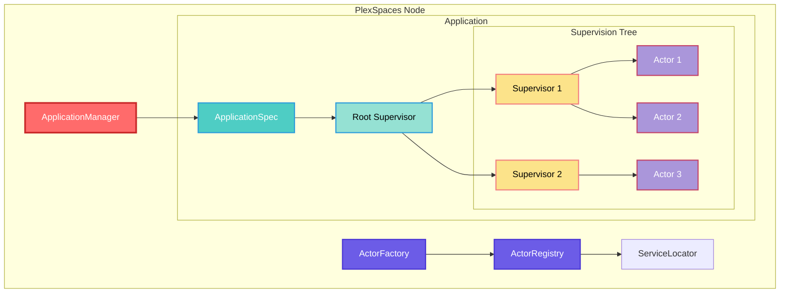

---

## Core Concepts

### Actor

An **Actor** is the fundamental unit of computation in PlexSpaces. Every actor has:

- **Identity**: Unique ID in format `name@node_id` (e.g., `counter@node1`)
- **State**: Private mutable state (no shared state between actors)
- **Behavior**: Message handling logic (implemented via behaviors)
- **Mailbox**: Message queue for incoming messages
- **Facets**: Composable runtime capabilities (virtual actor, durability, timers, etc.)
- **Lifecycle**: State machine tracking actor lifecycle

```rust
pub struct Actor {
    id: ActorId,                                    // "actor@node"
    state: ActorState,                              // Creating, Inactive, Active, Terminated, Failed
    behavior: Box<dyn Actor>,                       // Message handling logic
    mailbox: Arc<Mailbox>,                         // Message queue
    facets: Arc<RwLock<FacetContainer>>,          // Composable capabilities
    context: Arc<ActorContext>,                    // Service access
    // ... other fields
}
```

### ActorRef

**ActorRef** is a lightweight, location-transparent handle to an actor. It provides:

- **Location Transparency**: Same API for local and remote actors
- **Cloneable**: Share references safely across threads
- **Message Passing**: `tell()` (fire-and-forget) and `ask()` (request-reply)
- **Automatic Routing**: Handles local vs remote communication automatically

```rust
// Get actor reference
let actor_ref = actor_factory.spawn_actor(...).await?;

// Fire-and-forget (tell)
actor_ref.tell(message).await?;

// Request-reply (ask)
let reply = actor_ref.ask(request, Duration::from_secs(5)).await?;
```

### ActorContext

**ActorContext** provides actors with access to system services via ServiceLocator:

- `ActorService` - Spawn actors, send messages
- `ObjectRegistry` - Service discovery
- `TupleSpaceProvider` - Coordination
- `ChannelService` - Pub/sub
- `ProcessGroupService` - Actor groups
- `Journal` - Event sourcing and durability

```rust
pub struct ActorContext {
    pub node_id: String,
    pub tenant_id: String,
    pub namespace: String,
    pub service_locator: Arc<ServiceLocator>,
    // ... other fields
}
```

---

## Actor Lifecycle

### State Machine

Actors follow a well-defined state machine with detailed state transitions:

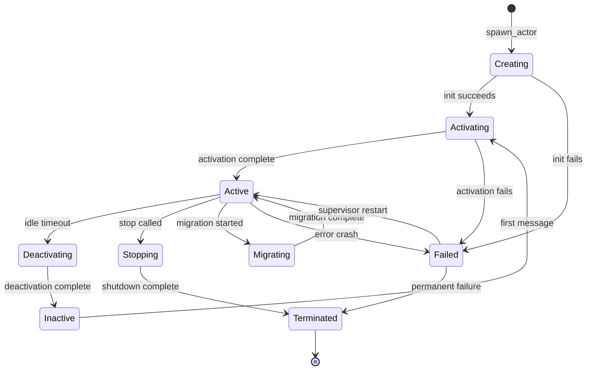

**States**:
- **Creating**: Actor is being initialized, cannot receive messages
- **Activating**: Loading state, running `on_activate()`, cannot receive messages
- **Active**: Actor is processing messages normally
- **Deactivating**: Saving state, running `on_deactivate()`, cannot receive messages
- **Inactive**: Actor is inactive (virtual actors, Orleans-style), can be activated on demand
- **Stopping**: Shutdown in progress, processing remaining messages
- **Migrating**: Moving to another node, state transfer in progress
- **Terminated**: Actor has stopped gracefully, cannot be restarted
- **Failed**: Actor has crashed with error, supervisor will restart if policy allows

### Starting Actors

Actors can be started in several ways:

#### 1. Direct Spawning (Programmatic)

```rust
use plexspaces_actor::{ActorFactory, get_actor_factory};
use plexspaces_core::RequestContext;

let ctx = RequestContext::internal();
let actor_factory = get_actor_factory(service_locator.as_ref()).await?;

let actor_ref = actor_factory.spawn_actor(
    &ctx,
    &"counter@node1".to_string(),
    "Counter",                    // actor_type
    b"initial_state".to_vec(),   // initial_state
    None,                         // config
    HashMap::new(),               // labels
    vec![],                       // facets
).await?;
```

#### 2. Application-Based (Declarative)

Actors are defined in `ApplicationSpec` and spawned automatically. Applications can be:

**Native Rust Applications:**
- Actor type is derived from `child.id` in `ChildSpec`
- Requires `BehaviorFactory` to create behaviors (future enhancement)

**WASM Applications:**
- WASM module is deployed at the **application level** via `DeployApplicationRequest.wasm_module`
- All actors in the supervision tree use the same deployed WASM module
- Actor type is derived from `child.id` in `ChildSpec`
- Actors are instantiated from the deployed WASM module using `module_hash`

```protobuf
// Deploy WASM application
message DeployApplicationRequest {
  string application_id = 1;
  string name = 2;
  string version = 3;
  optional WasmModule wasm_module = 4;  // WASM module deployed at application level
  ApplicationSpec config = 5;           // Supervision tree definition
}

message ApplicationSpec {
  string name = 1;
  optional SupervisorSpec supervisor = 2;  // Root supervisor tree
}

message SupervisorSpec {
  SupervisionStrategy strategy = 1;
  repeated ChildSpec children = 2;
}

message ChildSpec {
  string id = 1;                    // Actor ID (also used as actor_type)
  ChildType type = 2;              // Worker or Supervisor
  map<string, string> args = 3;     // Arguments to pass to start function
  RestartPolicy restart = 4;        // Restart policy
  repeated Facet facets = 5;        // Facets to attach
}
```

#### 3. Virtual Actors (Orleans-Style)

Virtual actors are activated automatically on first message:

```rust
// Create virtual actor facet
let virtual_facet = Box::new(VirtualActorFacet::new(
    serde_json::json!({
        "idle_timeout_seconds": 300,
        "activation_strategy": "lazy"
    }),
    100, // priority
));

let actor_ref = actor_factory.spawn_actor(
    &ctx,
    &"user-123@node1".to_string(),
    "UserSession",
    vec![],
    None,
    HashMap::new(),
    vec![virtual_facet],  // Virtual actor facet
).await?;

// Actor is addressable but not yet active
// First message triggers activation
actor_ref.tell(message).await?;  // Activates actor automatically
```

### Graceful Shutdown

Actors support graceful shutdown:

1. **Stop Accepting New Messages**: Mailbox stops accepting new messages
2. **Process Remaining Messages**: Actor processes all messages in mailbox
3. **Call Terminate Hook**: `terminate()` lifecycle hook is called
4. **Cleanup Resources**: Facets are detached, resources are freed
5. **State Transition**: Actor transitions to `Terminated` state

```rust
// Graceful shutdown
actor.stop().await?;

// Or via supervisor
supervisor.stop_child(&actor_id).await?;
```

**Shutdown Timeout**: If shutdown takes longer than `shutdown_timeout_ms`, actor is forcefully terminated.

---

## Supervision System

### Supervision Tree

Supervisors form a hierarchical tree structure:

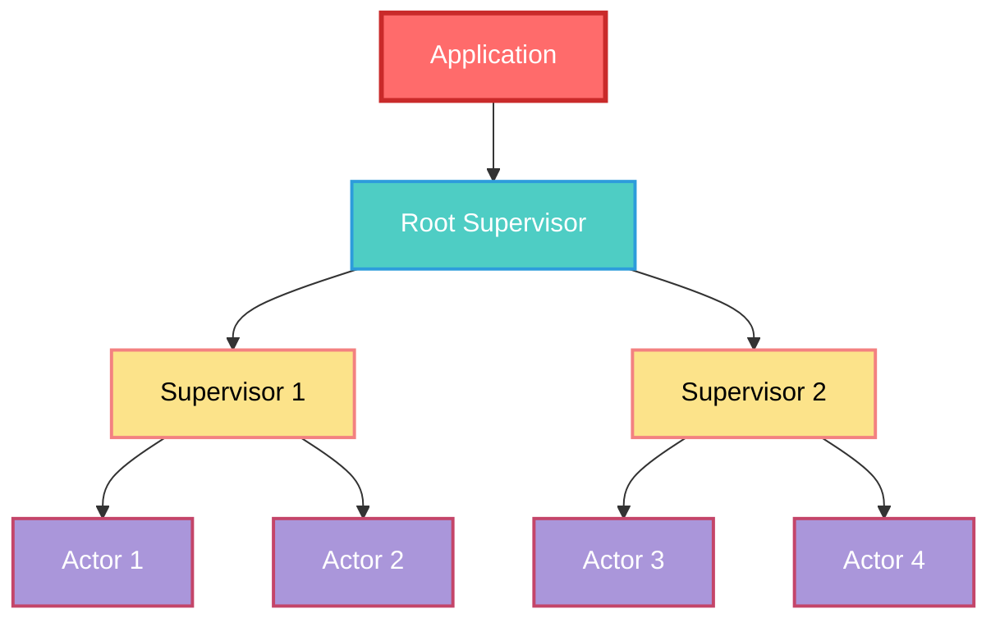

### Supervision Strategies

Supervisors use different strategies for handling child failures:

#### OneForOne (Default)

Only the failed child is restarted:

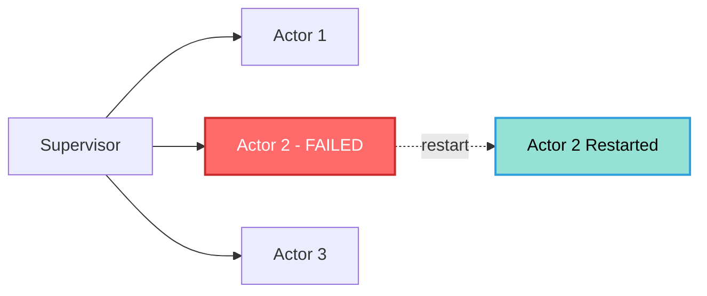

#### OneForAll

All children are restarted if one fails:

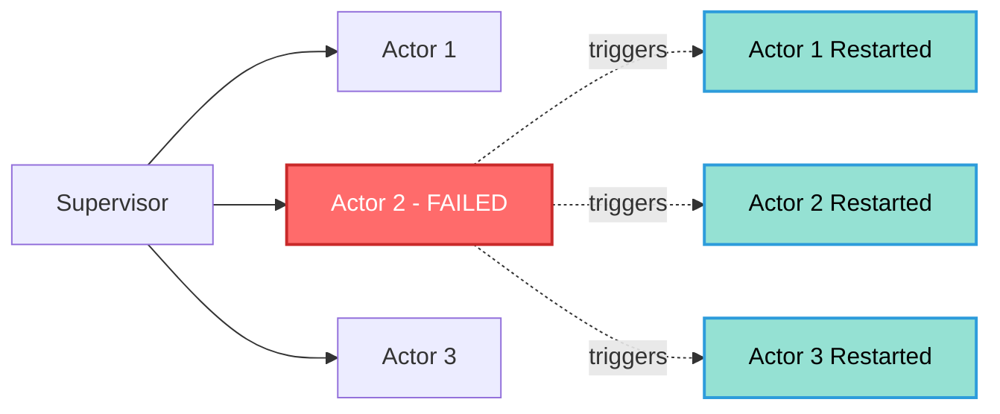

#### RestForOne

The failed child and all children started after it are restarted:

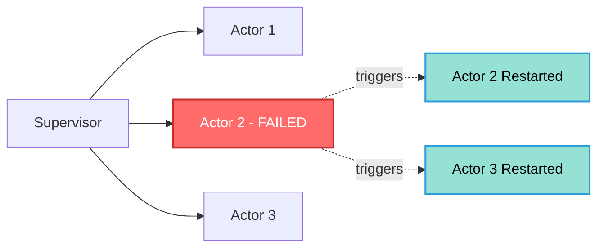

### Restart Policies

Each child has a restart policy:

- **Permanent**: Always restart (default for critical actors)
- **Transient**: Restart only on abnormal exit (not on normal termination)
- **Temporary**: Never restart (one-shot actors)

### Restart Intensity

Supervisors track restart intensity to prevent restart loops:

- **Max Restarts**: Maximum number of restarts allowed
- **Max Restart Window**: Time window for counting restarts
- **Exponential Backoff**: Delay between restarts increases exponentially

```rust
let supervisor = Supervisor::new(
    "root".to_string(),
    SupervisionStrategy::OneForOne,
    RestartIntensity {
        max_restarts: 5,
        max_restart_window: Duration::from_secs(60),
    },
);
```

---

## Applications

### Application Types

Applications can be:

1. **Library**: Just modules, no processes
2. **Active**: Has supervision tree and processes

### Application Lifecycle

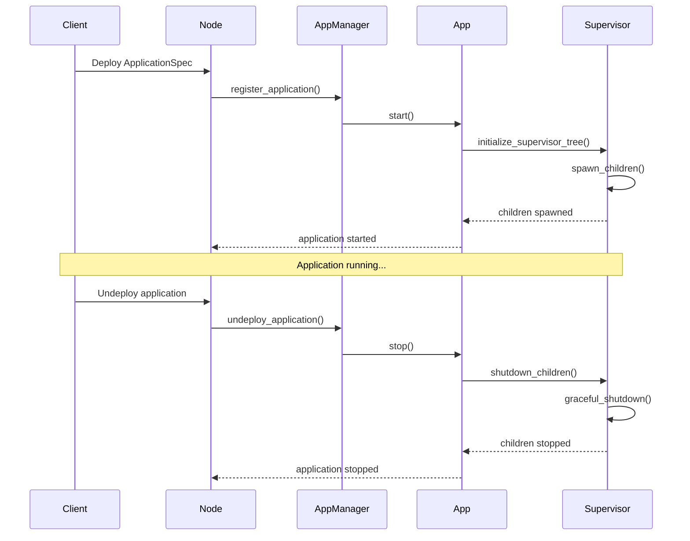

### ApplicationSpec Example

```protobuf
message ApplicationSpec {
  string name = "my-app";
  string version = "1.0.0";
  ApplicationType type = APPLICATION_TYPE_ACTIVE;
  
  optional SupervisorSpec supervisor = {
    strategy: SUPERVISION_STRATEGY_ONE_FOR_ONE;
    max_restarts: 5;
    max_restart_window: { seconds: 60 };
    
    children: [
      {
        id: "worker-1";
        type: CHILD_TYPE_WORKER;
        restart: RESTART_POLICY_PERMANENT;
        facets: [
          {
            type: "virtual_actor";
            config: { "idle_timeout_seconds": 300 };
            priority: 100;
          }
        ];
      },
      {
        id: "supervisor-1";
        type: CHILD_TYPE_SUPERVISOR;
        supervisor: {
          strategy: SUPERVISION_STRATEGY_ONE_FOR_ALL;
          children: [
            {
              id: "child-1";
              type: CHILD_TYPE_WORKER;
            }
          ];
        };
      }
    ];
  };
}
```

---

## Behaviors

**Behaviors** define how actors process messages. They are compile-time traits (zero overhead):

### GenServer Behavior

Erlang/OTP-style request/reply pattern:

```rust
use plexspaces_behavior::GenServer;

struct Counter {
    count: i32,
}

#[async_trait]
impl GenServer for Counter {
    async fn handle_request(
        &mut self,
        ctx: &ActorContext,
        msg: Message,
    ) -> Result<(), BehaviorError> {
        match msg.payload() {
            b"increment" => {
                self.count += 1;
                ctx.reply(Message::new(b"ok".to_vec())).await?;
            }
            b"get" => {
                ctx.reply(Message::new(self.count.to_string().into_bytes())).await?;
            }
            _ => {}
        }
        Ok(())
    }
}
```

### GenFSM Behavior

Finite state machine:

```rust
enum State {
    Idle,
    Processing,
    Done,
}

struct Processor {
    state: State,
}

#[async_trait]
impl GenFSM for Processor {
    async fn handle_state(
        &mut self,
        ctx: &ActorContext,
        msg: Message,
    ) -> Result<State, BehaviorError> {
        match (&self.state, msg.payload()) {
            (State::Idle, b"start") => {
                self.start_processing().await?;
                Ok(State::Processing)
            }
            (State::Processing, b"complete") => {
                Ok(State::Done)
            }
            _ => Ok(self.state.clone())
        }
    }
}
```

### GenEvent Behavior

Event-driven processing:

```rust
#[async_trait]
impl GenEvent for EventHandler {
    async fn handle_event(
        &mut self,
        ctx: &ActorContext,
        event: Message,
    ) -> Result<(), BehaviorError> {
        // Process event (fire-and-forget)
        self.process_event(event).await?;
        Ok(())
    }
}
```

---

## Facets

**Facets** are composable runtime capabilities attached to actors. They enable the "one powerful actor" philosophy:

```
Virtual Actor = Actor + VirtualActorFacet
Durable Workflow = Actor + DurabilityFacet + WorkflowFacet
Timer-Based Actor = Actor + TimerFacet
```

### Facet Execution Order

Facets execute in priority order (higher priority = runs first):

```mermaid
graph LR
    M[Message] --> F1[Security Facet<br/>Priority: 1000]
    F1 --> F2[Logging Facet<br/>Priority: 900]
    F2 --> F3[Metrics Facet<br/>Priority: 800]
    F3 --> F4[Business Logic<br/>Priority: 100-500]
    F4 --> F5[Persistence Facet<br/>Priority: 1-99]
    F5 --> A[Actor Behavior]
    
    style F1 fill:#FF6B6B,stroke:#C92A2A,stroke-width:2px,color:#fff
    style F2 fill:#FCE38A,stroke:#F38181,stroke-width:2px,color:#000
    style F3 fill:#4ECDC4,stroke:#2D9CDB,stroke-width:2px,color:#fff
    style F4 fill:#AA96DA,stroke:#C44569,stroke-width:2px,color:#fff
    style F5 fill:#95E1D3,stroke:#2D9CDB,stroke-width:2px,color:#000
```

### Virtual Actor Facet

Orleans-style automatic activation/deactivation:

**Features**:
- Always addressable (actor ID never changes)
- Automatic activation on first message
- Automatic deactivation after idle timeout
- State preservation during deactivation

**Configuration**:
```json
{
  "idle_timeout_seconds": 300,
  "activation_strategy": "lazy"  // or "eager", "prewarm"
}
```

**Example**:
```rust
let virtual_facet = Box::new(VirtualActorFacet::new(
    serde_json::json!({
        "idle_timeout_seconds": 300,
        "activation_strategy": "lazy"
    }),
    100, // priority
));

let actor_ref = actor_factory.spawn_actor(
    &ctx,
    &"user-123@node1".to_string(),
    "UserSession",
    vec![],
    None,
    HashMap::new(),
    vec![virtual_facet],
).await?;

// Actor is addressable but not yet active
// First message triggers activation
actor_ref.tell(message).await?;  // Activates automatically
```

### Durability Facet

Automatic persistence and recovery (Restate-inspired):

**Features**:
- Event sourcing (complete audit trail)
- Periodic snapshots for fast recovery
- Automatic recovery from failures
- Deterministic replay from any point
- Exactly-once message processing
- Time-travel debugging

**Configuration**:
```json
{
  "journal_backend": "sqlite",  // or "postgres", "redis", "memory"
  "replay_on_restart": true,
  "checkpoint_interval": 1000,
  "cache_side_effects": true
}
```

**Example**:
```rust
let durability_facet = Box::new(DurabilityFacet::new(
    journal,
    serde_json::json!({
        "journal_backend": "sqlite",
        "replay_on_restart": true,
        "checkpoint_interval": 1000
    }),
    50, // priority (runs after business logic)
));

let actor_ref = actor_factory.spawn_actor(
    &ctx,
    &"workflow-1@node1".to_string(),
    "WorkflowActor",
    vec![],
    None,
    HashMap::new(),
    vec![durability_facet],
).await?;
```

### Timer Facet

Non-durable, in-memory timers (like `setInterval`):

**Features**:
- Fast (no I/O)
- Lost on actor deactivation
- Millisecond precision
- Use for heartbeats, polling

**Example**:
```rust
let timer_facet = Box::new(TimerFacet::new(
    serde_json::json!({
        "timers": [
            {
                "id": "heartbeat",
                "interval_ms": 1000,
                "repeating": true
            }
        ]
    }),
    200, // priority
));

// Timer fires and sends TimerFired message to actor
```

### Reminder Facet

Durable, persistent reminders (like cron jobs):

**Features**:
- Survives deactivation/restart
- Persisted to storage
- Triggers auto-activation
- Use for billing, SLA, cron jobs

**Example**:
```rust
let reminder_facet = Box::new(ReminderFacet::new(
    journal_storage,
    serde_json::json!({
        "reminders": [
            {
                "id": "daily-report",
                "schedule": "0 0 * * *",  // Daily at midnight
                "repeating": true
            }
        ]
    }),
    200, // priority
));

// Reminder fires and sends ReminderFired message to actor
// Actor is automatically activated if inactive
```

### Event Sourcing Facet

Temporal-inspired event sourcing:

**Features**:
- Complete event history
- Deterministic replay
- Time-travel debugging
- Audit trail

**Example**:
```rust
let event_sourcing_facet = Box::new(EventSourcingFacet::new(
    journal,
    serde_json::json!({
        "event_store": "postgres",
        "snapshot_interval": 100
    }),
    50, // priority
));
```

### Workflow Facet

Durable workflow orchestration (Temporal/Restate-inspired):

**Features**:
- Multi-step workflows
- Exactly-once execution
- Automatic retries
- Compensation on failure

**Example**:
```rust
let workflow_facet = Box::new(WorkflowFacet::new(
    workflow_service,
    serde_json::json!({
        "workflow_type": "order-processing",
        "timeout": "1h"
    }),
    100, // priority
));
```

---

## Linking and Monitoring

### Monitoring (One-Way)

Supervisor monitors child. When child dies, supervisor is notified (but doesn't die):

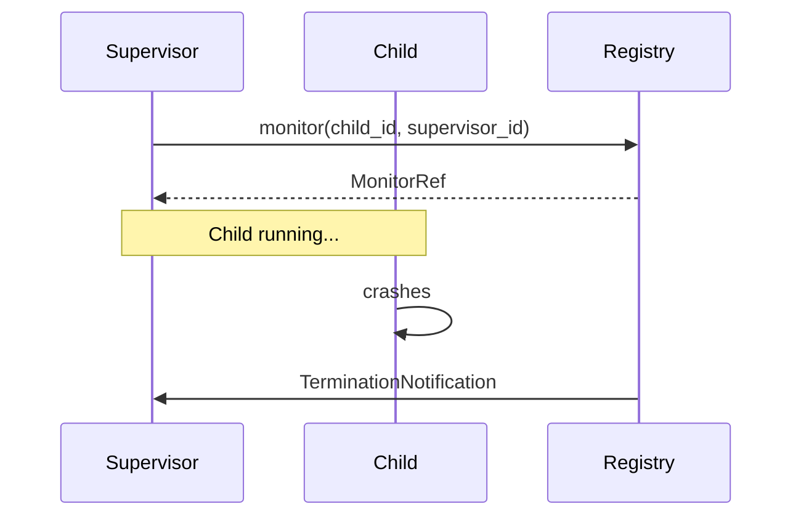

**Characteristics**:
- One-way: Child dies → Supervisor notified
- Supervisor doesn't die if child dies
- Multiple supervisors can monitor the same actor

### Linking (Two-Way)

Bidirectional link. If one actor dies abnormally, the other dies too:

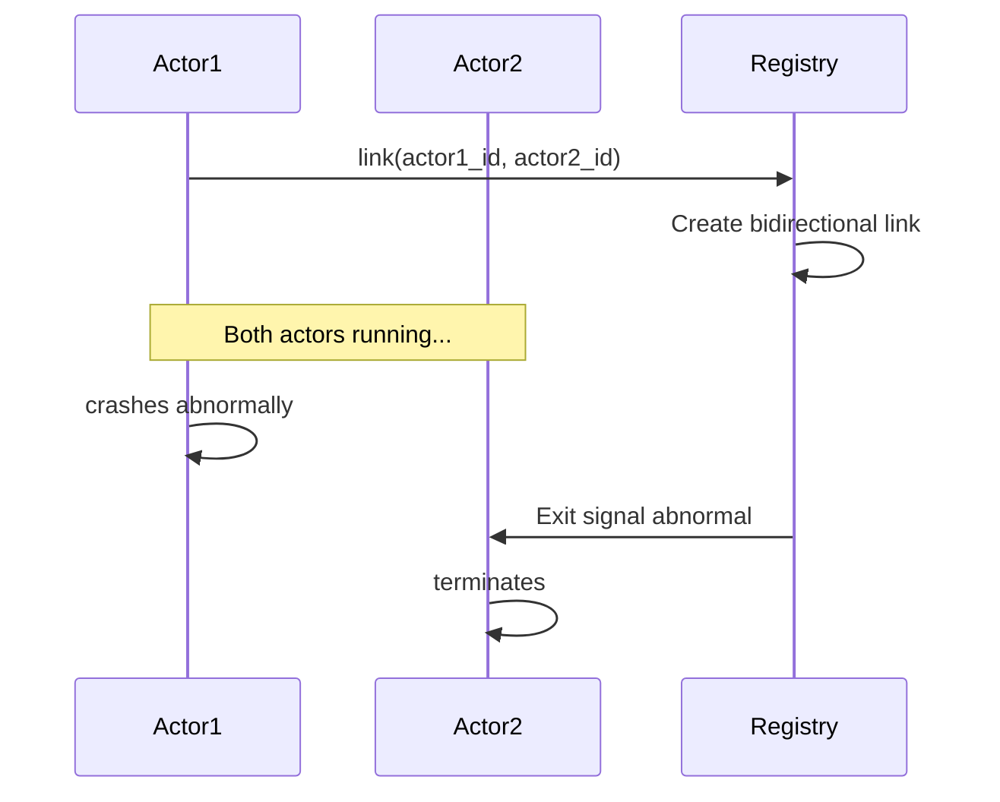

**Characteristics**:
- Bidirectional: If A links to B, B is linked to A
- Cascading: If A dies abnormally, B dies; if B dies abnormally, A dies
- Only propagates abnormal deaths (not "normal" shutdowns)
- Used internally by supervision (parent-child relationships)

**Example**:
```rust
// Link two actors
actor_registry.link(&ctx, &"actor1@node1".to_string(), &"actor2@node1".to_string()).await?;

// If actor1 dies abnormally, actor2 also dies
// If actor2 dies abnormally, actor1 also dies
```

---

## Message Passing

### Tell Pattern (Fire-and-Forget)

Async, non-blocking message sending:

```rust
let actor_ref = actor_factory.spawn_actor(...).await?;
actor_ref.tell(Message::new(b"increment".to_vec())).await?;
```

**Characteristics**:
- Async, non-blocking
- No response expected
- Best-effort delivery

### Ask Pattern (Request-Reply)

Async, but waits for response:

```rust
let reply = actor_ref.ask(
    Message::new(b"get_count".to_vec()),
    Duration::from_secs(5)
).await?;
```

**Characteristics**:
- Async, but waits for response
- Timeout-based
- Uses correlation IDs for reply matching

### Message Routing

Messages are routed automatically based on actor location:

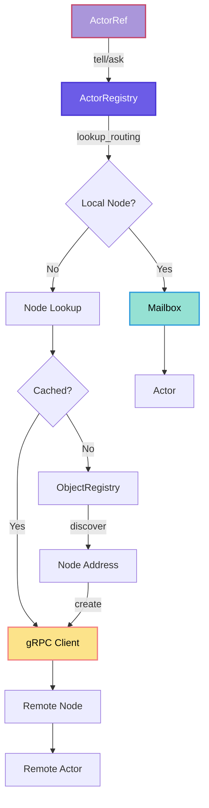

**Routing Details**:
- **Local Actors**: Direct mailbox access (tokio::mpsc channel)
- **Remote Actors**: gRPC via ActorService (location-transparent)
- **Client Caching**: gRPC clients are cached (TTL: 30-60 seconds)
- **Connection Pooling**: Reuses connections for performance
- **Failure Handling**: Retry with exponential backoff, circuit breaker

---

## Observability

### Metrics

PlexSpaces exposes comprehensive metrics in Prometheus format:

#### Actor Metrics

- `plexspaces_actor_spawn_total` (counter) - Actors created
- `plexspaces_actor_active` (gauge) - Currently active actors
- `plexspaces_actor_message_received_total` (counter) - Messages received
- `plexspaces_actor_message_processed_duration_seconds` (histogram) - Processing latency
- `plexspaces_actor_error_total` (counter) - Errors by actor type

#### Supervision Metrics

- `plexspaces_supervisor_restart_total` (counter) - Restarts by strategy
- `plexspaces_supervisor_child_failure_total` (counter) - Child failures
- `plexspaces_supervisor_recovery_duration_seconds` (histogram) - Recovery time

#### Remoting Metrics

- `plexspaces_remote_message_sent_total` (counter) - Remote messages
- `plexspaces_remote_message_latency_seconds` (histogram) - Network latency
- `plexspaces_registry_lookup_total` (counter) - Registry lookups

### Prometheus Export

```bash
# Scrape metrics
curl http://localhost:8001/metrics

# Prometheus configuration
scrape_configs:
  - job_name: 'plexspaces'
    static_configs:
      - targets: ['localhost:8000']
```

### Logging

Structured logging using `tracing`:

```rust
use tracing::{info, error, warn, debug};

info!(actor_id = %actor_id, "Actor spawned");
error!(actor_id = %actor_id, error = %e, "Actor failed");
warn!(actor_id = %actor_id, "Actor restarting");
debug!(actor_id = %actor_id, message_count = count, "Processing messages");
```

### Health Checks

- `GET /health/live` - Liveness probe
- `GET /health/ready` - Readiness probe
- `GET /v1/system/health` - Detailed health with dependency checks

### Dashboard

Internal dashboard available at `/dashboard` showing:
- **Home Page**: Aggregated metrics across all nodes (clusters, nodes, tenants, apps, actors by type)
- **Node Page**: Detailed metrics and data for individual nodes
- **Real-time Updates**: HTMX polling for live data
- **System Metrics**: CPU, memory, disk, network metrics
- **Dependency Health**: Monitor external dependencies (PostgreSQL, Redis, Kafka, etc.)
- **Actor Metrics**: Active actors by type, message counts, error rates
- **Multi-node Support**: Aggregate metrics from multiple nodes in a cluster

**Access**: `GET /dashboard` or `GET /api/v1/dashboard/summary`

**Future Enhancement**: Pre-built Grafana dashboards for Prometheus metrics (see [Actor System Improvements Plan](actor-system-improvements-plan.md) for details).

### OpenTelemetry Integration

**Current State**: Basic tracing support via `tracing` crate.

**Future Enhancement**: Full OpenTelemetry integration with:
- Trace context propagation across actors
- Automatic span creation for actor operations
- Trace export to Jaeger/Zipkin
- Distributed tracing for multi-actor workflows

See [Actor System Improvements Plan](actor-system-improvements-plan.md) for implementation details.

---

## Examples

### Example 1: Simple Counter Actor

```rust
use plexspaces_core::{Actor, ActorContext, BehaviorError};
use plexspaces_mailbox::Message;

struct Counter {
    count: i32,
}

#[async_trait]
impl Actor for Counter {
    async fn handle_message(
        &mut self,
        ctx: &ActorContext,
        msg: Message,
    ) -> Result<(), BehaviorError> {
        match msg.payload() {
            b"increment" => {
                self.count += 1;
                info!(count = self.count, "Counter incremented");
            }
            b"get" => {
                ctx.reply(Message::new(self.count.to_string().into_bytes())).await?;
            }
            _ => {}
        }
        Ok(())
    }

    fn behavior_type(&self) -> BehaviorType {
        BehaviorType::Custom("Counter".to_string())
    }
}

// Spawn actor
let actor_ref = actor_factory.spawn_actor(
    &ctx,
    &"counter@node1".to_string(),
    "Counter",
    vec![],
    None,
    HashMap::new(),
    vec![],
).await?;

// Send messages
actor_ref.tell(Message::new(b"increment".to_vec())).await?;
let count = actor_ref.ask(Message::new(b"get".to_vec()), Duration::from_secs(5)).await?;
```

### Example 2: Virtual Actor with Timer

```rust
// Create virtual actor with timer facet
let virtual_facet = Box::new(VirtualActorFacet::new(
    serde_json::json!({
        "idle_timeout_seconds": 300
    }),
    100,
));

let timer_facet = Box::new(TimerFacet::new(
    serde_json::json!({
        "timers": [
            {
                "id": "heartbeat",
                "interval_ms": 1000,
                "repeating": true
            }
        ]
    }),
    200,
));

let actor_ref = actor_factory.spawn_actor(
    &ctx,
    &"session-123@node1".to_string(),
    "UserSession",
    vec![],
    None,
    HashMap::new(),
    vec![virtual_facet, timer_facet],
).await?;

// Actor is virtual - activated on first message
// Timer fires every second while active
```

### Example 3: Durable Workflow Actor

```rust
// Create durable workflow actor
let durability_facet = Box::new(DurabilityFacet::new(
    journal,
    serde_json::json!({
        "journal_backend": "sqlite",
        "replay_on_restart": true
    }),
    50,
));

let workflow_facet = Box::new(WorkflowFacet::new(
    workflow_service,
    serde_json::json!({
        "workflow_type": "order-processing"
    }),
    100,
));

let actor_ref = actor_factory.spawn_actor(
    &ctx,
    &"workflow-1@node1".to_string(),
    "OrderWorkflow",
    vec![],
    None,
    HashMap::new(),
    vec![durability_facet, workflow_facet],
).await?;

// Workflow is durable - survives crashes and restarts
// State is automatically persisted and replayed
```

### Example 4: Supervised Actor Tree (WASM Application)

```protobuf
// Deploy WASM application with supervision tree
message DeployApplicationRequest {
  application_id: "my-app";
  name: "my-app";
  version: "1.0.0";
  wasm_module: {
    name: "my-app";
    version: "1.0.0";
    module_bytes: <WASM bytes>;
  };
  config: {
    name: "my-app";
    version: "1.0.0";
    type: APPLICATION_TYPE_ACTIVE;
    supervisor: {
      strategy: SUPERVISION_STRATEGY_ONE_FOR_ONE;
      max_restarts: 5;
      children: [
        {
          id: "worker-1";
          type: CHILD_TYPE_WORKER;
          restart: RESTART_POLICY_PERMANENT;
          facets: [
            {
              type: "virtual_actor";
              config: { "idle_timeout_seconds": 300 };
            }
          ];
        },
        {
          id: "supervisor-1";
          type: CHILD_TYPE_SUPERVISOR;
          supervisor: {
            strategy: SUPERVISION_STRATEGY_ONE_FOR_ALL;
            children: [
              {
                id: "child-1";
                type: CHILD_TYPE_WORKER;
              }
            ];
          };
        }
      ];
    };
  };
}
```

**Note:** Actor type is derived from `child.id` for both native Rust and WASM applications.

---

## State Transition Rules

### Valid State Transitions


### State-Specific Behaviors

- **Creating**: Actor is being initialized, cannot receive messages
- **Activating**: Loading state, running `on_activate()`, cannot receive messages
- **Active**: Processing messages normally
- **Deactivating**: Saving state, running `on_deactivate()`, cannot receive messages
- **Inactive**: Not processing messages, can be activated on demand
- **Stopping**: Shutdown in progress, processing remaining messages
- **Migrating**: Moving to another node, state transfer in progress
- **Failed**: Crashed with error, supervisor will restart if policy allows
- **Terminated**: Permanently stopped, cannot be restarted

---

## Best Practices

### 1. Use Virtual Actors for Stateless Services

Virtual actors are ideal for:
- User sessions
- Game sessions
- Stateful services with millions of instances
- Services that can be deactivated when idle

### 2. Use Durability Facet for Critical Workflows

Always use durability facet for:
- Financial transactions
- Order processing
- Multi-step workflows
- Any operation that must not be lost

### 3. Choose Appropriate Supervision Strategy

- **OneForOne**: Independent workers (default)
- **OneForAll**: Tightly coupled workers (all must restart together)
- **RestForOne**: Workers with dependencies (restart failed and dependent)

### 4. Set Appropriate Restart Policies

- **Permanent**: Critical actors that must always be running
- **Transient**: Actors that can fail but should restart on error
- **Temporary**: One-shot actors that shouldn't restart

### 5. Use Facets for Capabilities

Instead of creating specialized actor types, use facets:
- Virtual Actor = Actor + VirtualActorFacet
- Durable Actor = Actor + DurabilityFacet
- Timer Actor = Actor + TimerFacet

### 6. Monitor Actor Health

Use metrics and health checks to monitor:
- Actor spawn rate
- Message processing latency
- Error rates
- Restart frequency

### 7. Graceful Shutdown

Always implement graceful shutdown:
- Stop accepting new messages
- Process remaining messages
- Clean up resources
- Respect shutdown timeout

---

## Facet Execution Order

Facets execute in a well-defined interceptor chain based on priority:


### Priority Ranges

- **1000+**: Security/Auth facets (run first, can block execution)
- **900-999**: Logging/Tracing facets (capture all events)
- **800-899**: Metrics facets (collect performance data)
- **100-500**: Business logic facets (domain-specific processing)
- **1-99**: Persistence facets (run last, commit after business logic)

### Facet Interceptor Chain

Each facet can:
- **Continue**: Pass message to next facet
- **Block**: Stop message processing (e.g., security check failed)
- **Modify**: Change message before passing to next facet
- **Transform**: Replace message with different message

---

## Virtual Actor Activation Details

### Get or Activate Actor API

The `get_or_activate_actor` API provides a convenient way to get an existing actor or create and activate it if it doesn't exist. This is particularly useful for virtual actors that are activated on-demand.

```rust
use plexspaces_proto::v1::actor_service::{ActorServiceClient, GetOrActivateActorRequest};
use tonic::Request;

let mut client = ActorServiceClient::connect("http://localhost:9000").await?;

let request = GetOrActivateActorRequest {
    actor_id: "user-123@node1".to_string(),
    actor_type: "UserSession".to_string(),
    initial_state: vec![],  // Optional initial state
    config: None,            // Optional actor configuration
    force_activation: false, // Force activation even if actor exists
};

let response = client.get_or_activate_actor(Request::new(request)).await?;
let response_inner = response.into_inner();

println!("Actor ID: {}", response_inner.actor_ref);
println!("Was activated: {}", response_inner.was_activated);
if let Some(actor) = response_inner.actor {
    println!("Actor state: {:?}", actor.state);
}
```

**Behavior:**
- If actor exists and is active: Returns actor details, `was_activated = false`
- If actor exists but is inactive: Activates the actor, returns details, `was_activated = true`
- If actor doesn't exist: Creates and activates the actor, returns details, `was_activated = true`
- If `force_activation = true`: Forces activation even if actor is already active

**Use Cases:**
- Virtual actor activation on first access
- Lazy initialization of actors
- Actor creation with type information
- Idempotent actor access patterns

### Activation Strategies

Virtual actors support three activation strategies:

1. **Lazy** (Default): Activate on first message
2. **Eager**: Activate immediately after creation
3. **Prewarm**: Activate based on predicted load

### Activation Process

```mermaid
sequenceDiagram
    participant Client
    participant ActorRef
    participant VirtualFacet
    participant Actor
    participant Storage
    
    Client->>ActorRef: tell(message)
    ActorRef->>VirtualFacet: check activation
    alt Actor is inactive
        VirtualFacet->>Storage: load_state(actor_id)
        Storage-->>VirtualFacet: state_data
        VirtualFacet->>Actor: on_activate(state)
        Actor-->>VirtualFacet: activated
        VirtualFacet->>Actor: process message
    else Actor is active
        VirtualFacet->>Actor: process message
    end
    Actor-->>Client: response (if ask)
```

### State Loading/Saving

- **Loading**: State is loaded from journal/storage during activation
- **Saving**: State is saved to journal/storage during deactivation
- **Format**: State is serialized as `Vec<u8>` (format-agnostic)
- **Schema Versioning**: State includes schema version for format evolution

---

## Message Routing Details

### Routing Decision Logic


### gRPC Client Caching

- **Cache TTL**: 30-60 seconds (configurable)
- **Connection Pooling**: Reuses connections for performance
- **Automatic Cleanup**: Expired clients are removed
- **Failure Handling**: Failed connections are retried with backoff

### Network Failure Handling

- **Retry Policy**: Exponential backoff (3 retries by default)
- **Circuit Breaker**: Opens after consecutive failures
- **Timeout**: Configurable per-message timeout
- **Dead Letter Queue**: Failed messages can be sent to DLQ

---

## Supervision Tree Building

### Bottom-Up Building Process

Supervision trees are built bottom-up (workers first, then supervisors):

```mermaid
sequenceDiagram
    participant App
    participant Builder
    participant Supervisor
    participant Actor
    
    App->>Builder: initialize_supervisor_tree
    Builder->>Builder: breadth_first_traversal
    
    loop For each level
        Builder->>Actor: spawn_worker
        Actor-->>Builder: actor_id
        Builder->>Supervisor: register_child
    end
    
    Builder->>Supervisor: start
    Supervisor->>Supervisor: monitor_children
    Supervisor-->>App: tree_initialized
```

### Breadth-First Traversal

1. **Level 0**: Root supervisor spec
2. **Level 1**: All direct children (workers and supervisors)
3. **Level 2**: Children of level 1 supervisors
4. **Continue**: Until all levels are processed

### Link Establishment

- **Parent-Child Links**: Established when child is registered
- **Monitoring**: Supervisor monitors all children
- **Bidirectional**: Links are bidirectional (cascading failures)

---

## Summary

The PlexSpaces unified actor system provides:

✅ **One Powerful Abstraction**: Single actor type with composable facets  
✅ **Location Transparency**: Same API for local and remote actors  
✅ **Fault Tolerance**: "Let it crash" with automatic recovery  
✅ **Composable Capabilities**: Dynamic facets enable capabilities without new actor types  
✅ **Production Ready**: Built-in observability, metrics, and health checks  
✅ **Research-Backed**: Patterns from Erlang/OTP, Orleans, Restate, Temporal, Dapr  

### Key Takeaways

1. **Unified Model**: All actors share the same core structure; differences come from facets
2. **Virtual Actors**: Orleans-style activation/deactivation for millions of instances
3. **Durable Execution**: Restate-style journaling for exactly-once semantics
4. **Supervision Trees**: Erlang/OTP-style fault tolerance with restart strategies
5. **Facet System**: wasmCloud-style composable capabilities
6. **Observability**: Prometheus metrics, structured logging, health checks

### Next Steps

- Explore [Examples](examples.md) for practical usage patterns
- Check [Getting Started](getting-started.md) to build your first actor

---

## Related Documentation

- [Architecture Overview](architecture.md) - System architecture
- [Concepts](concepts.md) - Core concepts
- [Getting Started](getting-started.md) - Quick start guide
- [Examples](examples.md) - More examples
- [Durability](durability.md) - Durability and journaling
- [Security](security.md) - Security features

