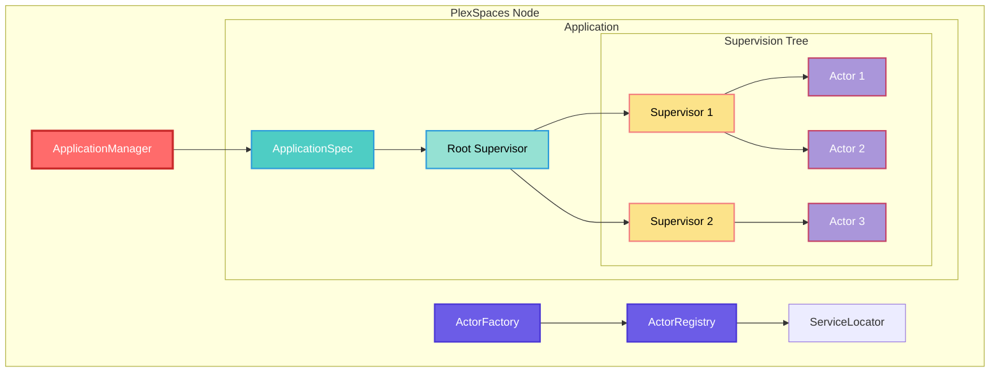
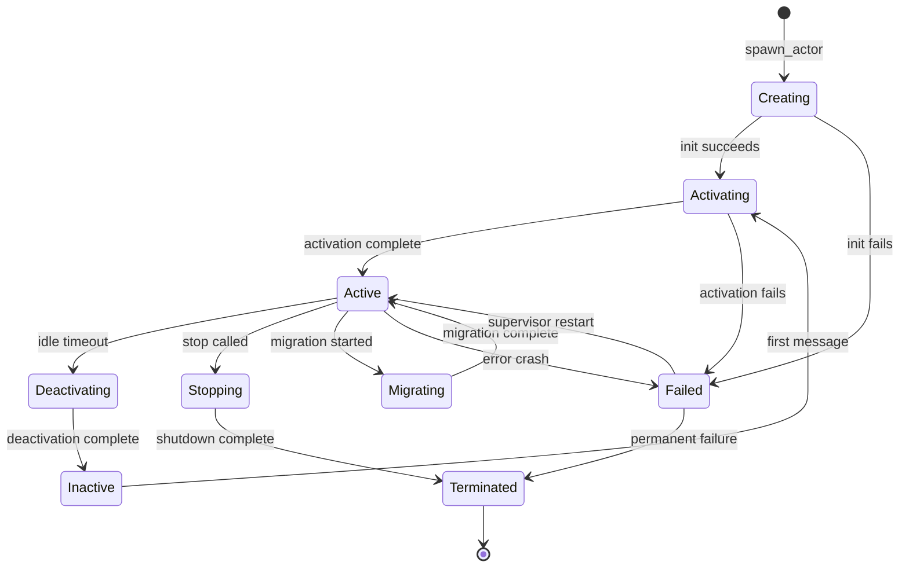
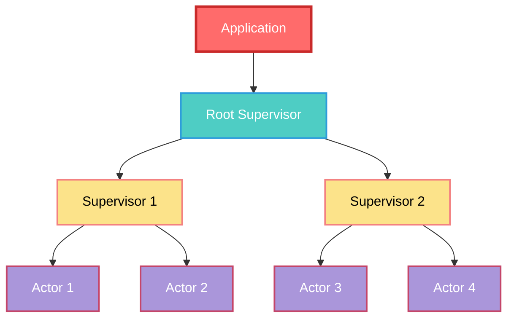
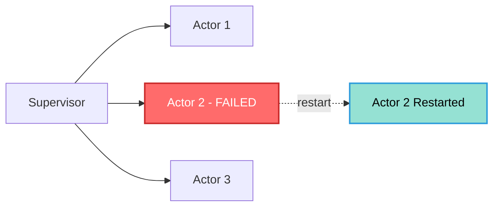
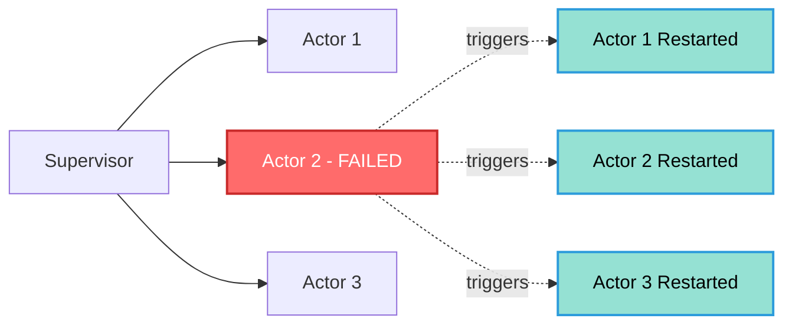
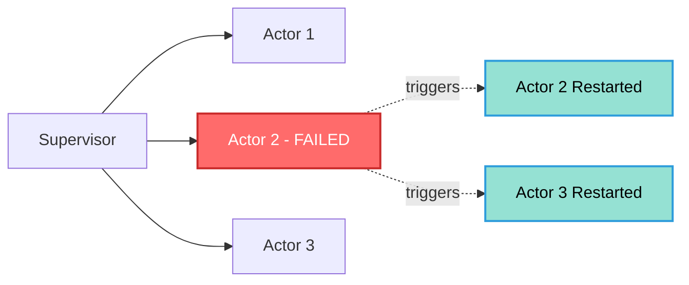
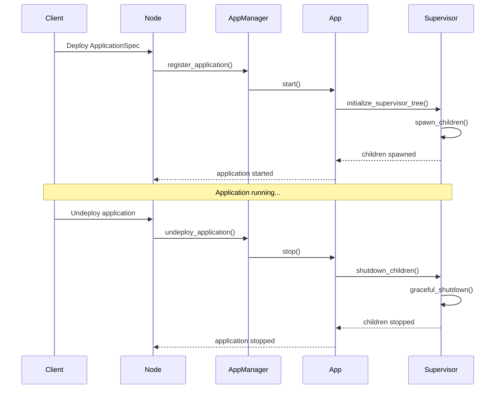
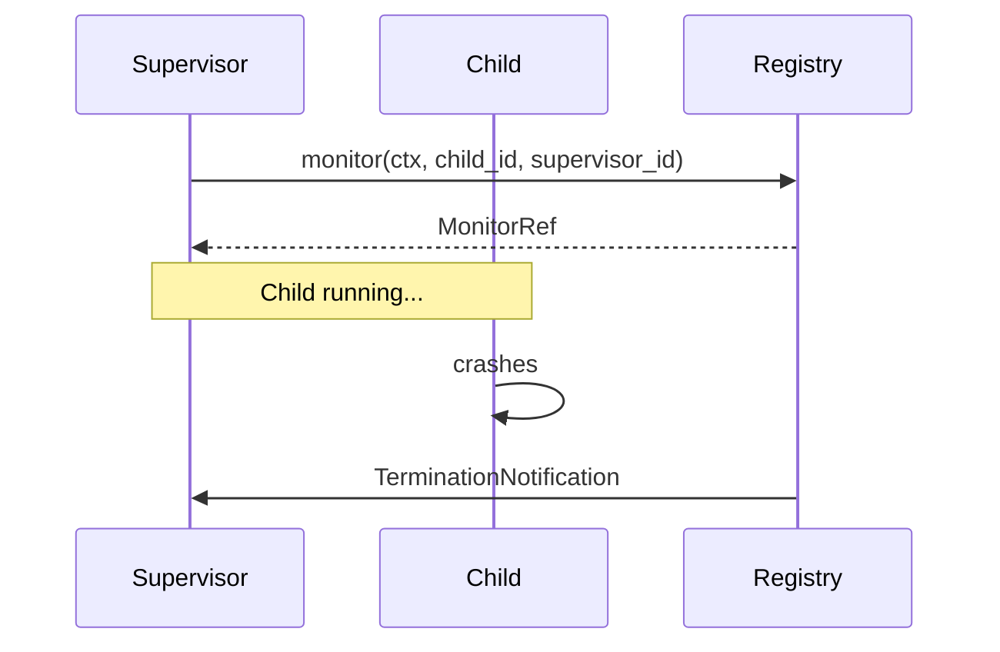
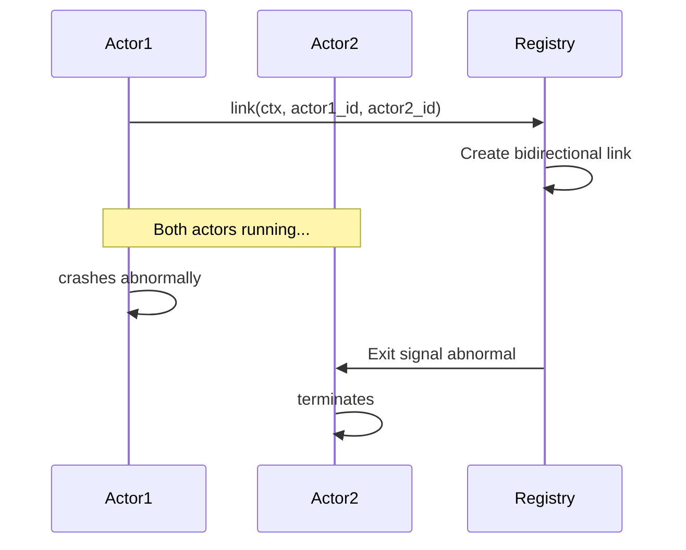
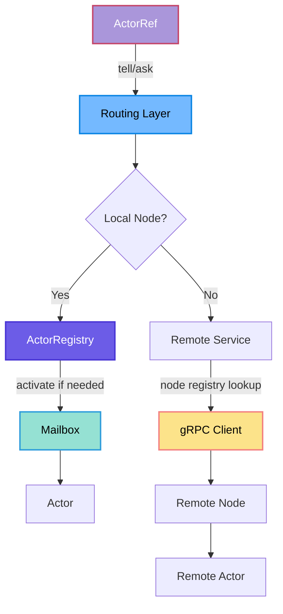

# PlexSpaces Unified Actor System

## Table of Contents

1. [Overview](#overview)
2. [Core Concepts](#core-concepts)
3. [Actor Lifecycle](#actor-lifecycle)
4. [Supervision System](#supervision-system)
5. [Applications](#applications)
6. [Behaviors](#behaviors)
7. [Facets](#facets)
8. [Facet Execution Order](#facet-execution-order)
9. [Virtual Actor Activation Details](#virtual-actor-activation-details)
10. [Message Routing Details](#message-routing-details)
11. [Supervision Tree Building](#supervision-tree-building)
12. [State Transition Rules](#state-transition-rules)
13. [Linking and Monitoring](#linking-and-monitoring)
14. [Message Passing](#message-passing)
15. [ActorRegistry Registration](#actorregistry-registration)
16. [Observability](#observability)
17. [Examples](#examples)
18. [Best Practices](#best-practices)
19. [Summary](#summary)

---

## Overview

PlexSpaces implements a **unified actor system** that combines the best patterns from Erlang/OTP, Orleans, Temporal, and modern serverless architectures. The system follows a "one powerful abstraction" philosophy: **one actor type with composable capabilities** instead of multiple specialized types.

### Design Principles

1. **Unified Actor Model**: All actors share the same core structure; differences come from attached facets
2. **Location Transparency**: Same API for local and remote actors
3. **Fault Tolerance**: "Let it crash" philosophy with automatic recovery
4. **Composable Capabilities**: Dynamic facets enable capabilities without creating new actor types
5. **Proto-First**: All contracts defined in Protocol Buffers for cross-language compatibility

### Architecture Diagram


```mermaid
graph TB
    subgraph "PlexSpaces Node"
        AM[ApplicationManager]
        subgraph "Application"
            AS[ApplicationSpec]
            RS[Root Supervisor]
            subgraph "Supervision Tree"
                S1[Supervisor 1]
                S2[Supervisor 2]
                A1[Actor 1]
                A2[Actor 2]
                A3[Actor 3]
            end
        end
        AR[ActorRegistry]
        AF[ActorFactory]
        SL[ServiceLocator]
    end
    
    AM --> AS
    AS --> RS
    RS --> S1
    RS --> S2
    S1 --> A1
    S1 --> A2
    S2 --> A3
    
    AF --> AR
    AR --> SL
    
    style AM fill:#FF6B6B,stroke:#C92A2A,stroke-width:3px,color:#fff
    style AS fill:#4ECDC4,stroke:#2D9CDB,stroke-width:2px,color:#fff
    style RS fill:#95E1D3,stroke:#2D9CDB,stroke-width:2px,color:#000
    style S1 fill:#FCE38A,stroke:#F38181,stroke-width:2px,color:#000
    style S2 fill:#FCE38A,stroke:#F38181,stroke-width:2px,color:#000
    style A1 fill:#AA96DA,stroke:#C44569,stroke-width:2px,color:#fff
    style A2 fill:#AA96DA,stroke:#C44569,stroke-width:2px,color:#fff
    style A3 fill:#AA96DA,stroke:#C44569,stroke-width:2px,color:#fff
    style AR fill:#6C5CE7,stroke:#4834D4,stroke-width:2px,color:#fff
    style AF fill:#6C5CE7,stroke:#4834D4,stroke-width:2px,color:#fff
```

---

## Core Concepts

### Actor

An **Actor** is the fundamental unit of computation in PlexSpaces. Every actor has:

- **Identity**: Unique structured ID with canonical form `name//actor_type::namespace@node_id` (e.g., `counter//gen_server::default@node1`). The full format is always used internally and at storage boundaries.
- **Client-supplied name**: Client code supplies the actor `name` only. That name must be unique for the actor within the namespace and node where it is created. The runtime fills in `actor_type`, `namespace`, and `node_id` to construct the canonical `ActorId`.
- **State**: Private mutable state (no shared state between actors)
- **Behavior**: Message handling logic (implemented via behaviors)
- **Delivery Runtime**: Local execution path that serializes incoming messages
- **Facets**: Composable runtime capabilities (virtual actor, durability, timers, etc.)
- **Lifecycle**: State machine tracking actor lifecycle

```rust
pub struct Actor {
    id: ActorId,                                    // "name//actor_type::namespace@node_id"
    state: ActorState,                              // Creating, Inactive, Active, Terminated, Failed
    behavior: Box<dyn Actor>,                       // Message handling logic
    mailbox: Arc<Mailbox>,                          // Internal delivery queue
    facets: Arc<RwLock<FacetContainer>>,          // Composable capabilities
    context: Arc<ActorContext>,                    // Service access
    // ... other fields
}
```

### ActorRef

**ActorRef** is a lightweight, location-transparent handle to an actor. It provides:

- **Location Transparency**: Same API for local and remote actors
- **Cloneable**: Share references safely across threads
- **Message Passing**: `tell()` (fire-and-forget) and `ask()` (request-reply)
- **Automatic Routing**: Handles local vs remote communication automatically

### Actor Name vs ActorId

- **Actor name**: The logical identifier that client code provides to builders and SDK helpers such as `with_name("counter")`.
- **Canonical ActorId**: The runtime-owned identity `name//actor_type::namespace@node_id` used for routing, storage, observability, and APIs that cross process or network boundaries.
- **Uniqueness rule**: Reusing the same name for different actors in the same namespace/node scope is a bug unless you intentionally mean to address the same actor identity.
- **Boundary rule**: Inside the runtime we prefer typed `ActorId`. At string boundaries such as gRPC, HTTP, persistence, and logs, we use the canonical string form.

```rust
use plexspaces_sdk::{spawn, call_message, cast_message, json, RequestContext};
use std::time::Duration;

// Spawn actor using SDK (recommended for examples)
let ctx = RequestContext::new_without_auth("tenant".to_string(), "namespace".to_string());
let actor_ref = spawn(&ctx, service_locator, actor_id, "namespace", MyActor::new()).await?;

// Fire-and-forget (tell) - use cast_message()
let event = cast_message(json!({ "event": "user_login" }));
actor_ref.tell(event).await?;

// Request-reply (ask) - use call_message()
let request = call_message(json!({ "action": "get_balance" }));
let reply = actor_ref.ask(request, Duration::from_secs(5)).await?;
```

**Note**: For examples and user code, use SDK patterns (`spawn`, `call_message`, `cast_message`). `ActorFactory` is for framework code only.

### ActorContext

**ActorContext** provides actors with access to system services via ServiceLocator:

- `ActorService` - Spawn actors, send messages
- `ObjectRegistry` - Service discovery
- `TupleSpaceProvider` - Coordination
- `ChannelService` - Pub/sub
- `ProcessGroupService` - Actor groups
- `Journal` - Event sourcing and durability

```rust
pub struct ActorContext {
    pub node_id: String,
    pub tenant_id: String,
    pub namespace: String,
    pub service_locator: Arc<ServiceLocator>,
    // ... other fields
}
```

---

## Actor Lifecycle

### State Machine

Actors follow a well-defined state machine with detailed state transitions:


```mermaid
stateDiagram-v2
    [*] --> Creating: spawn_actor
    Creating --> Activating: init succeeds
    Creating --> Failed: init fails
    Activating --> Active: activation complete
    Activating --> Failed: activation fails
    Active --> Deactivating: idle timeout
    Active --> Stopping: stop called
    Active --> Migrating: migration started
    Active --> Failed: error crash
    Deactivating --> Inactive: deactivation complete
    Inactive --> Activating: first message
    Stopping --> Terminated: shutdown complete
    Migrating --> Active: migration complete
    Failed --> Active: supervisor restart
    Failed --> Terminated: permanent failure
    Terminated --> [*]
```

**States**:
- **Creating**: Actor is being initialized, cannot receive messages
- **Activating**: Loading state, running `on_activate()`, cannot receive messages
- **Active**: Actor is processing messages normally
- **Deactivating**: Saving state, running `on_deactivate()`, cannot receive messages
- **Inactive**: Actor is inactive (virtual actors, Orleans-style), can be activated on demand
- **Stopping**: Shutdown in progress, processing remaining messages
- **Migrating**: Moving to another node, state transfer in progress
- **Terminated**: Actor has stopped gracefully, cannot be restarted
- **Failed**: Actor has crashed with error, supervisor will restart if policy allows

### Starting Actors

Actors can be started in several ways:

#### 1. Direct Spawning (SDK - Recommended)

```rust
use plexspaces_sdk::{
    gen_server_actor, plexspaces_handlers, handler,
    spawn_with_facets, RequestContext, ActorId, json,
};

// Define actor with SDK annotations
#[gen_server_actor]
struct Counter { count: i32 }

#[plexspaces_handlers]
impl Counter {
    #[handler("increment")]
    async fn increment(&mut self, _ctx: &plexspaces_sdk::ActorContext, msg: &plexspaces_sdk::Message) 
        -> Result<serde_json::Value, plexspaces_sdk::BehaviorError> {
        self.count += 1;
        Ok(json!({ "count": self.count }))
    }
}

// Spawn using SDK helper (NEVER use RequestContext::internal())
let ctx = RequestContext::new_without_auth("my-tenant".into(), "default".into());
let actor_ref = spawn_with_facets(
    &ctx,
    service_locator.clone(),
    "counter",
    "default",
    Counter { count: 0 },
    vec![],  // facets
).await?;
```

#### 2. Application-Based (Declarative)

Actors are defined in `ApplicationSpec` and spawned automatically. Applications can be:

**Native Rust Applications (Embedded):**
- Actor type is derived from `child.id` in `ChildSpec`
- Behaviors must be **explicitly registered** in `BehaviorRegistry` before spawning
- Registration pattern:
  ```rust
  use plexspaces_core::BehaviorRegistry;
  use std::sync::Arc;
  
  let behavior_registry = BehaviorRegistry::new();
  behavior_registry.register_simple("worker", || {
      WorkerActor::new()
  }).await;
  
  node.service_locator().register_behavior_registry(Arc::new(behavior_registry)).await;
  ```
- `BehaviorRegistry` is used by the framework (and Node) when spawning by actor type name
- If behavior is not registered, `spawn_actor` will fail with a clear error message
- Use SDK helper `spawn_with_behavior_type()` with an actor name; the runtime constructs the canonical `ActorId`

**WASM Applications:**
- WASM module is deployed at the **application level** via `DeployApplicationRequest.wasm_module`
- All actors in the supervision tree use the same deployed WASM module
- The **behavior-class** segment comes from **`ChildSpec.actor_identity.actor_type`** (registry / `BehaviorRegistry` key), not from OTP `behavior_kind`
- Instance **name** comes from **`actor_identity.name`**; together with namespace + node they form the canonical **`ActorId`**
- Actors are instantiated from the deployed WASM module using `module_hash`
- Behaviors are **automatically registered** from supervisor tree during `start()` using those **`actor_type`** slugs
- **`ChildType`** (worker vs supervisor) selects supervision policy only — it is **not** the registry key

```protobuf
// Deploy WASM application
message DeployApplicationRequest {
  string application_id = 1;
  string name = 2;
  string version = 3;
  optional WasmModule wasm_module = 4;  // WASM module deployed at application level
  ApplicationSpec config = 5;           // Supervision tree definition
}

message ApplicationSpec {
  string name = 1;
  optional SupervisorSpec supervisor = 2;  // Root supervisor tree
}

message SupervisorSpec {
  SupervisionStrategy strategy = 1;
  repeated ChildSpec children = 2;
}

message ChildSpec {
  // Declaration-time identity: instance name + behavior-class slug (→ ActorId at deploy).
  plexspaces.common.v1.ActorIdentity actor_identity = 1;
  // Structural supervision only (restart/shutdown paths), not the registry key.
  ChildType type = 2;
  map<string, string> args = 3;
  RestartPolicy restart = 4;
  google.protobuf.Duration shutdown_timeout = 5;
  optional SupervisorSpec supervisor = 6;
  repeated plexspaces.common.v1.Facet facets = 7;
  optional string behavior_kind = 8; // OTP model (GenServer, …) — observability only
}
```

#### 3. Virtual Actors (Orleans-Style)

Virtual actors are activated automatically on first message:

```rust
// Create virtual actor facet
let virtual_facet = Box::new(VirtualActorFacet::new(
    serde_json::json!({
        "idle_timeout_seconds": 300,
        "activation_strategy": "lazy"
    }),
    100, // priority
));

// Spawn actor using SDK (recommended)
use plexspaces_sdk::{spawn_with_facets, VirtualActorFacet};
#[gen_server_actor(facets = ["virtual_actor"])]
struct UserSession { /* ... */ }

let actor_ref = spawn_with_facets(
    &ctx,
    service_locator,
    "user-123",
    "namespace",
    UserSession::new(),
    vec![Box::new(virtual_facet)],
).await?;

// Actor is addressable but not yet active
// First message triggers activation
let event = cast_message(json!({ "event": "activate" }));
actor_ref.tell(event).await?;  // Activates actor automatically
```

### Graceful Shutdown

Actors support graceful shutdown:

1. **Stop Accepting New Messages**: Mailbox stops accepting new messages
2. **Process Remaining Messages**: Actor drains the internal delivery queue
3. **Call Terminate Hook**: `terminate()` lifecycle hook is called
4. **Cleanup Resources**: Facets are detached, resources are freed
5. **State Transition**: Actor transitions to `Terminated` state

```rust
// Graceful shutdown
actor.stop().await?;

// Or via supervisor
supervisor.stop_child(&actor_id).await?;
```

**Shutdown Timeout**: If shutdown takes longer than `shutdown_timeout_ms`, actor is forcefully terminated.

---

## Supervision System

### Supervision Tree

Supervisors form a hierarchical tree structure:


```mermaid
graph TD
    App[Application]
    RS[Root Supervisor]
    S1[Supervisor 1]
    S2[Supervisor 2]
    A1[Actor 1]
    A2[Actor 2]
    A3[Actor 3]
    A4[Actor 4]
    
    App --> RS
    RS --> S1
    RS --> S2
    S1 --> A1
    S1 --> A2
    S2 --> A3
    S2 --> A4
    
    style App fill:#FF6B6B,stroke:#C92A2A,stroke-width:3px,color:#fff
    style RS fill:#4ECDC4,stroke:#2D9CDB,stroke-width:2px,color:#fff
    style S1 fill:#FCE38A,stroke:#F38181,stroke-width:2px,color:#000
    style S2 fill:#FCE38A,stroke:#F38181,stroke-width:2px,color:#000
    style A1 fill:#AA96DA,stroke:#C44569,stroke-width:2px,color:#fff
    style A2 fill:#AA96DA,stroke:#C44569,stroke-width:2px,color:#fff
    style A3 fill:#AA96DA,stroke:#C44569,stroke-width:2px,color:#fff
    style A4 fill:#AA96DA,stroke:#C44569,stroke-width:2px,color:#fff
```

### Supervision Strategies

Supervisors use different strategies for handling child failures:

#### OneForOne (Default)

Only the failed child is restarted:


```mermaid
graph LR
    S[Supervisor]
    A1[Actor 1]
    A2[Actor 2 - FAILED]
    A3[Actor 3]
    
    S --> A1
    S --> A2
    S --> A3
    
    A2 -.->|restart| A2R[Actor 2 Restarted]
    
    style A2 fill:#FF6B6B,stroke:#C92A2A,stroke-width:2px,color:#fff
    style A2R fill:#95E1D3,stroke:#2D9CDB,stroke-width:2px,color:#000
```

#### OneForAll

All children are restarted if one fails:


```mermaid
graph LR
    S[Supervisor]
    A1[Actor 1]
    A2[Actor 2 - FAILED]
    A3[Actor 3]
    
    S --> A1
    S --> A2
    S --> A3
    
    A2 -.->|triggers| A1R[Actor 1 Restarted]
    A2 -.->|triggers| A2R[Actor 2 Restarted]
    A2 -.->|triggers| A3R[Actor 3 Restarted]
    
    style A2 fill:#FF6B6B,stroke:#C92A2A,stroke-width:2px,color:#fff
    style A1R fill:#95E1D3,stroke:#2D9CDB,stroke-width:2px,color:#000
    style A2R fill:#95E1D3,stroke:#2D9CDB,stroke-width:2px,color:#000
    style A3R fill:#95E1D3,stroke:#2D9CDB,stroke-width:2px,color:#000
```

#### RestForOne

The failed child and all children started after it are restarted:


```mermaid
graph LR
    S[Supervisor]
    A1[Actor 1]
    A2[Actor 2 - FAILED]
    A3[Actor 3]
    
    S --> A1
    S --> A2
    S --> A3
    
    A2 -.->|triggers| A2R[Actor 2 Restarted]
    A2 -.->|triggers| A3R[Actor 3 Restarted]
    
    style A2 fill:#FF6B6B,stroke:#C92A2A,stroke-width:2px,color:#fff
    style A2R fill:#95E1D3,stroke:#2D9CDB,stroke-width:2px,color:#000
    style A3R fill:#95E1D3,stroke:#2D9CDB,stroke-width:2px,color:#000
```

### Restart Policies

Each child has a restart policy:

- **Permanent**: Always restart (default for critical actors)
- **Transient**: Restart only on abnormal exit (not on normal termination)
- **Temporary**: Never restart (one-shot actors)

### Restart Intensity

Supervisors track restart intensity to prevent restart loops:

- **Max Restarts**: Maximum number of restarts allowed
- **Max Restart Window**: Time window for counting restarts
- **Exponential Backoff**: Delay between restarts increases exponentially

```rust
let supervisor = Supervisor::new(
    "root".to_string(),
    SupervisionStrategy::OneForOne,
    RestartIntensity {
        max_restarts: 5,
        max_restart_window: Duration::from_secs(60),
    },
);
```

---

## Applications

### Application Types

Applications can be:

1. **Library**: Just modules, no processes
2. **Active**: Has supervision tree and processes

### Application Lifecycle


```mermaid
sequenceDiagram
    participant Client
    participant Node
    participant AppManager
    participant App
    participant Supervisor
    
    Client->>Node: Deploy ApplicationSpec
    Node->>AppManager: register_application()
    AppManager->>App: start()
    App->>Supervisor: initialize_supervisor_tree()
    Supervisor->>Supervisor: spawn_children()
    Supervisor-->>App: children spawned
    App-->>Node: application started
    
    Note over Client,Supervisor: Application running...
    
    Client->>Node: Undeploy application
    Node->>AppManager: undeploy_application()
    AppManager->>App: stop()
    App->>Supervisor: shutdown_children()
    Supervisor->>Supervisor: graceful_shutdown()
    Supervisor-->>App: children stopped
    App-->>Node: application stopped
```

### ApplicationSpec Example

```protobuf
message ApplicationSpec {
  string name = "my-app";
  string version = "1.0.0";
  ApplicationType type = APPLICATION_TYPE_ACTIVE;
  
  optional SupervisorSpec supervisor = {
    strategy: SUPERVISION_STRATEGY_ONE_FOR_ONE;
    max_restarts: 5;
    max_restart_window: { seconds: 60 };
    
    children: [
      {
        id: "worker-1";
        type: CHILD_TYPE_WORKER;
        restart: RESTART_POLICY_PERMANENT;
        facets: [
          {
            type: "virtual_actor";
            config: { "idle_timeout_seconds": 300 };
            priority: 100;
          }
        ];
      },
      {
        id: "supervisor-1";
        type: CHILD_TYPE_SUPERVISOR;
        supervisor: {
          strategy: SUPERVISION_STRATEGY_ONE_FOR_ALL;
          children: [
            {
              id: "child-1";
              type: CHILD_TYPE_WORKER;
            }
          ];
        };
      }
    ];
  };
}
```

---

## Behaviors

**Behaviors** define how actors process messages. They are compile-time traits (zero overhead):

### GenServer Behavior

Erlang/OTP-style request/reply pattern:

```rust
use plexspaces_behavior::GenServer;

struct Counter {
    count: i32,
}

#[async_trait]
impl GenServer for Counter {
    async fn handle_request(
        &mut self,
        ctx: &ActorContext,
        msg: Message,
    ) -> Result<(), BehaviorError> {
        match msg.payload() {
            b"increment" => {
                self.count += 1;
                ctx.reply(call_message(json!({ "status": "ok" }))).await?;
            }
            b"get" => {
                ctx.reply(call_message(json!({ "count": self.count }))).await?;
            }
            _ => {}
        }
        Ok(())
    }
}
```

### GenFSM Behavior

Finite state machine:

```rust
enum State {
    Idle,
    Processing,
    Done,
}

struct Processor {
    state: State,
}

#[async_trait]
impl GenFSM for Processor {
    async fn handle_state(
        &mut self,
        ctx: &ActorContext,
        msg: Message,
    ) -> Result<State, BehaviorError> {
        match (&self.state, msg.payload()) {
            (State::Idle, b"start") => {
                self.start_processing().await?;
                Ok(State::Processing)
            }
            (State::Processing, b"complete") => {
                Ok(State::Done)
            }
            _ => Ok(self.state.clone())
        }
    }
}
```

### Behavior Registration

Behaviors must be registered in `BehaviorRegistry` before actors can be spawned using `actor_type` strings. This enables `ActorFactory` to create behaviors dynamically.

#### Embedded Applications (Explicit Registration)

Native Rust applications must explicitly register behaviors:

```rust
use plexspaces_core::BehaviorRegistry;
use std::sync::Arc;

// Create registry and register behaviors
let behavior_registry = BehaviorRegistry::new();
behavior_registry.register_simple("worker", || {
    WorkerActor::new()
}).await;

// Register with ServiceLocator (required for Node/spawn when using type-name)
node.service_locator().register_behavior_registry(Arc::new(behavior_registry)).await;

// In examples and app code, use Node and SDK spawn helpers (spawn, spawn_with_facets).
// Framework code may use ActorFactory for type-name spawn when servicing gRPC spawn requests.
```

#### WASM Applications (Automatic Registration)

WASM applications automatically register behaviors from their supervisor tree during `start()`:

1. Application walks each child’s **`actor_identity`** (`name` + **`actor_type`** behavior class)
2. Each distinct **`actor_type`** slug is registered as a **behavior class** key (alongside virtual metadata when applicable)
3. Behavior constructor creates `WasmActorBehavior` wrapping a WASM instance; **`behavior_kind`** is set separately for OTP observability
4. **`ShardGroups`** and other callers address actors by canonical **`ActorId`** built from identity + deploy context

```protobuf
// ApplicationSpec with supervisor tree (illustrative — see application.proto for full fields)
supervisor: {
  children: [
    {
      actor_identity: { name: "worker-1", actor_type: "my_worker" }
      type: CHILD_TYPE_WORKER
    },
    {
      actor_identity: { name: "processor-1", actor_type: "stream_processor" }
      type: CHILD_TYPE_WORKER
    }
  ]
}
```

After deployment, behavior factories are keyed by **`my_worker`**, **`stream_processor`**, etc., not by conflating **`behavior_kind`** with **`actor_type`**.

#### BehaviorRegistry API

```rust
// Register simple behavior (no arguments)
registry.register_simple("my_actor", || MyActor::new()).await;

// Register behavior with arguments
registry.register("my_actor", |args: &[u8]| {
    let config: MyConfig = deserialize(args)?;
    Ok(Box::new(MyActor::new(config)))
}).await;

// Check if behavior is registered
if registry.is_registered("my_actor").await {
    // Behavior exists
}

// Create behavior instance
let behavior = registry.create("my_actor", &[]).await?;

// List all registered behaviors
let modules = registry.registered_modules().await;
```

**Note**: `BehaviorRegistry` uses interior mutability (`Arc<RwLock<HashMap>>`), so methods take `&self` (not `&mut self`), enabling sharing via `Arc`.

### GenEvent Behavior

Event-driven processing:

```rust
#[async_trait]
impl GenEvent for EventHandler {
    async fn handle_event(
        &mut self,
        ctx: &ActorContext,
        event: Message,
    ) -> Result<(), BehaviorError> {
        // Process event (fire-and-forget)
        self.process_event(event).await?;
        Ok(())
    }
}
```

**WASM**: Event-handler actors deploy with `behavior_kind=GenEvent` and appear in logs as `EventHandler`. See [WASM Deployment](wasm-deployment.md).

---

## Facets

**Facets** are composable runtime capabilities attached to actors. They enable the "one powerful actor" philosophy:

```
Virtual Actor = Actor + VirtualActorFacet
Durable Workflow = Actor + DurabilityFacet + WorkflowFacet
Timer-Based Actor = Actor + TimerFacet
```

### Facet Execution Order

Facets execute in priority order (higher priority = runs first):


```mermaid
graph LR
    M[Message] --> F1[Security Facet<br/>Priority: 1000]
    F1 --> F2[Logging Facet<br/>Priority: 900]
    F2 --> F3[Metrics Facet<br/>Priority: 800]
    F3 --> F4[Business Logic<br/>Priority: 100-500]
    F4 --> F5[Persistence Facet<br/>Priority: 1-99]
    F5 --> A[Actor Behavior]
    
    style F1 fill:#FF6B6B,stroke:#C92A2A,stroke-width:2px,color:#fff
    style F2 fill:#FCE38A,stroke:#F38181,stroke-width:2px,color:#000
    style F3 fill:#4ECDC4,stroke:#2D9CDB,stroke-width:2px,color:#fff
    style F4 fill:#AA96DA,stroke:#C44569,stroke-width:2px,color:#fff
    style F5 fill:#95E1D3,stroke:#2D9CDB,stroke-width:2px,color:#000
```

### Virtual Actor Facet

Orleans-style automatic activation/deactivation:

**Features**:
- Always addressable (actor ID never changes)
- Automatic activation on first message
- Automatic deactivation after idle timeout
- State preservation during deactivation

**Configuration**:
```json
{
  "idle_timeout": "5m",  // or "300s", defaults to RuntimeConfig.default_virtual_actor_config.idle_timeout
  "activation_strategy": "lazy"  // or "eager", "prewarm", defaults to RuntimeConfig.default_virtual_actor_config.activation_strategy
}
```

**Default Configuration**:
Defaults are provided via `RuntimeConfig.default_virtual_actor_config`:
- `idle_timeout`: 5 minutes (300 seconds) if not specified
- `max_pool_per_actor_type`: 100 instances per actor type (LRU eviction when exceeded)
- `activation_strategy`: `lazy` if not specified

These defaults are applied automatically when creating virtual actors if not explicitly provided.

**Example**:
```rust
use plexspaces_sdk::{spawn_with_facets, VirtualActorFacet, RequestContext};

let ctx = RequestContext::new_without_auth("tenant".into(), "namespace".into());

// Create virtual actor facet (uses defaults from RuntimeConfig if not specified)
let virtual_facet = Box::new(VirtualActorFacet::new(
    serde_json::json!({
        "idle_timeout": "5m",  // Optional: defaults to RuntimeConfig.default_virtual_actor_config.idle_timeout
        "activation_strategy": "lazy"  // Optional: defaults to RuntimeConfig.default_virtual_actor_config.activation_strategy
    }),
    100, // priority
));

// Spawn actor using SDK (recommended)
let actor_ref = spawn_with_facets(
    &ctx,
    service_locator,
    "user-123",
    "namespace",
    UserSession::new(),
    vec![Box::new(virtual_facet)],
).await?;

// Actor is addressable but not yet active
// First message triggers activation
let event = cast_message(json!({ "event": "activate" }));
actor_ref.tell(event).await?;  // Activates automatically
```

### Durability Facet

Automatic persistence and recovery (Restate-inspired):

**Features**:
- Event sourcing (complete audit trail)
- Periodic snapshots for fast recovery
- Automatic recovery from failures
- Deterministic replay from any point
- Exactly-once message processing
- Time-travel debugging

**Configuration**:
```json
{
  "journal_backend": "sqlite",  // or "postgres", "redis", "memory"
  "replay_on_restart": true,
  "checkpoint_interval": 1000,
  "cache_side_effects": true
}
```

**Example**:
```rust
let durability_facet = Box::new(DurabilityFacet::new(
    journal,
    serde_json::json!({
        "journal_backend": "sqlite",
        "replay_on_restart": true,
        "checkpoint_interval": 1000
    }),
    50, // priority (runs after business logic)
));

// Spawn actor using SDK (recommended)
use plexspaces_sdk::{spawn_with_facets, DurabilityFacet};
#[workflow_actor(facets = ["durability"])]
struct WorkflowActor { /* ... */ }

let actor_ref = spawn_with_facets(
    &ctx,
    service_locator,
    "workflow-1",
    "namespace",
    WorkflowActor::new(),
    vec![Box::new(durability_facet)],
).await?;
```

### Timer Facet

Non-durable, in-memory timers (like `setInterval`):

**Features**:
- Fast (no I/O)
- Lost on actor deactivation
- Millisecond precision
- Use for heartbeats, polling

**Example**:
```rust
let timer_facet = Box::new(TimerFacet::new(
    serde_json::json!({
        "timers": [
            {
                "id": "heartbeat",
                "interval_ms": 1000,
                "repeating": true
            }
        ]
    }),
    200, // priority
));

// Timer fires and sends TimerFired message to actor
```

### Reminder Facet

Durable, persistent reminders (like cron jobs):

**Features**:
- Survives deactivation/restart
- Persisted to storage
- Triggers auto-activation
- Use for billing, SLA, cron jobs

**Example**:
```rust
let reminder_facet = Box::new(ReminderFacet::new(
    journal_storage,
    serde_json::json!({
        "reminders": [
            {
                "id": "daily-report",
                "schedule": "0 0 * * *",  // Daily at midnight
                "repeating": true
            }
        ]
    }),
    200, // priority
));

// Reminder fires and sends ReminderFired message to actor
// Actor is automatically activated if inactive
```

### Event Sourcing Facet

Temporal-inspired event sourcing:

**Features**:
- Complete event history
- Deterministic replay
- Time-travel debugging
- Audit trail

**Example**:
```rust
let event_sourcing_facet = Box::new(EventSourcingFacet::new(
    journal,
    serde_json::json!({
        "event_store": "postgres",
        "snapshot_interval": 100
    }),
    50, // priority
));
```

### Workflow Facet

Durable workflow orchestration (Temporal/Restate-inspired):

**Features**:
- Multi-step workflows
- Exactly-once execution
- Automatic retries
- Compensation on failure

**Example**:
```rust
let workflow_facet = Box::new(WorkflowFacet::new(
    workflow_service,
    serde_json::json!({
        "workflow_type": "order-processing",
        "timeout": "1h"
    }),
    100, // priority
));
```

### Capability Facets (Message Interception Pattern)

Capability facets (LockFacet, ProcessGroupFacet, RegistryFacet) use **message interception** to provide capabilities to actors. They intercept messages with specific types and handle them using real backend services from ServiceLocator.

#### LockFacet

Distributed lock coordination for task queues, resource coordination, and leader election.

**Message Types Intercepted**:
- `"acquire_lock"`: Acquire lock with lease duration
- `"release_lock"`: Release lock (requires version)
- `"renew_lock"`: Renew lock lease (heartbeat)
- `"try_acquire_lock"`: Non-blocking lock attempt
- `"get_lock"`: Get current lock state

**Backend**: Uses LockManager from ServiceLocator (configured via node-config/runtimeconfig, not hardcoded)
- MemoryLockManager (testing)
- SQLiteLockManager (production)
- DynamoDBLockManager (distributed)
- RedisLockManager (distributed)

**Use Cases**:
- Distributed task queues (ensure only one worker processes each job)
- Resource coordination (prevent concurrent access)
- Leader election (elect a leader node)

**Example**:
```toml
# app-config.toml
[[supervisor.children.facets]]
type = "locks"
priority = 50
config = {}
```

```rust
// Actor sends message - facet intercepts it
let msg = Message::json(&json!({
    "lock_key": "job:job-123",
    "holder_id": "worker-1",
    "lease_duration_secs": 300
}))
.with_message_type("acquire_lock");

let reply = actor_ref.ask(msg.to_proto(), Duration::from_secs(5)).await?;
// LockFacet handled the operation, actor's handle() was never called
```

**See Also**: [Task Queue Example](../../examples/python/apps/task-queue/) - Complete distributed task queue implementation

#### ProcessGroupFacet

Distributed pub/sub and group messaging (Erlang pg2-style).

**Message Types Intercepted**:
- `"create_group"`: Create a new process group
- `"join_group"`: Join a process group (with optional topics)
- `"leave_group"`: Leave a process group
- `"get_members"`: Get all members (cluster-wide)
- `"get_local_members"`: Get local members only
- `"list_groups"`: List all groups
- `"publish_to_group"`: Publish message to group members

**Backend**: Uses ProcessGroupService from ServiceLocator (configured via node-config/runtimeconfig)

**Use Cases**:
- Pub/sub messaging (chat rooms, notifications)
- Actor clustering (group actors for coordination)
- Broadcast messaging (send to all group members)

**Example**:
```toml
# app-config.toml
[[supervisor.children.facets]]
type = "process_groups"
priority = 50
config = {}
```

```rust
// Actor sends message - facet intercepts it
let msg = Message::json(&json!({
    "group_name": "chat-room-1",
    "actor_id": "user-123",
    "topics": ["general", "announcements"]
}))
.with_message_type("join_group");

let reply = actor_ref.ask(msg.to_proto(), Duration::from_secs(5)).await?;
// ProcessGroupFacet handled the operation
```

#### RegistryFacet

Service discovery and object registration.

**Message Types Intercepted**:
- `"register_object"`: Register an object in the registry
- `"unregister_object"`: Unregister an object
- `"lookup_object"`: Lookup an object by ID
- `"discover_objects"`: Discover objects with filters (JSON: `offset`, then `limit`)

**Backend**: Uses ObjectRegistry from ServiceLocator (configured via node-config/runtimeconfig)

**Use Cases**:
- Service discovery (find services by type)
- Actor discovery (find actors by type)
- Object registration (register services, actors, tuplespaces)

**Example**:
```toml
# app-config.toml
[[supervisor.children.facets]]
type = "registry"
priority = 50
config = {}
```

```rust
// Actor sends message - facet intercepts it
let msg = Message::json(&json!({
    "object_id": "payment-service",
    "object_type": "Service",
    "grpc_address": "http://payment-service:50051"
}))
.with_message_type("register_object");

let reply = actor_ref.ask(msg.to_proto(), Duration::from_secs(5)).await?;
// RegistryFacet handled the operation
```

**Design Pattern**:
- Facets intercept messages in `before_method()` hook
- Return `InterceptResult::ShortCircuit(data)` to handle operation
- Actor's `handle()` method is never called for intercepted messages
- Works for both Rust and WASM actors (they all send messages)

---

## Linking and Monitoring

### Monitoring (One-Way)

Supervisor monitors child. When child dies, supervisor is notified (but doesn't die):


```mermaid
sequenceDiagram
    participant Supervisor
    participant Child
    participant Registry
    
    Supervisor->>Registry: monitor(ctx, child_id, supervisor_id)
    Registry-->>Supervisor: MonitorRef
    
    Note over Supervisor,Child: Child running...
    
    Child->>Child: crashes
    Registry->>Supervisor: TerminationNotification
```

**Characteristics**:
- One-way: Child dies → Supervisor notified
- Supervisor doesn't die if child dies
- Multiple supervisors can monitor the same actor

### Multi-node monitoring

- **Where state lives:** Monitor entries are stored on the **node that hosts the monitored actor** (`actor_id`). `Node::monitor` (or gRPC `MonitorActor` against that node) registers `supervisor_id` there.
- **How `__DOWN__` is delivered:** When that node runs `ActorRegistry::handle_actor_termination`, it sends a **`__DOWN__` mailbox message** to each monitoring actor’s canonical `ActorId` via `ActorRegistry::tell`. For a supervisor on another node, `tell` routes over **gRPC** (`ActorService` / `SendMessage`), same family of path as remote `ActorRef::tell`.
- **RequestContext flow:** The monitor registration stores the caller’s `RequestContext`. On remote `__DOWN__` delivery, the framework reuses that stored context so **tenant_id** remains the one derived from JWT/mTLS at the original API boundary and **namespace** remains the one supplied by the gRPC request when the monitor was established.
- **Demonitor:** `DemonitorActor` (or local `demonitor`) runs on the **monitored actor’s host** and removes the entry; the caller must pass the `monitor_ref` returned from `MonitorActor`.
- **Proto `supervisor_callback`:** Required on the wire; the Rust server does not use it for DOWN delivery (DOWN goes to `supervisor_id`’s mailbox). See `MonitorActorRequest` in `actor_runtime.proto`.

### Linking (Two-Way)

Bidirectional link. If one actor dies abnormally, the other dies too:


```mermaid
sequenceDiagram
    participant Actor1
    participant Actor2
    participant Registry
    
    Actor1->>Registry: link(ctx, actor1_id, actor2_id)
    Registry->>Registry: Create bidirectional link
    
    Note over Actor1,Actor2: Both actors running...
    
    Actor1->>Actor1: crashes abnormally
    Registry->>Actor2: Exit signal abnormal
    Actor2->>Actor2: terminates
```

**Characteristics**:
- Bidirectional: If A links to B, B is linked to A
- Cascading: If A dies abnormally, B dies; if B dies abnormally, A dies
- Only propagates abnormal deaths (not "normal" shutdowns)
- Used internally by supervision (parent-child relationships)

**Cross-node `link`:** `Node::link` may contact **both** hosts via `ActorService`. Each node’s `NodeRegistry` must register **itself** and **peers** so RPC addresses resolve (integration tests mirror this).

**Example** (high-level API; `RequestContext` is always first after `&self`, same as `monitor` / `demonitor`):

```rust
use plexspaces_core::{ActorId, RequestContext};
// `node` is the PlexSpaces `Node` where the call is made (location-transparent routing).
let ctx = RequestContext::new_without_auth("tenant".into(), "namespace".into());
node
    .link(
        &ctx,
        &ActorId::from_canonical("actor1//gen_server::default@node1")?,
        &ActorId::from_canonical("actor2//gen_server::default@node2")?,
    )
    .await?;

// If actor1 dies abnormally, actor2 also dies (and vice versa for abnormal exits).
```

`ActorRegistry::link`, `unlink`, `monitor`, and `demonitor` take the same `&RequestContext` first (then actor ids) and route locally or via `ActorService` gRPC like `tell` / `ask`. For **same-node** tests you may call `actor_registry.local_link` / `local_monitor` when you intentionally bypass remote routing.

---

## Message Passing

### Tell Pattern (Fire-and-Forget)

Async, non-blocking message sending:

```rust
use plexspaces_sdk::{spawn, cast_message, json};

let actor_ref = spawn(&ctx, service_locator, actor_id, "namespace", Counter::new()).await?;
let event = cast_message(json!({ "action": "increment" }));
actor_ref.tell(event).await?;
```

**Characteristics**:
- Async, non-blocking
- No response expected
- Best-effort delivery

### Ask Pattern (Request-Reply)

Async, but waits for response:

```rust
use plexspaces_sdk::{call_message, json};

let request = call_message(json!({ "action": "get_count" }));
let reply = actor_ref.ask(request, Duration::from_secs(5)).await?;
```

**Characteristics**:
- Async, but waits for response
- Timeout-based
- Uses correlation IDs for reply matching

#### Ask Implementations

There are two distinct `ask()` implementations in the system, each serving a different layer:

**1. `core::MessageSender::ask()` (Framework-Level)**

Used by `ActorRef` for framework-level request-reply. This is the primary ask implementation that handles correlation ID creation, oneshot channel setup for reply matching, and timeout enforcement. All internal actor-to-actor communication uses this path.

```rust
// ActorRef uses core::MessageSender::ask() internally
let reply = actor_ref.ask(request, Duration::from_secs(5)).await?;
```

**2. `wasm_runtime::MessageSender::ask()` (WASM Host Functions)**

Used by WASM host functions to provide JSON-in/JSON-out ask semantics. When a WASM actor calls the `ask` host function, this implementation:
1. Accepts a JSON request from the WASM guest
2. Reconstructs `RequestContext` from the registered sender actor so routing keeps the actor’s tenant/namespace scope
3. Routes the local request through `ActorRegistry::ask()`
4. Lets the registry activate virtual actors on demand before delivering to the target runtime
5. Returns the JSON response back to the WASM guest

```rust
// WASM guest calls host function: ask(target_actor_id, json_payload)
// Internally, the host routes local delivery through ActorRegistry::ask()
// so activation and reply handling stay centralized.
```

This two-layer design keeps the core ask pattern clean while allowing WASM actors to use a simplified JSON-based interface without needing direct `ActorRef` handles.

#### Configurable Timeout

HTTP ask operations (via the REST API) support a configurable timeout through the `?timeout=<seconds>` query parameter:

- **Default**: 5 seconds
- **Maximum**: 3600 seconds (1 hour)
- **Usage**: `POST /v1/actors/{actor_id}/ask?timeout=30`

```bash
# Ask with default 5-second timeout
curl -X POST http://localhost:8080/v1/actors/counter//counter::default@node1/ask \
  -H "Content-Type: application/json" \
  -d '{"action": "get_count"}'

# Ask with custom 30-second timeout
curl -X POST http://localhost:8080/v1/actors/counter//counter::default@node1/ask?timeout=30 \
  -H "Content-Type: application/json" \
  -d '{"action": "get_count"}'
```

### Message Routing

Messages are routed automatically based on actor location:


```mermaid
graph TB
    Sender[ActorRef]
    Route[Routing Layer]
    AR[ActorRegistry]
    RS["Remote Service"]
    
    Sender -->|tell/ask| Route
    Route --> Local{Local Node?}
    
    Local -->|Yes| AR
    Local -->|No| RS
    AR -->|activate if needed| MB[Mailbox]
    RS -->|node registry lookup| GRPC[gRPC Client]
    MB --> Actor[Actor]
    GRPC --> Remote[Remote Node]
    Remote --> RemoteActor[Remote Actor]
    
    style Sender fill:#AA96DA,stroke:#C44569,stroke-width:2px,color:#fff
    style Route fill:#74B9FF,stroke:#0984E3,stroke-width:2px,color:#000
    style AR fill:#6C5CE7,stroke:#4834D4,stroke-width:2px,color:#fff
    style MB fill:#95E1D3,stroke:#2D9CDB,stroke-width:2px,color:#000
    style GRPC fill:#FCE38A,stroke:#F38181,stroke-width:2px,color:#000
```

**Routing Details**:
- **Local Actors**: Direct local-runtime delivery through the registered `ActorRef`
- **Remote Actors**: gRPC via ActorService (location-transparent)
- **Client Caching**: gRPC clients are cached (TTL: 30-60 seconds)
- **Connection Pooling**: Reuses connections for performance
- **Failure Handling**: Retry with exponential backoff, circuit breaker

---

## ActorRegistry Registration

### Registration During Supervision

Actors are registered in the `ActorRegistry` during `supervisor.add_child()`. Registration stores a scope-aware `ActorRef` entry keyed by `(tenant_id, namespace, actor_id)`. For local actors, the same registered `ActorRef` is enriched with an internal runtime state handle so lifecycle/state operations do not require a separate instance map. This registration is what enables `ActorRegistry::tell()` and `ActorRegistry::ask()` to resolve local delivery and virtual activation consistently.

```rust
// During supervisor.add_child(), the actor is registered:
// 1. Actor ID "worker//worker::my-app@node1" is parsed
// 2. Namespace "my-app" is read from the structured ID
// 3. ActorRef is registered in ActorRegistry under scope (tenant, namespace, actor_id)
// 4. ActorRegistry::tell()/ask() can now route to "worker//worker::my-app@node1"

supervisor.add_child(child_spec).await?;
// Actor is now registered and routable via ActorRegistry
```

### Namespace Isolation

Namespace is a fundamental isolation boundary in the actor system. It is extracted from the canonical actor ID format (`name//actor_type::namespace@node_id`) and stored as part of the scope key for each registered actor entry.

**Key behaviors**:

- **WASM actors** always include namespace in their actor ID (e.g., `worker//worker::my-wasm-app@node1`)
- **Namespace extraction** happens at registration time during `supervisor.add_child()`
- **Stop operations** validate namespace boundaries -- an actor can only be stopped by operations within the same namespace
- **Undeploy operations** validate namespace boundaries -- undeploying an application only affects actors within that application's namespace
- **Lookup operations** can filter by namespace to scope actor discovery

```rust
// Namespace is extracted from actor ID and used in the registry scope key
// Actor ID: "worker//worker::my-app@node1"
//   name:       "worker"
//   actor_type: "worker"
//   namespace:  "my-app"
//   node_id:    "node1"

// Stop/undeploy operations enforce namespace boundaries:
// - stop_actor("worker//worker::my-app@node1") validates the caller's namespace matches "my-app"
// - undeploy_application("my-app") only stops actors with namespace "my-app"
```

This ensures that multi-tenant deployments maintain strict isolation -- actors in one namespace cannot interfere with actors in another namespace.

---

## Observability

### Metrics

PlexSpaces exposes comprehensive metrics in Prometheus format:

#### Unified collection

Counters and gauges are recorded with the in-process `metrics` crate and rendered as Prometheus text from a single process-wide handle installed via `metrics_service::install_metrics_recorder` (see [Metrics and Prometheus export](metrics.md)). `MetricsService` and `MetricsPrometheusRenderer` on `ServiceLocator` share that handle. Node and actor aggregates for the dashboard and `NodeService.GetMetrics` are derived from that exposition (plus sysinfo for host resources), not from a second in-memory metrics store. Actor registry updates Prometheus counters for spawn/active alongside mailbox lifecycle.

#### Actor Metrics

- `plexspaces_actor_spawn_total` (counter) - Actors created
- `plexspaces_actor_active` (gauge) - Currently active actors
- `plexspaces_actor_message_received_total` (counter) - Messages received
- `plexspaces_actor_message_processed_duration_seconds` (histogram) - Processing latency
- `plexspaces_actor_error_total` (counter) - Errors by actor type

#### Supervision Metrics

- `plexspaces_supervisor_restart_total` (counter) - Restarts by strategy
- `plexspaces_supervisor_child_failure_total` (counter) - Child failures
- `plexspaces_supervisor_recovery_duration_seconds` (histogram) - Recovery time

#### Remoting Metrics

- `plexspaces_remote_message_sent_total` (counter) - Remote messages
- `plexspaces_remote_message_latency_seconds` (histogram) - Network latency
- `plexspaces_registry_lookup_total` (counter) - Registry lookups

### Prometheus Export

```bash
# Scrape metrics
curl http://localhost:8000/metrics

# Prometheus configuration
scrape_configs:
  - job_name: 'plexspaces'
    static_configs:
      - targets: ['localhost:8000']
```

### Logging

Structured logging using `tracing`:

```rust
use tracing::{info, error, warn, debug};

info!(actor_id = %actor_id, "Actor spawned");
error!(actor_id = %actor_id, error = %e, "Actor failed");
warn!(actor_id = %actor_id, "Actor restarting");
debug!(actor_id = %actor_id, message_count = count, "Processing messages");
```

### Health Checks

**HTTP Endpoints**:
- `GET /health/live` - Liveness probe (Kubernetes liveness probe)
- `GET /health/ready` - Readiness probe (Kubernetes readiness probe)
- `GET /health/startup` - Startup probe (Kubernetes startup probe)
- `GET /v1/system/health` - Detailed health with dependency checks

**gRPC Endpoints** (via `SystemService`):
- `SystemService.liveness_probe()` - Liveness check (is node alive?)
- `SystemService.readiness_probe()` - Readiness check (is node ready?)
- `SystemService.startup_probe()` - Startup check (is initialization complete?)

**SDK Health-Aware Connection**:
The SDK's `NodeClient` uses these health checks for production-grade connection:
- Pre-checks liveness before connecting (avoids unnecessary attempts)
- Waits for readiness after connecting (ensures node is ready)
- Exponential backoff with jitter for retries
- Parallel health checks for multi-node connections

See [SDK Documentation](../docs/sdk.md#node-connectivity-health-aware-connection) for usage examples.

### Dashboard

Internal dashboard available at `/dashboard` showing:
- **Home Page**: Aggregated metrics across all nodes (clusters, nodes, tenants, apps, actors by type)
- **Node Page**: Detailed metrics and data for individual nodes
- **Real-time Updates**: HTMX polling for live data
- **System Metrics**: CPU, memory, disk, network metrics
- **Dependency Health**: Monitor external dependencies (PostgreSQL, Redis, Kafka, etc.)
- **Actor Metrics**: Active actors by type, message counts, error rates
- **Multi-node Support**: Aggregate metrics from multiple nodes in a cluster

**Access**: `GET /dashboard` or `GET /api/v1/dashboard/summary`

**Future Enhancement**: Pre-built Grafana dashboards for Prometheus metrics (see [Actor System Improvements Plan](actor-system-improvements-plan.md) for details).

### OpenTelemetry Integration

**Current State**: Basic tracing support via `tracing` crate.

**Future Enhancement**: Full OpenTelemetry integration with:
- Trace context propagation across actors
- Automatic span creation for actor operations
- Trace export to Jaeger/Zipkin
- Distributed tracing for multi-actor workflows

See [Actor System Improvements Plan](actor-system-improvements-plan.md) for implementation details.

---

## Examples

### Example 1: Simple Counter Actor

```rust
use plexspaces_sdk::{
    gen_server_actor, handler, json, plexspaces_handlers, spawn, ActorContext, BehaviorError,
    Message,
};

#[gen_server_actor]
struct Counter {
    count: i32,
}

#[plexspaces_handlers]
impl Counter {
    #[handler("increment")]
    async fn increment(
        &mut self,
        _ctx: &ActorContext,
        _msg: &Message,
    ) -> Result<serde_json::Value, BehaviorError> {
        self.count += 1;
        Ok(json!({ "count": self.count }))
    }

    #[handler("get")]
    async fn get(
        &self,
        _ctx: &ActorContext,
        _msg: &Message,
    ) -> Result<serde_json::Value, BehaviorError> {
        Ok(json!({ "count": self.count }))
    }
}

// Spawn actor using SDK (recommended)
let actor_ref = spawn(&ctx, service_locator, "counter", "namespace", Counter::new()).await?;

// Send messages using SDK helpers
let event = cast_message(json!({ "action": "increment" }));
actor_ref.tell(event).await?;
let request = call_message(json!({ "action": "get" }));
let count = actor_ref.ask(request, Duration::from_secs(5)).await?;
```

### Example 2: Virtual Actor with Timer

```rust
// Create virtual actor with timer facet
let virtual_facet = Box::new(VirtualActorFacet::new(
    serde_json::json!({
        "idle_timeout_seconds": 300
    }),
    100,
));

let timer_facet = Box::new(TimerFacet::new(
    serde_json::json!({
        "timers": [
            {
                "id": "heartbeat",
                "interval_ms": 1000,
                "repeating": true
            }
        ]
    }),
    200,
));

// Spawn actor using SDK (recommended)
use plexspaces_sdk::{spawn_with_facets, VirtualActorFacet, TimerFacet};
#[actor(facets = ["virtual_actor", "timer"])]
struct UserSession { /* ... */ }

let actor_ref = spawn_with_facets(
    &ctx,
    service_locator,
    "session-123",
    "namespace",
    UserSession::new(),
    vec![Box::new(virtual_facet), Box::new(timer_facet)],
).await?;

// Actor is virtual - activated on first message
// Timer fires every second while active
```

### Example 3: Durable Workflow Actor

```rust
// Create durable workflow actor
let durability_facet = Box::new(DurabilityFacet::new(
    journal,
    serde_json::json!({
        "journal_backend": "sqlite",
        "replay_on_restart": true
    }),
    50,
));

let workflow_facet = Box::new(WorkflowFacet::new(
    workflow_service,
    serde_json::json!({
        "workflow_type": "order-processing"
    }),
    100,
));

// Spawn actor using SDK (recommended)
use plexspaces_sdk::{spawn_with_facets, DurabilityFacet};
#[workflow_actor(facets = ["durability"])]
struct OrderWorkflow { /* ... */ }

let actor_ref = spawn_with_facets(
    &ctx,
    service_locator,
    "workflow-1",
    "namespace",
    OrderWorkflow::new(),
    vec![Box::new(durability_facet)],
).await?;

// Workflow is durable - survives crashes and restarts
// State is automatically persisted and replayed
```

### Example 4: Supervised Actor Tree (WASM Application)

```protobuf
// Deploy WASM application with supervision tree
message DeployApplicationRequest {
  application_id: "my-app";
  name: "my-app";
  version: "1.0.0";
  wasm_module: {
    name: "my-app";
    version: "1.0.0";
    module_bytes: <WASM bytes>;
  };
  config: {
    name: "my-app";
    version: "1.0.0";
    type: APPLICATION_TYPE_ACTIVE;
    supervisor: {
      strategy: SUPERVISION_STRATEGY_ONE_FOR_ONE;
      max_restarts: 5;
      children: [
        {
          id: "worker-1";
          type: CHILD_TYPE_WORKER;
          restart: RESTART_POLICY_PERMANENT;
          facets: [
            {
              type: "virtual_actor";
              config: { "idle_timeout_seconds": 300 };
            }
          ];
        },
        {
          id: "supervisor-1";
          type: CHILD_TYPE_SUPERVISOR;
          supervisor: {
            strategy: SUPERVISION_STRATEGY_ONE_FOR_ALL;
            children: [
              {
                id: "child-1";
                type: CHILD_TYPE_WORKER;
              }
            ];
          };
        }
      ];
    };
  };
}
```

**Note:** Actor type is derived from `child.id` for both native Rust and WASM applications.

---

## State Transition Rules

### Valid State Transitions


```mermaid
stateDiagram-v2
    [*] --> Creating: spawn_actor
    Creating --> Activating: init succeeds
    Creating --> Failed: init fails
    Activating --> Active: activation complete
    Activating --> Failed: activation fails
    Active --> Deactivating: idle timeout
    Active --> Stopping: stop called
    Active --> Migrating: migration started
    Active --> Failed: error crash
    Deactivating --> Inactive: deactivation complete
    Inactive --> Activating: first message
    Stopping --> Terminated: shutdown complete
    Migrating --> Active: migration complete
    Failed --> Active: supervisor restart
    Failed --> Terminated: permanent failure
    Terminated --> [*]
```

### State-Specific Behaviors

- **Creating**: Actor is being initialized, cannot receive messages
- **Activating**: Loading state, running `on_activate()`, cannot receive messages
- **Active**: Processing messages normally
- **Deactivating**: Saving state, running `on_deactivate()`, cannot receive messages
- **Inactive**: Not processing messages, can be activated on demand
- **Stopping**: Shutdown in progress, processing remaining messages
- **Migrating**: Moving to another node, state transfer in progress
- **Failed**: Crashed with error, supervisor will restart if policy allows
- **Terminated**: Permanently stopped, cannot be restarted

---

## Best Practices

### 1. Use Virtual Actors for Stateless Services

Virtual actors are ideal for:
- User sessions
- Game sessions
- Stateful services with millions of instances
- Services that can be deactivated when idle

### 2. Use Durability Facet for Critical Workflows

Always use durability facet for:
- Financial transactions
- Order processing
- Multi-step workflows
- Any operation that must not be lost

### 3. Choose Appropriate Supervision Strategy

- **OneForOne**: Independent workers (default)
- **OneForAll**: Tightly coupled workers (all must restart together)
- **RestForOne**: Workers with dependencies (restart failed and dependent)

### 4. Set Appropriate Restart Policies

- **Permanent**: Critical actors that must always be running
- **Transient**: Actors that can fail but should restart on error
- **Temporary**: One-shot actors that shouldn't restart

### 5. Use Facets for Capabilities

Instead of creating specialized actor types, use facets:
- Virtual Actor = Actor + VirtualActorFacet
- Durable Actor = Actor + DurabilityFacet
- Timer Actor = Actor + TimerFacet

### 6. Monitor Actor Health

Use metrics and health checks to monitor:
- Actor spawn rate
- Message processing latency
- Error rates
- Restart frequency

### 7. Graceful Shutdown

Always implement graceful shutdown:
- Stop accepting new messages
- Process remaining messages
- Clean up resources
- Respect shutdown timeout

---

## Facet Execution Order

Facets execute in a well-defined interceptor chain based on priority:


```mermaid
graph LR
    M[Message] --> F1[Security Facet<br/>Priority: 1000]
    F1 --> F2[Logging Facet<br/>Priority: 900]
    F2 --> F3[Metrics Facet<br/>Priority: 800]
    F3 --> F4[Business Logic<br/>Priority: 100-500]
    F4 --> F5[Persistence Facet<br/>Priority: 1-99]
    F5 --> A[Actor Behavior]
    
    style F1 fill:#FF6B6B,stroke:#C92A2A,stroke-width:2px,color:#fff
    style F2 fill:#FCE38A,stroke:#F38181,stroke-width:2px,color:#000
    style F3 fill:#4ECDC4,stroke:#2D9CDB,stroke-width:2px,color:#fff
    style F4 fill:#AA96DA,stroke:#C44569,stroke-width:2px,color:#fff
    style F5 fill:#95E1D3,stroke:#2D9CDB,stroke-width:2px,color:#000
```

### Priority Ranges

- **1000+**: Security/Auth facets (run first, can block execution)
- **900-999**: Logging/Tracing facets (capture all events)
- **800-899**: Metrics facets (collect performance data)
- **100-500**: Business logic facets (domain-specific processing)
- **50-99**: Capability facets (LockFacet, ProcessGroupFacet, RegistryFacet - message interception)
- **1-49**: Persistence facets (run last, commit after business logic)

### Facet Interceptor Chain

Each facet can:
- **Continue**: Pass message to next facet
- **Block**: Stop message processing (e.g., security check failed)
- **Modify**: Change message before passing to next facet
- **Transform**: Replace message with different message

---

## Virtual Actor Activation Details

### AskReply and SendMessage APIs

Virtual actors are activated on demand through `AskReply` and `SendMessage`. The public API stays actor-type based, and the framework performs actor lookup first, then internally activates or reinstantiates the virtual actor from stored metadata when no active instance is found.

```rust
use plexspaces_proto::v1::actor_service::{ActorServiceClient, AskReplyRequest};
use tonic::Request;

let mut client = ActorServiceClient::connect("http://localhost:9000").await?;

let request = AskReplyRequest {
    namespace: "default".to_string(),
    actor_type: "user-session:user-123".to_string(),
    http_method: "GET".to_string(),
    payload: vec![],
    headers: Default::default(),
    query_params: Default::default(),
    path: String::new(),
    subpath: String::new(),
    timeout: None,
};

let response = client.ask_reply(Request::new(request)).await?;
let response_inner = response.into_inner();

println!("Actor ID: {}", response_inner.actor_id);
println!("Success: {}", response_inner.success);
```

**Behavior:**
- If actor exists and is active: Returns actor details, `was_activated = false`
- If actor exists but is inactive: Activates the actor, returns details, `was_activated = true`
- If actor doesn't exist: Creates and activates the actor, returns details, `was_activated = true`
- If `force_activation = true`: Forces activation even if actor is already active

**Use Cases:**
- Virtual actor activation on first access
- Lazy initialization of actors
- Actor creation with type information
- Idempotent actor access patterns

### Activation Strategies

Virtual actors support three activation strategies:

1. **Lazy** (Default): Activate on first message
2. **Eager**: Activate immediately after creation
3. **Prewarm**: Activate based on predicted load

### Activation Process

```mermaid
sequenceDiagram
    participant Client
    participant ActorRef
    participant VirtualFacet
    participant Actor
    participant Storage
    
    Client->>ActorRef: tell(message)
    ActorRef->>VirtualFacet: check activation
    alt Actor is inactive
        VirtualFacet->>Storage: load_state(actor_id)
        Storage-->>VirtualFacet: state_data
        VirtualFacet->>Actor: on_activate(state)
        Actor-->>VirtualFacet: activated
        VirtualFacet->>Actor: process message
    else Actor is active
        VirtualFacet->>Actor: process message
    end
    Actor-->>Client: response (if ask)
```

### State Loading/Saving

- **Loading**: State is loaded from journal/storage during activation
- **Saving**: State is saved to journal/storage during deactivation
- **Format**: State is serialized as `Vec<u8>` (format-agnostic)
- **Schema Versioning**: State includes schema version for format evolution

---

## Message Routing Details

### Routing Decision Logic


```mermaid
graph TB
    Sender[ActorRef]
    Route[Routing Layer]
    AR[ActorRegistry]
    RS["Remote Service"]
    
    Sender -->|tell/ask| Route
    Route --> Local{Local Node?}
    
    Local -->|Yes| AR
    Local -->|No| RS
    AR -->|activate if needed| MB[Mailbox]
    RS -->|node registry lookup| GRPC[gRPC Client]
    MB --> Actor[Actor]
    GRPC --> Remote[Remote Node]
    Remote --> RemoteActor[Remote Actor]
    
    style Sender fill:#AA96DA,stroke:#C44569,stroke-width:2px,color:#fff
    style Route fill:#74B9FF,stroke:#0984E3,stroke-width:2px,color:#000
    style AR fill:#6C5CE7,stroke:#4834D4,stroke-width:2px,color:#fff
    style MB fill:#95E1D3,stroke:#2D9CDB,stroke-width:2px,color:#000
    style GRPC fill:#FCE38A,stroke:#F38181,stroke-width:2px,color:#000
```

### gRPC Client Caching

- **Cache TTL**: 30-60 seconds (configurable)
- **Connection Pooling**: Reuses connections for performance
- **Automatic Cleanup**: Expired clients are removed
- **Failure Handling**: Failed connections are retried with backoff

### Network Failure Handling

- **Retry Policy**: Exponential backoff (3 retries by default)
- **Circuit Breaker**: Opens after consecutive failures
- **Timeout**: Configurable per-message timeout
- **Dead Letter Queue**: Failed messages can be sent to DLQ

---

## Supervision Tree Building

### Bottom-Up Building Process

Supervision trees are built bottom-up (workers first, then supervisors):

```mermaid
sequenceDiagram
    participant App
    participant Builder
    participant Supervisor
    participant Actor
    
    App->>Builder: initialize_supervisor_tree
    Builder->>Builder: breadth_first_traversal
    
    loop For each level
        Builder->>Actor: spawn_worker
        Actor-->>Builder: actor_id
        Builder->>Supervisor: register_child
    end
    
    Builder->>Supervisor: start
    Supervisor->>Supervisor: monitor_children
    Supervisor-->>App: tree_initialized
```

### Breadth-First Traversal

1. **Level 0**: Root supervisor spec
2. **Level 1**: All direct children (workers and supervisors)
3. **Level 2**: Children of level 1 supervisors
4. **Continue**: Until all levels are processed

### Link Establishment

- **Parent-Child Links**: Established when child is registered
- **Monitoring**: Supervisor monitors all children
- **Bidirectional**: Links are bidirectional (cascading failures)

---

## Summary

The PlexSpaces unified actor system provides:

✅ **One Powerful Abstraction**: Single actor type with composable facets  
✅ **Location Transparency**: Same API for local and remote actors  
✅ **Fault Tolerance**: "Let it crash" with automatic recovery  
✅ **Composable Capabilities**: Dynamic facets enable capabilities without new actor types  
✅ **Production Ready**: Built-in observability, metrics, and health checks  
✅ **Research-Backed**: Patterns from Erlang/OTP, Orleans, Restate, Temporal, Dapr  

### Key Takeaways

1. **Unified Model**: All actors share the same core structure; differences come from facets
2. **Virtual Actors**: Orleans-style activation/deactivation for millions of instances
3. **Durable Execution**: Restate-style journaling for exactly-once semantics
4. **Supervision Trees**: Erlang/OTP-style fault tolerance with restart strategies
5. **Facet System**: wasmCloud-style composable capabilities
6. **Observability**: Prometheus metrics, structured logging, health checks

### Next Steps

- Explore [Examples](../examples/README.md) for practical usage patterns
- Check [Getting Started](getting-started.md) to build your first actor

---

## Related Documentation

- [Architecture Overview](architecture.md) - System architecture
- [Concepts](concepts.md) - Core concepts
- [Getting Started](getting-started.md) - Quick start guide
- [Examples](../examples/README.md) - More examples
- [Durability](durability.md) - Durability and journaling
- [Security](security.md) - Security features
