# Architecture

This document provides a high-level overview of PlexSpaces architecture, abstractions, and design principles.

## Overview

PlexSpaces is a unified distributed actor framework that combines the best patterns from Erlang/OTP, Orleans, Temporal, and modern serverless architectures into a single, powerful abstraction.

### Historical Context

PlexSpaces is the evolution of **JavaNow**, a comprehensive parallel computing framework developed for post-graduate research in the late 1990s that supported:

- **Linda-style Tuple Spaces** (EntitySpaces): Distributed associative shared memory
- **Mobile Agents**: Code mobility with state migration
- **Dynamic Capabilities**: Facets pattern for runtime composition
- **Event-Driven Architecture**: Publisher/Subscriber messaging
- **Non-blocking Operations**: `getIfExists()`, `readIfExists()` for tuple spaces
- **Quality of Service**: BEST_EFFORT, GUARANTEED delivery semantics

PlexSpaces modernizes these concepts with:
- Rust for performance and safety
- WebAssembly for polyglot support
- Protocol Buffers for type-safe APIs
- Modern observability and deployment patterns
- Integration with Erlang/OTP supervision, Orleans virtual actors, and Temporal-style durable workflows

## Five Foundational Pillars

### Pillar Architecture Diagram

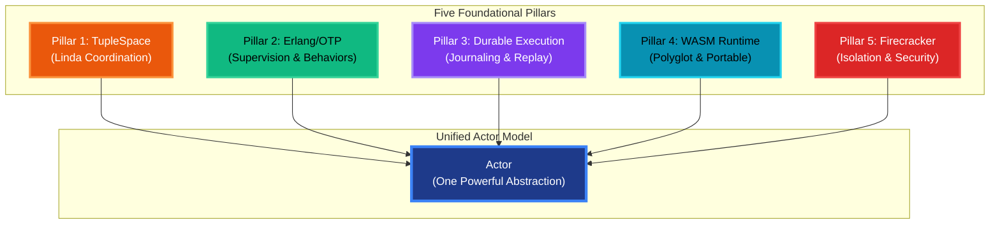

### 1. TupleSpace Coordination (Linda Model)

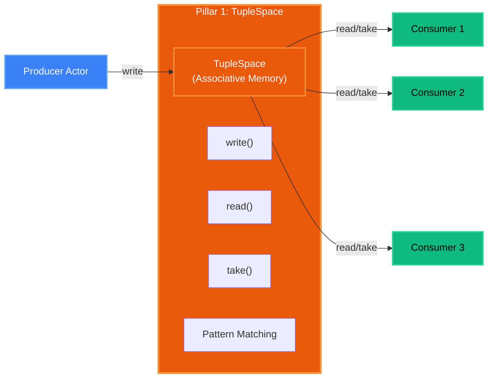

Decoupled communication via associative memory:

- **Spatial Decoupling**: Actors don't need to know each other
- **Temporal Decoupling**: Actors don't need to be active simultaneously
- **Pattern Matching**: Flexible tuple retrieval
- **Blocking Operations**: `read()` and `take()` wait for matching tuples
- **Non-blocking Operations**: `read_if_exists()` and `take_if_exists()` for non-blocking access

### 2. Erlang/OTP Philosophy

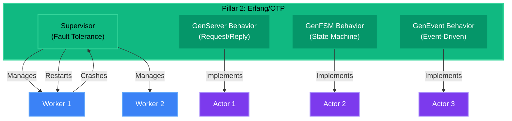

Supervision trees and fault tolerance:

- **GenServer Behavior**: Request/reply pattern
- **Supervision Trees**: Automatic restart and recovery
- **"Let It Crash"**: Failure isolation and recovery
- **Behaviors**: Reusable patterns (GenServer, GenFSM, GenEvent)

### 3. Durable Execution

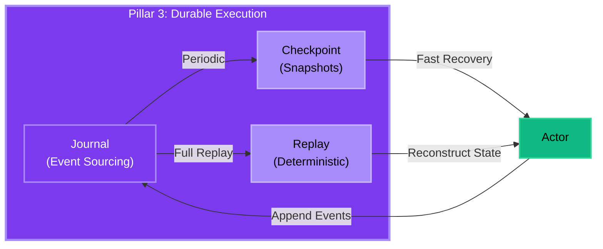

Restate-inspired journaling for exactly-once semantics:

- **Event Sourcing**: Complete audit trail
- **Deterministic Replay**: Recover from any point
- **Exactly-Once**: Guaranteed message processing
- **Time-Travel Debugging**: Replay past executions

For comprehensive documentation on durability, journaling, recovery, and channel-based mailboxes, see [Durability Documentation](durability.md).

### 4. WASM Runtime

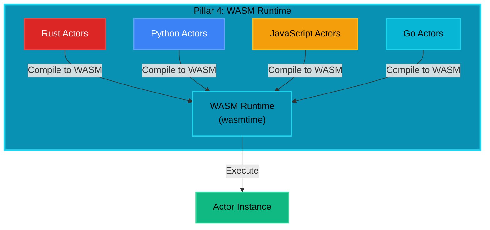

Portable, secure actors:

- **Polyglot Support**: Write actors in any language
- **Portable**: Run anywhere WASM runs
- **Secure**: WASM sandbox provides isolation
- **Fast**: Near-native performance

### 5. Firecracker Isolation

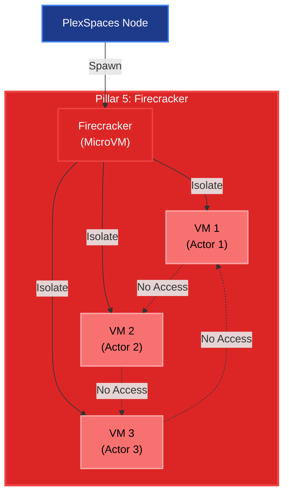

MicroVM-level isolation:

- **Strong Isolation**: Each actor in its own microVM
- **Fast Startup**: <125ms VM creation
- **Resource Limits**: CPU, memory, I/O quotas
- **Multi-Tenancy**: Secure multi-tenant deployments

## System Architecture

### High-Level Architecture Diagram

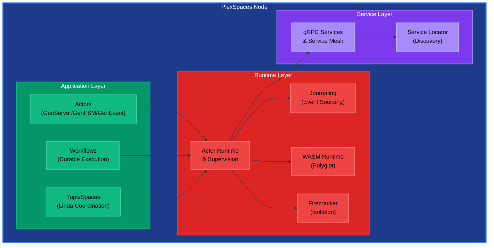

### Component Interaction Diagram

```mermaid
sequenceDiagram
    participant Client
    participant Node
    participant ActorRef
    participant Actor
    participant Facets
    participant Journal
    participant TupleSpace
    
    Client->>Node: Spawn Actor
    Node->>Actor: Create Actor Instance
    Node->>Facets: Attach Facets
    Node->>ActorRef: Return ActorRef
    Node-->>Client: ActorRef
    
    Client->>ActorRef: tell(message) or ask(message)
    ActorRef->>Node: Route Message
    Node->>Actor: Deliver to Mailbox
    Actor->>Facets: Intercept (on_message)
    Facets->>Journal: Append Entry (if DurabilityFacet)
    Actor->>Actor: Process Message
    Actor->>TupleSpace: Write/Read Tuples (if needed)
    Actor-->>ActorRef: Reply (if ask)
    ActorRef-->>Client: Response
```

## Core Abstractions

### Actors

The fundamental unit of computation:

- **Stateful**: Each actor maintains private state
- **Sequential**: Messages processed one at a time
- **Location-Transparent**: Work the same locally or remotely
- **Fault-Tolerant**: Automatic recovery via supervision

### ActorRef

Lightweight handle to an actor:

- **Location-Transparent**: Same API for local/remote
- **Cloneable**: Share references safely
- **Message Passing**: `tell()` and `ask()` methods

### Behaviors

Define how actors process messages (compile-time patterns):

- **GenServerBehavior**: Erlang/OTP-style request/reply (synchronous)
- **GenFSMBehavior**: Finite state machine (state transitions)
- **GenEventBehavior**: Event-driven processing (fire-and-forget)
- **WorkflowBehavior**: Durable workflow orchestration (Temporal/Restate-inspired)

**Key Difference**: Behaviors are compile-time traits (zero overhead), while Facets are runtime capabilities (small interception overhead).

See [Detailed Design - Behaviors](detailed-design.md#behaviors) for comprehensive documentation.

### Facets

Composable capabilities that extend actor behavior at runtime:

**Infrastructure Facets**:
- **VirtualActorFacet**: Orleans-style activation/deactivation
- **DurabilityFacet**: Automatic persistence and recovery (Restate-inspired)
- **MobilityFacet**: Actor migration between nodes

**Capability Facets**:
- **HttpClientFacet**: HTTP client for outbound requests
- **KeyValueFacet**: Key-value store access
- **BlobStorageFacet**: Blob storage access

**Timer/Reminder Facets**:
- **TimerFacet**: Scheduled tasks (one-shot and periodic)
- **ReminderFacet**: Persistent scheduled reminders

**Observability Facets**:
- **MetricsFacet**: Prometheus metrics collection
- **TracingFacet**: Distributed tracing (OpenTelemetry)
- **LoggingFacet**: Structured logging

**Security Facets**:
- **AuthenticationFacet**: Identity verification
- **AuthorizationFacet**: Permission checking

**Event Facets**:
- **EventEmitterFacet**: Event-driven communication

See [Detailed Design - Facets](detailed-design.md#facets) for comprehensive documentation.

### TupleSpace

Linda-style coordination for decoupled communication:

- **Write**: Add tuples to space (non-blocking)
- **Read**: Non-destructive retrieval (blocking or non-blocking)
- **Take**: Destructive retrieval (blocking or non-blocking)
- **Pattern Matching**: Flexible tuple queries with wildcards
- **Subscriptions**: Event notifications on tuple changes
- **Transactions**: Atomic tuple operations

**Backends**: InMemory (testing), Redis (production), PostgreSQL (transactional)

See [Detailed Design - TupleSpace](detailed-design.md#tuplespace) for comprehensive documentation.

## Communication Patterns

### Message Passing Sequence Diagram

```mermaid
sequenceDiagram
    participant Sender
    participant ActorRef
    participant Node
    participant Mailbox
    participant Actor
    participant Behavior
    
    rect rgb(240, 240, 240)
        Note over Sender,Behavior: Tell (Fire-and-Forget)
        Sender->>ActorRef: tell(message)
        ActorRef->>Node: Route Message
        Node->>Mailbox: Enqueue Message
        Mailbox->>Actor: Dequeue Message
        Actor->>Behavior: handle_message()
        Behavior-->>Actor: Ok(())
    end
    
    rect rgb(240, 240, 240)
        Note over Sender,Behavior: Ask (Request-Reply)
        Sender->>ActorRef: ask(request, timeout)
        ActorRef->>Node: Route Message (with correlation_id)
        Node->>Mailbox: Enqueue Message
        Mailbox->>Actor: Dequeue Message
        Actor->>Behavior: handle_request()
        Behavior-->>Actor: Reply
        Actor->>Node: Send Reply (via correlation_id)
        Node->>ActorRef: Match Reply
        ActorRef-->>Sender: Response
    end
```

### Tell (Fire-and-Forget)

```rust
actor_ref.tell(message).await?;
```

### Ask (Request-Reply)

```rust
let reply = actor_ref.ask(request, Duration::from_secs(5)).await?;
```

### TupleSpace Coordination

```rust
// Write tuple
tuplespace.write(Tuple::new(vec!["order", order_id])).await?;

// Read tuple (non-blocking)
let tuple = tuplespace.read_if_exists(pattern).await?;

// Take tuple (blocking)
let tuple = tuplespace.take(pattern).await?;
```

### TupleSpace Coordination Diagram

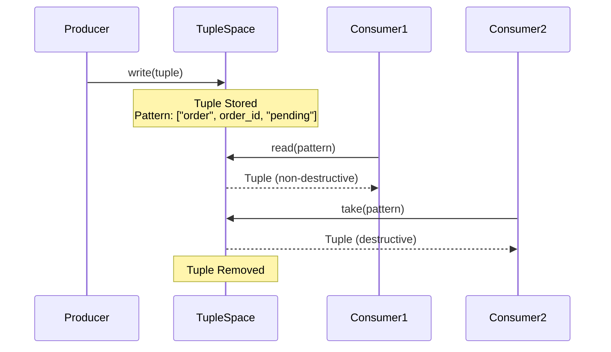

## Design Principles

### 1. Proto-First

All contracts defined in Protocol Buffers:

- Cross-language compatibility
- Versioning and evolution
- Single source of truth

### 2. Location Transparency

Actors work seamlessly across boundaries:

- Local: Direct mailbox access
- Remote: Automatic gRPC routing
- Same API for both

### 3. Composable Abstractions

One powerful actor model with dynamic facets:

- No inheritance hierarchies
- Runtime composition
- Pay for what you use

### 4. Single-Threaded Execution

Each actor processes messages sequentially:

- No race conditions
- Simple reasoning
- Predictable behavior

### 5. Failure Isolation

Actors are isolated:

- One actor's failure doesn't affect others
- Supervision trees handle recovery
- "Let it crash" philosophy

## Core Primitives

### ActorId

Unique identifier for actors in format `name@node_id`:

```rust
type ActorId = String; // Format: "actor-name@node-id"
```

**Examples**:
- `"counter@node1"` - Local actor
- `"user-123@node2"` - Remote actor
- `"virtual-actor@node1"` - Virtual actor (always addressable)

### ActorRef

Lightweight, location-transparent handle to an actor:

```rust
pub struct ActorRef {
    actor_id: ActorId,
    location: ActorLocation,
    service_locator: Arc<ServiceLocator>,
}
```

**Operations**:
- `tell(message)` - Fire-and-forget messaging
- `ask(message, timeout)` - Request-reply messaging
- `actor_id()` - Get actor identifier

### ActorContext

Provides actors with access to all system services:

```rust
pub trait ActorContext {
    fn actor_service(&self) -> &dyn ActorService;
    fn object_registry(&self) -> &dyn ObjectRegistry;
    fn tuplespace(&self) -> &dyn TupleSpaceProvider;
    fn channel_service(&self) -> &dyn ChannelService;
    fn process_group_service(&self) -> &dyn ProcessGroupService;
    fn facet_service(&self) -> &dyn FacetService;
}
```

See [Detailed Design - APIs](detailed-design.md#apis-and-primitives) for complete API documentation.

### Message

Message structure for actor communication:

```rust
pub struct Message {
    id: MessageId,
    sender: Option<ActorId>,
    receiver: ActorId,
    payload: Vec<u8>,
    message_type: String,
    correlation_id: Option<CorrelationId>,
    timestamp: u64,
    ttl: Option<Duration>,
}
```

### Tuple

Tuple structure for TupleSpace coordination:

```rust
pub struct Tuple {
    fields: Vec<TupleField>,
    timestamp: u64,
    ttl: Option<u64>,
    owner: Option<String>,
    metadata: HashMap<String, serde_json::Value>,
}

pub enum TupleField {
    String(String),
    Integer(i64),
    Float(f64),
    Boolean(bool),
    Bytes(Vec<u8>),
    Null,
}
```

### Pattern

Pattern for tuple matching:

```rust
pub struct Pattern {
    fields: Vec<PatternField>,
}

pub enum PatternField {
    Exact(TupleField),
    Wildcard,
}
```

## Data Model

### Actor State

```rust
struct Actor {
    id: ActorId,
    state: ActorState,
    behavior: Box<dyn ActorBehavior>,
    mailbox: Mailbox,
    facets: Vec<Box<dyn Facet>>,
}
```

### Messages

```rust
struct Message {
    id: MessageId,
    sender: Option<ActorId>,
    receiver: ActorId,
    payload: Vec<u8>,
    correlation_id: Option<CorrelationId>,
}
```

### Tuples

```rust
struct Tuple {
    fields: Vec<TupleField>,
    timestamp: u64,
    ttl: Option<u64>,
}
```

## Observability

### Metrics

- Actor count and state distribution
- Message throughput and latency
- TupleSpace operations
- Workflow execution times

### Tracing

- Distributed tracing across actors
- Request correlation IDs
- Span tracking for workflows

### Health Checks

- Node health status
- Actor health monitoring
- Backend connectivity

## Scalability

### Horizontal Scaling

- Add nodes to cluster
- Automatic load distribution
- Actor migration for rebalancing

### Resource Awareness

- CPU, memory, I/O profiles
- Intelligent placement
- Resource quotas and limits

## FaaS Invocation

PlexSpaces provides FaaS-style HTTP invocation of actors, enabling serverless patterns and cloud platform integration.

### Architecture

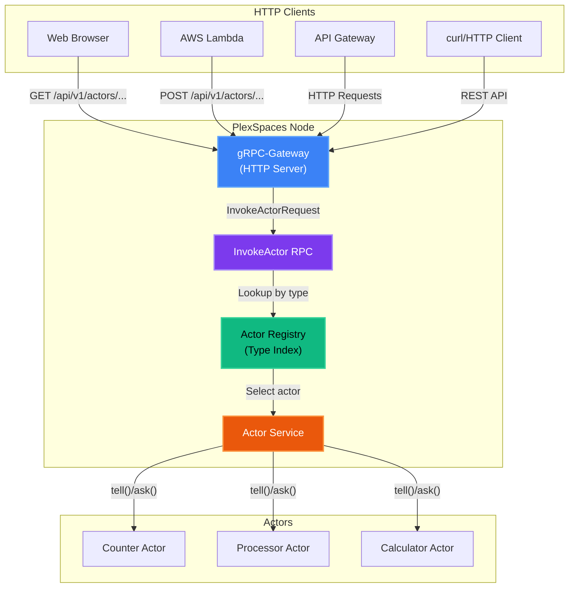

### API Endpoint

```
GET  /api/v1/actors/{tenant_id}/{namespace}/{actor_type}?param1=value1&param2=value2
POST /api/v1/actors/{tenant_id}/{namespace}/{actor_type}
PUT  /api/v1/actors/{tenant_id}/{namespace}/{actor_type}
DELETE /api/v1/actors/{tenant_id}/{namespace}/{actor_type}

# Alternative paths without tenant_id (defaults to "default")
GET  /api/v1/actors/{namespace}/{actor_type}?param1=value1&param2=value2
POST /api/v1/actors/{namespace}/{actor_type}
PUT  /api/v1/actors/{namespace}/{actor_type}
DELETE /api/v1/actors/{namespace}/{actor_type}
```

### HTTP Method Handling

- **GET**: Query parameters → JSON payload → `ask()` pattern (request-reply)
- **POST/PUT**: Request body → payload, headers → metadata → `tell()` pattern (fire-and-forget)
- **DELETE**: Query parameters → JSON payload → `ask()` pattern (request-reply)

### Actor Discovery

- **Type-Based Lookup**: O(1) hashmap lookup by `(tenant_id, namespace, actor_type)`
- **Load Balancing**: Random selection when multiple actors of same type exist
- **404 Handling**: Returns 404 if no actors found

### Path Routing

Actors receive full HTTP path information for custom routing:

- `message.uri_path`: Full URL path (e.g., "/api/v1/actors/default/default/counter/metrics")
- `message.uri_method`: HTTP method (GET, POST, PUT, DELETE)
- `message.metadata["http_path"]`: Full URL path (for backward compatibility)
- `message.metadata["http_subpath"]`: Path after actor_type (for future routing)

### Routing Patterns

#### HTTP Gateway Architecture

The HTTP gateway (Axum) runs as a separate server alongside the gRPC server:

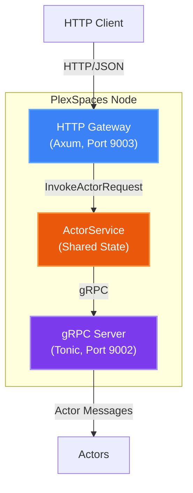

**Key Design Decisions**:
- **Separate Servers**: HTTP gateway and gRPC server run concurrently using `tokio::select!`
- **Shared State**: Both servers share the same `ActorServiceImpl` instance
- **Port Configuration**: HTTP gateway listens on `grpc_port + 1` (e.g., 9003 if gRPC is 9002)
- **Direct Service Calls**: HTTP handlers directly invoke `ActorServiceTrait::invoke_actor` rather than making gRPC calls

#### Request Flow

1. **HTTP Request Parsing**: Axum router extracts path parameters (`tenant_id`, `namespace`, `actor_type`)
2. **Query/Body Parsing**: GET requests parse query params, POST/PUT parse request body
3. **gRPC Request Construction**: Build `InvokeActorRequest` with:
   - Path parameters → `tenant_id`, `namespace`, `actor_type`
   - Query params or body → `payload` (JSON bytes)
   - HTTP method → `message_type` ("call" for GET/DELETE, "cast" for POST/PUT)
4. **Service Invocation**: Call `ActorServiceImpl::invoke_actor` directly (not via gRPC)
5. **Response Conversion**: Convert `InvokeActorResponse` to HTTP/JSON:
   - `payload` (bytes) → JSON value (UTF-8 decode or base64 encode)
   - `success` → HTTP status code (200 for success, 500 for errors)
   - `error_message` → HTTP error response body

#### Actor Discovery Pattern

```rust
// 1. Type-based lookup
let actors = actor_registry.discover_actors_by_type(
    tenant_id, 
    namespace, 
    actor_type
).await;

// 2. Random selection (load balancing)
let selected_actor = actors.choose(&mut rng)
    .ok_or_else(|| "No actors found")?;

// 3. Message delivery
actor_ref.ask(message, timeout).await
```

#### Message Type Routing

HTTP methods map to actor message patterns:

| HTTP Method | Message Type | Pattern | Reply Expected |
|------------|--------------|---------|----------------|
| GET | `Call` | Ask | Yes |
| DELETE | `Call` | Ask | Yes |
| POST | `Cast` | Tell | No |
| PUT | `Cast` | Tell | No |

**Behavior Routing**:
- `GenServer::route_message` handles both `Call` and `Cast`
- `Call` messages: Actor must reply via `ctx.send_reply()`
- `Cast` messages: Fire-and-forget, no reply required

#### Multi-Node Routing

For distributed deployments:

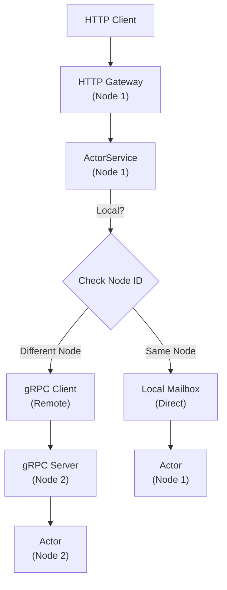

**Location Transparency**: Same API works for local and remote actors - routing is automatic.

### AWS Lambda Integration

Ready for AWS Lambda Function URLs:

1. Deploy PlexSpaces Node as Lambda function
2. Enable Function URL for HTTP access
3. Route `/api/v1/actors/{tenant_id}/{namespace}/{actor_type}` or `/api/v1/actors/{namespace}/{actor_type}` to Lambda
4. Automatic scaling based on request volume

### Multi-Tenancy

- **Tenant Isolation**: All actors scoped by `tenant_id` (defaults to "default" if not provided)
- **Namespace Isolation**: Actors organized by namespace within tenant (defaults to "default" if not provided)
- **Lookup Key**: `(tenant_id, namespace, actor_type)` for efficient O(1) lookup
- **JWT Authentication**: Extract `tenant_id` from JWT claims
- **Access Control**: Verify JWT `tenant_id` matches path `tenant_id`
- **Default Tenant**: "default" when not provided in path or when no authentication provided
- **Default Namespace**: "default" when not provided in path

See [Concepts: FaaS-Style Invocation](concepts.md#faas-style-invocation) and [Detailed Design: InvokeActor Service](detailed-design.md#invokeactor-service) for implementation details.

## Security

### Multi-Tenancy

- Isolation contexts
- Resource quotas
- Access control

### Network Security

- mTLS for inter-node communication
- Service mesh integration
- Firewall rules

## See Also

- [Concepts](concepts.md): Core concepts explained in detail
- [Detailed Design](detailed-design.md): Component deep-dives
- [Getting Started](getting-started.md): Quick start guide
- [Use Cases](use-cases.md): Real-world applications
