# Architecture

This document provides a high-level overview of PlexSpaces architecture, abstractions, and design principles.

> **📖 For comprehensive actor system documentation**, see [Actor System Guide](actor-system.md) which covers the unified actor system, supervision trees, applications, facets, behaviors, and observability in detail.

## Overview

PlexSpaces is a unified distributed actor framework that combines the best patterns from Erlang/OTP, Orleans, Temporal, and modern serverless architectures into a single, powerful abstraction.

### Historical Context

PlexSpaces is the evolution of **JavaNow**, a comprehensive parallel computing framework developed for post-graduate research in the late 1990s that supported:

- **Linda-style Tuple Spaces** (EntitySpaces): Distributed associative shared memory
- **Mobile Agents**: Code mobility with state migration
- **Dynamic Capabilities**: Facets pattern for runtime composition
- **Event-Driven Architecture**: Publisher/Subscriber messaging
- **Non-blocking Operations**: `getIfExists()`, `readIfExists()` for tuple spaces
- **Quality of Service**: BEST_EFFORT, GUARANTEED delivery semantics

PlexSpaces modernizes these concepts with:
- Rust for performance and safety
- WebAssembly for polyglot support (Python, TypeScript, Rust, Go) - see [Polyglot WASM Development Guide](polyglot.md)
- Protocol Buffers for type-safe APIs
- Modern observability and deployment patterns
- Integration with Erlang/OTP supervision, Orleans virtual actors, and Temporal-style durable workflows

### Client code and SDK

- **Core in main crates**: Business logic and framework behavior live in the main Rust crates. The SDK is a **decorator** that removes boilerplate and simplifies usage; it does not reimplement core logic.
- **Spawning**: Client code and examples should use **Node** via SDK spawn helpers (`spawn`, `spawn_with_facets`, `spawn_with_storage`). Do not use `ActorFactory` directly except in framework code (e.g. gRPC spawn).
- **Messages**: Use SDK helpers `call_message`, `cast_message`, or `new_message` for message construction instead of `Message::new`. Prefer annotations (`#[gen_server_actor]`, `#[handler("op")]`) for actor definitions.
- **WASM**: SDKs provide WASM support that wraps the same underlying framework (in-process, no RPC). gRPC and other remote APIs are built separately.
- **Consistency**: SDK and API behavior are consistent across Rust, Python, TypeScript, and Go where the abstraction maps.

See [SDK guide](sdk.md) and [AGENTS.md](../AGENTS.md) for conventions.

### Metrics, dashboard, and APIs

Observability uses one Prometheus-oriented pipeline: process-local recording through the `metrics` crate with a single install path (`metrics_service::install_metrics_recorder`), export via `MetricsService`, and parsing/overlay for dashboard and node APIs (see [Metrics and Prometheus export](metrics.md) and [Actor System — Observability](actor-system.md#observability)). gRPC services that emit or route work must obtain `RequestContext` from metadata through the shared helper (`request_context_from_grpc_request`) so tenant isolation matches [Security — gRPC](security.md#grpc-middleware-plexspaces-grpc-middleware).

For how workspace crates depend on each other (including dev-dependency edges in `cargo metadata`), see [Dependency graph](dependency-graph.md).

## Five Foundational Pillars

### Pillar Architecture Diagram

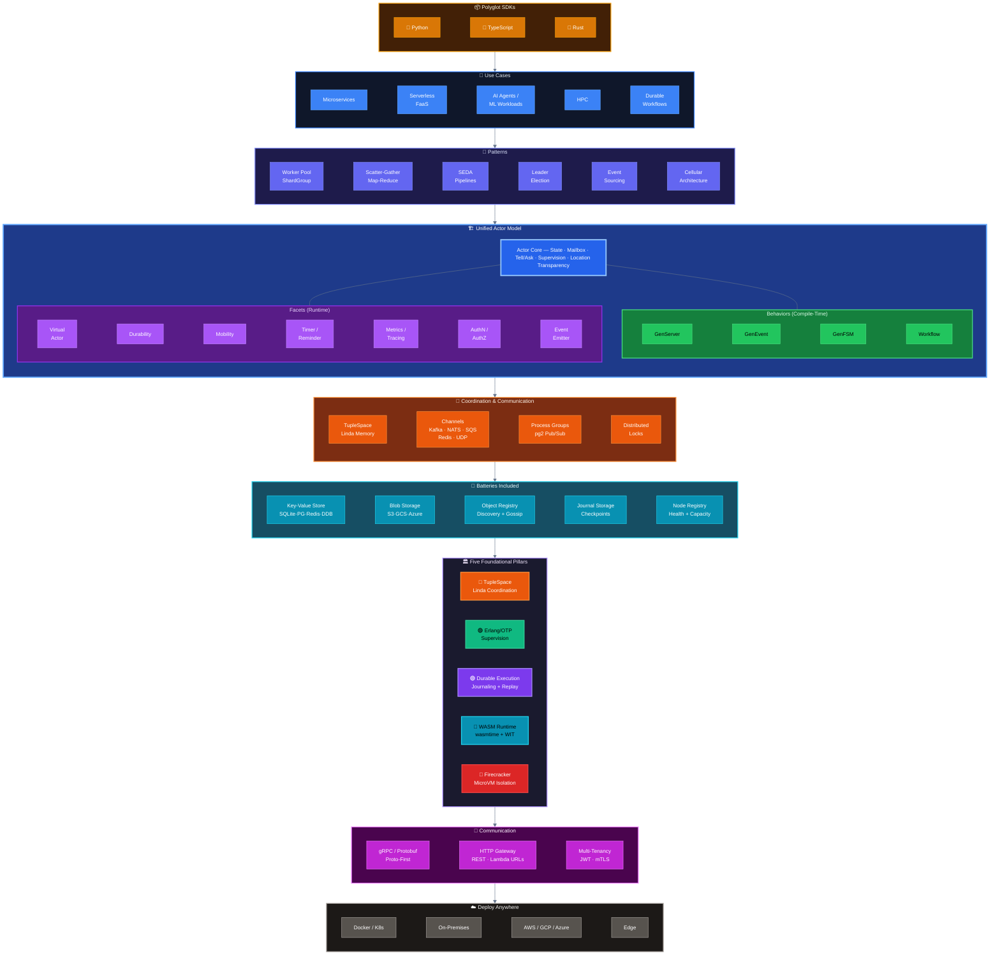
```mermaid
%%{init: {'theme': 'base', 'themeVariables': {'primaryColor': '#3b82f6', 'primaryTextColor': '#fff', 'lineColor': '#64748b', 'fontSize': '13px'}}}%%
graph TB
    subgraph SDKs["📦 Polyglot SDKs"]
        SDK1["🐍 Python"] ~~~ SDK2["📜 TypeScript"] ~~~ SDK3["🦀 Rust"]
    end

    subgraph UseCases["🎯 Use Cases"]
        UC1["Microservices"] ~~~ UC2["Serverless<br/>FaaS"] ~~~ UC3["AI Agents /<br/>ML Workloads"] ~~~ UC4["HPC"] ~~~ UC5["Durable<br/>Workflows"]
    end

    subgraph Patterns["📐 Patterns"]
        PA1["Worker Pool<br/>ShardGroup"] ~~~ PA2["Scatter-Gather<br/>Map-Reduce"] ~~~ PA3["SEDA<br/>Pipelines"] ~~~ PA4["Leader<br/>Election"] ~~~ PA5["Event<br/>Sourcing"] ~~~ PA6["Cellular<br/>Architecture"]
    end

    subgraph Core["🏗️ Unified Actor Model"]
        direction TB
        ActorCore["Actor Core — State · Mailbox · Tell/Ask · Supervision · Location Transparency"]
        subgraph BehaviorRow["Behaviors (Compile-Time)"]
            B1["GenServer"] ~~~ B2["GenEvent"] ~~~ B3["GenFSM"] ~~~ B4["Workflow"]
        end
        subgraph FacetRow["Facets (Runtime)"]
            F1["Virtual<br/>Actor"] ~~~ F2["Durability"] ~~~ F3["Mobility"] ~~~ F4["Timer /<br/>Reminder"] ~~~ F5["Metrics /<br/>Tracing"] ~~~ F6["AuthN /<br/>AuthZ"] ~~~ F7["Event<br/>Emitter"]
        end
        ActorCore --- BehaviorRow
        ActorCore --- FacetRow
    end

    subgraph CoordLayer["🔗 Coordination & Communication"]
        CO1["TupleSpace<br/>Linda Memory"] ~~~ CO2["Channels<br/>Kafka · NATS · SQS<br/>Redis · UDP"] ~~~ CO3["Process Groups<br/>pg2 Pub/Sub"] ~~~ CO4["Distributed<br/>Locks"]
    end

    subgraph Services["🔧 Batteries Included"]
        IS1["Key-Value Store<br/>SQLite·PG·Redis·DDB"] ~~~ IS2["Blob Storage<br/>S3·GCS·Azure"] ~~~ IS3["Object Registry<br/>Discovery + Gossip"] ~~~ IS4["Journal Storage<br/>Checkpoints"] ~~~ IS5["Node Registry<br/>Health + Capacity"]
    end

    subgraph Pillars["🏛️ Five Foundational Pillars"]
        P1["🔷 TupleSpace<br/>Linda Coordination"]
        P2["🟢 Erlang/OTP<br/>Supervision"]
        P3["🟣 Durable Execution<br/>Journaling + Replay"]
        P4["🔵 WASM Runtime<br/>wasmtime + WIT"]
        P5["🔴 Firecracker<br/>MicroVM Isolation"]
    end

    subgraph Deploy["☁️ Deploy Anywhere"]
        D1["Docker / K8s"] ~~~ D2["On-Premises"] ~~~ D3["AWS / GCP / Azure"] ~~~ D4["Edge"]
    end

    subgraph Comms["📡 Communication"]
        CM1["gRPC / Protobuf<br/>Proto-First"] ~~~ CM2["HTTP Gateway<br/>REST · Lambda URLs"] ~~~ CM3["Multi-Tenancy<br/>JWT · mTLS"]
    end

    SDKs --> UseCases
    UseCases --> Patterns
    Patterns --> Core
    Core --> CoordLayer
    CoordLayer --> Services
    Services --> Pillars
    Pillars --> Comms
    Comms --> Deploy

    style SDKs fill:#422006,stroke:#f59e0b,stroke-width:2px,color:#fefce8
    style UseCases fill:#0f172a,stroke:#3b82f6,stroke-width:2px,color:#e2e8f0
    style Patterns fill:#1e1b4b,stroke:#818cf8,stroke-width:2px,color:#e0e7ff
    style Core fill:#1e3a8a,stroke:#60a5fa,stroke-width:3px,color:#fff
    style CoordLayer fill:#7c2d12,stroke:#fb923c,stroke-width:2px,color:#fff7ed
    style Services fill:#164e63,stroke:#22d3ee,stroke-width:2px,color:#ecfeff
    style Pillars fill:#1a1a2e,stroke:#a78bfa,stroke-width:2px,color:#f3e8ff
    style Deploy fill:#1c1917,stroke:#a8a29e,stroke-width:2px,color:#f5f5f4
    style Comms fill:#4a044e,stroke:#e879f9,stroke-width:2px,color:#fdf4ff

    style SDK1 fill:#d97706,stroke:#f59e0b,color:#fff
    style SDK2 fill:#d97706,stroke:#f59e0b,color:#fff
    style SDK3 fill:#d97706,stroke:#f59e0b,color:#fff

    style UC1 fill:#3b82f6,stroke:#60a5fa,color:#fff
    style UC2 fill:#3b82f6,stroke:#60a5fa,color:#fff
    style UC3 fill:#3b82f6,stroke:#60a5fa,color:#fff
    style UC4 fill:#3b82f6,stroke:#60a5fa,color:#fff
    style UC5 fill:#3b82f6,stroke:#60a5fa,color:#fff

    style PA1 fill:#6366f1,stroke:#818cf8,color:#fff
    style PA2 fill:#6366f1,stroke:#818cf8,color:#fff
    style PA3 fill:#6366f1,stroke:#818cf8,color:#fff
    style PA4 fill:#6366f1,stroke:#818cf8,color:#fff
    style PA5 fill:#6366f1,stroke:#818cf8,color:#fff
    style PA6 fill:#6366f1,stroke:#818cf8,color:#fff

    style ActorCore fill:#2563eb,stroke:#93c5fd,stroke-width:3px,color:#fff
    style BehaviorRow fill:#15803d,stroke:#4ade80,stroke-width:2px,color:#dcfce7
    style FacetRow fill:#581c87,stroke:#9333ea,stroke-width:2px,color:#e9d5ff

    style B1 fill:#22c55e,stroke:#4ade80,color:#000
    style B2 fill:#22c55e,stroke:#4ade80,color:#000
    style B3 fill:#22c55e,stroke:#4ade80,color:#000
    style B4 fill:#22c55e,stroke:#4ade80,color:#000

    style F1 fill:#a855f7,stroke:#c084fc,color:#fff
    style F2 fill:#a855f7,stroke:#c084fc,color:#fff
    style F3 fill:#a855f7,stroke:#c084fc,color:#fff
    style F4 fill:#a855f7,stroke:#c084fc,color:#fff
    style F5 fill:#a855f7,stroke:#c084fc,color:#fff
    style F6 fill:#a855f7,stroke:#c084fc,color:#fff
    style F7 fill:#a855f7,stroke:#c084fc,color:#fff

    style CO1 fill:#ea580c,stroke:#fb923c,color:#fff
    style CO2 fill:#ea580c,stroke:#fb923c,color:#fff
    style CO3 fill:#ea580c,stroke:#fb923c,color:#fff
    style CO4 fill:#ea580c,stroke:#fb923c,color:#fff

    style IS1 fill:#0891b2,stroke:#22d3ee,color:#fff
    style IS2 fill:#0891b2,stroke:#22d3ee,color:#fff
    style IS3 fill:#0891b2,stroke:#22d3ee,color:#fff
    style IS4 fill:#0891b2,stroke:#22d3ee,color:#fff
    style IS5 fill:#0891b2,stroke:#22d3ee,color:#fff

    style P1 fill:#ea580c,stroke:#fb923c,stroke-width:2px,color:#fff
    style P2 fill:#10b981,stroke:#34d399,stroke-width:2px,color:#000
    style P3 fill:#7c3aed,stroke:#a78bfa,stroke-width:2px,color:#fff
    style P4 fill:#0891b2,stroke:#22d3ee,stroke-width:2px,color:#000
    style P5 fill:#dc2626,stroke:#ef4444,stroke-width:2px,color:#fff

    style CM1 fill:#c026d3,stroke:#e879f9,color:#fff
    style CM2 fill:#c026d3,stroke:#e879f9,color:#fff
    style CM3 fill:#c026d3,stroke:#e879f9,color:#fff

    style D1 fill:#57534e,stroke:#a8a29e,color:#fff
    style D2 fill:#57534e,stroke:#a8a29e,color:#fff
    style D3 fill:#57534e,stroke:#a8a29e,color:#fff
    style D4 fill:#57534e,stroke:#a8a29e,color:#fff
```

### 1. TupleSpace Coordination (Linda Model)

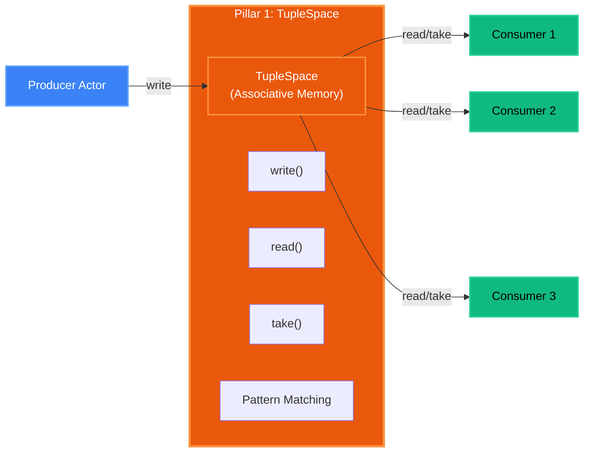
```mermaid
graph LR
    subgraph Pillar1["Pillar 1: TupleSpace"]
        TS["TupleSpace<br/>(Associative Memory)"]
        Write["write()"]
        Read["read()"]
        Take["take()"]
        Pattern["Pattern Matching"]
    end
    
    Producer["Producer Actor"] -->|write| TS
    TS -->|read/take| Consumer1["Consumer 1"]
    TS -->|read/take| Consumer2["Consumer 2"]
    TS -->|read/take| Consumer3["Consumer 3"]
    
    style Pillar1 fill:#ea580c,stroke:#fb923c,stroke-width:3px,color:#fff
    style TS fill:#ea580c,stroke:#fb923c,stroke-width:2px,color:#fff
    style Producer fill:#3b82f6,stroke:#60a5fa,stroke-width:2px,color:#fff
    style Consumer1 fill:#10b981,stroke:#34d399,stroke-width:2px,color:#000
    style Consumer2 fill:#10b981,stroke:#34d399,stroke-width:2px,color:#000
    style Consumer3 fill:#10b981,stroke:#34d399,stroke-width:2px,color:#000
```

Decoupled communication via associative memory:

- **Spatial Decoupling**: Actors don't need to know each other
- **Temporal Decoupling**: Actors don't need to be active simultaneously
- **Pattern Matching**: Flexible tuple retrieval
- **Blocking Operations**: `read()` and `take()` wait for matching tuples
- **Non-blocking Operations**: `read_if_exists()` and `take_if_exists()` for non-blocking access

### 2. Erlang/OTP Philosophy

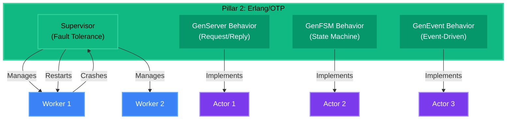
```mermaid
graph TD
    subgraph Pillar2["Pillar 2: Erlang/OTP"]
        Supervisor["Supervisor<br/>(Fault Tolerance)"]
        GenServer["GenServer Behavior<br/>(Request/Reply)"]
        GenFSM["GenFSM Behavior<br/>(State Machine)"]
        GenEvent["GenEvent Behavior<br/>(Event-Driven)"]
    end
    
    Supervisor -->|"Manages"| Worker1["Worker 1"]
    Supervisor -->|"Manages"| Worker2["Worker 2"]
    Worker1 -->|"Crashes"| Supervisor
    Supervisor -->|"Restarts"| Worker1
    
    GenServer -->|"Implements"| Actor1["Actor 1"]
    GenFSM -->|"Implements"| Actor2["Actor 2"]
    GenEvent -->|"Implements"| Actor3["Actor 3"]
    
    style Pillar2 fill:#10b981,stroke:#34d399,stroke-width:3px,color:#000
    style Supervisor fill:#10b981,stroke:#34d399,stroke-width:2px,color:#000
    style GenServer fill:#059669,stroke:#10b981,stroke-width:2px,color:#fff
    style GenFSM fill:#059669,stroke:#10b981,stroke-width:2px,color:#fff
    style GenEvent fill:#059669,stroke:#10b981,stroke-width:2px,color:#fff
    style Worker1 fill:#3b82f6,stroke:#60a5fa,stroke-width:2px,color:#fff
    style Worker2 fill:#3b82f6,stroke:#60a5fa,stroke-width:2px,color:#fff
    style Actor1 fill:#7c3aed,stroke:#a78bfa,stroke-width:2px,color:#fff
    style Actor2 fill:#7c3aed,stroke:#a78bfa,stroke-width:2px,color:#fff
    style Actor3 fill:#7c3aed,stroke:#a78bfa,stroke-width:2px,color:#fff
```

Supervision trees and fault tolerance:

- **GenServer Behavior**: Request/reply pattern
- **Supervision Trees**: Automatic restart and recovery
- **"Let It Crash"**: Failure isolation and recovery
- **Behaviors**: Reusable patterns (GenServer, GenFSM, GenEvent)

### 3. Durable Execution

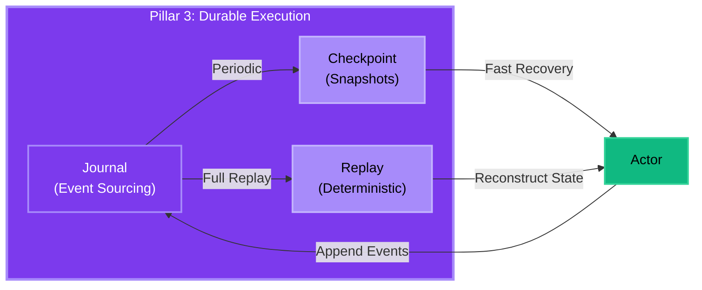
```mermaid
graph LR
    subgraph Pillar3["Pillar 3: Durable Execution"]
        Journal["Journal<br/>(Event Sourcing)"]
        Checkpoint["Checkpoint<br/>(Snapshots)"]
        Replay["Replay<br/>(Deterministic)"]
    end
    
    Actor["Actor"] -->|"Append Events"| Journal
    Journal -->|"Periodic"| Checkpoint
    Checkpoint -->|"Fast Recovery"| Actor
    Journal -->|"Full Replay"| Replay
    Replay -->|"Reconstruct State"| Actor
    
    style Pillar3 fill:#7c3aed,stroke:#a78bfa,stroke-width:3px,color:#fff
    style Journal fill:#7c3aed,stroke:#a78bfa,stroke-width:2px,color:#fff
    style Checkpoint fill:#a78bfa,stroke:#c4b5fd,stroke-width:2px,color:#000
    style Replay fill:#a78bfa,stroke:#c4b5fd,stroke-width:2px,color:#000
    style Actor fill:#10b981,stroke:#34d399,stroke-width:2px,color:#000
```

Restate-inspired journaling for exactly-once semantics:

- **Event Sourcing**: Complete audit trail
- **Deterministic Replay**: Recover from any point
- **Exactly-Once**: Guaranteed message processing
- **Time-Travel Debugging**: Replay past executions

For comprehensive documentation on durability, journaling, recovery, and channel-based mailboxes, see [Durability Documentation](durability.md).

### 4. WASM Runtime

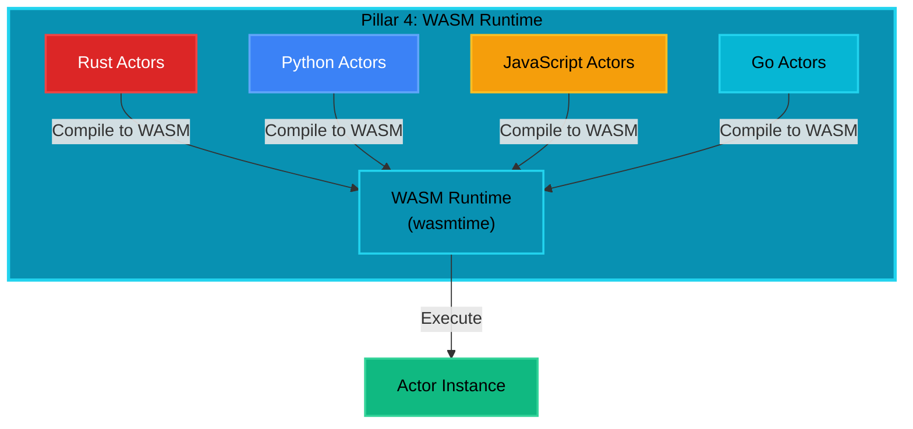
```mermaid
graph TB
    subgraph Pillar4["Pillar 4: WASM Runtime"]
        WASM["WASM Runtime<br/>(wasmtime)"]
        Rust["Rust Actors"]
        Python["Python Actors"]
        JS["JavaScript Actors"]
        Go["Go Actors"]
    end
    
    Rust -->|"Compile to WASM"| WASM
    Python -->|"Compile to WASM"| WASM
    JS -->|"Compile to WASM"| WASM
    Go -->|"Compile to WASM"| WASM
    WASM -->|"Execute"| Actor["Actor Instance"]
    
    style Pillar4 fill:#0891b2,stroke:#22d3ee,stroke-width:3px,color:#000
    style WASM fill:#0891b2,stroke:#22d3ee,stroke-width:2px,color:#000
    style Rust fill:#dc2626,stroke:#ef4444,stroke-width:2px,color:#fff
    style Python fill:#3b82f6,stroke:#60a5fa,stroke-width:2px,color:#fff
    style JS fill:#f59e0b,stroke:#fbbf24,stroke-width:2px,color:#000
    style Go fill:#06b6d4,stroke:#22d3ee,stroke-width:2px,color:#000
    style Actor fill:#10b981,stroke:#34d399,stroke-width:2px,color:#000
```

Portable, secure actors:

- **Polyglot Support**: Write actors in Python, TypeScript, Go, or Rust via language-specific SDKs
- **One Canonical WIT Package**: `plexspaces:actor@0.1.0` with `actor-world` for deployable polyglot actors and `plexspaces-actor` for native typed actors
- **Rich Host Interface**: Messaging (send, ask), actor lifecycle (spawn, stop), linking/monitoring, timers, process groups, elastic pool (checkout/checkin), KV store, TupleSpace, distributed locks, blob storage
- **Portable**: Run anywhere WASM runs
- **Secure**: WASM sandbox provides isolation
- **State Preservation**: Automatic get_state/set_state cycle across WASM re-instantiation
- **Fast**: Near-native performance with wasmtime Component Model

### 5. Firecracker Isolation

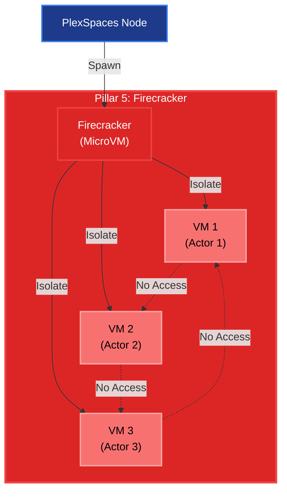
```mermaid
graph TB
    subgraph Pillar5["Pillar 5: Firecracker"]
        FC["Firecracker<br/>(MicroVM)"]
        VM1["VM 1<br/>(Actor 1)"]
        VM2["VM 2<br/>(Actor 2)"]
        VM3["VM 3<br/>(Actor 3)"]
    end
    
    Node["PlexSpaces Node"] -->|"Spawn"| FC
    FC -->|"Isolate"| VM1
    FC -->|"Isolate"| VM2
    FC -->|"Isolate"| VM3
    
    VM1 -.->|"No Access"| VM2
    VM2 -.->|"No Access"| VM3
    VM3 -.->|"No Access"| VM1
    
    style Pillar5 fill:#dc2626,stroke:#ef4444,stroke-width:3px,color:#fff
    style FC fill:#dc2626,stroke:#ef4444,stroke-width:2px,color:#fff
    style VM1 fill:#f87171,stroke:#fca5a5,stroke-width:2px,color:#000
    style VM2 fill:#f87171,stroke:#fca5a5,stroke-width:2px,color:#000
    style VM3 fill:#f87171,stroke:#fca5a5,stroke-width:2px,color:#000
    style Node fill:#1e3a8a,stroke:#3b82f6,stroke-width:2px,color:#fff
```

MicroVM-level isolation:

- **Strong Isolation**: Each actor in its own microVM
- **Fast Startup**: <125ms VM creation
- **Resource Limits**: CPU, memory, I/O quotas
- **Multi-Tenancy**: Secure multi-tenant deployments

## System Architecture

### High-Level Architecture Diagram

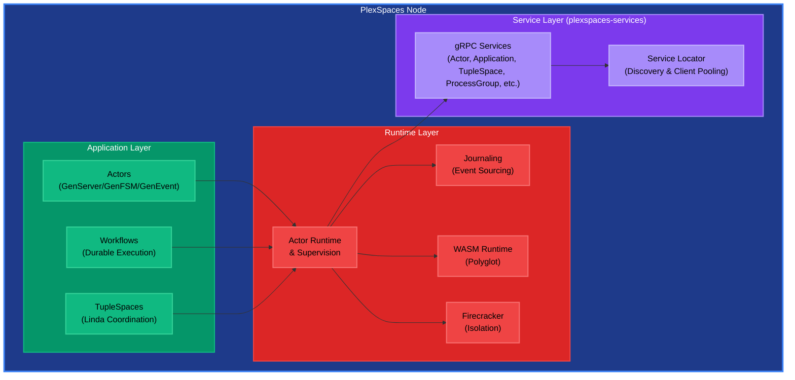
```mermaid
graph TB
    subgraph Node["PlexSpaces Node"]
        subgraph AppLayer["Application Layer"]
            Actors["Actors<br/>(GenServer/GenFSM/GenEvent)"]
            Workflows["Workflows<br/>(Durable Execution)"]
            TupleSpaces["TupleSpaces<br/>(Linda Coordination)"]
        end
        
        subgraph RuntimeLayer["Runtime Layer"]
            ActorRuntime["Actor Runtime<br/>& Supervision"]
            Journaling["Journaling<br/>(Event Sourcing)"]
            WASMRuntime["WASM Runtime<br/>(Polyglot)"]
            Firecracker["Firecracker<br/>(Isolation)"]
        end
        
        subgraph ServiceLayer["Service Layer (plexspaces-services)"]
            GRPCServices["gRPC Services<br/>(Actor, Application, TupleSpace, ProcessGroup, etc.)"]
            ServiceLocator["Service Locator<br/>(Discovery & Client Pooling)"]
        end
    end
    
    Actors --> ActorRuntime
    Workflows --> ActorRuntime
    TupleSpaces --> ActorRuntime
    ActorRuntime --> Journaling
    ActorRuntime --> WASMRuntime
    ActorRuntime --> Firecracker
    ActorRuntime --> GRPCServices
    GRPCServices --> ServiceLocator
    
    style Node fill:#1e3a8a,stroke:#3b82f6,stroke-width:3px,color:#fff
    style AppLayer fill:#059669,stroke:#10b981,stroke-width:2px,color:#fff
    style RuntimeLayer fill:#dc2626,stroke:#ef4444,stroke-width:2px,color:#fff
    style ServiceLayer fill:#7c3aed,stroke:#a78bfa,stroke-width:2px,color:#fff
    style Actors fill:#10b981,stroke:#34d399,stroke-width:2px,color:#000
    style Workflows fill:#10b981,stroke:#34d399,stroke-width:2px,color:#000
    style TupleSpaces fill:#10b981,stroke:#34d399,stroke-width:2px,color:#000
    style ActorRuntime fill:#ef4444,stroke:#f87171,stroke-width:2px,color:#000
    style Journaling fill:#ef4444,stroke:#f87171,stroke-width:2px,color:#000
    style WASMRuntime fill:#ef4444,stroke:#f87171,stroke-width:2px,color:#000
    style Firecracker fill:#ef4444,stroke:#f87171,stroke-width:2px,color:#000
    style GRPCServices fill:#a78bfa,stroke:#c4b5fd,stroke-width:2px,color:#000
    style ServiceLocator fill:#a78bfa,stroke:#c4b5fd,stroke-width:2px,color:#000
```

### Data-Parallel Actors (ShardGroup)

PlexSpaces supports data-parallel actors inspired by the [Data-Parallel Actors (DPA) paper](https://www.micahlerner.com/2022/06/04/data-parallel-actors-a-programming-model-for-scalable-query-serving-systems.html). ShardGroup provides partitioning, bulk updates, parallel queries, and scatter-gather operations.

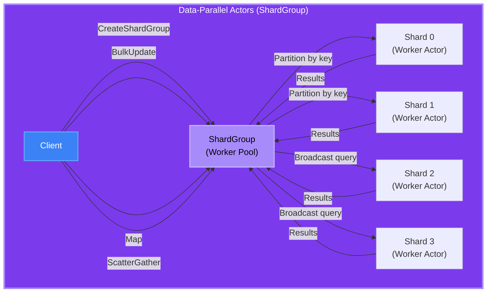
```mermaid
graph TB
    subgraph DPA["Data-Parallel Actors (ShardGroup)"]
        Client["Client"]
        ShardGroup["ShardGroup<br/>(Worker Pool)"]
        Shard1["Shard 0<br/>(Worker Actor)"]
        Shard2["Shard 1<br/>(Worker Actor)"]
        Shard3["Shard 2<br/>(Worker Actor)"]
        Shard4["Shard 3<br/>(Worker Actor)"]
    end
    
    Client -->|"CreateShardGroup"| ShardGroup
    Client -->|"BulkUpdate"| ShardGroup
    Client -->|"Map"| ShardGroup
    Client -->|"ScatterGather"| ShardGroup
    
    ShardGroup -->|"Partition by key"| Shard1
    ShardGroup -->|"Partition by key"| Shard2
    ShardGroup -->|"Broadcast query"| Shard3
    ShardGroup -->|"Broadcast query"| Shard4
    
    Shard1 -->|"Results"| ShardGroup
    Shard2 -->|"Results"| ShardGroup
    Shard3 -->|"Results"| ShardGroup
    Shard4 -->|"Results"| ShardGroup
    
    style DPA fill:#7c3aed,stroke:#a78bfa,stroke-width:3px,color:#fff
    style ShardGroup fill:#a78bfa,stroke:#c4b5fd,stroke-width:2px,color:#000
    style Client fill:#3b82f6,stroke:#60a5fa,stroke-width:2px,color:#fff
```

**Key Features**:
- **Partitioning**: Hash, ConsistentHash, or Range strategies
- **Bulk Updates**: Route updates to shards based on partition key (DPA UpdateFunction)
- **Parallel Map**: Query all shards simultaneously (DPA Map operator)
- **Scatter-Gather**: Aggregate results with fault tolerance (DPA Scatter-Gather)
- **Resource-Based Routing**: Labels flow to DataParallelConfig.placement.required_labels (NodePlacement) for scheduler node matching
- **Unified SDK**: `ShardGroupClient` and `UnifiedShardGroupClient` for both WASM/internal and gRPC

**Architecture**:
- Core functionality in `crates/services/src/actor_service/mod.rs` (ActorService trait)
- SDK provides unified abstractions (`UnifiedShardGroupClient`, `ShardGroupClient`)
- Labels flow: ShardGroup config.placement.required_labels (NodePlacement) → ActorResourceRequirements.placement → NodeSelector → Node placement
- **Cohesive design**: One placement model (`NodePlacement`) for scheduling, ShardGroup, and scatter-gather; scheduler (`crates/scheduler`) uses `ActorResourceRequirements.placement`; CreateShardGroup passes `config.placement` into shard spawn; elastic pool uses `PoolConfig` for sizing and can align worker placement with NodeRegistry/placement when spanning nodes. See [Leader-Worker and ShardGroup Placement](detailed-design.md#leader-worker-and-shardgroup-placement) in detailed-design.

**Parallel Operations**:
- **Parallel Map**: Uses Erlang `pmap` pattern - sends query to all shards simultaneously, collects individual results
- **Scatter-Gather**: Aggregates results using strategies (Concat, Merge/Sum) with fault tolerance
- **Unified Implementation**: Both operations use `parallel_operation_unified()` helper for consistent behavior
- **Temporary Sender Pattern**: Uses single temporary sender ActorRef with per-shard correlation IDs for reply routing
- **ReplyWaiterRegistry**: Centralized registry for async reply waiting (not used for routing, only waiting)

**Example**: See [Event Analytics Example](../examples/rust/embedded/event_analytics/) for a complete demonstration of shard groups with hash-based routing and scatter-gather queries using SDK patterns (`#[gen_server_actor]`, SDK spawn helpers, `GenServerRef.cast()`/`call()`).

**Routing Architecture**:
- **Unified Routing Module**: `crates/actor/src/routing.rs` centralizes all routing logic
- **Location Transparency**: `is_actor_local()` determines locality by comparing node_id from actor_id with local_node_id
- **RequestContext Required**: All routing functions require RequestContext for tenant/namespace isolation
- **Ask Pattern**: Uses temporary sender ActorRef + ReplyWaiterRegistry for request-reply semantics

### Component Interaction Diagram

```mermaid
sequenceDiagram
    participant Client
    participant Node
    participant ActorRef
    participant Actor
    participant Facets
    participant Journal
    participant TupleSpace
    
    Client->>Node: Spawn Actor
    Node->>Actor: Create Actor Instance
    Node->>Facets: Attach Facets
    Node->>ActorRef: Return ActorRef
    Node-->>Client: ActorRef
    
    Client->>ActorRef: tell(message) or ask(message)
    ActorRef->>Node: Route Message
    Node->>Actor: Deliver to Mailbox
    Actor->>Facets: Intercept (on_message)
    Facets->>Journal: Append Entry (if DurabilityFacet)
    Actor->>Actor: Process Message
    Actor->>TupleSpace: Write/Read Tuples (if needed)
    Actor-->>ActorRef: Reply (if ask)
    ActorRef-->>Client: Response
```

## Core Abstractions

### Actors

The fundamental unit of computation:

- **Stateful**: Each actor maintains private state
- **Sequential**: Messages processed one at a time
- **Location-Transparent**: Work the same locally or remotely
- **Fault-Tolerant**: Automatic recovery via supervision

### ActorRef

Lightweight handle to an actor:

- **Location-Transparent**: Same API for local/remote
- **Cloneable**: Share references safely
- **Message Passing**: `tell()` and `ask()` methods

### Behaviors

Define how actors process messages (compile-time patterns):

- **GenServerBehavior**: Erlang/OTP-style request/reply (synchronous)
- **GenFSMBehavior**: Finite state machine (state transitions)
- **GenEventBehavior**: Event-driven processing (fire-and-forget)
- **WorkflowBehavior**: Durable workflow orchestration (Temporal/Restate-inspired)

**Key Difference**: Behaviors are compile-time traits (zero overhead), while Facets are runtime capabilities (small interception overhead).

See [Detailed Design - Behaviors](detailed-design.md#behaviors) for comprehensive documentation.

### Facets

Composable capabilities that extend actor behavior at runtime:

**Infrastructure Facets**:
- **VirtualActorFacet**: Orleans-style activation/deactivation
  - Implements `VirtualActorLifecycleFacet` trait (type-safe lifecycle management)
  - Uses `RuntimeConfig.default_virtual_actor_config` for defaults (idle_timeout: 5m, max_pool: 100, strategy: lazy)
  - Supports LRU eviction when max pool size per actor type is exceeded
- **DurabilityFacet**: Automatic persistence and recovery (Restate-inspired)
- **MobilityFacet**: Actor migration between nodes

**Capability Facets** (Message Interception Pattern):
- **LockFacet**: Distributed lock coordination (task queues, resource coordination, leader election)
- **ProcessGroupFacet**: Distributed pub/sub and group messaging (Erlang pg2-style)
- **RegistryFacet**: Service discovery and object registration
- **HttpClientFacet**: HTTP client for outbound requests
- **KeyValueFacet**: Key-value store access
- **BlobStorageFacet**: Blob storage access

**Capability Facet Design**:
- Facets intercept messages with specific types (e.g., `"acquire_lock"`, `"join_group"`, `"register_object"`)
- Facets use real backend services from ServiceLocator (configured via node-config/runtimeconfig, not hardcoded)
- Works for both Rust and WASM actors via message interception
- Actor's `handle()` method is never called for intercepted messages

**Timer/Reminder Facets**:
- **TimerFacet**: Scheduled tasks (one-shot and periodic)
- **ReminderFacet**: Persistent scheduled reminders

**Observability Facets**:
- **MetricsFacet**: Prometheus metrics collection
- **TracingFacet**: Distributed tracing (OpenTelemetry)
- **LoggingFacet**: Structured logging

**Security Facets**:
- **AuthenticationFacet**: Identity verification
- **AuthorizationFacet**: Permission checking

**Event Facets**:
- **EventEmitterFacet**: Event-driven communication

See [Detailed Design - Facets](detailed-design.md#facets) for comprehensive documentation.

### TupleSpace

Linda-style coordination for decoupled communication:

- **Write**: Add tuples to space (non-blocking)
- **Read**: Non-destructive retrieval (blocking or non-blocking)
- **Take**: Destructive retrieval (blocking or non-blocking)
- **Pattern Matching**: Flexible tuple queries with wildcards
- **Subscriptions**: Event notifications on tuple changes
- **Transactions**: Atomic tuple operations

**Backends**: SQLite with `:memory:` (testing), Redis (production), PostgreSQL (transactional)

See [Detailed Design - TupleSpace](detailed-design.md#tuplespace) for comprehensive documentation.

### Channels

Queue and topic patterns for message passing between actors and services:

- **Queue Pattern**: Load-balanced message delivery (one consumer per message)
- **Topic Pattern**: Pub/sub messaging (all subscribers receive message)
- **Durability**: Durable backends (Redis, Kafka, SQLite) persist messages
- **ACK/NACK**: Acknowledge successful processing or requeue failed messages
- **Dead Letter Queue**: Automatic handling of poisonous messages
- **Graceful Shutdown**: Stop accepting new messages but complete in-progress work
- **Message Recovery**: Unacked messages automatically recovered on restart

**Backends**:
- **InMemory**: Fast, non-persistent (testing)
- **Redis**: Distributed, durable (Redis Streams)
- **Kafka**: High-throughput, durable (production)
- **SQLite**: File-based, durable (single-node)
- **NATS**: Lightweight pub/sub (multi-node)
- **UDP**: Low-latency multicast (best-effort, cluster-wide)

**UDP Multicast Channels**:
- Uses UDP multicast for efficient cluster-wide broadcasting
- Requires `cluster_name` configuration (nodes with same cluster_name can communicate). You can set `node.cluster_name` in the release file or override it with the `PLEXSPACES_CLUSTER_NAME` environment variable (handled in `config_manager::initialize`).
- Best-effort delivery (no ACK/NACK, messages may be lost)
- Non-durable (messages lost on restart)
- Ideal for real-time, non-critical cluster messaging

**Graceful Shutdown**:
- Non-memory channels stop accepting new messages during shutdown
- In-progress messages complete before channel closes
- Configurable timeout for shutdown completion
- ACK/NACK still works for in-progress messages

See [Durability Documentation](durability.md) for comprehensive channel documentation.

## Communication Patterns

### Message Passing Sequence Diagram

```mermaid
sequenceDiagram
    participant Sender
    participant ActorRef
    participant Node
    participant Mailbox
    participant Actor
    participant Behavior
    
    rect rgb(240, 240, 240)
        Note over Sender,Behavior: Tell (Fire-and-Forget)
        Sender->>ActorRef: tell(message)
        ActorRef->>Node: Route Message
        Node->>Mailbox: Enqueue Message
        Mailbox->>Actor: Dequeue Message
        Actor->>Behavior: handle_message()
        Behavior-->>Actor: Ok(())
    end
    
    rect rgb(240, 240, 240)
        Note over Sender,Behavior: Ask (Request-Reply)
        Sender->>ActorRef: ask(request, timeout)
        ActorRef->>Node: Route Message (with correlation_id)
        Node->>Mailbox: Enqueue Message
        Mailbox->>Actor: Dequeue Message
        Actor->>Behavior: handle_request()
        Behavior-->>Actor: Reply
        Actor->>Node: Send Reply (via correlation_id)
        Node->>ActorRef: Match Reply
        ActorRef-->>Sender: Response
    end
```

### Tell (Fire-and-Forget)

```rust
actor_ref.tell(message).await?;
```

### Ask (Request-Reply)

```rust
let reply = actor_ref.ask(request, Duration::from_secs(5)).await?;
```

### TupleSpace Coordination

```rust
// Write tuple
tuplespace.write(Tuple::new(vec!["order", order_id])).await?;

// Read tuple (non-blocking)
let tuple = tuplespace.read_if_exists(pattern).await?;

// Take tuple (blocking)
let tuple = tuplespace.take(pattern).await?;
```

### TupleSpace Coordination Diagram

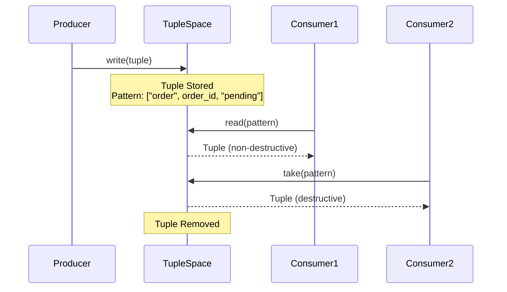
```mermaid
sequenceDiagram
    participant Producer
    participant TupleSpace
    participant Consumer1
    participant Consumer2
    
    Producer->>TupleSpace: write(tuple)
    Note over TupleSpace: Tuple Stored<br/>Pattern: ["order", order_id, "pending"]
    
    Consumer1->>TupleSpace: read(pattern)
    TupleSpace-->>Consumer1: Tuple (non-destructive)
    
    Consumer2->>TupleSpace: take(pattern)
    TupleSpace-->>Consumer2: Tuple (destructive)
    Note over TupleSpace: Tuple Removed
```

## Design Principles

### 1. Proto-First

All contracts defined in Protocol Buffers:

- Cross-language compatibility
- Versioning and evolution
- Single source of truth

### 2. Location Transparency

Actors work seamlessly across boundaries:

- Local: Direct mailbox access
- Remote: Automatic gRPC routing
- Same API for both

### 3. Composable Abstractions

One powerful actor model with dynamic facets:

- No inheritance hierarchies
- Runtime composition
- Pay for what you use

### 4. Single-Threaded Execution

Each actor processes messages sequentially:

- No race conditions
- Simple reasoning
- Predictable behavior

### 5. Failure Isolation

Actors are isolated:

- One actor's failure doesn't affect others
- Supervision trees handle recovery
- "Let it crash" philosophy

## Core Primitives

### ActorId

Structured identifier for actors with canonical string form
`name//actor_type::namespace@node_id`:

```rust
pub struct ActorId {
    name: String,
    actor_type: String,
    namespace: String,
    node_id: String,
}
```

**Examples**:
- `"counter//gen_server::default@node1"` - Actor on the local node
- `"user-123//session::prod@node2"` - Actor on a remote node
- `"virtual-actor//virtual_counter::default@node1"` - Virtual actor identity

### ActorRef

Lightweight, location-transparent handle to an actor:

```rust
pub struct ActorRef {
    id: ActorId,
}
```

**Operations**:
- `tell(message)` - Fire-and-forget messaging
- `ask(message, timeout)` - Request-reply messaging
- `id()` - Get structured actor identity
- `namespace()` - Get actor namespace from the identity

**Multi-tenancy**:
```rust
// Get RequestContext with tenant from auth and namespace from ActorRef
let ctx = actor_ref.get_request_context(tenant_id);
```

### ActorContext

Provides actors with access to all system services:

```rust
pub trait ActorContext {
    fn actor_service(&self) -> &dyn ActorService;
    fn object_registry(&self) -> &dyn ObjectRegistry;
    fn tuplespace(&self) -> &dyn TupleSpaceProvider;
    fn channel_service(&self) -> &dyn ChannelService;
    fn process_group_service(&self) -> &dyn ProcessGroupService;
    fn facet_service(&self) -> &dyn FacetService;
}
```

**ProcessGroupService** provides Erlang pg/pg2-style distributed pub/sub:
- **Named Groups**: Actors join named groups for coordination
- **Topic-based Pub/Sub**: Fine-grained subscriptions within groups
- **Multi-tenancy**: Groups scoped by tenant_id + namespace
- **gRPC Service**: Full gRPC service for remote access
- **ServiceLocator Integration**: Available via `service_locator.get_process_group_service()`

See [Process Groups README](../crates/process-groups/README.md) and [Channel ProcessGroup Backend](../crates/channel/README.md#5-process-group-backend-srcprocess_group_backendrs) for details.

See [Detailed Design - APIs](detailed-design.md#apis-and-primitives) for complete API documentation.

### Message

Message structure for actor communication:

```rust
pub struct Message {
    id: MessageId,
    sender: Option<ActorId>,
    receiver: ActorId,
    payload: Vec<u8>,
    message_type: String,
    correlation_id: Option<CorrelationId>,
    timestamp: u64,
    ttl: Option<Duration>,
}
```

### Tuple

Tuple structure for TupleSpace coordination:

```rust
pub struct Tuple {
    fields: Vec<TupleField>,
    timestamp: u64,
    ttl: Option<u64>,
    owner: Option<String>,
    metadata: HashMap<String, serde_json::Value>,
}

pub enum TupleField {
    String(String),
    Integer(i64),
    Float(f64),
    Boolean(bool),
    Bytes(Vec<u8>),
    Null,
}
```

### Pattern

Pattern for tuple matching:

```rust
pub struct Pattern {
    fields: Vec<PatternField>,
}

pub enum PatternField {
    Exact(TupleField),
    Wildcard,
}
```

## Data Model

### Actor State

```rust
struct Actor {
    id: ActorId,
    state: ActorState,
    behavior: Box<dyn Actor>,  // behavior implementation (SDK annotations generate this)
    mailbox: Mailbox,
    facets: Vec<Box<dyn Facet>>,
}
```

### Messages

```rust
struct Message {
    id: MessageId,
    sender: Option<ActorId>,
    receiver: ActorId,
    payload: Vec<u8>,
    correlation_id: Option<CorrelationId>,
}
```

### Tuples

```rust
struct Tuple {
    fields: Vec<TupleField>,
    timestamp: u64,
    ttl: Option<u64>,
}
```

## Observability

### Metrics

- Actor count and state distribution
- Message throughput and latency
- TupleSpace operations
- Workflow execution times

### Tracing

- Distributed tracing across actors
- Request correlation IDs
- Span tracking for workflows

### Health Checks

- Node health status
- Actor health monitoring
- Backend connectivity

## Scalability

### Horizontal Scaling

- Add nodes to cluster
- Automatic load distribution
- Actor migration for rebalancing

### Resource Awareness

- CPU, memory, I/O profiles
- Intelligent placement
- Resource quotas and limits

## FaaS Invocation

PlexSpaces provides FaaS-style HTTP invocation of actors, enabling serverless patterns and cloud platform integration.

### Architecture

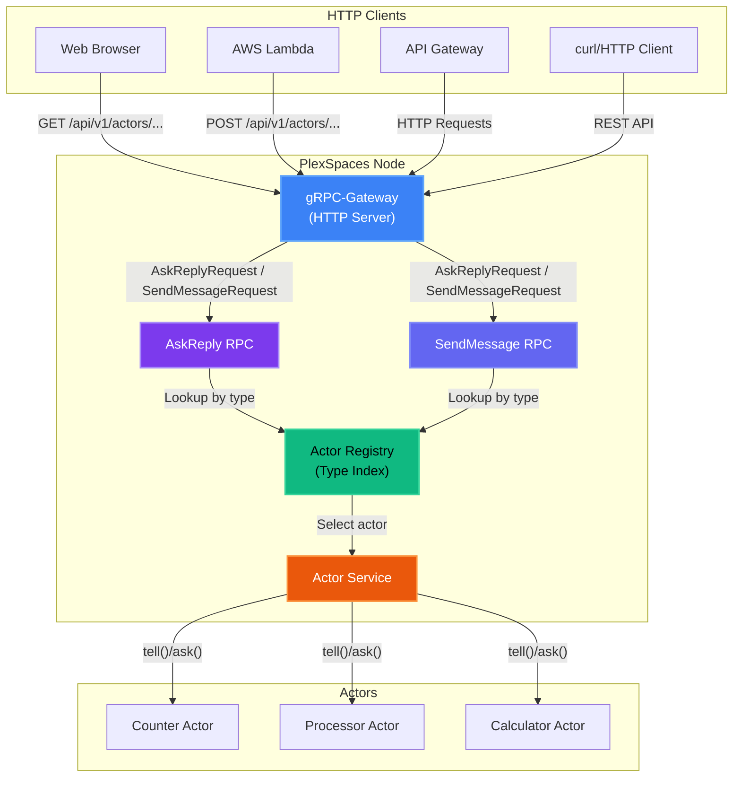
```mermaid
graph TB
    subgraph Client["HTTP Clients"]
        Browser["Web Browser"]
        Lambda["AWS Lambda"]
        API["API Gateway"]
        Curl["curl/HTTP Client"]
    end
    
    subgraph PlexSpaces["PlexSpaces Node"]
        Gateway["gRPC-Gateway<br/>(HTTP Server)"]
        AskReply["AskReply RPC"]
        SendMessage["SendMessage RPC"]
        ActorRegistry["Actor Registry<br/>(Type Index)"]
        ActorService["Actor Service"]
    end
    
    subgraph Actors["Actors"]
        Counter["Counter Actor"]
        Processor["Processor Actor"]
        Calculator["Calculator Actor"]
    end
    
    Browser -->|"GET /api/v1/actors/..."| Gateway
    Lambda -->|"POST /api/v1/actors/..."| Gateway
    API -->|"HTTP Requests"| Gateway
    Curl -->|"REST API"| Gateway
    
    Gateway -->|"AskReplyRequest / SendMessageRequest"| AskReply
    Gateway -->|"AskReplyRequest / SendMessageRequest"| SendMessage
    AskReply -->|"Lookup by type"| ActorRegistry
    SendMessage -->|"Lookup by type"| ActorRegistry
    ActorRegistry -->|"Select actor"| ActorService
    ActorService -->|"tell()/ask()"| Counter
    ActorService -->|"tell()/ask()"| Processor
    ActorService -->|"tell()/ask()"| Calculator
    
    style Gateway fill:#3b82f6,stroke:#60a5fa,stroke-width:2px,color:#fff
    style AskReply fill:#7c3aed,stroke:#a78bfa,stroke-width:2px,color:#fff
    style SendMessage fill:#6366f1,stroke:#818cf8,stroke-width:2px,color:#fff
    style ActorRegistry fill:#10b981,stroke:#34d399,stroke-width:2px,color:#000
    style ActorService fill:#ea580c,stroke:#fb923c,stroke-width:2px,color:#fff
```

### API Endpoint

```
GET  /api/v1/actors/{namespace}/{actor_type}?param1=value1&param2=value2
GET  /api/v1/actors/{namespace}/{actor_type}/ask?param1=value1&param2=value2
POST /api/v1/actors/{namespace}/{actor_type}
PUT  /api/v1/actors/{namespace}/{actor_type}
POST /api/v1/actors/{namespace}/{actor_type}/ask
PUT  /api/v1/actors/{namespace}/{actor_type}/ask
```

### HTTP Endpoint Handling

- **GET** on `/api/v1/actors/{...}` or `/ask`: Query parameters become JSON payload for `AskReply`.
- **POST/PUT** on `/api/v1/actors/{...}`: Request body is delivered through `SendMessage`.
- **POST/PUT** on `/api/v1/actors/{...}/ask`: Request body is delivered through `AskReply`.
- The route selects the service directly. The gateway does not infer ask vs tell from a generic `invocation` flag.

### Actor Discovery

- **Type-Based Lookup**: O(1) hashmap lookup by `(tenant_id, namespace, actor_type)`
- **Load Balancing**: Random selection when multiple actors of same type exist
- **404 Handling**: Returns 404 if no actors found

### Path Routing

Actors receive full HTTP path information for custom routing:

- `message.uri_path`: Full URL path (e.g., "/api/v1/actors/default/counter/metrics")
- `message.uri_method`: HTTP method (GET, POST, PUT, DELETE)
- `message.metadata["http_subpath"]`: Path after actor_type (for future routing)

### Routing Patterns

#### HTTP Gateway Architecture

The HTTP gateway (Axum) runs as a separate server alongside the gRPC server:

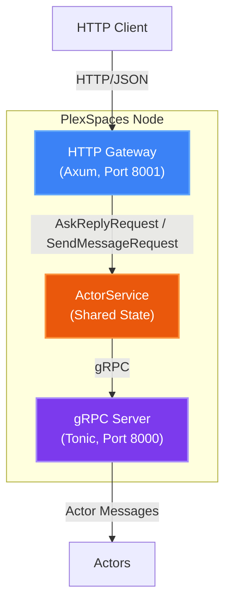
```mermaid
graph TB
    subgraph Node["PlexSpaces Node"]
        HTTP["HTTP Gateway<br/>(Axum, Port 8001)"]
        GRPC["gRPC Server<br/>(Tonic, Port 8000)"]
        Service["ActorService<br/>(Shared State)"]
    end
    
    Client["HTTP Client"] -->|"HTTP/JSON"| HTTP
    HTTP -->|"AskReplyRequest / SendMessageRequest"| Service
    Service -->|"gRPC"| GRPC
    GRPC -->|"Actor Messages"| Actors["Actors"]
    
    style HTTP fill:#3b82f6,stroke:#60a5fa,stroke-width:2px,color:#fff
    style GRPC fill:#7c3aed,stroke:#a78bfa,stroke-width:2px,color:#fff
    style Service fill:#ea580c,stroke:#fb923c,stroke-width:2px,color:#fff
```

**Key Design Decisions**:
- **Separate Servers**: HTTP gateway and gRPC server run concurrently using `tokio::select!`
- **Shared State**: Both servers share the same `ActorServiceImpl` instance
- **Port Configuration**: HTTP gateway listens on `grpc_port + 1` (e.g., 8001 if gRPC is 8000)
- **Direct Service Calls**: HTTP handlers directly invoke `ActorServiceTrait::ask_reply` or `ActorServiceTrait::send_message` rather than making gRPC calls

#### Request Flow

1. **HTTP Request Parsing**: Axum router extracts path parameters (`namespace`, `actor_type`)
2. **Query/Body Parsing**: GET requests parse query params, POST/PUT parse request body
3. **Request Construction**: Build `AskReplyRequest` or `SendMessageRequest` with:
   - Path parameters → `namespace`, `actor_type`
   - JWT claims → `tenant_id` when authentication is enabled
   - Query params or body → `payload` (JSON bytes)
   - HTTP method, headers, path, and subpath as request metadata
4. **Service Invocation**: Call `ActorServiceImpl::ask_reply` or `ActorServiceImpl::send_message` directly (not via gRPC)
5. **Response Conversion**: Convert `AskReplyResponse` or `SendMessageResponse` to HTTP/JSON:
   - `payload` (bytes) → JSON value (UTF-8 decode or base64 encode)
   - `success` → HTTP status code (200 for success, 500 for errors)
   - `error_message` → HTTP error response body

#### Actor Discovery Pattern

```rust
// 1. Type-based lookup
let actors = actor_registry.discover_actors_by_type(
    tenant_id, 
    namespace, 
    actor_type
).await;

// 2. Random selection (load balancing)
let selected_actor = actors.choose(&mut rng)
    .ok_or_else(|| "No actors found")?;

// 3. Message delivery
actor_ref.ask(message, timeout).await
```

#### Endpoint Routing

HTTP routes map to actor runtime services:

| HTTP Endpoint | Pattern | Reply Expected |
|------------|---------|----------------|
| `GET /api/v1/actors/{...}` | AskReply | Yes |
| `GET /api/v1/actors/{...}/ask` | AskReply | Yes |
| `POST/PUT /api/v1/actors/{...}` | SendMessage | No |
| `POST/PUT /api/v1/actors/{...}/ask` | AskReply | Yes |

**Behavior Routing**:
- `GenServer::route_message` handles both `Call` and `Cast`
- `Call` messages: Actor must reply via `ctx.send_reply()`
- `Cast` messages: Fire-and-forget, no reply required

#### Multi-Node Routing

For distributed deployments:

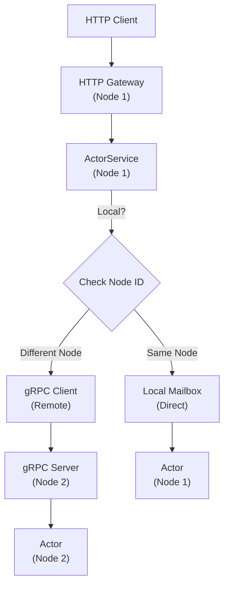
```mermaid
graph TB
    Client["HTTP Client"] --> Gateway["HTTP Gateway<br/>(Node 1)"]
    Gateway --> Service["ActorService<br/>(Node 1)"]
    Service -->|"Local?"| Check{Check Node ID}
    Check -->|"Same Node"| Local["Local Mailbox<br/>(Direct)"]
    Check -->|"Different Node"| Remote["gRPC Client<br/>(Remote)"]
    Remote --> GRPC["gRPC Server<br/>(Node 2)"]
    GRPC --> Actor["Actor<br/>(Node 2)"]
    Local --> Actor2["Actor<br/>(Node 1)"]
```

**Location Transparency**: Same API works for local and remote actors - routing is automatic.

### AWS Lambda Integration

Ready for AWS Lambda Function URLs:

1. Deploy PlexSpaces Node as Lambda function
2. Enable Function URL for HTTP access
3. Route `/api/v1/actors/{namespace}/{actor_type}` to Lambda
4. Automatic scaling based on request volume

### Multi-Tenancy Architecture

PlexSpaces implements **two-level tenant isolation**:

1. **Tenant-id** (Primary isolation)
   - **Source of Truth**: JWT token (HTTP) or mTLS certificate (gRPC)
   - **Purpose**: Tenant-level data isolation
   - **Storage**: Extracted from auth at request time, passed via `RequestContext`
   - **When empty**: Only allowed when auth is disabled

2. **Namespace** (Sub-tenant isolation)
   - **Source of Truth**: Application (when actor is part of app) or Actor creation
   - **Purpose**: Allows tenants to create multiple isolated environments
   - **Storage**: Stored in `ActorRef.namespace` and `Actor.namespace`
   - **When empty**: Represents default namespace within tenant

**Key Design Principles:**
- **Tenant-id** NEVER stored in ActorRef (comes from auth at request time)
- **Namespace** stored in ActorRef (source of truth is application/actor)
- **RequestContext** carries both through the call chain
- **Services** (locks, registry, keyvalue) take namespace as explicit parameter

**Data Flow:**
```
Auth (JWT/mTLS) → tenant_id ─┐
                              ├──→ RequestContext → Service → Repository → Database
Application/Actor → namespace ┘
```

- **Lookup Key**: `(tenant_id, namespace, actor_type)` for O(1) actor lookup
- **JWT Authentication**: Extract `tenant_id` from JWT claims only
- **Admin/Internal Contexts**: With empty namespace bypass namespace filtering for cross-namespace queries

See [Security Guide](security.md) for comprehensive multi-tenancy documentation.

See [Concepts: FaaS-Style Invocation](concepts.md#faas-style-invocation) and [Detailed Design: AskReply and SendMessage Services](detailed-design.md#askreply-and-sendmessage-services) for implementation details.

## Infrastructure Services

### Node Management Architecture

PlexSpaces provides a comprehensive node management layer with caching, gossip protocol support, and production-grade observability.

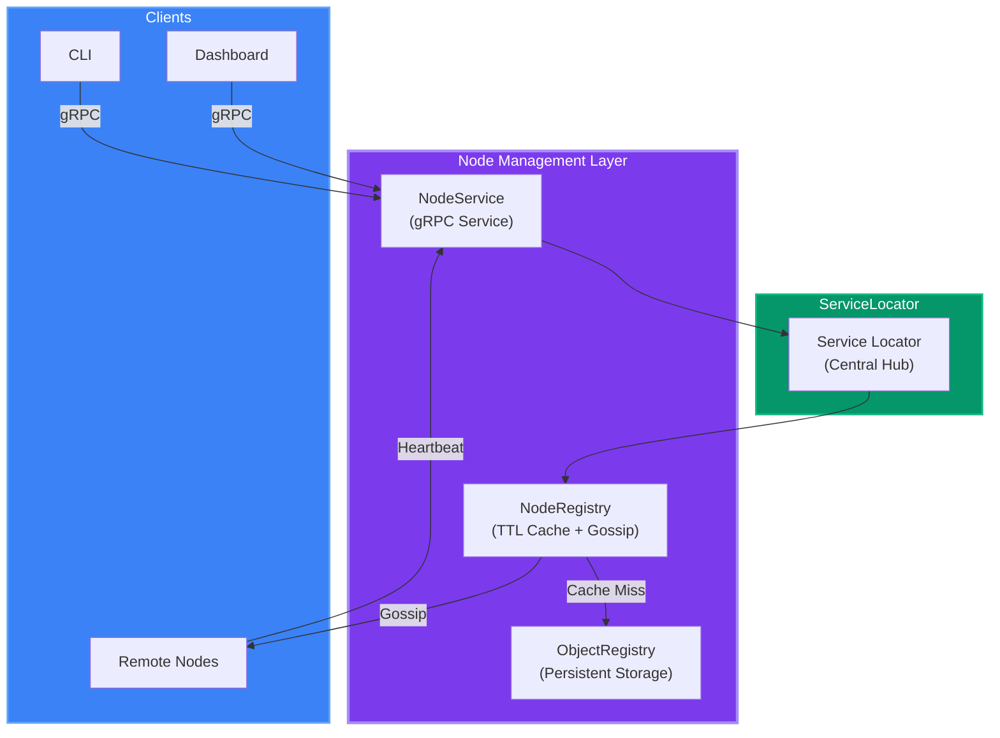
```mermaid
graph TB
    subgraph NodeManagement["Node Management Layer"]
        NodeService["NodeService<br/>(gRPC Service)"]
        NodeRegistry["NodeRegistry<br/>(TTL Cache + Gossip)"]
        ObjectRegistry["ObjectRegistry<br/>(Persistent Storage)"]
    end
    
    subgraph ServiceLocator["ServiceLocator"]
        SL["Service Locator<br/>(Central Hub)"]
    end
    
    subgraph Clients["Clients"]
        Dashboard["Dashboard"]
        CLI["CLI"]
        RemoteNodes["Remote Nodes"]
    end
    
    Dashboard -->|"gRPC"| NodeService
    CLI -->|"gRPC"| NodeService
    RemoteNodes -->|"Heartbeat"| NodeService
    
    NodeService --> SL
    SL --> NodeRegistry
    NodeRegistry -->|"Cache Miss"| ObjectRegistry
    NodeRegistry -->|"Gossip"| RemoteNodes
    
    style NodeManagement fill:#7c3aed,stroke:#a78bfa,stroke-width:3px,color:#fff
    style ServiceLocator fill:#059669,stroke:#10b981,stroke-width:2px,color:#fff
    style Clients fill:#3b82f6,stroke:#60a5fa,stroke-width:2px,color:#fff
```

#### NodeService

The `NodeService` gRPC service provides comprehensive node management operations:

| RPC Method | Description |
|-----------|-------------|
| `GetReleaseSpec` | Get node configuration (secrets masked) |
| `RegisterNodes` | Register multiple nodes (batch operation) |
| `UnregisterNode` | Remove node from registry |
| `ListConnectedNodes` | Paginated list of connected nodes |
| `StreamConnectedNodes` | Streaming for large clusters |
| `GetMetrics` | Node CPU, memory, operational metrics |
| `CalculateCapacity` | Total, allocated, available resources |
| `ListNodeApplications` | Applications deployed on node |
| `GetHealth` | Node health status |
| `SendHeartbeat` | Heartbeat with capacity info |
| `ConnectNodes` | Connect to remote nodes (Erlang-style net_adm:ping) |
| `DisconnectNodes` | Disconnect from nodes |
| `Ping` | SWIM protocol ping for failure detection |

**Health-Aware Connection**: The SDK's `NodeClient` provides production-grade health-aware connection:
- Pre-checks liveness using `SystemService.liveness_probe()` (avoids unnecessary connection attempts)
- Waits for readiness using `SystemService.readiness_probe()` (ensures node is ready)
- Exponential backoff with jitter for retries (prevents thundering herd)
- Parallel health checks for multi-node connections (efficient)
- Graceful degradation (handles partial success)

**Security Feature**: The `GetReleaseSpec` RPC automatically masks all secrets (passwords, API keys, tokens) before returning the configuration via the `SecretMasker` utility.

#### ObjectRegistry

The `ObjectRegistry` provides unified service discovery for actors, services, nodes, workflows, and other distributed objects. It uses a dedicated repository backend with indexed columns for fast queries.

**Storage Architecture**:
- **Repository Pattern**: Dedicated `ObjectRegistryRepository` trait with multiple backend implementations
- **Indexed Columns**: `object_type`, `node_id`, `health_status`, `last_heartbeat`, `object_category` for fast queries
- **Blob Storage**: Full `ObjectRegistration` protobuf preserved in `registration_blob` column
- **Multi-Backend**: SQLite with `:memory:` (tests), SQLite (embedded), PostgreSQL (production), DynamoDB (AWS)

**Performance Characteristics**:
- `heartbeat()` - O(1) single column UPDATE (no blob read/write)
- `discover()` - O(log n + k) using indexed columns
- `lookup()` - O(1) primary key lookup
- `find_stale()` - Fast query using `last_heartbeat` index

**Environment Variables**:
- `PLEXSPACES_OBJECT_REGISTRY_BACKEND`: `memory`, `sqlite`, `postgres`, `dynamodb`
- `PLEXSPACES_OBJECT_REGISTRY_SQLITE_PATH`: SQLite database path
- `PLEXSPACES_OBJECT_REGISTRY_POSTGRES_URL`: PostgreSQL connection string
- `PLEXSPACES_OBJECT_REGISTRY_DDB_TABLE`: DynamoDB table name

See [Database Models and ER Diagram](detailed-design.md#database-models-and-er-diagram) for schema details.

#### NodeRegistry

The `NodeRegistry` wraps `ObjectRegistry` with:

- **TTL-based Caching**: Configurable cache duration (default 60s)
- **Gossip Protocol Support**: Peer-to-peer liveness checking
- **Cache Statistics**: Hits, misses, evictions for observability
- **Atomic Operations**: Lock-free where possible

```rust
// NodeRegistry usage via ServiceLocator
let node_registry = service_locator.get_node_registry().await?;
let node = node_registry.lookup_node(&ctx, "node-123").await?;
let (nodes, next_token) = node_registry.list_nodes(&ctx, None, 100, "").await?;
```

#### Node connectivity and seed nodes

**Ownership**: Node connectivity is implemented by **NodeServiceImpl** (not ServiceLocator). The node creates NodeServiceImpl, calls `register_node_connectivity(self)` so the instance is the connectivity provider, and passes it into **ApplicationServiceImpl** at construction so deploy can connect to `ApplicationSpec.seed_nodes`.

**Automatic connection**:
- **Node startup**: Connects to `ReleaseSpec.node.cluster_seed_nodes` via `connect_to_node_addresses` after the gRPC server is up.
- **Application deploy**: Connects to `ApplicationSpec.seed_nodes` using the injected NodeConnectivity before the app runs.
- **Registry reconciliation**: Seed addresses are inserted into NodeRegistry immediately so placement can observe them, then SWIM ping reconciles placeholders to real node IDs and updates heartbeats. Nodes that report a different cluster are removed during reconciliation.

**Connect timeout**: 1 second per address, minimum 5s, maximum 5 minutes. See [Services Reference](services.md#node-connectivity-and-seed-nodes).

**Cluster matching**: NodeServiceImpl holds `local_cluster` (from release spec when using `with_release_spec`). After a successful ping, the remote node is registered only if the remote cluster matches the effective local cluster (or either is unspecified). Address lookup for "already registered" uses exact match (no scheme normalization).

### Channel Factory Architecture

The `ServiceLocator` includes a channel factory with priority-based backend selection:

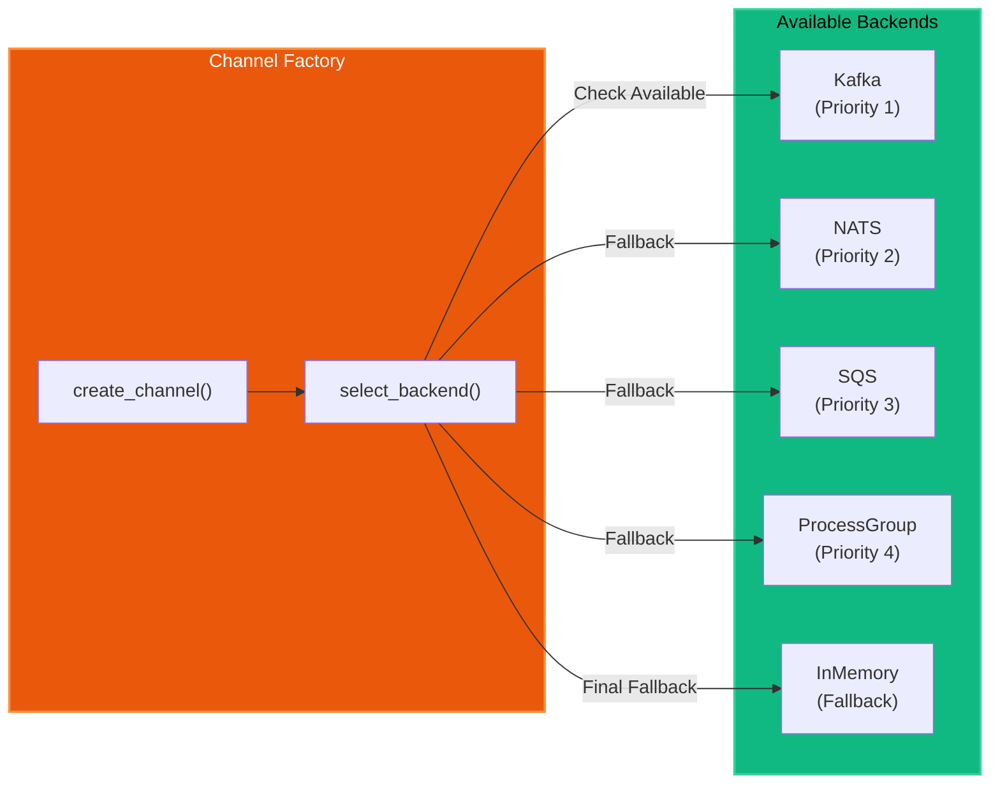
```mermaid
graph LR
    subgraph ChannelFactory["Channel Factory"]
        Create["create_channel()"]
        Select["select_backend()"]
    end
    
    subgraph Backends["Available Backends"]
        Kafka["Kafka<br/>(Priority 1)"]
        NATS["NATS<br/>(Priority 2)"]
        SQS["SQS<br/>(Priority 3)"]
        ProcessGroup["ProcessGroup<br/>(Priority 4)"]
        InMemory["InMemory<br/>(Fallback)"]
    end
    
    Create --> Select
    Select -->|"Check Available"| Kafka
    Select -->|"Fallback"| NATS
    Select -->|"Fallback"| SQS
    Select -->|"Fallback"| ProcessGroup
    Select -->|"Final Fallback"| InMemory
    
    style ChannelFactory fill:#ea580c,stroke:#fb923c,stroke-width:2px,color:#fff
    style Backends fill:#10b981,stroke:#34d399,stroke-width:2px,color:#000
```

**Backend Priority Order**:
1. **Kafka**: Enterprise-grade, when `brokers` configured
2. **NATS**: Lightweight messaging, when `servers` configured
3. **SQS**: AWS integration, when `region` configured
4. **ProcessGroup**: In-cluster multicast
5. **InMemory**: Local development fallback

### Secret Masking

All API responses containing sensitive data use the `SecretMasker` utility:

```rust
use plexspaces_core::{mask_release_spec, SecretMasker};

// Mask all secrets in ReleaseSpec before returning via API
let masked_spec = mask_release_spec(release_spec);

// Custom masking patterns
let masker = SecretMasker::new()
    .with_pattern("api_key")
    .with_pattern("connection_string");
let masked = masker.mask("password", sensitive_value);
```

**Default Masked Fields**: `password`, `secret`, `token`, `key`, `api_key`, `access_key`, `secret_key`, `private_key`, `credential`, `auth`

## Security

### Multi-Tenancy

PlexSpaces enforces mandatory tenant isolation through:

- **Two-level isolation**: Tenant-id (from auth) + Namespace (from application/actor)
- **RequestContext**: Carries tenant_id and namespace through entire call chain
- **Database-level enforcement**: All queries filter by tenant_id and namespace
- **Resource quotas**: Per-tenant resource limits (CPU, memory, storage)

See [Multi-Tenancy Architecture](#multi-tenancy-architecture) and [Security Guide](security.md) for details.

### Network Security

- mTLS for inter-node communication
- Service mesh integration
- Firewall rules

## See Also

- [Concepts](concepts.md): Core concepts explained in detail
- [Detailed Design](detailed-design.md): Component deep-dives
- [Getting Started](getting-started.md): Quick start guide
- [Use Cases](use-cases.md): Real-world applications
