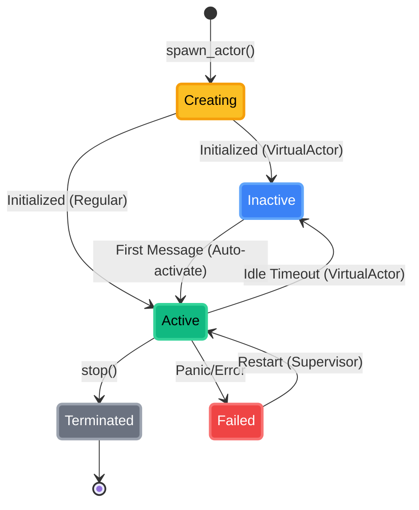
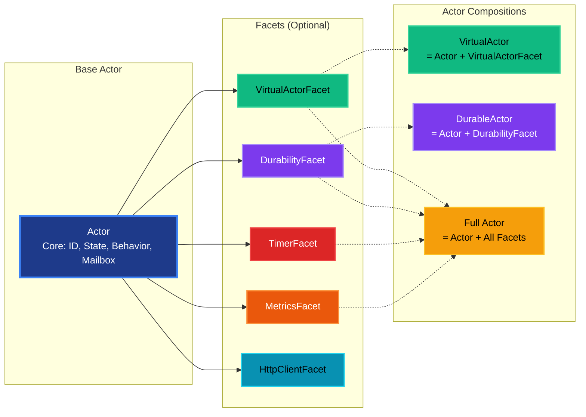
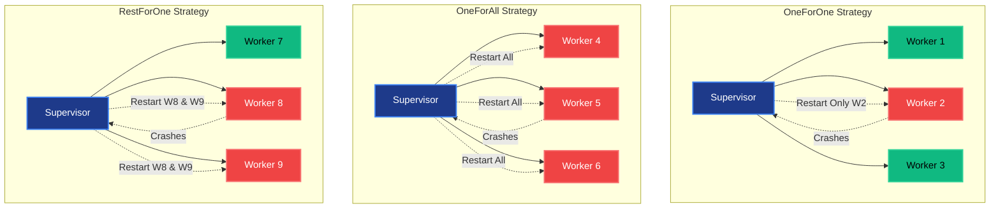
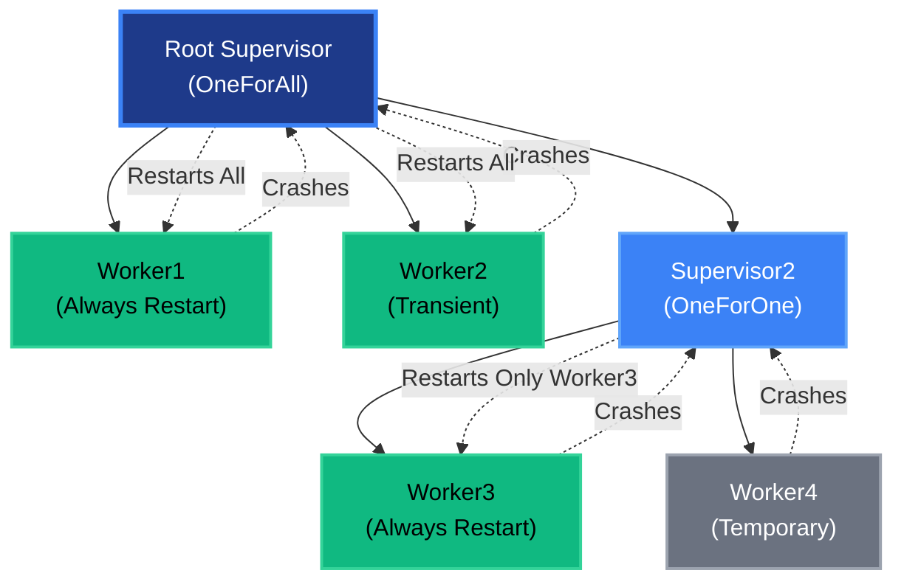

# Detailed Design

This document provides detailed information about PlexSpaces abstractions, components, and implementation details.

## Table of Contents

1. [Actors](#actors)
2. [Behaviors](#behaviors)
3. [Facets](#facets)
4. [TupleSpace](#tuplespace)
5. [Workflows](#workflows)
6. [Journaling](#journaling)
7. [Supervision](#supervision)
8. [Observability](#observability)

## Actors

### Actor Model

Actors are the fundamental unit of computation in PlexSpaces:

- **Stateful**: Each actor maintains private state
- **Sequential**: Messages processed one at a time
- **Isolated**: No shared state between actors
- **Location-Transparent**: Work the same locally or remotely

### Actor Lifecycle



**States**:
- **Creating**: Actor is being initialized
- **Inactive**: Actor is inactive (virtual actors)
- **Active**: Actor is processing messages
- **Terminated**: Actor has stopped gracefully
- **Failed**: Actor has crashed with error

### ActorRef

Lightweight, location-transparent handle to an actor:

```rust
pub struct ActorRef {
    actor_id: ActorId,
    location: ActorLocation,
    service_locator: Arc<ServiceLocator>,
}
```

**Features**:
- Cloneable and Send + Sync
- Automatic routing (local vs remote)
- Efficient gRPC client caching
- Correlation ID tracking for replies

### Message Passing

#### Tell (Fire-and-Forget)

```rust
actor_ref.tell(message).await?;
```

#### Ask (Request-Reply)

```rust
let reply = actor_ref.ask(request, Duration::from_secs(5)).await?;
```

**Implementation**:
- Uses correlation IDs for reply matching
- Timeout handling
- Automatic routing via gRPC for remote actors

## Behaviors

### GenServerBehavior

Erlang/OTP-style request/reply pattern:

```rust
#[async_trait]
pub trait GenServerBehavior: ActorBehavior {
    type Request: Send + Sync;
    type Reply: Send + Sync;
    
    async fn handle_request(
        &mut self,
        ctx: &ActorContext,
        request: Self::Request,
    ) -> Result<Self::Reply, BehaviorError>;
}
```

**Features**:
- Type-safe request/reply
- Automatic error handling
- Integration with ask pattern

### GenFSMBehavior

Finite state machine behavior:

```rust
#[async_trait]
pub trait GenFSMBehavior: ActorBehavior {
    type State: Send + Sync;
    type Event: Send + Sync;
    
    async fn handle_event(
        &mut self,
        ctx: &ActorContext,
        state: Self::State,
        event: Self::Event,
    ) -> Result<Self::State, BehaviorError>;
}
```

**Features**:
- State transitions
- Event-driven processing
- State validation

### GenEventBehavior

Event-driven behavior:

```rust
#[async_trait]
pub trait GenEventBehavior: ActorBehavior {
    type Event: Send + Sync;
    
    async fn handle_event(
        &mut self,
        ctx: &ActorContext,
        event: Self::Event,
    ) -> Result<(), BehaviorError>;
}
```

**Features**:
- Event subscriptions
- Pub/sub patterns
- Event filtering

### WorkflowBehavior

Durable workflow orchestration:

```rust
#[async_trait]
pub trait WorkflowBehavior: ActorBehavior {
    async fn execute(
        &mut self,
        ctx: &WorkflowContext,
    ) -> Result<(), WorkflowError>;
}
```

**Features**:
- Step-by-step execution
- Automatic persistence
- Retry policies
- Compensation logic

## Facets

Facets are the key extensibility mechanism in PlexSpaces, enabling runtime composition of capabilities without creating multiple actor types. They follow the "Static for core, Dynamic for extensions" principle.

### Facet Interceptor Chain


### Facet Philosophy

**Problem**: How to support Virtual Actors, Mobile Agents, OTP GenServers, Workflows WITHOUT creating 20 different actor implementations?

**Solution**: ONE powerful Actor type + composable Facets



**Compositions**:
- `VirtualActor = Actor + VirtualActorFacet`
- `MobileAgent = Actor + MobilityFacet + ItineraryFacet`
- `GenServer = Actor + OTPGenServerFacet`
- `DurableWorkflow = Actor + DurableExecutionFacet + WorkflowFacet`

### Facet Priority System

Facets execute in priority order (higher = runs first):

- **1000+**: Security/Auth facets (run first, can block execution)
- **900-999**: Logging/Tracing facets (capture all events)
- **800-899**: Metrics facets
- **100-500**: Domain logic facets
- **1-99**: Persistence facets (run last, commit after business logic)

### Infrastructure Facets

#### VirtualActorFacet

Orleans-style activation/deactivation:

```rust
pub struct VirtualActorFacet {
    idle_timeout: Duration,
    activation_count: u64,
    last_accessed: Instant,
}
```

**Configuration**:
- `activation_strategy`: `lazy` (default) or `eager`
- `deactivation_timeout`: Duration before deactivation (default: 5 minutes)

**Features**:
- Automatic activation on first message
- Deactivation after idle timeout
- State preservation during deactivation
- Transparent to application code
- Always addressable (actor ID never changes)

**Use Cases**: Stateful services with millions of instances, user sessions, game sessions

**Example**:
```rust
let actor = ActorBuilder::new("user-123@node1".to_string())
    .with_behavior(UserSession {})
    .with_facet(VirtualActorFacet::new(Duration::from_secs(300)))
    .build()?;
```

#### DurabilityFacet

Automatic persistence and recovery (Restate-inspired):

```rust
pub struct DurabilityFacet {
    journal: Arc<dyn Journal>,
    snapshot_interval: Duration,
    execution_context: ExecutionContext,
}
```

**Configuration**:
- `journal_backend`: `sqlite`, `postgres`, `redis`, `memory`
- `replay_on_restart`: `true` (default) or `false`
- `checkpoint_interval`: Messages between checkpoints (default: 1000)
- `cache_side_effects`: `true` (default) for deterministic replay

**Features**:
- Event sourcing (complete audit trail)
- Periodic snapshots for fast recovery
- Automatic recovery from failures
- Deterministic replay from any point
- Exactly-once message processing
- Time-travel debugging

**Use Cases**: Workflows, sagas, critical business logic, financial transactions

**Example**:
```rust
let storage = SqliteJournalStorage::new(":memory:").await?;
let durability = DurabilityFacet::new(
    Arc::new(storage),
    DurabilityConfig {
        checkpoint_interval: 100,
        replay_on_activation: true,
        ..Default::default()
    }
);
actor.attach_facet(Box::new(durability), 50, serde_json::json!({})).await?;
```

#### MobilityFacet

Actor migration between nodes (Voyager-inspired):

```rust
pub struct MobilityFacet {
    migration_strategy: MigrationStrategy,
    state_transfer: StateTransferMode,
}
```

**Configuration**:
- `migration_strategy`: `eager` (proactive) or `lazy` (on-demand)
- `state_transfer`: `checkpoint` (full state) or `incremental` (delta)

**Features**:
- State capture before migration
- State restoration after migration
- Pre-departure and post-arrival hooks
- Automatic resource cleanup

**Note**: WASM migration may replace this (state-only transfer, code cached)

**Use Cases**: Load balancing, node maintenance, mobile agents

### Capability Facets (I/O Operations)

#### HttpClientFacet

HTTP client for outbound requests (wasmCloud-inspired):

```rust
pub struct HttpClientFacet {
    base_url: Option<String>,
    timeout: Duration,
    retry_policy: RetryPolicy,
}
```

**Configuration**:
- `base_url`: Base URL for all requests
- `timeout`: Request timeout (default: 30s)
- `retry_policy`: Retry configuration

**Features**:
- HTTP/HTTPS requests
- Automatic retries
- Request/response logging
- Circuit breaker integration

**Use Cases**: External API calls, webhooks, service integration

**Example**:
```rust
let http_facet = HttpClientFacet::new()
    .with_base_url("https://api.example.com")
    .with_timeout(Duration::from_secs(10));
actor.attach_facet(Box::new(http_facet), 200, serde_json::json!({})).await?;

// In actor code
let response = ctx.facet_service()
    .get_facet::<HttpClientFacet>("http_client")?
    .get("/users/123")
    .await?;
```

#### KeyValueFacet

Key-value store access (wasmCloud-inspired):

```rust
pub struct KeyValueFacet {
    store_type: StoreType,
    connection_string: String,
}
```

**Configuration**:
- `store_type`: `memory`, `redis`, `dynamodb`, `sqlite`
- `connection_string`: Backend connection string

**Features**:
- Get, set, delete operations
- TTL support
- Atomic operations
- Multi-tenant isolation

**Use Cases**: Caching, session storage, configuration, feature flags

**Example**:
```rust
let kv_facet = KeyValueFacet::new()
    .with_backend(StoreType::Redis, "redis://localhost:6379");
actor.attach_facet(Box::new(kv_facet), 200, serde_json::json!({})).await?;

// In actor code
ctx.facet_service()
    .get_facet::<KeyValueFacet>("keyvalue")?
    .set("key", "value", Some(Duration::from_secs(3600)))
    .await?;
```

#### BlobStorageFacet

Blob storage access (wasmCloud-inspired):

```rust
pub struct BlobStorageFacet {
    backend: BlobBackend,
    bucket: String,
}
```

**Configuration**:
- `backend`: `s3`, `gcs`, `azure`, `minio`
- `bucket`: Storage bucket name
- `connection_string`: Backend connection

**Features**:
- Upload, download, delete blobs
- Streaming support
- Metadata management
- Multi-part uploads

**Use Cases**: File storage, media assets, large data objects

### Timer and Reminder Facets

#### TimerFacet

Scheduled tasks (Orleans-inspired):

```rust
pub struct TimerFacet {
    timers: HashMap<TimerId, Timer>,
}
```

**Configuration**:
- `default_period`: Default timer period
- `max_timers`: Maximum concurrent timers per actor

**Features**:
- One-shot timers
- Periodic timers
- Timer cancellation
- Persistent timers (with DurabilityFacet)

**Use Cases**: Periodic tasks, cleanup jobs, heartbeats

**Example**:
```rust
let timer_facet = TimerFacet::new();
actor.attach_facet(Box::new(timer_facet), 300, serde_json::json!({})).await?;

// Schedule periodic timer
ctx.facet_service()
    .get_facet::<TimerFacet>("timer")?
    .schedule_periodic(
        "cleanup",
        Duration::from_secs(60),
        || async { cleanup().await }
    )
    .await?;
```

#### ReminderFacet

Persistent scheduled reminders (Orleans-inspired):

```rust
pub struct ReminderFacet {
    reminders: HashMap<ReminderId, Reminder>,
    storage: Arc<dyn ReminderStorage>,
}
```

**Configuration**:
- `storage_backend`: `sqlite`, `postgres`, `redis`
- `default_recurrence`: Default reminder recurrence

**Features**:
- Persistent reminders (survive actor restarts)
- Configurable recurrence (cron-like)
- Timezone support
- Reminder cancellation

**Use Cases**: Scheduled notifications, periodic reports, recurring tasks

**Example**:
```rust
let reminder_facet = ReminderFacet::new(storage);
actor.attach_facet(Box::new(reminder_facet), 300, serde_json::json!({})).await?;

// Register persistent reminder
ctx.facet_service()
    .get_facet::<ReminderFacet>("reminder")?
    .register(
        "daily-report",
        Duration::from_secs(86400), // 24 hours
        || async { generate_report().await }
    )
    .await?;
```

### Observability Facets

#### MetricsFacet

Prometheus metrics collection:

```rust
pub struct MetricsFacet {
    namespace: String,
    push_interval: Duration,
}
```

**Configuration**:
- `namespace`: Metric namespace (default: `plexspaces`)
- `push_interval`: Push interval for metrics (default: 10s)
- `export_format`: `prometheus` (default) or `json`

**Features**:
- Counter, gauge, histogram metrics
- Automatic actor metrics (message count, latency)
- Custom metric registration
- Prometheus endpoint

**Use Cases**: Monitoring, alerting, capacity planning

**Example**:
```rust
let metrics_facet = MetricsFacet::new()
    .with_namespace("myapp")
    .with_push_interval(Duration::from_secs(5));
actor.attach_facet(Box::new(metrics_facet), 800, serde_json::json!({})).await?;
```

#### TracingFacet

Distributed tracing (OpenTelemetry):

```rust
pub struct TracingFacet {
    sampler: Sampler,
    exporter: Exporter,
}
```

**Configuration**:
- `sampler`: `always`, `never`, `ratio` (default: `always`)
- `exporter`: `jaeger`, `zipkin`, `otlp`, `console`
- `service_name`: Service name for traces

**Features**:
- Distributed tracing across actors
- Request correlation IDs
- Span tracking for workflows
- Integration with OpenTelemetry

**Use Cases**: Performance debugging, request flow analysis, distributed system observability

**Example**:
```rust
let tracing_facet = TracingFacet::new()
    .with_exporter(Exporter::Jaeger("http://localhost:14268"))
    .with_sampler(Sampler::Always);
actor.attach_facet(Box::new(tracing_facet), 900, serde_json::json!({})).await?;
```

#### LoggingFacet

Structured logging:

```rust
pub struct LoggingFacet {
    level: LogLevel,
    format: LogFormat,
}
```

**Configuration**:
- `level`: `debug`, `info`, `warn`, `error` (default: `info`)
- `format`: `json` (default) or `text`
- `output`: `stdout`, `file`, `syslog`

**Features**:
- Structured logging with context
- Log levels and filtering
- JSON and text formats
- Integration with actor context

**Use Cases**: Debugging, audit trails, compliance

### Security Facets

#### AuthenticationFacet

Identity verification:

```rust
pub struct AuthenticationFacet {
    provider: AuthProvider,
    issuer: String,
}
```

**Configuration**:
- `provider`: `oauth2`, `jwt`, `mtls`
- `issuer`: Authentication issuer URL
- `audience`: Expected audience

**Features**:
- Token validation
- Identity extraction
- Principal injection
- Multi-provider support

**Use Cases**: API security, multi-tenant isolation

#### AuthorizationFacet

Permission checking:

```rust
pub struct AuthorizationFacet {
    policy: PolicyType,
    roles: Vec<String>,
}
```

**Configuration**:
- `policy`: `rbac`, `abac`, `custom`
- `roles`: Allowed roles
- `permissions`: Required permissions

**Features**:
- Role-based access control (RBAC)
- Attribute-based access control (ABAC)
- Custom policy evaluation
- Permission caching

**Use Cases**: Access control, multi-tenant security

### Event Facets

#### EventEmitterFacet

Event-driven communication:

```rust
pub struct EventEmitterFacet {
    listeners: HashMap<String, Vec<Box<dyn EventListener>>>,
}
```

**Features**:
- Event emission
- Event subscriptions
- Event filtering
- Pub/sub patterns

**Use Cases**: Event-driven architectures, reactive systems

**Example**:
```rust
let event_facet = EventEmitterFacet::new();
actor.attach_facet(Box::new(event_facet), 400, serde_json::json!({})).await?;

// Subscribe to events
ctx.facet_service()
    .get_facet::<EventEmitterFacet>("event_emitter")?
    .on("order.created", |event| async {
        handle_order_created(event).await
    })
    .await?;

// Emit event
ctx.facet_service()
    .get_facet::<EventEmitterFacet>("event_emitter")?
    .emit("order.created", order_data)
    .await?;
```

### Facet Lifecycle

#### Attaching Facets

```rust
// At actor creation
let actor = ActorBuilder::new("actor@node1".to_string())
    .with_behavior(MyBehavior {})
    .with_facet(VirtualActorFacet::new())
    .with_facet(DurabilityFacet::new(storage, config))
    .build()?;

// At runtime
actor.attach_facet(
    Box::new(MetricsFacet::new()),
    800, // Priority
    serde_json::json!({"namespace": "myapp"})
).await?;
```

#### Detaching Facets

```rust
actor.detach_facet("metrics").await?;
```

#### Listing Facets

```rust
let facets = actor.list_facets().await?;
for facet in facets {
    println!("Facet: {} (priority: {})", facet.type, facet.priority);
}
```

### Custom Facets

Users can create custom facets for domain-specific capabilities:

```rust
pub struct FraudDetectionFacet {
    ml_model: Arc<dyn MLModel>,
    threshold: f64,
}

#[async_trait]
impl Facet for FraudDetectionFacet {
    fn name(&self) -> &str { "fraud_detection" }
    
    async fn on_attach(&mut self, actor_id: &str) -> Result<(), FacetError> {
        // Initialize ML model
        Ok(())
    }
    
    async fn on_message(&mut self, msg: &Message) -> Result<(), FacetError> {
        // Check for fraud before processing
        let score = self.ml_model.predict(&msg.payload()).await?;
        if score > self.threshold {
            return Err(FacetError::FraudDetected);
        }
        Ok(())
    }
}
```

### Facet Registry

Facets can be registered globally for discovery:

```rust
// Register facet type
facet_registry.register(
    "fraud_detection",
    FacetDescriptor {
        description: "Real-time fraud scoring".to_string(),
        category: "domain".to_string(),
        config_options: vec![
            ConfigOption { key: "ml_model", required: true },
            ConfigOption { key: "threshold", default: "0.8" },
        ],
    }
).await?;

// Later, attach to actor
actor.attach_facet_by_type(
    "fraud_detection",
    200,
    serde_json::json!({
        "ml_model": "fraud-v2.onnx",
        "threshold": "0.95"
    })
).await?;
```

## TupleSpace

PlexSpaces TupleSpace is inspired by JavaNow's EntitySpaces, which extended the Linda coordination model with innovations like multiple tuple spaces, non-blocking operations, and event notifications. JavaNow (I developed in the late 1990s for post-graduate research) pioneered many tuple space concepts that are now standard in PlexSpaces.

### Linda Operations

#### Write

```rust
tuplespace.write(Tuple::new(vec!["order", order_id, "pending"])).await?;
```

#### Read (Non-Destructive)

```rust
let tuple = tuplespace.read_if_exists(pattern).await?;
```

#### Take (Destructive)

```rust
let tuple = tuplespace.take(pattern).await?;
```

### Pattern Matching

```rust
// Exact match
let pattern = Pattern::new(vec![
    TupleField::String("order".to_string()),
    TupleField::String(order_id.clone()),
    TupleField::String("pending".to_string()),
]);

// Wildcard match
let pattern = Pattern::new(vec![
    TupleField::String("order".to_string()),
    TupleField::Wildcard,
    TupleField::String("pending".to_string()),
]);
```

### Backends

- **InMemory**: Single-node, testing
- **Redis**: Multi-node, production
- **PostgreSQL**: Multi-node, transactional

## Workflows

### Workflow Definition

```rust
struct OrderWorkflow {
    order_id: String,
    steps: Vec<WorkflowStep>,
}
```

### Workflow Steps

```rust
enum WorkflowStep {
    ActorTask {
        actor_id: ActorId,
        method: String,
        params: serde_json::Value,
    },
    Parallel {
        branches: Vec<Vec<WorkflowStep>>,
    },
    Choice {
        conditions: Vec<ChoiceCondition>,
    },
    Wait {
        duration: Duration,
    },
}
```

### Execution Model

```mermaid
sequenceDiagram
    participant Client
    participant Workflow
    participant Journal
    participant Step1
    participant Step2
    participant Step3
    
    Client->>Workflow: Start Workflow
    Workflow->>Journal: Append Start Event
    Workflow->>Step1: Execute Step 1
    Step1-->>Workflow: Result
    Workflow->>Journal: Append Step1 Complete
    
    Workflow->>Step2: Execute Step 2
    Step2-->>Workflow: Error
    Workflow->>Journal: Append Step2 Failed
    Workflow->>Step1: Compensate (Rollback)
    Workflow->>Journal: Append Compensation
    
    Workflow->>Step2: Retry Step 2
    Step2-->>Workflow: Result
    Workflow->>Journal: Append Step2 Complete
    
    Workflow->>Step3: Execute Step 3
    Step3-->>Workflow: Result
    Workflow->>Journal: Append Step3 Complete
    Workflow->>Journal: Append Workflow Complete
    Workflow-->>Client: Success
    
    style Client fill:#3b82f6,stroke:#60a5fa,stroke-width:2px,color:#fff
    style Workflow fill:#7c3aed,stroke:#a78bfa,stroke-width:2px,color:#fff
    style Journal fill:#dc2626,stroke:#ef4444,stroke-width:2px,color:#fff
    style Step1 fill:#10b981,stroke:#34d399,stroke-width:2px,color:#000
    style Step2 fill:#10b981,stroke:#34d399,stroke-width:2px,color:#000
    style Step3 fill:#10b981,stroke:#34d399,stroke-width:2px,color:#000
```

**Features**:
- **Durable**: All steps are journaled
- **Exactly-Once**: Guaranteed execution
- **Retry**: Automatic retry on failure
- **Compensation**: Rollback on failure

## Journaling

### Event Sourcing

All actor state changes are recorded as events:

```rust
pub struct JournalEntry {
    sequence_number: u64,
    timestamp: u64,
    event_type: String,
    event_data: Vec<u8>,
}
```

### Snapshots

Periodic snapshots for fast recovery:

```rust
pub struct Snapshot {
    sequence_number: u64,
    timestamp: u64,
    state: Vec<u8>,
}
```

### Replay

Deterministic replay from any point:

```rust
journal.replay_from(actor_id, sequence_number).await?;
```

### Journaling and Replay Flow

```mermaid
sequenceDiagram
    participant Actor
    participant DurabilityFacet
    participant Journal
    participant Snapshot
    
    Note over Actor,Snapshot: Normal Execution
    Actor->>DurabilityFacet: Process Message
    DurabilityFacet->>Journal: Append Entry
    Journal-->>DurabilityFacet: Entry Stored
    DurabilityFacet->>Actor: Continue Processing
    
    Note over Actor,Snapshot: Periodic Checkpoint
    DurabilityFacet->>Actor: Request Snapshot
    Actor-->>DurabilityFacet: State Snapshot
    DurabilityFacet->>Snapshot: Save Checkpoint
    DurabilityFacet->>Journal: Mark Checkpoint
    
    Note over Actor,Snapshot: Recovery After Crash
    Actor->>DurabilityFacet: Initialize
    DurabilityFacet->>Snapshot: Load Latest Checkpoint
    Snapshot-->>DurabilityFacet: State
    DurabilityFacet->>Journal: Replay from Checkpoint
    Journal-->>DurabilityFacet: Entries
    DurabilityFacet->>Actor: Replay Messages
    Actor->>Actor: Reconstruct State
    
    style Actor fill:#10b981,stroke:#34d399,stroke-width:2px,color:#000
    style DurabilityFacet fill:#7c3aed,stroke:#a78bfa,stroke-width:2px,color:#fff
    style Journal fill:#dc2626,stroke:#ef4444,stroke-width:2px,color:#fff
    style Snapshot fill:#ea580c,stroke:#fb923c,stroke-width:2px,color:#fff
```

### Journaling and Replay Flow

```mermaid
sequenceDiagram
    participant Actor
    participant DurabilityFacet
    participant Journal
    participant Snapshot
    
    Note over Actor,Snapshot: Normal Execution
    Actor->>DurabilityFacet: Process Message
    DurabilityFacet->>Journal: Append Entry
    Journal-->>DurabilityFacet: Entry Stored
    DurabilityFacet->>Actor: Continue Processing
    
    Note over Actor,Snapshot: Periodic Checkpoint
    DurabilityFacet->>Actor: Request Snapshot
    Actor-->>DurabilityFacet: State Snapshot
    DurabilityFacet->>Snapshot: Save Checkpoint
    DurabilityFacet->>Journal: Mark Checkpoint
    
    Note over Actor,Snapshot: Recovery After Crash
    Actor->>DurabilityFacet: Initialize
    DurabilityFacet->>Snapshot: Load Latest Checkpoint
    Snapshot-->>DurabilityFacet: State
    DurabilityFacet->>Journal: Replay from Checkpoint
    Journal-->>DurabilityFacet: Entries
    DurabilityFacet->>Actor: Replay Messages
    Actor->>Actor: Reconstruct State
    
    style Actor fill:#10b981,stroke:#34d399,stroke-width:2px,color:#000
    style DurabilityFacet fill:#7c3aed,stroke:#a78bfa,stroke-width:2px,color:#fff
    style Journal fill:#dc2626,stroke:#ef4444,stroke-width:2px,color:#fff
    style Snapshot fill:#ea580c,stroke:#fb923c,stroke-width:2px,color:#fff
```

## Supervision

### Supervision Strategies



- **OneForOne**: Restart only failed child
- **OneForAll**: Restart all children
- **RestForOne**: Restart failed child and all after it

### Restart Policies

```rust
pub struct RestartPolicy {
    max_restarts: u32,
    within_duration: Duration,
    backoff: BackoffStrategy,
}
```

### Supervision Tree



## Observability

### Metrics

- Actor count and state distribution
- Message throughput and latency
- TupleSpace operations
- Workflow execution times
- Resource usage (CPU, memory, I/O)

### Tracing

- Distributed tracing across actors
- Request correlation IDs
- Span tracking for workflows
- Integration with OpenTelemetry

### Health Checks

- Node health status
- Actor health monitoring
- Backend connectivity
- Resource availability

## APIs and Primitives

### ActorContext API

The `ActorContext` provides actors with access to all system services:

```rust
pub trait ActorContext: Send + Sync {
    // Actor operations
    fn actor_service(&self) -> &dyn ActorService;
    
    // Service discovery
    fn object_registry(&self) -> &dyn ObjectRegistry;
    
    // Coordination
    fn tuplespace(&self) -> &dyn TupleSpaceProvider;
    
    // Channels
    fn channel_service(&self) -> &dyn ChannelService;
    
    // Process groups
    fn process_group_service(&self) -> &dyn ProcessGroupService;
    
    // Facets
    fn facet_service(&self) -> &dyn FacetService;
    
    // Node operations
    fn node_operations(&self) -> &dyn NodeOperations;
}
```

**Usage Example**:
```rust
async fn handle_message(&mut self, ctx: &ActorContext, msg: Message) -> Result<(), Error> {
    // Spawn a new actor
    let child_id = "child@node1".to_string();
    ctx.actor_service().spawn_actor(child_id.clone(), behavior).await?;
    
    // Send message to another actor
    let target_ref = ctx.object_registry().lookup_actor(&"target@node1".to_string()).await?;
    target_ref.tell(msg).await?;
    
    // Write to TupleSpace
    let tuple = Tuple::new(vec![/* fields */]);
    ctx.tuplespace().write(tuple).await?;
    
    // Publish to channel
    ctx.channel_service().publish("topic", msg.payload()).await?;
    
    Ok(())
}
```

### ActorRef API

Lightweight handle for sending messages to actors:

```rust
impl ActorRef {
    // Fire-and-forget
    pub async fn tell(&self, message: Message) -> Result<(), ActorError>;
    
    // Request-reply
    pub async fn ask(
        &self,
        message: Message,
        timeout: Duration
    ) -> Result<Message, ActorError>;
    
    // Get actor ID
    pub fn actor_id(&self) -> &ActorId;
    
    // Check if local or remote
    pub fn is_local(&self) -> bool;
}
```

### TupleSpace API

Linda-style coordination operations:

```rust
pub trait TupleSpace: Send + Sync {
    // Blocking operations
    async fn read(&self, pattern: Pattern) -> Result<Tuple, TupleSpaceError>;
    async fn read_with_timeout(
        &self,
        pattern: Pattern,
        timeout: Duration
    ) -> Result<Option<Tuple>, TupleSpaceError>;
    async fn take(&self, pattern: Pattern) -> Result<Tuple, TupleSpaceError>;
    async fn take_with_timeout(
        &self,
        pattern: Pattern,
        timeout: Duration
    ) -> Result<Option<Tuple>, TupleSpaceError>;
    
    // Non-blocking operations
    async fn read_if_exists(&self, pattern: Pattern) -> Result<Option<Tuple>, TupleSpaceError>;
    async fn take_if_exists(&self, pattern: Pattern) -> Result<Option<Tuple>, TupleSpaceError>;
    async fn read_all_if_exists(&self, pattern: Pattern) -> Result<Vec<Tuple>, TupleSpaceError>;
    async fn take_all_if_exists(&self, pattern: Pattern) -> Result<Vec<Tuple>, TupleSpaceError>;
    
    // Write operations
    async fn write(&self, tuple: Tuple) -> Result<(), TupleSpaceError>;
    async fn write_all(&self, tuples: Vec<Tuple>) -> Result<(), TupleSpaceError>;
    
    // Utility operations
    async fn count(&self, pattern: Pattern) -> Result<usize, TupleSpaceError>;
    async fn exists(&self, pattern: Pattern) -> Result<bool, TupleSpaceError>;
    async fn wait_until_exists(&self, pattern: Pattern) -> Result<(), TupleSpaceError>;
    async fn clear(&self) -> Result<(), TupleSpaceError>;
    
    // Advanced operations
    async fn subscribe(
        &self,
        pattern: Pattern,
        listener: Arc<dyn TupleSpaceListener>,
        qos: QoSLevel,
        actions: ActionType,
    ) -> Result<SubscriptionId, TupleSpaceError>;
    
    async fn unsubscribe(&self, subscription_id: SubscriptionId) -> Result<(), TupleSpaceError>;
}
```

### Workflow API

Durable workflow orchestration:

```rust
pub trait WorkflowContext: Send + Sync {
    // Execute workflow step
    async fn step<F, Fut>(
        &self,
        step_id: &str,
        f: F
    ) -> Result<serde_json::Value, WorkflowError>
    where
        F: FnOnce() -> Fut,
        Fut: Future<Output = Result<serde_json::Value, WorkflowError>>;
    
    // Wait for external signal
    async fn wait_for_signal(
        &self,
        signal_name: &str,
        timeout: Duration
    ) -> Result<serde_json::Value, WorkflowError>;
    
    // Send signal to workflow
    async fn send_signal(
        &self,
        workflow_id: &str,
        signal_name: &str,
        data: serde_json::Value
    ) -> Result<(), WorkflowError>;
    
    // Query workflow state (read-only)
    async fn query(
        &self,
        query_name: &str,
        args: serde_json::Value
    ) -> Result<serde_json::Value, WorkflowError>;
}
```

### Journaling API

Durable execution and event sourcing:

```rust
pub trait Journal: Send + Sync {
    // Append journal entry
    async fn append_entry(&self, entry: &JournalEntry) -> Result<(), JournalError>;
    
    // Replay from sequence number
    async fn replay_from(
        &self,
        actor_id: &str,
        from_sequence: u64
    ) -> Result<Vec<JournalEntry>, JournalError>;
    
    // Get latest checkpoint
    async fn get_latest_checkpoint(
        &self,
        actor_id: &str
    ) -> Result<Option<Checkpoint>, JournalError>;
    
    // Save checkpoint
    async fn save_checkpoint(
        &self,
        checkpoint: &Checkpoint
    ) -> Result<(), JournalError>;
}
```

### Supervisor API

Fault tolerance and restart management:

```rust
pub trait Supervisor: Send + Sync {
    // Add child actor
    async fn add_child(&self, spec: ChildSpec) -> Result<ActorId, SupervisorError>;
    
    // Remove child actor
    async fn remove_child(&self, actor_id: &ActorId) -> Result<(), SupervisorError>;
    
    // Restart child actor
    async fn restart_child(&self, actor_id: &ActorId) -> Result<(), SupervisorError>;
    
    // Get supervisor stats
    async fn get_stats(&self) -> Result<SupervisorStats, SupervisorError>;
}
```

### Channel Service API

Queue and topic patterns:

```rust
pub trait ChannelService: Send + Sync {
    // Send to queue (load-balanced)
    async fn send_to_queue(
        &self,
        queue_name: &str,
        message: Message
    ) -> Result<String, Error>;
    
    // Publish to topic (all subscribers)
    async fn publish_to_topic(
        &self,
        topic_name: &str,
        message: Message
    ) -> Result<String, Error>;
    
    // Subscribe to topic
    async fn subscribe_to_topic(
        &self,
        topic_name: &str
    ) -> Result<BoxStream<Message>, Error>;
    
    // Receive from queue
    async fn receive_from_queue(
        &self,
        queue_name: &str,
        timeout: Option<Duration>
    ) -> Result<Option<Message>, Error>;
}
```

### Process Group Service API

Group communication for actor sets:

```rust
pub trait ProcessGroupService: Send + Sync {
    // Join process group
    async fn join_group(
        &self,
        group_name: &str,
        tenant_id: &str,
        namespace: &str,
        actor_id: &str
    ) -> Result<(), Error>;
    
    // Leave process group
    async fn leave_group(
        &self,
        group_name: &str,
        tenant_id: &str,
        namespace: &str,
        actor_id: &str
    ) -> Result<(), Error>;
    
    // Send to all group members
    async fn send_to_group(
        &self,
        group_name: &str,
        tenant_id: &str,
        namespace: &str,
        message: Message
    ) -> Result<(), Error>;
    
    // Get group members
    async fn get_members(
        &self,
        group_name: &str,
        tenant_id: &str,
        namespace: &str
    ) -> Result<Vec<ActorId>, Error>;
}
```

### Object Registry API

Service discovery and registration:

```rust
pub trait ObjectRegistry: Send + Sync {
    // Lookup object
    async fn lookup(
        &self,
        tenant_id: &str,
        object_id: &str,
        namespace: &str,
        object_type: Option<ObjectType>
    ) -> Result<Option<ObjectRegistration>, Error>;
    
    // Register object
    async fn register(
        &self,
        registration: ObjectRegistration
    ) -> Result<(), Error>;
    
    // Unregister object
    async fn unregister(
        &self,
        tenant_id: &str,
        namespace: &str,
        object_id: &str
    ) -> Result<(), Error>;
}
```

## See Also

- [Architecture](architecture.md): High-level overview
- [Getting Started](getting-started.md): Quick start guide
- [Use Cases](use-cases.md): Real-world applications
- [API Reference](https://docs.rs/plexspaces/): Full API documentation
