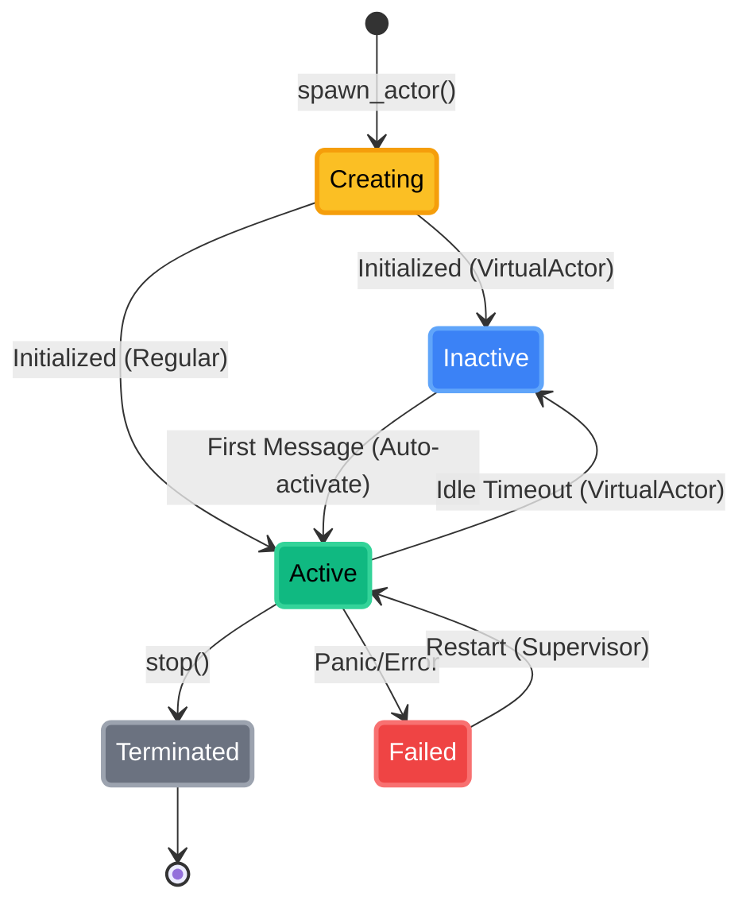
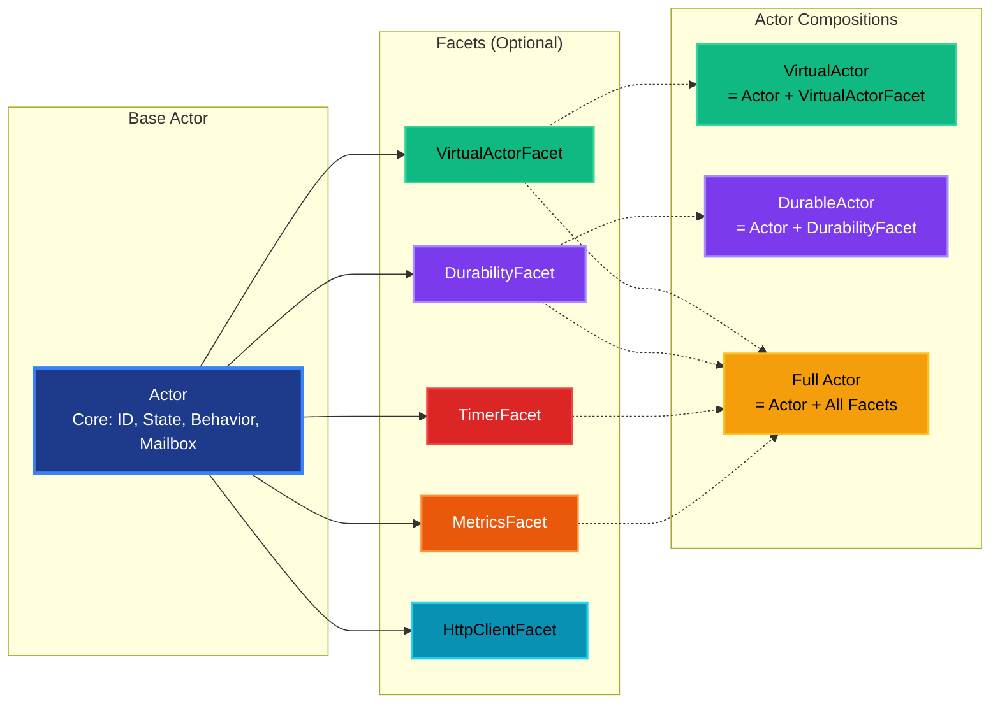
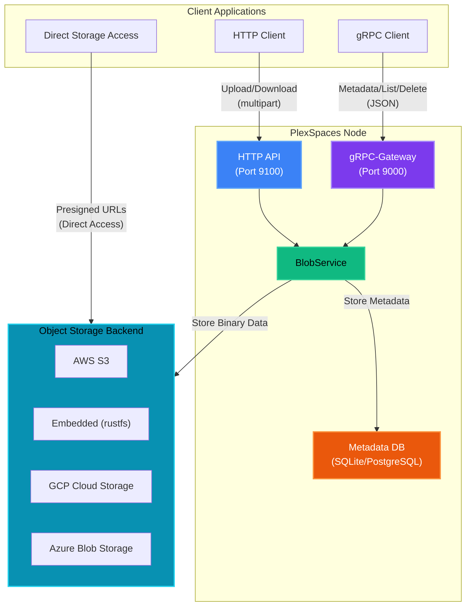
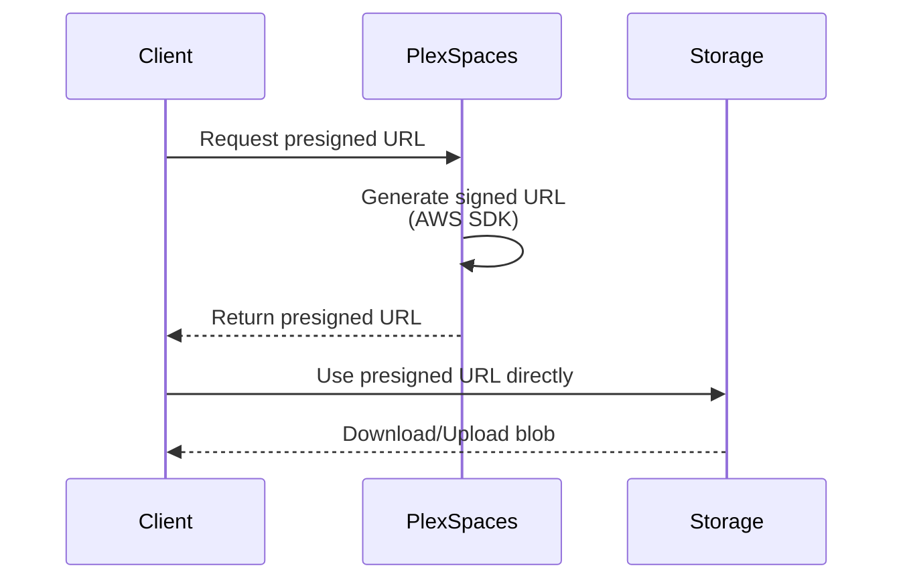
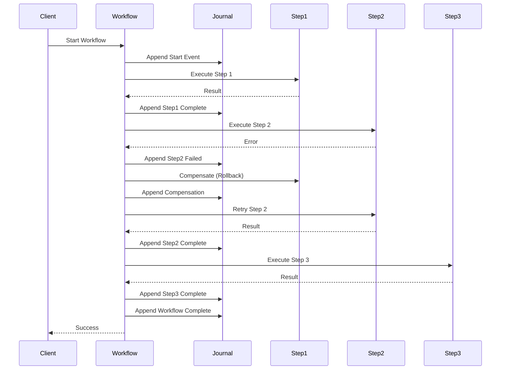
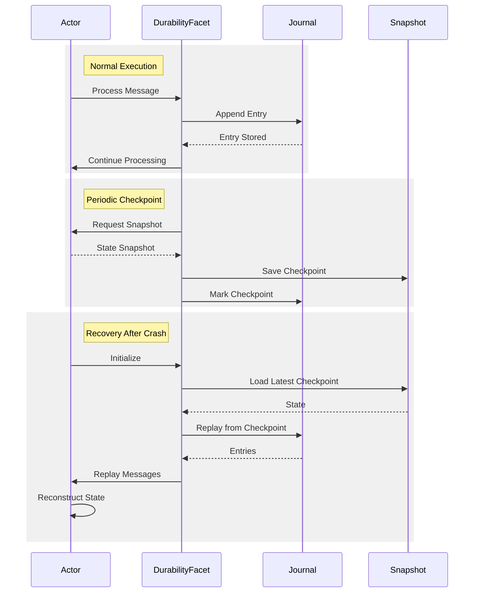
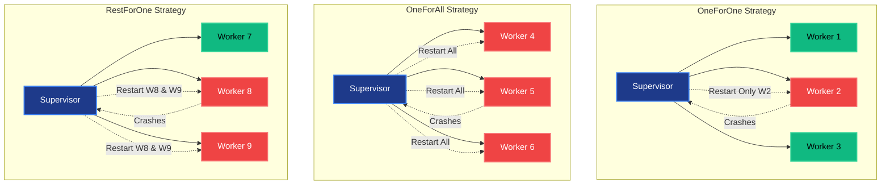
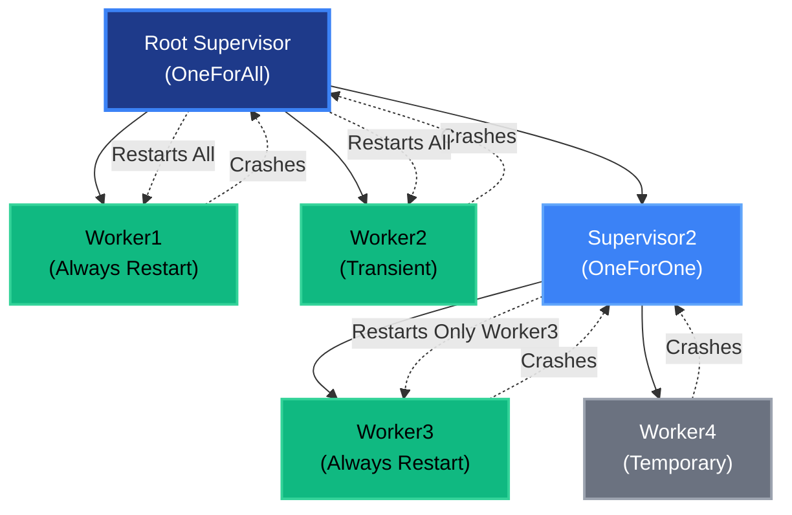
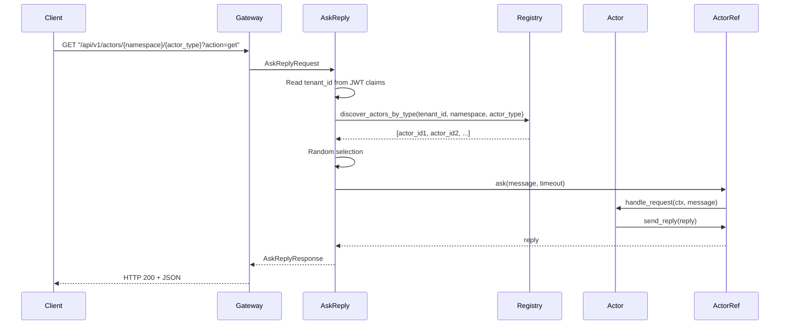

# Detailed Design

This document provides detailed information about PlexSpaces abstractions, components, and implementation details.

> **📖 For comprehensive actor system documentation**, see [Actor System Guide](actor-system.md) which covers the unified actor system, supervision trees, applications, facets, behaviors, lifecycle, linking/monitoring, and observability in detail.

## Table of Contents

1. [Actors](#actors)
2. [Behaviors](#behaviors)
3. [Facets](#facets)
4. [Object Store (Blob Store)](#object-store-blob-store)
5. [TupleSpace](#tuplespace)
6. [Elastic pool](#elastic-pool)
7. [Workflows](#workflows)
8. [Journaling](#journaling)
9. [Supervision](#supervision)
10. [Observability](#observability)
11. [WASM Runtime & SDKs](#wasm-runtime--sdks)
12. [Database Models and ER Diagram](#database-models-and-er-diagram)

## Actors

### Actor Model

Actors are the fundamental unit of computation in PlexSpaces:

- **Stateful**: Each actor maintains private state
- **Sequential**: Messages processed one at a time
- **Isolated**: No shared state between actors
- **Location-Transparent**: Work the same locally or remotely

### Actor Lifecycle


```mermaid
stateDiagram-v2
    [*] --> Creating: spawn_actor()
    Creating --> Inactive: Initialized (VirtualActor)
    Creating --> Active: Initialized (Regular)
    Inactive --> Active: First Message (Auto-activate)
    Active --> Inactive: Idle Timeout (VirtualActor)
    Active --> Terminated: stop()
    Active --> Failed: Panic/Error
    Failed --> Active: Restart (Supervisor)
    Terminated --> [*]
    
    style Creating fill:#fbbf24,stroke:#f59e0b,stroke-width:3px,color:#000
    style Inactive fill:#3b82f6,stroke:#60a5fa,stroke-width:3px,color:#fff
    style Active fill:#10b981,stroke:#34d399,stroke-width:3px,color:#000
    style Terminated fill:#6b7280,stroke:#9ca3af,stroke-width:3px,color:#fff
    style Failed fill:#ef4444,stroke:#f87171,stroke-width:3px,color:#fff
```

**States**:
- **Creating**: Actor is being initialized
- **Inactive**: Actor is inactive (virtual actors)
- **Active**: Actor is processing messages
- **Terminated**: Actor has stopped gracefully
- **Failed**: Actor has crashed with error

### ActorRef

Lightweight, location-transparent handle to an actor. For local actors it can also carry
framework-only lifecycle/state access used by the runtime; remote refs never expose that local
state handle.

```rust
pub struct ActorRef {
    actor_id: ActorId,
    namespace: String,      // Source of truth for namespace (from app/actor)
    location: ActorLocation,
    service_locator: Arc<ServiceLocator>,
}
```

### Actor ID Format

Actor IDs follow a standardized format for consistency and proto-first design:

**Format**: `{id}//{actor_type}::{namespace}@{node_id}`

**Components**:
- `id`: Base actor identifier (can be ULID, client-provided, or empty)
- `actor_type`: Actor type from proto (required, e.g., "read-state-tracker", "GenServer")
- `namespace`: Optional namespace for multi-tenancy
- `node_id`: Node identifier (required)

**Delimiters**:
- `//`: Separates base ID from actor_type (allows client-provided IDs with slashes)
- `::`: Separates actor_type from namespace (allows actor_type with colons)
- `@`: Separates namespace from node_id (standard format)

**Examples**:
- `user-123//read-state-tracker::orbit-read-state-ts@node-1` (full canonical format)
- `ask_01HXYZ...//temp_sender::default@node-1` (temporary sender actor)
- `counter//gen_server::default@node-1` (regular actor)

**Factory Methods**:
```rust
use plexspaces_actor::ActorId;

let actor_id = ActorId::new(
    "user-123",
    "read-state-tracker",
    "orbit-read-state-ts",
    "node-1",
)?;

let parsed = ActorId::from_canonical(actor_id.as_str())?;
assert_eq!(parsed.name(), "user-123");
assert_eq!(parsed.actor_type(), "read-state-tracker");
assert_eq!(parsed.namespace(), "orbit-read-state-ts");
assert_eq!(parsed.node_id(), "node-1");
```

**Features**:
- Cloneable and Send + Sync
- Automatic routing (local vs remote)
- Efficient gRPC client caching
- Correlation ID tracking for replies
- **Namespace storage**: Source of truth for sub-tenant isolation

**Multi-tenancy Methods**:
```rust
// Get actor's namespace
let ns = actor_ref.namespace();

// Create RequestContext with tenant from auth + namespace from ActorRef
let ctx = actor_ref.get_request_context(tenant_id);

// Or get default context (empty tenant, ActorRef's namespace)
let ctx = actor_ref.get_default_request_context().await?;
```

**Design Philosophy**:
- **Tenant-id**: NOT stored in ActorRef. Comes from auth (JWT/mTLS) at request time.
- **Namespace**: Stored in ActorRef. Source of truth is application (if deployed) or actor creation.

### Message Passing

#### Tell (Fire-and-Forget)

```rust
actor_ref.tell(message).await?;
```

#### Ask (Request-Reply)

```rust
let reply = actor_ref.ask(request, Duration::from_secs(5)).await?;
```

**Implementation**:
- Uses correlation IDs for reply matching
- Timeout handling
- Automatic routing via gRPC for remote actors

#### Unified Routing Module

All message routing logic is centralized in `crates/actor/src/routing.rs` to ensure consistency and enable parallel operations.

**Key Functions**:

- **`ActorId::new(name, actor_type, namespace, node_id)`**: Constructs validated actor IDs
- **`ActorId::from_canonical(actor_id)`**: Restores a structured ID at string boundaries
- **`is_actor_local(actor_id, service_locator)`**: Determines locality from the structured `ActorId`
- **`ask_helper(ctx, service_locator, ...)`**: Generic ask helper that returns `Pin<Box<dyn Future>>` for parallel operations
- **`route_local(ctx, service_locator, ...)`**: Routes message to local actor (returns Future)
- **`route_remote(ctx, service_locator, ...)`**: Routes message to remote actor via gRPC (returns Future)
- **`route_message(ctx, service_locator, ...)`**: Unified routing that determines locality and routes accordingly (returns Future)

**Design Principles**:

1. **Generic Functions**: Not tied to specific instances (ActorRef, ActorService)
2. **RequestContext First**: All functions take `RequestContext` as first parameter for tenant/namespace isolation
3. **Return Futures**: All async functions return `Pin<Box<dyn Future>>` for parallel operations (map/reduce)
4. **No Cyclic Dependencies**: Routing module stays dependency-light and works with framework traits plus `RequestContext`

**Parallel Operations**:

The `ask_helper()` function returns a Future, enabling true parallel map/reduce operations:

```rust
// Send all asks asynchronously
let futures: Vec<_> = shard_ids.iter().map(|shard_id| {
    ask_helper(ctx.clone(), service_locator.clone(), shard_id, message.clone(), ...)
}).collect();

// Await all replies in parallel
let results = join_all(futures).await;
```

**Observability**:

All routing functions include comprehensive metrics:
- `plexspaces_routing_local_route_duration_seconds` - Histogram for local routing latency
- `plexspaces_routing_remote_route_duration_seconds` - Histogram for remote routing latency
- `plexspaces_routing_local_route_success_total` - Counter for successful local routes (by pattern: ask/tell)
- `plexspaces_routing_local_route_error_total` - Counter for failed local routes (by error type)
- `plexspaces_routing_remote_route_total` - Counter for remote routes (by target node)
- `plexspaces_routing_remote_route_success_total` - Counter for successful remote routes
- `plexspaces_routing_remote_route_error_total` - Counter for failed remote routes (by error code)
- `plexspaces_routing_route_total` - Counter for routing decisions (by actor_id, node_id, local flag)

**Tenant and Namespace Propagation**:

All routing functions accept `RequestContext` as the first parameter, ensuring proper tenant/namespace isolation. Tenant identity comes from authenticated request context, while namespace follows the actor/application scope carried through `ActorRef` and `RequestContext`.

**Hash-Based Sharding**:

For shard groups (data-parallel actors), routing uses hash-based partitioning:

```rust
// Hash-based routing: partition key → shard_id
fn route_to_shard(key: &str, shard_count: usize) -> usize {
    let hash = key.bytes().fold(0u64, |acc, b| acc.wrapping_mul(31).wrapping_add(b as u64));
    (hash % shard_count as u64) as usize
}

// Route event to shard based on user_id
let shard_id = route_to_shard(&event.user_id, shard_count);
shards[shard_id].cast("track_event", &event_data).await?;
```

**Scatter-Gather Pattern**:

Query all shards in parallel and aggregate results:

```rust
// Query all shards in parallel using GenServerRef.call()
let mut query_futures = Vec::new();
for shard in &shards {
    query_futures.push(shard.call::<_, ShardMetrics>("get_metrics", &json!({})));
}

// Collect and aggregate results
let results: Vec<Result<ShardMetrics, _>> = futures::future::join_all(query_futures).await;
let total: u64 = results.iter().map(|r| r.as_ref().map(|m| m.total).unwrap_or(0)).sum();
```

**See Also**: 
- [Message Routing Design](message-routing.md) - Comprehensive documentation of routing patterns and implementation details
- [Event Analytics Example](../examples/rust/embedded/event_analytics/) - Complete shard groups demonstration with hash-based routing

## Behaviors

**All behaviors are defined in `crates/behavior/src/mod.rs`.** The base actor contract is `plexspaces_actor::Actor` (in `crates/actor`). Handler dispatching follows the Python SDK: **call** = request-reply (GET/ask), **cast** = fire-and-forget (POST/tell). **GenServer uses call by default** (routes `MessageType::Call` → `handle_request()` with reply expected).

See [crates/behavior/README.md](../crates/behavior/README.md) for full behavior documentation and tests.

### Behavior Types Summary

| BehaviorType | Trait | SDK Annotation | Use Case | Default Invocation |
|--------------|-------|----------------|----------|-------------------|
| `GenServer` | `GenServer` | `#[gen_server_actor]` | Request-reply actors | call |
| `GenEvent` | `EventHandler` | `#[event_actor]` | Fire-and-forget events | cast |
| `GenStateMachine` | `StateHandler<S,E>` | `#[fsm_actor]` | State machine workflows | call |
| `Workflow` | `Workflow` | `#[workflow_actor]` | Durable orchestrations | call |
| `Custom(name)` | `Actor` | `#[actor]` | User-defined behavior | varies |

### GenServer

Request/reply (OTP-style). Trait: `plexspaces_behavior::GenServer`. Implements `handle_request(ctx, msg)`; `route_message()` routes Call → handle_request (reply expected), Cast → handle_request (optional reply).

**Location**: `crates/behavior/src/mod.rs` (lines 97-342)

**Error Reply Semantics (Erlang/Orleans model)**:

When a GenServer handler returns `Err(BehaviorError)`, the framework sends an immediate **error reply** (`message_type: "error_reply"`) to the caller rather than letting the caller time out. The actor itself survives and continues processing subsequent messages. This matches:
- **Erlang gen_server**: `handle_call` failure → caller gets `{error, Reason}`, process continues (or restarts via supervisor)
- **Orleans**: grain method throws → caller's `Task` faults immediately, grain remains active
- **Akka**: `StatusReply.error()` → caller gets immediate failure, actor survives

The error reply carries a JSON payload `{"error": "<message>", "success": false}`. On the receiving side:
- **Local calls** (`ask`): The `ReplyWaiter` resolves with the error reply message (callers check `message_type == "error_reply"`)
- **Remote calls** (gRPC): The `AskReplyResponse` returns `success: false` with `error_message` populated; `route_remote` reconstructs the reply with `message_type: "error_reply"`
- **Scatter-gather**: Error replies from individual shards are classified as shard failures, contributing to partial-failure tolerance

The `send_reply` method has an idempotency guard (AtomicBool) ensuring exactly one reply per message cycle — the error reply path and normal reply path cannot both fire.

**SDK Usage**:
```rust
#[gen_server_actor]
struct MyActor { ... }

#[plexspaces_handlers]
impl MyActor {
    #[handler("operation")]  // defaults to call semantics
    async fn handle_op(&mut self, ctx: &ActorContext, msg: &Message) -> Result<Value, BehaviorError> { ... }
}
```

### GenEvent

Fire-and-forget event handling. `GenEventBehavior` + `EventHandler` trait. No reply.

**Location**: `crates/behavior/src/mod.rs` (lines 344-405)

**SDK Usage**:
```rust
#[event_actor]
struct AuditLogger { ... }

#[plexspaces_handlers(event)]
impl AuditLogger {
    #[handler("log", cast)]  // cast semantics (fire-and-forget)
    async fn handle_log(&mut self, ctx: &ActorContext, msg: &Message) -> Result<(), BehaviorError> { ... }
}
```

### GenStateMachine (GenFSM)

Finite state machine. `GenStateMachineBehavior<S, E>` with `transition(ctx, event)` and state handlers.

**Location**: `crates/behavior/src/mod.rs` (lines 407-520)

**SDK Usage**:
```rust
// Declare valid states and initial state for self-documentation and startup validation.
// Generates FSM_STATES and FSM_INITIAL consts on the struct.
#[fsm_actor(states = ["idle", "processing", "done", "error"], initial = "idle")]
struct OrderWorkflow { state: OrderState }

#[plexspaces_handlers(fsm)]
impl OrderWorkflow {
    #[handler("submit")]
    async fn on_submit(&mut self, ctx: &ActorContext, msg: &Message) -> Result<Value, BehaviorError> {
        // Transition state based on event
        self.state = OrderState::Processing;
        Ok(json!({ "state": "processing" }))
    }
}
```

**Python**:
```python
@fsm_actor(states=["idle", "processing", "done", "error"], initial="idle")
class OrderFSM:
    fsm_state: str = "idle"   # auto-set to initial if omitted

    @handler("submit")
    def on_submit(self, payload: dict) -> dict:
        self.fsm_state = "processing"
        return {"state": self.fsm_state}
```

**Go**:
```go
router.RouteDefinition("order_fsm", plexspaces.FSMActorDef(
    NewOrderFSM,
    plexspaces.FSMOpts{
        States:  []string{"idle", "processing", "done", "error"},
        Initial: "idle",
    },
))
```

**TypeScript**:
```typescript
@fsm_actor({ states: ["idle", "processing", "done", "error"], initial: "idle" })
class OrderFSMActor { ... }
// Or class-based without decorator:
class OrderFSMActor extends PlexSpacesActor<State> {
  static readonly FSM_STATES = ["idle", "processing", "done", "error"] as const;
  static readonly FSM_INITIAL = "idle";
}
```

**Parameters**:

| Parameter | Type | Description |
|-----------|------|-------------|
| `states` | `string[]` | Valid state names — for self-documentation, observability, and startup validation |
| `initial` | `string` | Initial state name — runtime sets `fsm_state` to this on first activation |
| `facets` | `string[]` | Optional PlexSpaces facets (e.g., `"durability"`, `"timer"`) |

All parameters are optional and backward-compatible — bare `@fsm_actor` continues to work unchanged.

### Workflow

Durable workflows (Restate/Temporal-style). `Workflow` trait with `run()`, `signal()`, `query()`.

**Location**: `crates/behavior/src/mod.rs` (lines 522-812), `crates/behavior/src/workflow.rs` (ExecutionContext)

**SDK Usage**:
```rust
#[workflow_actor(facets = ["durability"])]
struct PaymentPipeline { ... }

#[plexspaces_handlers(workflow)]
impl PaymentPipeline {
    #[run_handler]
    async fn run(&mut self, ctx: &ActorContext, input: Message) -> Result<Message, BehaviorError> {
        // Main workflow execution (exclusive)
    }
    
    #[signal_handler("cancel")]
    async fn on_cancel(&mut self, ctx: &ActorContext, data: Message) -> Result<(), BehaviorError> {
        // Handle external signals
    }
    
    #[query_handler("status")]
    async fn get_status(&self, ctx: &ActorContext, params: Message) -> Result<Message, BehaviorError> {
        // Read-only queries (concurrent)
    }
}
```

**ExecutionContext Methods** (for durable execution):
- `ctx.run(name, retry, || ...)` - Execute side-effect durably; `retry` is `None` or `Some(&RetryConfig)` (proto). Single unified run: `None` or `max_attempts == 0` = one attempt; otherwise retries up to `max_attempts` with **exponential backoff and full jitter** (delay = min(initial_interval_ms * backoff_rate^(attempt-1), max_interval_ms) * random(0,1]). Defaults when unset: initial_interval_ms 100, backoff_rate 2, max_interval_ms 30000. Only the first successful result is journaled for deterministic replay.
- `ctx.sleep(duration)` - Durable sleep
- `ctx.promise()` - Create awaitable promise
- `ctx.now()` - Deterministic timestamp

### Custom Behavior

User-defined behavior type for specialized actors.

**SDK Usage**:
```rust
#[actor(name = "my_custom_actor")]
struct CustomActor { ... }

#[plexspaces_handlers(custom)]
impl CustomActor {
    #[handler("process", cast)]
    async fn process(&mut self, ctx: &ActorContext, msg: &Message) -> Result<(), BehaviorError> { ... }
}
```

## Facets

Facets are the key extensibility mechanism in PlexSpaces, enabling runtime composition of capabilities without creating multiple actor types. They follow the "Static for core, Dynamic for extensions" principle.

### Facet Interceptor Chain


```mermaid
graph LR
    Message["Incoming Message"] --> Security["Security Facets<br/>(Priority 1000+)"]
    Security --> Logging["Logging/Tracing Facets<br/>(Priority 900-999)"]
    Logging --> Metrics["Metrics Facets<br/>(Priority 800-899)"]
    Metrics --> Domain["Domain Facets<br/>(Priority 100-500)"]
    Domain --> Actor["Actor Behavior<br/>(Process Message)"]
    Actor --> Persistence["Persistence Facets<br/>(Priority 1-99)"]
    Persistence --> Response["Response"]
    
    style Message fill:#3b82f6,stroke:#60a5fa,stroke-width:2px,color:#fff
    style Security fill:#ef4444,stroke:#f87171,stroke-width:2px,color:#fff
    style Logging fill:#6b7280,stroke:#9ca3af,stroke-width:2px,color:#fff
    style Metrics fill:#ea580c,stroke:#fb923c,stroke-width:2px,color:#fff
    style Domain fill:#7c3aed,stroke:#a78bfa,stroke-width:2px,color:#fff
    style Actor fill:#10b981,stroke:#34d399,stroke-width:2px,color:#000
    style Persistence fill:#0891b2,stroke:#22d3ee,stroke-width:2px,color:#000
    style Response fill:#3b82f6,stroke:#60a5fa,stroke-width:2px,color:#fff
```

### Built-in Facet Inventory

**Complete list of facets** available in PlexSpaces, their SDK annotation names (for `facets = [...]`), and implementation locations:

| Facet | SDK Name | Category | Implementation |
|-------|----------|----------|----------------|
| **TimerFacet** | `timer` | Scheduling | `crates/journaling/src/timer_facet.rs` |
| **ReminderFacet** | `reminder` | Scheduling | `crates/journaling/src/reminder_facet.rs` |
| **DurabilityFacet** | `durability` | Persistence | `crates/journaling/src/durability_facet.rs` |
| **EventSourcingFacet** | `event_sourcing` | Persistence | `crates/journaling/src/event_sourcing_facet.rs` |
| **VirtualActorFacet** | `virtual_actor` | Lifecycle | `crates/journaling/src/virtual_actor_facet.rs` |
| **EventEmitterFacet** | `event_emitter` | Messaging | `crates/facet/src/event_emitter.rs` |
| **KeyValueFacet** | `keyvalue` | Storage | `crates/facet/src/capabilities/keyvalue.rs` |
| **HttpClientFacet** | `http_client` | Integration | `crates/facet/src/capabilities/http_client.rs` |
| **LockFacet** | `lock` | Coordination | `crates/facet/src/capabilities/locks.rs` |
| **RegistryFacet** | `registry` | Discovery | `crates/facet/src/capabilities/registry.rs` |
| **ProcessGroupFacet** | `process_group` | Coordination | `crates/facet/src/capabilities/process_groups.rs` |
| **LoggingFacet** | `logging` | Observability | `crates/facet/src/mod.rs` |
| **CachingFacet** | `caching` | Performance | `crates/facet/src/mod.rs` |
| **MetricsFacet** | `metrics` | Observability | `crates/facet/src/metrics_facet.rs` |
| **MobilityFacet** | `mobility` | Distribution | (mobility crate) |
| **BlobStorageFacet** | `blob_storage` | Storage | (blob crate) |
| **SecretsFacet** | `secrets` | Security | (secrets facet) |
| **StreamingFacet** | `streaming` | Messaging | (streaming facet) |
| **TransactionFacet** | `transaction` | Persistence | (transaction facet) |
| **StatelessWorkerFacet** | `stateless_worker` | Scaling | (stateless worker facet) |

### Facet Categories

**Scheduling Facets** - Time-based operations (Orleans Model):

| Facet | Durability | Storage | Use Case |
|-------|------------|---------|----------|
| `TimerFacet` | Transient (in-memory) | None | Heartbeats, timeouts, health checks |
| `ReminderFacet` | Durable (persisted) | `Arc<dyn JournalStorage>` | Billing, SLA, scheduled tasks |

The naming convention follows the **industry standard** (Orleans, Akka, Dapr):
- **Timer** = transient, fast, no persistence overhead, lost on crash
- **Reminder** = durable, requires storage, survives crashes

This is a deliberate design choice - the name itself communicates durability semantics.

**Persistence Facets** - State durability:
- `DurabilityFacet`: Checkpoint-based state persistence
- `EventSourcingFacet`: Event log-based state reconstruction

**Lifecycle Facets** - Actor lifecycle management:
- `VirtualActorFacet`: Automatic activation/passivation with idle timeout

**Messaging Facets** - Communication patterns:
- `EventEmitterFacet`: Pub/sub event broadcasting
- `StreamingFacet`: Streaming message delivery

**Storage Facets** - Data access:
- `KeyValueFacet`: Key-value store operations
- `BlobStorageFacet`: Large object storage
- `CachingFacet`: In-memory caching

**Coordination Facets** - Distributed coordination:
- `LockFacet`: Distributed locking
- `ProcessGroupFacet`: Actor group membership
- `RegistryFacet`: Actor discovery and registration

**Integration Facets** - External systems:
- `HttpClientFacet`: HTTP client for external APIs
- `SecretsFacet`: Secure credential access

**Observability Facets** - Monitoring:
- `LoggingFacet`: Structured logging
- `MetricsFacet`: Metrics collection and export

### Using Facets with SDK Annotations

Facets are declared using the `facets = [...]` parameter on actor type annotations:

```rust
// Single facet
#[gen_server_actor(facets = ["timer"])]
struct TimerActor { ... }

// Multiple facets
#[workflow_actor(facets = ["durability", "event_sourcing", "metrics"])]
struct DurableWorkflow { ... }

// With custom name
#[actor(name = "my_actor", facets = ["keyvalue", "lock"])]
struct CustomActor { ... }
```

The SDK generates a `FACETS` constant containing the declared facet names:

```rust
// Generated by #[gen_server_actor(facets = ["timer", "reminder"])]
impl MyActor {
    pub const FACETS: &'static [&'static str] = &["timer", "reminder"];
}
```

### Proto Definition

`BuiltInFacetType` enum (proto: `plexspaces.facets.v1`):

| BuiltInFacetType | Proto Value |
|------------------|-------------|
| Mobility | `MOBILITY` |
| EventEmitter | `EVENT_EMITTER` |
| KeyValue | `KEY_VALUE` |
| Timer | `TIMER` |
| Reminder | `REMINDER` |
| HttpClient | `HTTP_CLIENT` |
| BlobStorage | `BLOB_STORAGE` |
| Secrets | `SECRETS` |
| Streaming | `STREAMING` |
| Transaction | `TRANSACTION` |
| StatelessWorker | `STATELESS_WORKER` |
| VirtualActor | `VIRTUAL_ACTOR` |

### Facet Philosophy

**Problem**: How to support Virtual Actors, Mobile Agents, OTP GenServers, Workflows WITHOUT creating 20 different actor implementations?

**Solution**: ONE powerful Actor type + composable Facets


```mermaid
graph LR
    subgraph Base["Base Actor"]
        Actor["Actor<br/>Core: ID, State, Behavior, Mailbox"]
    end
    
    subgraph Facets["Facets (Optional)"]
        VA["VirtualActorFacet"]
        Durability["DurabilityFacet"]
        Timer["TimerFacet"]
        Metrics["MetricsFacet"]
        HTTP["HttpClientFacet"]
    end
    
    Actor --> VA
    Actor --> Durability
    Actor --> Timer
    Actor --> Metrics
    Actor --> HTTP
    
    subgraph Compositions["Actor Compositions"]
        VirtualActor["VirtualActor<br/>= Actor + VirtualActorFacet"]
        DurableActor["DurableActor<br/>= Actor + DurabilityFacet"]
        FullActor["Full Actor<br/>= Actor + All Facets"]
    end
    
    VA -.-> VirtualActor
    Durability -.-> DurableActor
    VA -.-> FullActor
    Durability -.-> FullActor
    Timer -.-> FullActor
    Metrics -.-> FullActor
    
    style Actor fill:#1e3a8a,stroke:#3b82f6,stroke-width:3px,color:#fff
    style VA fill:#10b981,stroke:#34d399,stroke-width:2px,color:#000
    style Durability fill:#7c3aed,stroke:#a78bfa,stroke-width:2px,color:#fff
    style Timer fill:#dc2626,stroke:#ef4444,stroke-width:2px,color:#fff
    style Metrics fill:#ea580c,stroke:#fb923c,stroke-width:2px,color:#fff
    style HTTP fill:#0891b2,stroke:#22d3ee,stroke-width:2px,color:#000
    style VirtualActor fill:#10b981,stroke:#34d399,stroke-width:2px,color:#000
    style DurableActor fill:#7c3aed,stroke:#a78bfa,stroke-width:2px,color:#fff
    style FullActor fill:#f59e0b,stroke:#fbbf24,stroke-width:2px,color:#000
```

**Compositions**:
- `VirtualActor = Actor + VirtualActorFacet`
- `MobileAgent = Actor + MobilityFacet + ItineraryFacet`
- `GenServer = Actor + OTPGenServerFacet`
- `DurableWorkflow = Actor + DurableExecutionFacet + WorkflowFacet`

### Facet Priority System

Facets execute in priority order (higher = runs first):

- **1000+**: Security/Auth facets (run first, can block execution)
- **900-999**: Logging/Tracing facets (capture all events)
- **800-899**: Metrics facets
- **100-500**: Domain logic facets
- **1-99**: Persistence facets (run last, commit after business logic)

### Infrastructure Facets

#### VirtualActorFacet

Orleans-style activation/deactivation with automatic instance creation:

**Activation Flow**:

1. **Type Registration**: During application deployment (`wasm_application.rs`):
   ```rust
   // Build ActorSpawnSpec from ChildSpec — single source of truth for spawn + reactivation.
   // role maps 1:1 from ChildSpec.role (TOML `role` field) and is the BehaviorRegistry
   // dispatch key when multiple children share the same actor_type (WASM module).
   let spawn_spec = ActorSpawnSpec {
       identity: Some(ActorIdentity {
           name: child_spec.actor_identity.name.clone(),
           actor_type: actor_type.clone(),
       }),
       role: child_spec.role.clone(),   // e.g. "worker", "leader" from app-config.toml
       namespace: namespace.to_string(),
       tenant_id: tenant_id.to_string(),
       behavior_kind: child_spec.behavior_kind.clone(),
       args: child_spec.args.clone(),
       facets: child_spec.facets.clone(),
       config: None,
       labels: std::collections::HashMap::new(),
   };
   
   // Register virtual actor definition — stores ActorSpawnSpec verbatim
   virtual_actor_manager.register_virtual_actor_definition(spawn_spec).await?;
   ```

2. **WASM Init Payload**: At activation time `wasm_init_payload(&spec, &actor_id)` builds the
   canonical JSON passed to the WASM guest's `init()` function:
   ```json
   {
     "actor_id":      "worker-0//parameter_server_wasm::my-app@node-1",
     "actor_type":    "parameter_server_wasm",
     "role":          "worker",
     "behavior_kind": "GenServer",
     "args":          { "learning_rate": "0.01" },
     "learning_rate": 0.01
   }
   ```
   - `role` (from `ActorSpawnSpec.role`, falls back to `identity.name`) is the key used by
     SDK routers (Go `ActorRouter`, TypeScript `ActorRouter`, Python `_select_class`) to
     dispatch to the correct actor class when a single WASM module hosts multiple child specs.
   - `args` is nested for structured access; scalar args are also promoted to the top level
     for non-WASM behavior factories.
   - Framework meta-fields (`actor_id`, `actor_type`, `role`, `behavior_kind`, `args`) are
     excluded from the promoted top-level scalars to prevent shadowing.

3. **Auto-Activation**: When message arrives for non-existent virtual actor:
   - `AskReply` or `SendMessage` discovers no actors match `actor_type`
   - Checks `VirtualActorManager.is_virtual_actor_type(actor_type)`
   - Performs internal activation inside `ActorServiceImpl::ask_reply()` or `ActorServiceImpl::send_message()` which:
     - Reuses suspended instance metadata when a virtual actor id is already known
     - Builds actor_id via `ActorId::new(name, actor_type, namespace, node_id)` for type-driven activation
     - Retrieves `ActorSpawnSpec` from `VirtualActorManager` (stored at registration time)
     - Calls `ActorFactory::spawn_actor(ctx, &spec, facets)` — derives WASM init bytes via `wasm_init_payload(&spec, &actor_id)` from `spec.args` (no stale `initial_state` bytes)
     - Creates runtime facet objects from `spec.facets` via `create_facets_from_config`
   - Retries lookup to discover newly created actor

3. **Facet Support**: Supports all facet types:
   - `virtual_actor`: Lifecycle management (always included)
   - `durability`: State persistence (if configured)
   - `timer`: Time-based operations (if configured)
   - `reminder`: Durable reminders (if configured)
   - Any other facets declared in application config

**Actor ID Format**: Uses standardized format `{id}//{actor_type}::{namespace}@{node_id}`:
- Type: `read-state-tracker` (registered during deployment)
- Instance: `user-123//read-state-tracker::orbit-read-state-ts@node-1`
- Auto-activation: Any message to matching pattern triggers activation

**Configuration**:
- `activation_strategy`: `lazy` (default), `eager`, or `prewarm`
- `idle_timeout`: Duration before deactivation (default: 5 minutes from `RuntimeConfig.default_virtual_actor_config`)

**Default Configuration**:
Defaults are provided via `RuntimeConfig.default_virtual_actor_config`:
- `idle_timeout`: 5 minutes (300 seconds) if not specified
- `max_pool_per_actor_type`: 100 instances per actor type (LRU eviction when exceeded)
- `activation_strategy`: `lazy` if not specified

These defaults are applied when creating `VirtualActorFacet` instances if not explicitly provided in facet configuration.

**Architecture**:
- Uses `VirtualActorLifecycleFacet` trait (defined in `plexspaces-actor`) for type-safe lifecycle management
- `VirtualActorFacet` (in `plexspaces-journaling`) implements this trait
- Eliminates `Any` types and unsafe downcasting - all lifecycle operations use trait methods
- `VirtualActorManager` stores facets as `Box<dyn VirtualActorLifecycleFacet>` for type safety

**Features**:
- Automatic activation on first message
- Deactivation after idle timeout (configurable via runtime config defaults)
- State preservation during deactivation
- Transparent to application code
- Always addressable (actor ID never changes)
- Supports all facets (not just virtual_actor)
- LRU eviction when max pool size per actor type is exceeded

**Use Cases**: Stateful services with millions of instances, user sessions, game sessions

**VirtualActorManager Architecture**:
- Manages virtual actor metadata and lifecycle state
- Stores facets as `Box<dyn VirtualActorLifecycleFacet>` (type-safe, no `Any` types)
- Provides trait-based API for lifecycle operations (`get_activation_strategy()`, `should_activate()`, `should_deactivate()`, etc.)
- Supports both instance-level and type-level registration
- Applies defaults from `RuntimeConfig.default_virtual_actor_config` when creating facets
- Each registered actor type/definition stores a single `ActorSpawnSpec` (proto message) as the unified descriptor for spawn and reactivation — eliminates the old `init_config_template`/`initial_state` duality
- `ActorSpawnSpec.role` carries the `ChildSpec.role` value from the application config; it is the BehaviorRegistry dispatch key written into the `"role"` field of the WASM init payload

**Example (SDK)**:
```rust
use plexspaces_sdk::{
    gen_server_actor, plexspaces_handlers, handler,
    spawn, spawn_with_facets, VirtualActorFacet,
    RequestContext, ActorId, json,
};

// Define virtual actor with facets annotation
#[gen_server_actor(facets = ["virtual_actor"])]
struct UserSession {
    user_id: String,
    last_activity: u64,
}

#[plexspaces_handlers]
impl UserSession {
    #[handler("activity")]
    async fn activity(&mut self, _ctx: &plexspaces_sdk::ActorContext, _msg: &plexspaces_sdk::Message) 
        -> Result<serde_json::Value, plexspaces_sdk::BehaviorError> {
        self.last_activity = std::time::SystemTime::now()
            .duration_since(std::time::UNIX_EPOCH).unwrap().as_secs();
        Ok(json!({ "status": "ok" }))
    }
}

// Spawn using SDK - facets auto-created from annotation
let ctx = RequestContext::new_without_auth("tenant".into(), "ns".into());
let actor_ref = spawn(&ctx, service_locator.clone(), "session", "default", 
    UserSession { user_id: "user-123".into(), last_activity: 0 }).await?;
```

#### DurabilityFacet

Automatic persistence and recovery (Restate-inspired):

```rust
pub struct DurabilityFacet {
    journal: Arc<dyn Journal>,
    snapshot_interval: Duration,
    execution_context: ExecutionContext,
}
```

**Configuration**:
- `journal_backend`: `sqlite`, `postgres`, `redis`, `memory`
- `replay_on_restart`: `true` (default) or `false`
- `checkpoint_interval`: Messages between checkpoints (default: 1000)
- `cache_side_effects`: `true` (default) for deterministic replay

**Features**:
- Event sourcing (complete audit trail)
- Periodic snapshots for fast recovery
- Automatic recovery from failures
- Deterministic replay from any point
- Exactly-once message processing
- Time-travel debugging

**Use Cases**: Workflows, sagas, critical business logic, financial transactions

**Example (SDK)**:
```rust
use plexspaces_sdk::{
    gen_server_actor, plexspaces_handlers, handler,
    spawn_with_storage, SqliteJournalStorage,
    RequestContext, json,
};
use std::sync::Arc;

// Define durable actor with facets annotation
#[gen_server_actor(facets = ["durability"])]
struct DurableCounter {
    count: i32,
}

#[plexspaces_handlers]
impl DurableCounter {
    #[handler("increment")]
    async fn increment(&mut self, _ctx: &plexspaces_sdk::ActorContext, _msg: &plexspaces_sdk::Message) 
        -> Result<serde_json::Value, plexspaces_sdk::BehaviorError> {
        self.count += 1;
        Ok(json!({ "count": self.count }))
    }
}

// Spawn with storage backend
let storage = Arc::new(SqliteJournalStorage::new(":memory:").await?);
let ctx = RequestContext::new_without_auth("tenant".into(), "ns".into());
let actor_ref = spawn_with_storage(&ctx, service_locator.clone(), 
    "counter", "default", DurableCounter { count: 0 }, storage).await?;
```

#### MobilityFacet

Actor migration between nodes (Voyager-inspired):

```rust
pub struct MobilityFacet {
    migration_strategy: MigrationStrategy,
    state_transfer: StateTransferMode,
}
```

**Configuration**:
- `migration_strategy`: `eager` (proactive) or `lazy` (on-demand)
- `state_transfer`: `checkpoint` (full state) or `incremental` (delta)

**Features**:
- State capture before migration
- State restoration after migration
- Pre-departure and post-arrival hooks
- Automatic resource cleanup

**Note**: WASM migration may replace this (state-only transfer, code cached)

**Use Cases**: Load balancing, node maintenance, mobile agents

### Capability Facets (I/O Operations)

Capability facets use **message interception** to provide capabilities to actors. Actors send messages with specific types, and facets intercept and handle them using real backend services from ServiceLocator.

#### LockFacet

Distributed lock coordination for task queues, resource coordination, and leader election.

**Message Types Intercepted**:
- `"acquire_lock"`: Acquire lock with lease duration
- `"release_lock"`: Release lock (requires version)
- `"renew_lock"`: Renew lock lease (heartbeat)
- `"try_acquire_lock"`: Non-blocking lock attempt
- `"get_lock"`: Get current lock state

**Backend**: Uses LockManager from ServiceLocator (configured via node-config/runtimeconfig)
- **SQLiteLockManager**: SQLite-backed (use `:memory:` for testing, file path for production)
- **DynamoDBLockManager**: DynamoDB-backed (distributed)

> **Note**: In-memory testing uses `SqliteLockManager::new(":memory:")` which provides fast, isolated storage without persistence.
- **RedisLockManager**: Redis-backed (distributed)

**Use Cases**:
- Distributed task queues (ensure only one worker processes each job)
- Resource coordination (prevent concurrent access)
- Leader election (elect a leader node)

**Example**:
```toml
# app-config.toml
[[supervisor.children.facets]]
type = "locks"
priority = 50
config = {}
```

```rust
// Actor sends message - facet intercepts it
let msg = Message::json(&json!({
    "lock_key": "job:job-123",
    "holder_id": "worker-1",
    "lease_duration_secs": 300
}))
.with_message_type("acquire_lock");

let reply = actor_ref.ask(msg.to_proto(), Duration::from_secs(5)).await?;
// LockFacet handled the operation, actor's handle() was never called
```

**See Also**: [Task Queue Example](../../examples/python/apps/task-queue/) - Complete distributed task queue implementation

#### ProcessGroupFacet

Distributed pub/sub and group messaging (Erlang pg2-style).

**Message Types Intercepted**:
- `"create_group"`: Create a new process group
- `"join_group"`: Join a process group (with optional topics)
- `"leave_group"`: Leave a process group
- `"get_members"`: Get all members (cluster-wide)
- `"get_local_members"`: Get local members only
- `"list_groups"`: List all groups
- `"publish_to_group"`: Publish message to group members

**Backend**: Uses ProcessGroupService from ServiceLocator (configured via node-config/runtimeconfig)

**Use Cases**:
- Pub/sub messaging (chat rooms, notifications)
- Actor clustering (group actors for coordination)
- Broadcast messaging (send to all group members)

**Example**:
```toml
# app-config.toml
[[supervisor.children.facets]]
type = "process_groups"
priority = 50
config = {}
```

```rust
// Actor sends message - facet intercepts it
let msg = Message::json(&json!({
    "group_name": "chat-room-1",
    "actor_id": "user-123",
    "topics": ["general", "announcements"]
}))
.with_message_type("join_group");

let reply = actor_ref.ask(msg.to_proto(), Duration::from_secs(5)).await?;
// ProcessGroupFacet handled the operation
```

#### RegistryFacet

Service discovery and object registration.

**Message Types Intercepted**:
- `"register_object"`: Register an object in the registry
- `"unregister_object"`: Unregister an object
- `"lookup_object"`: Lookup an object by ID
- `"discover_objects"`: Discover objects with filters (`offset`, then `limit`, matching the ObjectRegistry backend)

**Backend**: Uses ObjectRegistry from ServiceLocator (configured via node-config/runtimeconfig)

**Use Cases**:
- Service discovery (find services by type)
- Actor discovery (find actors by type)
- Object registration (register services, actors, tuplespaces)

**Example**:
```toml
# app-config.toml
[[supervisor.children.facets]]
type = "registry"
priority = 50
config = {}
```

```rust
// Actor sends message - facet intercepts it
let msg = Message::json(&json!({
    "object_id": "payment-service",
    "object_type": "Service",
    "grpc_address": "http://payment-service:50051"
}))
.with_message_type("register_object");

let reply = actor_ref.ask(msg.to_proto(), Duration::from_secs(5)).await?;
// RegistryFacet handled the operation
```

#### HttpClientFacet

HTTP client for outbound requests (wasmCloud-inspired):

```rust
pub struct HttpClientFacet {
    base_url: Option<String>,
    timeout: Duration,
    retry_policy: RetryPolicy,
}
```

**Configuration**:
- `base_url`: Base URL for all requests
- `timeout`: Request timeout (default: 30s)
- `retry_policy`: Retry configuration

**Features**:
- HTTP/HTTPS requests
- Automatic retries
- Request/response logging
- Circuit breaker integration

**Use Cases**: External API calls, webhooks, service integration

**Example**:
```rust
let http_facet = HttpClientFacet::new()
    .with_base_url("https://api.example.com")
    .with_timeout(Duration::from_secs(10));
actor.attach_facet(Box::new(http_facet), 200, serde_json::json!({})).await?;

// In actor code
let response = ctx.facet_service()
    .get_facet::<HttpClientFacet>("http_client")?
    .get("/users/123")
    .await?;
```

#### KeyValueFacet

Key-value store access (wasmCloud-inspired):

```rust
pub struct KeyValueFacet {
    store_type: StoreType,
    connection_string: String,
}
```

**Configuration**:
- `store_type`: `memory`, `redis`, `dynamodb`, `sqlite`, `blob`
- `connection_string`: Backend connection string

**Features**:
- Get, set, delete operations
- TTL support
- Atomic operations
- Multi-tenant isolation

**Backend Support**:
- **SQLite**: Use `:memory:` for testing, file path for persistent storage
- **PostgreSQL**: Production-grade persistent SQL storage
- **Redis**: Distributed with native TTL
- **DynamoDB**: AWS-native distributed storage

> **Note**: In-memory testing uses `SqliteKVStore::new(":memory:")` which provides fast, isolated storage without persistence.
- **Blob**: Object storage (embedded object store/S3/GCP/Azure) using object_store directly

**Use Cases**: Caching, session storage, configuration, feature flags

**Example**:
```rust
let kv_facet = KeyValueFacet::new()
    .with_backend(StoreType::Redis, "redis://localhost:6379");
actor.attach_facet(Box::new(kv_facet), 200, serde_json::json!({})).await?;

// In actor code
ctx.facet_service()
    .get_facet::<KeyValueFacet>("keyvalue")?
    .set("key", "value", Some(Duration::from_secs(3600)))
    .await?;
```

#### BlobStorageFacet

Blob storage access (wasmCloud-inspired):

```rust
pub struct BlobStorageFacet {
    backend: BlobBackend,
    bucket: String,
}
```

**Configuration**:
- `backend`: `s3`, `gcs`, `azure`, `embedded`
- `bucket`: Storage bucket name
- `connection_string`: Backend connection

**Features**:
- Upload, download, delete blobs
- Streaming support
- Metadata management
- Multi-part uploads

**Use Cases**: File storage, media assets, large data objects

### Timer and Reminder Facets

#### TimerFacet

Scheduled tasks (Orleans-inspired):

```rust
pub struct TimerFacet {
    timers: HashMap<TimerId, Timer>,
}
```

**Configuration**:
- `default_period`: Default timer period
- `max_timers`: Maximum concurrent timers per actor

**Features**:
- One-shot timers
- Periodic timers
- Timer cancellation
- Persistent timers (with DurabilityFacet)

**Use Cases**: Periodic tasks, cleanup jobs, heartbeats

**Example (SDK)**:
```rust
use plexspaces_sdk::{
    actor, plexspaces_handlers, handler,
    spawn_with_facets, TimerFacet,
    RequestContext, ActorId, json,
};

// Define actor with timer facet annotation
#[actor(facets = ["timer"])]
struct CleanupActor {
    last_cleanup: u64,
}

#[plexspaces_handlers(custom)]
impl CleanupActor {
    // Timer fires send "timer_fired" messages
    #[handler("timer_fired", cast)]
    async fn on_timer(&mut self, _ctx: &plexspaces_sdk::ActorContext, _msg: &plexspaces_sdk::Message) 
        -> Result<(), plexspaces_sdk::BehaviorError> {
        self.last_cleanup = std::time::SystemTime::now()
            .duration_since(std::time::UNIX_EPOCH).unwrap().as_secs();
        // ... cleanup logic ...
        Ok(())
    }
}

// Spawn with timer facet
let timer_facet = TimerFacet::new(json!({}), 75);
let ctx = RequestContext::new_without_auth("tenant".into(), "ns".into());
let actor_ref = spawn_with_facets(&ctx, service_locator.clone(), 
    "cleanup", "default", CleanupActor { last_cleanup: 0 }, 
    vec![Box::new(timer_facet)]).await?;
```

#### ReminderFacet

Persistent scheduled reminders (Orleans-inspired):

```rust
pub struct ReminderFacet {
    reminders: HashMap<ReminderId, Reminder>,
    storage: Arc<dyn ReminderStorage>,
}
```

**Configuration**:
- `storage_backend`: `sqlite`, `postgres`, `redis`
- `default_recurrence`: Default reminder recurrence

**Features**:
- Persistent reminders (survive actor restarts)
- Configurable recurrence (cron-like)
- Timezone support
- Reminder cancellation

**Use Cases**: Scheduled notifications, periodic reports, recurring tasks

**Example**:
```rust
let reminder_facet = ReminderFacet::new(storage);
actor.attach_facet(Box::new(reminder_facet), 300, serde_json::json!({})).await?;

// Register persistent reminder
ctx.facet_service()
    .get_facet::<ReminderFacet>("reminder")?
    .register(
        "daily-report",
        Duration::from_secs(86400), // 24 hours
        || async { generate_report().await }
    )
    .await?;
```

### Observability Facets

#### MetricsFacet

Prometheus metrics collection. Node-level export and the gRPC `MetricsService` share the unified pipeline in [Metrics and Prometheus export](metrics.md) (`metrics` crate + `metrics-exporter-prometheus`).

```rust
pub struct MetricsFacet {
    namespace: String,
    push_interval: Duration,
}
```

**Configuration**:
- `namespace`: Metric namespace (default: `plexspaces`)
- `push_interval`: Push interval for metrics (default: 10s)
- `export_format`: `prometheus` (default) or `json`

**Features**:
- Counter, gauge, histogram metrics
- Automatic actor metrics (message count, latency)
- Custom metric registration
- Prometheus endpoint

**Use Cases**: Monitoring, alerting, capacity planning

**Example**:
```rust
let metrics_facet = MetricsFacet::new()
    .with_namespace("myapp")
    .with_push_interval(Duration::from_secs(5));
actor.attach_facet(Box::new(metrics_facet), 800, serde_json::json!({})).await?;
```

#### TracingFacet

Distributed tracing (OpenTelemetry):

```rust
pub struct TracingFacet {
    sampler: Sampler,
    exporter: Exporter,
}
```

**Configuration**:
- `sampler`: `always`, `never`, `ratio` (default: `always`)
- `exporter`: `jaeger`, `zipkin`, `otlp`, `console`
- `service_name`: Service name for traces

**Features**:
- Distributed tracing across actors
- Request correlation IDs
- Span tracking for workflows
- Integration with OpenTelemetry

**Use Cases**: Performance debugging, request flow analysis, distributed system observability

**Example**:
```rust
let tracing_facet = TracingFacet::new()
    .with_exporter(Exporter::Jaeger("http://localhost:14268"))
    .with_sampler(Sampler::Always);
actor.attach_facet(Box::new(tracing_facet), 900, serde_json::json!({})).await?;
```

#### LoggingFacet

Structured logging:

```rust
pub struct LoggingFacet {
    level: LogLevel,
    format: LogFormat,
}
```

**Configuration**:
- `level`: `debug`, `info`, `warn`, `error` (default: `info`)
- `format`: `json` (default) or `text`
- `output`: `stdout`, `file`, `syslog`

**Features**:
- Structured logging with context
- Log levels and filtering
- JSON and text formats
- Integration with actor context

**Use Cases**: Debugging, audit trails, compliance

### Security Facets

#### AuthenticationFacet

Identity verification:

```rust
pub struct AuthenticationFacet {
    provider: AuthProvider,
    issuer: String,
}
```

**Configuration**:
- `provider`: `oauth2`, `jwt`, `mtls`
- `issuer`: Authentication issuer URL
- `audience`: Expected audience

**Features**:
- Token validation
- Identity extraction
- Principal injection
- Multi-provider support

**Use Cases**: API security, multi-tenant isolation

#### AuthorizationFacet

Permission checking:

```rust
pub struct AuthorizationFacet {
    policy: PolicyType,
    roles: Vec<String>,
}
```

**Configuration**:
- `policy`: `rbac`, `abac`, `custom`
- `roles`: Allowed roles
- `permissions`: Required permissions

**Features**:
- Role-based access control (RBAC)
- Attribute-based access control (ABAC)
- Custom policy evaluation
- Permission caching

**Use Cases**: Access control, multi-tenant security

### Event Facets

#### EventEmitterFacet

Event-driven communication:

```rust
pub struct EventEmitterFacet {
    listeners: HashMap<String, Vec<Box<dyn EventListener>>>,
}
```

**Features**:
- Event emission
- Event subscriptions
- Event filtering
- Pub/sub patterns

**Use Cases**: Event-driven architectures, reactive systems

**Example**:
```rust
let event_facet = EventEmitterFacet::new();
actor.attach_facet(Box::new(event_facet), 400, serde_json::json!({})).await?;

// Subscribe to events
ctx.facet_service()
    .get_facet::<EventEmitterFacet>("event_emitter")?
    .on("order.created", |event| async {
        handle_order_created(event).await
    })
    .await?;

// Emit event
ctx.facet_service()
    .get_facet::<EventEmitterFacet>("event_emitter")?
    .emit("order.created", order_data)
    .await?;
```

### Facet Lifecycle

#### Attaching Facets (SDK)

```rust
use plexspaces_sdk::{
    gen_server_actor, plexspaces_handlers, handler,
    spawn, spawn_with_storage, SqliteJournalStorage,
    RequestContext, ActorId, json,
};
use std::sync::Arc;

// Define actor with multiple facets via annotation
#[gen_server_actor(facets = ["virtual_actor", "durability"])]
struct MyActor {
    data: String,
}

#[plexspaces_handlers]
impl MyActor {
    #[handler("get")]
    async fn get(&mut self, _ctx: &plexspaces_sdk::ActorContext, _msg: &plexspaces_sdk::Message) 
        -> Result<serde_json::Value, plexspaces_sdk::BehaviorError> {
        Ok(json!({ "data": self.data }))
    }
}

// Spawn with storage backend (for durability facet)
let storage = Arc::new(SqliteJournalStorage::new(":memory:").await?);
let ctx = RequestContext::new_without_auth("tenant".into(), "ns".into());
let actor_ref = spawn_with_storage(&ctx, service_locator.clone(), 
    "myactor", "default", MyActor { data: "test".into() }, storage).await?;
```

#### Detaching Facets

```rust
actor.detach_facet("metrics").await?;
```

#### Listing Facets

```rust
let facets = actor.list_facets().await?;
for facet in facets {
    println!("Facet: {} (priority: {})", facet.type, facet.priority);
}
```

### Custom Facets

Users can create custom facets for domain-specific capabilities:

```rust
pub struct FraudDetectionFacet {
    ml_model: Arc<dyn MLModel>,
    threshold: f64,
}

#[async_trait]
impl Facet for FraudDetectionFacet {
    fn name(&self) -> &str { "fraud_detection" }
    
    async fn on_attach(&mut self, actor_id: &str) -> Result<(), FacetError> {
        // Initialize ML model
        Ok(())
    }
    
    async fn on_message(&mut self, msg: &Message) -> Result<(), FacetError> {
        // Check for fraud before processing
        let score = self.ml_model.predict(&msg.payload()).await?;
        if score > self.threshold {
            return Err(FacetError::FraudDetected);
        }
        Ok(())
    }
}
```

### Facet Registry

Facets can be registered globally for discovery:

```rust
// Register facet type
facet_registry.register(
    "fraud_detection",
    FacetDescriptor {
        description: "Real-time fraud scoring".to_string(),
        category: "domain".to_string(),
        config_options: vec![
            ConfigOption { key: "ml_model", required: true },
            ConfigOption { key: "threshold", default: "0.8" },
        ],
    }
).await?;

// Later, attach to actor
actor.attach_facet_by_type(
    "fraud_detection",
    200,
    serde_json::json!({
        "ml_model": "fraud-v2.onnx",
        "threshold": "0.95"
    })
).await?;
```

## Object Store (Blob Store)

PlexSpaces provides a comprehensive blob storage service for storing and managing binary data objects. The service supports multiple backends (embedded object store, S3, GCP, Azure) and provides both direct API access and presigned URLs for efficient client-to-storage communication.

### Architecture


```mermaid
graph TB
    subgraph Client["Client Applications"]
        HTTP["HTTP Client"]
        GRPC["gRPC Client"]
        Direct["Direct Storage Access"]
    end
    
    subgraph PlexSpaces["PlexSpaces Node"]
        HTTPAPI["HTTP API<br/>(Port 9100)"]
        GRPCAPI["gRPC-Gateway<br/>(Port 9000)"]
        BlobService["BlobService"]
        MetadataDB["Metadata DB<br/>(SQLite/PostgreSQL)"]
    end
    
    subgraph Storage["Object Storage Backend"]
        S3["AWS S3"]
        Embedded["Embedded (rustfs)"]
        GCP["GCP Cloud Storage"]
        Azure["Azure Blob Storage"]
    end
    
    HTTP -->|"Upload/Download<br/>(multipart)"| HTTPAPI
    GRPC -->|"Metadata/List/Delete<br/>(JSON)"| GRPCAPI
    Direct -->|"Presigned URLs<br/>(Direct Access)"| Storage
    
    HTTPAPI --> BlobService
    GRPCAPI --> BlobService
    
    BlobService -->|"Store Binary Data"| Storage
    BlobService -->|"Store Metadata"| MetadataDB
    
    style HTTPAPI fill:#3b82f6,stroke:#60a5fa,stroke-width:2px,color:#fff
    style GRPCAPI fill:#7c3aed,stroke:#a78bfa,stroke-width:2px,color:#fff
    style BlobService fill:#10b981,stroke:#34d399,stroke-width:2px,color:#000
    style MetadataDB fill:#ea580c,stroke:#fb923c,stroke-width:2px,color:#fff
    style Storage fill:#0891b2,stroke:#22d3ee,stroke-width:2px,color:#000
```

### Core Concepts

#### Blob Storage vs Metadata Storage

- **Blob Storage**: Actual binary data stored in S3-compatible backend (embedded object store, AWS S3, GCP, Azure)
- **Metadata Storage**: BlobMetadata stored in SQL database (SQLite/PostgreSQL) for querying and management
- **Path Structure**: `/plexspaces/{tenant_id}/{namespace}/{blob_id}`

#### Multi-Tenancy

- **Tenant Isolation**: All blobs are scoped by `tenant_id`
- **Namespace Isolation**: Further scoping via `namespace` within tenant
- **Query Support**: List and filter blobs by tenant, namespace, blob_group, kind, etc.

### Backend Support

#### Supported Backends

- **Embedded (rustfs)**: S3-compatible object storage auto-started by the node (default; configurable via `EMBEDDED_OBJECT_STORE_BIN`)
- **AWS S3**: Amazon Simple Storage Service
- **GCP Cloud Storage**: Google Cloud Platform storage
- **Azure Blob Storage**: Microsoft Azure storage

#### Configuration

```rust
pub struct BlobConfig {
    backend: String,              // "embedded", "s3", "gcp", "azure"
    bucket: String,               // Storage bucket name
    endpoint: String,             // Endpoint URL (optional; embedded store auto-started)
    region: String,               // Region (for S3/GCP/Azure)
    access_key_id: String,        // Access credentials (optional for embedded)
    secret_access_key: String,    // Secret credentials (optional for embedded)
    prefix: String,               // Path prefix (default: "/plexspaces")
}
```

**Environment Variables**:
- `BLOB_BACKEND`: Backend type (default: "embedded")
- `BLOB_BUCKET`: Bucket name (default: "plexspaces")
- `BLOB_ENDPOINT`: Endpoint URL (optional; when unset and backend is "embedded", the node auto-starts `rustfs`)
- `EMBEDDED_OBJECT_STORE_BIN`: Path to the embedded store binary (default: "rustfs")
- `BLOB_REGION`: Region (required for S3)
- `BLOB_ACCESS_KEY_ID` or `AWS_ACCESS_KEY_ID`: Access key (optional for embedded)
- `BLOB_SECRET_ACCESS_KEY` or `AWS_SECRET_ACCESS_KEY`: Secret key (optional for embedded)
- `BLOB_PREFIX`: Path prefix (default: "/plexspaces")

### API Endpoints

#### HTTP API (Port 9100)

**Upload Blob**:
```bash
POST /api/v1/blobs/upload
Content-Type: multipart/form-data

file: <binary data>
tenant_id: "tenant-1"
namespace: "ns-1"
content_type: "text/plain"
blob_group: "documents"
kind: "report"
```

**Download Blob (Raw)**:
```bash
GET /api/v1/blobs/{blob_id}/download/raw
```

#### gRPC-Gateway API (Port 9000)

**Get Blob Metadata**:
```bash
GET /api/v1/blobs/{blob_id}
```

**List Blobs**:
```bash
GET /api/v1/blobs?tenant_id={tenant_id}&namespace={namespace}&blob_group={group}
```

**Delete Blob**:
```bash
DELETE /api/v1/blobs/{blob_id}
```

**Generate Presigned URL**:
```bash
POST /api/v1/blobs/{blob_id}/presigned-url
Content-Type: application/json

{
  "blob_id": "01HZ...",
  "operation": "GET",  # or "PUT"
  "expires_after": {
    "seconds": 3600
  }
}
```

### Presigned URLs

Presigned URLs provide temporary, direct access to blobs stored in S3-compatible storage without requiring requests to go through the PlexSpaces server. This enables efficient client-to-storage communication for large file transfers.

#### Architecture


```mermaid
sequenceDiagram
    participant Client
    participant PlexSpaces
    participant Storage
    
    Client->>PlexSpaces: Request presigned URL
    PlexSpaces->>PlexSpaces: Generate signed URL<br/>(AWS SDK)
    PlexSpaces-->>Client: Return presigned URL
    Client->>Storage: Use presigned URL directly
    Storage-->>Client: Download/Upload blob
```

#### Features

- **GET Operations**: Generate presigned URLs for downloading blobs
- **PUT Operations**: Generate presigned URLs for uploading/updating blobs
- **Configurable Expiration**: Set expiration from 1 second to 7 days (AWS S3 limit)
- **Embedded Store Support**: Works with the embedded object store (rustfs) and any custom S3-compatible endpoint
- **AWS S3 Support**: Full compatibility with AWS S3

#### Usage

**Rust API**:
```rust
use chrono::Duration;

// Generate presigned URL for GET (download)
let download_url = blob_service
    .generate_presigned_url(
        &blob_id,
        "GET",
        Duration::hours(1)  // Expires in 1 hour
    )
    .await?;

// Generate presigned URL for PUT (upload)
let upload_url = blob_service
    .generate_presigned_url(
        &blob_id,
        "PUT",
        Duration::minutes(30)  // Expires in 30 minutes
    )
    .await?;
```

**HTTP API**:
```bash
# Generate presigned URL
curl -X POST http://localhost:9000/api/v1/blobs/{blob_id}/presigned-url \
  -H "Content-Type: application/json" \
  -d '{
    "blob_id": "01HZ...",
    "operation": "GET",
    "expires_after": {"seconds": 3600}
  }'

# Use presigned URL directly
curl -X GET "{presigned_url}" -o downloaded-file.zip
```

#### Security Considerations

- **URL Expiration**: URLs automatically expire after the specified duration
- **Cryptographic Signing**: Presigned URLs are cryptographically signed and cannot be tampered with
- **Access Control**: URLs inherit the permissions of the credentials used to generate them
- **Best Practices**: Use HTTPS in production, set appropriate expiration times, rotate credentials regularly

#### When to Use Presigned URLs

**Use presigned URLs when**:
- ✅ Transferring large files (>10MB)
- ✅ Serving files via CDN
- ✅ Reducing server load
- ✅ Enabling direct client-to-storage communication

**Use regular API when**:
- ❌ Small files (<1MB)
- ❌ Need server-side processing
- ❌ Require access logging/auditing
- ❌ Need dynamic access control

### Blob Metadata

Blob metadata is stored in SQL database for efficient querying:

```rust
pub struct BlobMetadata {
    blob_id: String,              // ULID-based unique identifier
    tenant_id: String,            // Tenant isolation
    namespace: String,            // Namespace within tenant
    name: String,                 // Original filename
    content_type: String,         // MIME type
    content_length: i64,          // Size in bytes
    sha256: String,               // SHA256 hash (for deduplication)
    etag: String,                 // Storage ETag
    blob_group: String,           // Grouping for organization
    kind: String,                 // Blob type/category
    metadata: HashMap<String, String>,  // Custom metadata
    tags: HashMap<String, String>,      // Tags for filtering
    expires_at: Option<Timestamp>,      // Optional expiration
    created_at: Timestamp,
    updated_at: Timestamp,
}
```

### Deduplication

The blob service supports SHA256-based deduplication:

- **Automatic Detection**: If a blob with the same SHA256 hash already exists, the existing blob is reused
- **Storage Efficiency**: Multiple references to the same content share a single storage object
- **Metadata Tracking**: Each upload creates new metadata, but points to the same storage object

### Operations

#### Upload

```rust
let metadata = blob_service.upload_blob(
    "tenant-1",
    "namespace-1",
    "my-file.txt",
    data,
    Some("text/plain".to_string()),
    Some("documents".to_string()),  // blob_group
    Some("report".to_string()),     // kind
    HashMap::new(),                 // custom metadata
    HashMap::new(),                 // tags
    None,                           // expires_after
).await?;
```

#### Download

```rust
let data = blob_service.download_blob(&blob_id).await?;
```

#### List

```rust
let filters = ListFilters {
    name_prefix: Some("report".to_string()),
    blob_group: Some("documents".to_string()),
    kind: Some("pdf".to_string()),
    sha256: None,
};

let (blobs, total_count) = blob_service
    .list_blobs("tenant-1", "namespace-1", &filters, 10, 1)
    .await?;
```

#### Delete

```rust
blob_service.delete_blob(&blob_id).await?;
```

### Integration with Actors

Actors can access blob storage via the `BlobStorageFacet`:

```rust
let blob_facet = BlobStorageFacet::new()
    .with_backend(BlobBackend::Embedded, "http://localhost:9000")
    .with_bucket("plexspaces");

actor.attach_facet(Box::new(blob_facet), 200, serde_json::json!({})).await?;

// In actor code
let metadata = ctx.facet_service()
    .get_facet::<BlobStorageFacet>("blob_storage")?
    .upload("tenant-1", "ns-1", "file.txt", data)
    .await?;
```

### Testing

#### Integration Tests

Integration tests require the embedded object store (or any S3-compatible endpoint) running on port 9001 or 9000. When no external endpoint is configured, the node auto-starts `rustfs`.

```bash
# Run integration tests
cargo test --package plexspaces-blob \
    --features "sql-backend,presigned-urls" \
    --test integration_tests
```

#### Test Scripts

- `test-blob-http.sh`: Test pure HTTP APIs (upload/download)
- `test-blob-grpc-gateway.sh`: Test gRPC-Gateway APIs (metadata, list, delete, presigned URLs)
- `test-blob-all-apis.sh`: Comprehensive test of all APIs
- `test-blob-integration.sh`: Run Rust integration tests

See `scripts/BLOB_TESTING_GUIDE.md` for detailed testing instructions.

## TupleSpace

PlexSpaces TupleSpace is inspired by Linda memory model. WASM actors using the actor-world WIT call **`ts-write`** / **`ts-read`** / **`ts-take`** / **`ts-read-all`** with protobuf wire bytes using the shared `plexspaces.tuplespace.v1.WriteRequest` and `ReadRequest` models. The runtime decodes those bytes once at the host boundary and delegates to the same TupleSpace backend used by native code. See [WASM Deployment: TupleSpace (ts_write)](wasm-deployment.md#tuplespace-ts_write-for-wasm).

### Linda Operations

#### Write

```rust
tuplespace.write(Tuple::new(vec!["order", order_id, "pending"])).await?;
```

#### Read (Non-Destructive)

```rust
let tuple = tuplespace.read_if_exists(pattern).await?;
```

#### Take (Destructive)

```rust
let tuple = tuplespace.take(pattern).await?;
```

### Pattern Matching

```rust
// Exact match
let pattern = Pattern::new(vec![
    TupleField::String("order".to_string()),
    TupleField::String(order_id.clone()),
    TupleField::String("pending".to_string()),
]);

// Wildcard match
let pattern = Pattern::new(vec![
    TupleField::String("order".to_string()),
    TupleField::Wildcard,
    TupleField::String("pending".to_string()),
]);
```

### Backends

- **SQLite**: Single-node, use `:memory:` for testing
- **Redis**: Multi-node, production
- **PostgreSQL**: Multi-node, transactional

> **Note**: In-memory testing uses `SqlStorage::new_sqlite(":memory:")` which provides fast, isolated storage without persistence.
- **Blob**: Object storage (embedded object store/S3/GCP/Azure) - uses object_store directly, no SQL database needed

## Elastic pool

Single unified implementation for actor pools with checkout/checkin semantics and optional auto-scaling.

- **Trait**: `ElasticPoolService` in `plexspaces-actor` defines the interface (create_pool, checkout, checkin, get_metrics, scale_to, scale_by, pause_scaling, resume_scaling, drain, delete_pool). Errors use `PoolServiceError`.
- **Implementation**: `crates/elastic-pool` — `ElasticPool` holds workers and implements the pool logic; `PoolRegistry` implements `ElasticPoolService` and holds named `ElasticPool` instances for use via ServiceLocator.
- **ServiceLocator**: `get_elastic_pool_service` / `register_elastic_pool_service` (implemented in `plexspaces-services`).
- **SDK**: `ElasticPoolClient::from_service_locator(service_locator)` in the Rust SDK delegates to the registered service; no duplicate business logic.
- **Proto**: `proto/plexspaces/v1/pool/pool.proto` defines PoolConfig, PoolMetrics, ActorHandle, and ElasticPoolError. PoolService gRPC can be added later for remote access.
- **WASM host**: The actor-world WIT (`wit/plexspaces-actor/world.wit`) exposes `pool-checkout`, `pool-checkin`, and `pool-get-metrics`. SDKs wrap these with generated protobuf models such as `plexspaces.pool.v1.ActorHandle` and `PoolMetrics`. When the pool is not configured, checkout returns a typed actor error and apps can fall back to process group broadcast. See [Parameter sweep (migrating_merlin)](../examples/python/apps/migrating_merlin/README.md) and [WASM Deployment: Elastic pool](wasm-deployment.md#elastic-pool-wasm-host).

## Leader-Worker and ShardGroup Placement

Leader-worker patterns use **existing building blocks** only; no dedicated session service. Session state (round, progress, aggregation) is the leader’s responsibility (in-memory or TupleSpace/KV). Distribute/collect/rounds are **client logic** using tell/ask, ScatterGather, TupleSpace, or process groups.

**Unified placement**:

- **ShardGroup**: Placement is defined in `DataParallelConfig.placement` (type `NodePlacement`). Labels, affinity, and resource requirements live in `NodePlacement` (e.g. `required_labels`, `resource_requirements`, `avoid_node_ids`). The scheduler (`crates/scheduler`) matches nodes using `ActorResourceRequirements.placement` (same single `NodePlacement`).
- **CreateShardGroupRequest**: Takes `config: DataParallelConfig`; there is no separate `labels` field—labels are in `config.placement.required_labels`.
- **Scatter-gather / MapShardGroup**: Unchanged; they operate on the ShardGroup’s `shard_actor_ids`. Multi-node placement is achieved by creating the group with `config.placement` (e.g. `from_registry` or explicit `node_ids`), so shards are spread across nodes; ScatterGather and MapShardGroup then fan out to those actors.

**Building blocks** (see [Purdue CS525 leader-worker design](https://www.cs.purdue.edu/homes/ayg/CS525_SPR17/chap3_slides.pdf): centralized dynamic mapping, chunk scheduling):

- **Obtain workers**: (A) CreateShardGroup with `NodePlacement` (from_registry or node_ids), then ScatterGather/MapShardGroup; (B) virtual actors via `list_worker_node_ids` + tell/ask to canonical actor IDs; (D) elastic pool + TupleSpace (e.g. migrating_merlin).
- **Distribute work**: Short payload → messages (ScatterGather or ask); large payload → TupleSpace write/take/read_all.
- **Collect and iterate**: Leader aggregates in application code; session state in leader or TupleSpace/KV.

**Consistency**: Scatter-gather, elastic-pool, and parallel abstractions all use the same placement model: `NodePlacement` for node selection (labels, resources, preferred/avoid nodes). Elastic pool uses `PoolConfig` for pool sizing/scaling; worker placement on nodes, when needed, follows the same NodeRegistry/placement patterns.

**Cohesive design (single model)**:

| Layer | Concept | Where used |
|-------|--------|------------|
| Placement contract | `NodePlacement` | Proto `actor_runtime.proto`; labels, affinity, resource_requirements, preferred/avoid node_ids. |
| Scheduling | `ActorResourceRequirements { placement }` | `crates/scheduler`: NodeSelector filters/scores nodes; used by ScheduleActor and when CreateShardGroup passes placement to spawn. |
| ShardGroup / scatter-gather | `DataParallelConfig.placement` | CreateShardGroupRequest and ShardGroup; ScatterGather/MapShardGroup/SendToShard use `shard_actor_ids`. |
| Elastic pool | `PoolConfig` | Pool sizing/scaling; worker placement can use same NodeRegistry/placement. |

Data flow: CreateShardGroup `config.placement` → `shard_config.resource_requirements.placement` → scheduler (when used) → ScatterGather/MapShardGroup use `shard_actor_ids`.

**Multi-node spawn**: When `placement.node_ids` lists multiple nodes (or `from_registry` returns multiple), `create_shard_group_internal` spawns each shard on the corresponding node: local shards via `ActorFactory::spawn_actor(ctx, &spec, facets)` (3-param, spec carries identity/namespace/config/labels), remote shards via `get_actor_service_client(node_id)` and gRPC `SpawnActor`. Integration test: `test_create_shard_group_multi_node_scatter_gather` (in-process two nodes, node2 on a local gRPC server, node1’s ObjectRegistry updated so node2 is discoverable) validates that CreateShardGroup with `node_ids: [node1, node2]` yields two shard actor IDs (one per node).

## Collective / Parallel Shard-Group APIs

Five MPI-style collective operations extend shard groups for data-parallel applications. All are handled by `ActorService` (thin gRPC/service controller) delegating pure computation to `crates/actor/src/parallel.rs`.

### Operations

| Operation | Proto RPC | Semantics |
|-----------|-----------|-----------|
| `BroadcastShardGroup` | `BroadcastShardGroupRequest/Response` | Fan-out message to all shards; workers respond with per-shard acks |
| `ReduceShardGroup` | `ReduceShardGroupRequest/Response` | Query all shards, extract `target` field from each response, apply built-in `reduction`; result available at caller only |
| `AllReduceShardGroup` | `AllReduceShardGroupRequest/Response` | Same as Reduce, then framework broadcasts final result back to all workers as `message_type="event"` |
| `BarrierShardGroup` | `BarrierShardGroupRequest/Response` | Block until `min_acks` workers acknowledge; tracked by `barrier_id` + `round` |
| `SpawnActors` | `SpawnActorsRequest/Response` | Batch actor creation; `instances_count > 1` creates N replicas with `{actor_id}-0`, `{actor_id}-1`, ... naming |

### Built-in Reductions (`CollectiveReduction` enum)

| String value | Proto enum | Semantics |
|---|---|---|
| `"sum"` | `SUM` | Σ of all numeric values |
| `"min"` | `MIN` | Minimum numeric value |
| `"max"` | `MAX` | Maximum numeric value |
| `"product"` | `PRODUCT` | ∏ of all numeric values |
| `"concat"` | `CONCAT` | Concatenate arrays (scalars become single-element arrays) |
| `"bool_and"` | `BOOL_AND` | Logical AND of boolean values |
| `"bool_or"` | `BOOL_OR` | Logical OR of boolean values |

### `parallel.rs` — Pure Collective Helpers

**Location**: `crates/actor/src/parallel.rs`

All stateless collective logic lives here, not in the service layer. The actor-service imports and delegates; the service itself only orchestrates (shard group lookup, parallel fan-out, temp sender lifecycle).

**Public API**:
- `reduce_values(values, reduction)` — Apply `CollectiveReduction` to a slice of `serde_json::Value`
- `select_collective_value(response, target)` — Extract value from message payload via dot-path
- `build_collective_message(message_type, payload, headers)` — Construct a proto `Message` for collective ops
- `scatter_stats_from_results(shard_count, results)` — Compute `ScatterGatherStats` from parallel results
- `shard_query_responses_from_results(results)` — Convert raw result tuples to `ShardQueryResponse` vec
- `shard_group_config(group)` — Extract `DataParallelConfig` from `ShardGroup`
- `resolve_timeout(timeout_ms)` — Convert optional `u64` milliseconds to `Duration` (defaults to `DEFAULT_SHARD_TIMEOUT_SECS`)
- `default_shard_timeout()` — Returns `Duration::from_secs(DEFAULT_SHARD_TIMEOUT_SECS)` (30 s)

**Type alias**:
```rust
pub type ParallelResult = (u32, String, Duration, bool, String, Option<Message>);
// (shard_id, actor_id, latency, success, error, response)
```

**Design constraint**: No new dependencies added to the actor crate; functions are stateless and unit-tested in `parallel.rs` itself. Integration tests remain in `crates/services/tests/`.

### MPI → PlexSpaces Conceptual Mapping

| MPI Concept | PlexSpaces API |
|-------------|---------------|
| `MPI_Bcast` | `BroadcastShardGroup` |
| `MPI_Reduce` | `ReduceShardGroup` |
| `MPI_Allreduce` | `AllReduceShardGroup` |
| `MPI_Barrier` | `BarrierShardGroup` |
| `MPI_Scatter` + `MPI_Gather` | `ScatterGather` (existing) |
| `MPI_Comm_spawn` | `SpawnActors` |
| `MPI_Map` | `MapShardGroup` (existing) |

**See Also**: [Go mpi_collectives example](../examples/go/apps/mpi_collectives/README.md), [SDK: Collective APIs](sdk.md#collective--parallel-shard-group-apis)

## Scaling Benchmarks and Parallel Efficiency

When evaluating how well a ShardGroup scales, two complementary modes expose different properties of the system.

### Strong Scaling

**Definition**: Fixed total work is divided among an increasing number of shards. Each additional shard receives a smaller slice of the problem.

- `batch_size = total_logical_actors / shard_count` (shrinks as shards grow)
- One scatter-gather round-trip per benchmark round, regardless of shard count
- Expected behaviour: throughput rises initially as parallelism increases, then falls as coordination overhead dominates (Amdahl's law)
- Use case: finding the optimal shard count for a given workload

### Weak Scaling

**Definition**: Each shard always processes the same amount of work; total problem size grows proportionally with shard count.

- `batch_size = actors_per_shard` (constant at every shard count)
- Expected behaviour: throughput stays flat and `Eff% ≈ 100` if the system scales without coordination penalty
- Use case: verifying that adding capacity handles proportionally larger problems

**Key distinction**: Strong scaling measures coordination overhead for the same problem. Weak scaling measures whether the system handles a proportionally larger problem without slowdown.

### Benchmark Metrics

| Metric | Formula | Goal |
|--------|---------|------|
| `Req/s` | `total_requests / wall_time_s` | Higher is better |
| `Wall ms` | End-to-end elapsed time | Lower is better |
| `p50/p95/p99` | Per-request latency percentiles | Lower tail = more predictable |
| `Compute ms` | Time spent in worker computation | Represents useful work |
| `Coord ms` | Wall time − compute time | Represents framework overhead (gRPC RTTs, scheduling) |
| `Comp%` | `compute / (compute + coord) × 100` | Higher = less coordination waste |
| `Gran` | `compute / coord` (granularity ratio) | >1.0: compute dominates; <1.0: coordination dominates |
| `Eff%` | `actual_rps / ideal_linear_rps × 100` | 100% = perfect linear scaling; baseline = smallest shard count |

**Granularity ratio** (`Gran`): The most important single diagnostic. A ratio below 1.0 means each scatter-gather RTT spends more time in framework overhead than in the actor work itself — increase `batch_size` (more logical actors per shard per round-trip) or increase compute intensity.

**Batching to improve Gran**: Because each ScatterGather call is one gRPC RTT shared across all shards, processing `N` logical work items in a single call amortises the coordination cost by a factor of `N`. In the parallel AI inference examples the benchmark sends `batch_size` logical actor IDs per shard message; the worker runs one model pass and reports `batch_size` items processed. This models real batched inference where multiple inputs are fused into a single forward pass.

### WASM Benchmark Ops (parallel_ai_inference)

The `parallel_ai_inference` WASM application (Rust and Python) exposes a `benchmark` actor with these ops:

| Op | Description |
|----|-------------|
| `run_shard_benchmark` | Quick sanity benchmark over small shard counts |
| `run_scaling_benchmark` | **Strong scaling**: fixed total `logical_actor_count` divided among `shard_counts`; `batch_size` shrinks per shard |
| `run_weak_scaling_benchmark` | **Weak scaling**: fixed `logical_actor_count` per shard; `batch_size` constant; total problem grows |
| `run_collective_benchmark` | Exercises MPI-style collectives (broadcast, barrier, reduce, allreduce) |
| `get_results` | Returns all stored benchmark results |

**run_scaling_benchmark request fields**:

| Field | Type | Default | Description |
|-------|------|---------|-------------|
| `shard_counts` | `[int]` | `[2,4,8,16,32]` | Shard counts to benchmark |
| `requests_per_shard` | `int` | `4` | Rounds (scatter-gather RTTs) per shard count |
| `warmup_requests` | `int` | `2` | Warmup rounds (excluded from stats) |
| `logical_actor_count` | `int` | `200` | Total logical work items (divided by shard_count for strong scaling) |
| `payload_size_bytes` | `int` | `262144` | Bytes per request (simulates model input size) |
| `model_type` | `string` | `"large"` | Computation intensity: `"small"`, `"medium"`, `"large"` |
| `work_multiplier` | `int` | `10` | Scales compute iterations |

**run_weak_scaling_benchmark** uses the same fields; `logical_actor_count` is interpreted as actors *per shard* so the total problem grows with `shard_count`.

**See Also**: [Python parallel AI inference](../examples/python/apps/parallel_ai_inference/README.md), [Rust parallel AI inference](../examples/rust/apps/parallel_ai_inference/README.md)

## Workflows

### Workflow Definition

```rust
struct OrderWorkflow {
    order_id: String,
    steps: Vec<WorkflowStep>,
}
```

### Workflow Steps

```rust
enum WorkflowStep {
    ActorTask {
        actor_id: ActorId,
        method: String,
        params: serde_json::Value,
    },
    Parallel {
        branches: Vec<Vec<WorkflowStep>>,
    },
    Choice {
        conditions: Vec<ChoiceCondition>,
    },
    Wait {
        duration: Duration,
    },
}
```

### Execution Model


```mermaid
sequenceDiagram
    participant Client
    participant Workflow
    participant Journal
    participant Step1
    participant Step2
    participant Step3
    
    Client->>Workflow: Start Workflow
    Workflow->>Journal: Append Start Event
    Workflow->>Step1: Execute Step 1
    Step1-->>Workflow: Result
    Workflow->>Journal: Append Step1 Complete
    
    Workflow->>Step2: Execute Step 2
    Step2-->>Workflow: Error
    Workflow->>Journal: Append Step2 Failed
    Workflow->>Step1: Compensate (Rollback)
    Workflow->>Journal: Append Compensation
    
    Workflow->>Step2: Retry Step 2
    Step2-->>Workflow: Result
    Workflow->>Journal: Append Step2 Complete
    
    Workflow->>Step3: Execute Step 3
    Step3-->>Workflow: Result
    Workflow->>Journal: Append Step3 Complete
    Workflow->>Journal: Append Workflow Complete
    Workflow-->>Client: Success
```

**Features**:
- **Durable**: All steps are journaled
- **Exactly-Once**: Guaranteed execution
- **Retry**: Automatic retry on failure
- **Compensation**: Rollback on failure

## Journaling

> **Comprehensive Documentation**: For detailed information on durability, journaling, recovery scenarios, channel-based mailboxes, and DLQ patterns, see [Durability Documentation](durability.md).

### Event Sourcing

All actor state changes are recorded as events:

```rust
pub struct JournalEntry {
    sequence_number: u64,
    timestamp: u64,
    event_type: String,
    event_data: Vec<u8>,
}
```

### Snapshots

Periodic snapshots for fast recovery:

```rust
pub struct Snapshot {
    sequence_number: u64,
    timestamp: u64,
    state: Vec<u8>,
}
```

### Replay

Deterministic replay from any point:

```rust
journal.replay_from(actor_id, sequence_number).await?;
```

### Journaling and Replay Flow


```mermaid
sequenceDiagram
    participant A as Actor
    participant DurabilityFacet
    participant Journal
    participant Snapshot
    
    rect rgb(240, 240, 240)
        Note right of A: Normal Execution
        A->>DurabilityFacet: Process Message
        DurabilityFacet->>Journal: Append Entry
        Journal-->>DurabilityFacet: Entry Stored
        DurabilityFacet->>A: Continue Processing
    end
    
    rect rgb(240, 240, 240)
        Note right of A: Periodic Checkpoint
        DurabilityFacet->>A: Request Snapshot
        A-->>DurabilityFacet: State Snapshot
        DurabilityFacet->>Snapshot: Save Checkpoint
        DurabilityFacet->>Journal: Mark Checkpoint
    end
    
    rect rgb(240, 240, 240)
        Note right of A: Recovery After Crash
        A->>DurabilityFacet: Initialize
        DurabilityFacet->>Snapshot: Load Latest Checkpoint
        Snapshot-->>DurabilityFacet: State
        DurabilityFacet->>Journal: Replay from Checkpoint
        Journal-->>DurabilityFacet: Entries
        DurabilityFacet->>A: Replay Messages
        A->>A: Reconstruct State
    end
```

## Supervision

### Supervision Strategies


```mermaid
graph TD
    subgraph OneForOne["OneForOne Strategy"]
        S1["Supervisor"] --> W1["Worker 1"]
        S1 --> W2["Worker 2"]
        S1 --> W3["Worker 3"]
        W2 -.->|"Crashes"| S1
        S1 -.->|"Restart Only W2"| W2
    end
    
    subgraph OneForAll["OneForAll Strategy"]
        S2["Supervisor"] --> W4["Worker 4"]
        S2 --> W5["Worker 5"]
        S2 --> W6["Worker 6"]
        W5 -.->|"Crashes"| S2
        S2 -.->|"Restart All"| W4
        S2 -.->|"Restart All"| W5
        S2 -.->|"Restart All"| W6
    end
    
    subgraph RestForOne["RestForOne Strategy"]
        S3["Supervisor"] --> W7["Worker 7"]
        S3 --> W8["Worker 8"]
        S3 --> W9["Worker 9"]
        W8 -.->|"Crashes"| S3
        S3 -.->|"Restart W8 & W9"| W8
        S3 -.->|"Restart W8 & W9"| W9
    end
    
    style S1 fill:#1e3a8a,stroke:#3b82f6,stroke-width:2px,color:#fff
    style S2 fill:#1e3a8a,stroke:#3b82f6,stroke-width:2px,color:#fff
    style S3 fill:#1e3a8a,stroke:#3b82f6,stroke-width:2px,color:#fff
    style W1 fill:#10b981,stroke:#34d399,stroke-width:2px,color:#000
    style W2 fill:#ef4444,stroke:#f87171,stroke-width:2px,color:#fff
    style W3 fill:#10b981,stroke:#34d399,stroke-width:2px,color:#000
    style W4 fill:#ef4444,stroke:#f87171,stroke-width:2px,color:#fff
    style W5 fill:#ef4444,stroke:#f87171,stroke-width:2px,color:#fff
    style W6 fill:#ef4444,stroke:#f87171,stroke-width:2px,color:#fff
    style W7 fill:#10b981,stroke:#34d399,stroke-width:2px,color:#000
    style W8 fill:#ef4444,stroke:#f87171,stroke-width:2px,color:#fff
    style W9 fill:#ef4444,stroke:#f87171,stroke-width:2px,color:#fff
```

- **OneForOne**: Restart only failed child
- **OneForAll**: Restart all children
- **RestForOne**: Restart failed child and all after it

### Restart Policies

```rust
pub struct RestartPolicy {
    max_restarts: u32,
    within_duration: Duration,
    backoff: BackoffStrategy,
}
```

### Supervision Tree


```mermaid
graph TD
    RootSupervisor["Root Supervisor<br/>(OneForAll)"] --> Worker1["Worker1<br/>(Always Restart)"]
    RootSupervisor --> Worker2["Worker2<br/>(Transient)"]
    RootSupervisor --> Supervisor2["Supervisor2<br/>(OneForOne)"]
    
    Supervisor2 --> Worker3["Worker3<br/>(Always Restart)"]
    Supervisor2 --> Worker4["Worker4<br/>(Temporary)"]
    
    Worker1 -.->|"Crashes"| RootSupervisor
    Worker2 -.->|"Crashes"| RootSupervisor
    Worker3 -.->|"Crashes"| Supervisor2
    Worker4 -.->|"Crashes"| Supervisor2
    
    RootSupervisor -.->|"Restarts All"| Worker1
    RootSupervisor -.->|"Restarts All"| Worker2
    Supervisor2 -.->|"Restarts Only Worker3"| Worker3
    
    style RootSupervisor fill:#1e3a8a,stroke:#3b82f6,stroke-width:3px,color:#fff
    style Supervisor2 fill:#3b82f6,stroke:#60a5fa,stroke-width:2px,color:#fff
    style Worker1 fill:#10b981,stroke:#34d399,stroke-width:2px,color:#000
    style Worker2 fill:#10b981,stroke:#34d399,stroke-width:2px,color:#000
    style Worker3 fill:#10b981,stroke:#34d399,stroke-width:2px,color:#000
    style Worker4 fill:#6b7280,stroke:#9ca3af,stroke-width:2px,color:#fff
```

## AskReply and SendMessage Services

The actor runtime exposes two explicit FaaS-style RPCs:

- `AskReply` for request-reply delivery
- `SendMessage` for fire-and-forget delivery

### Architecture


```mermaid
sequenceDiagram
    participant Client
    participant Gateway
    participant AskReply
    participant Registry
    participant Act as Actor
    participant ActorRef
    
    Client->>Gateway: GET "/api/v1/actors/{namespace}/{actor_type}?action=get"
    Gateway->>AskReply: AskReplyRequest
    AskReply->>AskReply: Read tenant_id from JWT claims
    AskReply->>Registry: discover_actors_by_type(tenant_id, namespace, actor_type)
    Registry-->>AskReply: [actor_id1, actor_id2, ...]
    AskReply->>AskReply: Random selection
    AskReply->>ActorRef: ask(message, timeout)
    ActorRef->>Act: handle_request(ctx, message)
    Act->>ActorRef: send_reply(reply)
    ActorRef-->>AskReply: reply
    AskReply-->>Gateway: AskReplyResponse
    Gateway-->>Client: HTTP 200 + JSON
```

### API Definition

**Proto Definition**:
```proto
rpc SendMessage(SendMessageRequest) returns (SendMessageResponse) {
  option (google.api.http) = {
    post: "/api/v1/actors/{namespace}/{actor_type}"
    additional_bindings {
      put: "/api/v1/actors/{namespace}/{actor_type}"
      body: "*"
    }
  };
}

rpc AskReply(AskReplyRequest) returns (AskReplyResponse) {
  option (google.api.http) = {
    get: "/api/v1/actors/{namespace}/{actor_type}"
    additional_bindings {
      get: "/api/v1/actors/{namespace}/{actor_type}/ask"
    }
    additional_bindings {
      post: "/api/v1/actors/{namespace}/{actor_type}/ask"
      body: "*"
    }
    additional_bindings {
      put: "/api/v1/actors/{namespace}/{actor_type}/ask"
      body: "*"
    }
  };
}

message AskReplyRequest {
  string namespace = 1;           // From path
  string actor_type = 2;          // From path
  string http_method = 4;         // GET, POST, or PUT
  bytes payload = 5;              // Query params (GET) or body (POST/PUT)
  map<string, string> headers = 6; // HTTP headers
  map<string, string> query_params = 7; // Query parameters
  string path = 9;                // Full HTTP path (optional)
  string subpath = 10;            // Subpath after actor_type (optional)
}
```

### HTTP Request Handling

**AskReply Requests**:
1. Route `GET /api/v1/actors/{namespace}/{actor_type}` and `GET|POST|PUT /api/v1/actors/{namespace}/{actor_type}/ask` to `AskReply`
2. For `GET`, convert query parameters to a JSON payload
3. For `POST` and `PUT`, pass the request body through as payload
4. Set `message.uri_path` and `message.uri_method` from the HTTP request
5. Call `actor_ref.ask(message, timeout)`
6. Return the actor reply in the HTTP response

**SendMessage Requests**:
1. Route `POST|PUT /api/v1/actors/{namespace}/{actor_type}` to `SendMessage`
2. Extract the request body as payload
3. Preserve HTTP headers and query parameters as message metadata
4. Set `message.uri_path` and `message.uri_method` from the HTTP request
5. Call `actor_ref.tell(message)`
6. Return acknowledgement immediately

The endpoint determines semantics directly. There is no HTTP-level `invocation` switch and no `GET` route for `SendMessage`.

### Actor Lookup

**Efficient O(1) Lookup**:
- `ActorRegistry` maintains `actor_type_index: HashMap<(tenant_id, namespace, actor_type), Vec<ActorId>>`
- `discover_actors_by_type(ctx, actor_type)` returns matching actor IDs for the caller scope
- Random selection if multiple actors found (load balancing)
- Returns 404 if no actors found

**Registration**:
```rust
actor_registry.register_actor(
    &ctx,                         // carries tenant_id + namespace
    actor_id,
    message_sender,
    "counter".to_string(),        // actor_type
    config,
    instance,
    behavior_kind,
).await;
```

### Path and Subpath Routing

For advanced routing capabilities:

- **Full Path**: `message.metadata["http_path"]` contains complete URL path
- **Subpath**: `message.metadata["http_subpath"]` contains path after actor_type

**Example**:
- URL: `/api/v1/actors/default/counter/metrics/latest`
- `http_path`: `/api/v1/actors/default/counter/metrics/latest`
- `http_subpath`: `metrics/latest`

Actors can use this for custom routing (e.g., `/metrics`, `/health`, `/actions/{name}`).

**Future Enhancement**: Declarative routing DSL for per-actor sub-routing configuration.

### Routing Patterns Implementation

#### HTTP Gateway Implementation

gRPC and HTTP share a **single TCP port** via `GrpcHttpServerBuilder` (in `crates/grpc-middleware`). Tonic services are merged into Axum using `Routes::into_axum_router()`; modular HTTP route handlers are composed by `all_http_routes()` under `crates/node/src/http_routes/`:

```rust
// In crates/node/src/mod.rs
use plexspaces_grpc_middleware::GrpcHttpServerBuilder;
use crate::http_routes::all_http_routes;

let http_routes = all_http_routes(
    actor_service.clone(),
    service_locator.clone(),
    node_connectivity.clone(),
    auth_disabled,
    jwt_secret.clone(),
);

let (listener, app) = GrpcHttpServerBuilder::new(addr)
    .grpc_service(tonic_web::enable(ActorServiceServer::new(...)))
    // ... more grpc services ...
    .http_routes(http_routes)
    .build()
    .await?;

// Single select loop — one server for both gRPC and HTTP
tokio::select! {
    result = axum::serve(listener, app) => { ... }
    _ = shutdown_signal => {}
}
```

**Key Implementation Details**:

1. **Single Port**: `GrpcHttpServerBuilder::build()` binds one `TcpListener`; tonic's `Routes::into_axum_router()` converts all gRPC services to an Axum router which is then merged with the HTTP routes.

2. **Modular HTTP Routes**: `actor_routes`, `node_routes`, and `deploy_routes` are independent modules composed by `all_http_routes()` — each owns its state and handlers.

3. **Direct Service Calls**: HTTP handlers invoke `ActorServiceImpl` directly (no internal gRPC round-trip):
   ```rust
   async fn actor_http_request(...) -> Result<Json<Value>, StatusCode> {
       crate::http_gateway::actor_http_request(
           tenant_id, method, path, query, body, headers, actor_service
       ).await
   }
   ```

#### Request Parsing and Translation

**Path Parameter Extraction**:
```rust
// Extract from Axum path parameters
let namespace = params.get("namespace")
    .map(|s| s.to_string())
    .unwrap_or_else(|| "default".to_string());
let actor_type = params.get("actor_type")
    .ok_or_else(|| StatusCode::BAD_REQUEST)?;
```

**Query Parameter Parsing (GET)**:
```rust
// Parse query params into JSON payload
let mut payload_map = HashMap::new();
for (key, value) in query_params {
    payload_map.insert(key, value);
}
let payload = serde_json::to_vec(&payload_map)?;
```

**Body Parsing (POST/PUT)**:
```rust
// Read request body
let body_bytes = hyper::body::to_bytes(req.into_body()).await?;
let payload = body_bytes.to_vec();
```

**Endpoint-to-Service Mapping**:
```rust
let service = match (method.as_str(), path.ends_with("/ask")) {
    ("GET", false) => "AskReply",
    ("GET", true) => "AskReply",
    ("POST", false) | ("PUT", false) => "SendMessage",
    ("POST", true) | ("PUT", true) => "AskReply",
    _ => return Err(StatusCode::METHOD_NOT_ALLOWED),
};
```

The HTTP gateway chooses the service from the route. The SDK-level `call` and `cast` message types are still used inside actor dispatch, but they are no longer inferred from a generic HTTP method mapping.

#### Response Conversion

**gRPC Response to HTTP/JSON**:
```rust
let payload_json = if resp_inner.payload.is_empty() {
    serde_json::Value::Null
} else {
    // Try UTF-8 decode first
    match String::from_utf8(resp_inner.payload.clone()) {
        Ok(utf8_str) => {
            // Try to parse as JSON
            serde_json::from_str(&utf8_str)
                .unwrap_or_else(|_| serde_json::Value::String(utf8_str))
        }
        Err(_) => {
            // Base64 encode binary data
            let encoded = base64::engine::general_purpose::STANDARD
                .encode(&resp_inner.payload);
            serde_json::Value::String(encoded)
        }
    }
};

let response = serde_json::json!({
    "actor_id": resp_inner.actor_id,
    "success": resp_inner.success,
    "payload": payload_json,
    "error_message": resp_inner.error_message,
    "headers": resp_inner.headers,
});
```

#### Actor Discovery Flow

```rust
// 1. Type-based lookup in ActorRegistry
let actors = actor_registry.discover_actors_by_type(
    tenant_id,
    namespace,
    actor_type,
).await;

// 2. Random selection (load balancing)
if actors.is_empty() {
    return Err(StatusCode::NOT_FOUND);
}
let selected = actors.choose(&mut rng)
    .ok_or_else(|| StatusCode::NOT_FOUND)?;

// 3. Get ActorRef and send message
let actor_ref = actor_registry.get_actor_ref(selected).await?;
match message_type {
    "call" => {
        let reply = actor_ref.ask(message, timeout).await?;
        // Return reply as HTTP response
    }
    "cast" => {
        actor_ref.tell(message).await?;
        // Return 202 Accepted
    }
}
```

#### Multi-Node Routing Implementation

**Local vs Remote Decision**:
```rust
// In ActorRef::ask() and ActorRef::tell()
if target_actor_id.node_id == self.node_id {
    // Local routing: resolve scoped local ActorRef and deliver through the actor runtime
    let sender = registry
        .lookup_actor_in_scope(ctx.tenant_id(), ctx.namespace(), &target_actor_id)
        .await
        .ok_or_else(|| anyhow!("actor not found in scope"))?;
    sender.tell(message).await?;
} else {
    // Remote routing: gRPC client call
    let client = self.get_or_create_client(&target_actor_id.node_id).await?;
    client.send_message(grpc_request).await?;
}
```

**gRPC Client Pooling**:
```rust
// Connection pool per remote node
struct GrpcClientPool {
    clients: Arc<RwLock<HashMap<String, Arc<ActorServiceClient>>>>,
}

impl GrpcClientPool {
    async fn get_or_create(&self, node_id: &str) -> Result<Arc<ActorServiceClient>> {
        // Check cache first
        if let Some(client) = self.clients.read().await.get(node_id) {
            return Ok(client.clone());
        }
        
        // Create new client
        let endpoint = format!("http://{}:{}", node_address, port);
        let client = ActorServiceClient::connect(endpoint).await?;
        let client_arc = Arc::new(client);
        
        // Cache client
        self.clients.write().await.insert(
            node_id.to_string(), 
            client_arc.clone()
        );
        
        Ok(client_arc)
    }
}
```

### Multi-Tenancy

**Tenant and Namespace Isolation**:
- All actors must have `tenant_id` (from JWT/auth, or caller-provided test context if auth is disabled)
- All actors have `namespace` (optional, can be empty, from RequestContext)
- Path parameters `{namespace}` and `{actor_type}` are extracted from the URL
- Actor HTTP routes use `/api/v1/actors/{namespace}/{actor_type}` and `/ask`
- JWT authentication (ES256 or HS256) extracts `tenant_id` from claims
- Access control uses the JWT-derived `tenant_id`
- JWKS endpoint (`/.well-known/jwks.json`) exposes ES256 public key for external verification
- Admin/internal contexts with empty namespace bypass namespace filtering for cross-namespace queries

**Default Behavior**:
- If no authentication: local test clients may provide `tenant_id` out of band
- If JWT provided: `tenant_id` from JWT claims
- Namespace comes from the request path

### Observability

**Metrics**:
- `plexspaces_actor_service_ask_reply_total`: Total ask requests
- `plexspaces_actor_service_ask_reply_duration_seconds`: Ask duration histogram
- `plexspaces_actor_service_send_message_total`: Total tell requests
- `plexspaces_actor_service_actor_lookup_duration_seconds`: Actor lookup duration

**Tracing**:
- Structured logging with tenant_id, actor_type, method
- Actor selection and invocation duration tracking
- Error logging with full context

### Error Handling

**Common Errors**:
- **404 Not Found**: No actors of specified type found
- **400 Bad Request**: Missing or invalid `actor_type`
- **401 Unauthorized**: JWT authentication failed or tenant mismatch
- **500 Internal Server Error**: Actor invocation failed (ask timeout, etc.)

### AWS Lambda Integration

**Lambda Function URL Setup**:
1. Deploy PlexSpaces Node as Lambda function
2. Enable Function URL for HTTP access
3. Route requests to `/api/v1/actors/{namespace}/{actor_type}`
4. Lambda automatically scales based on request volume

**API Gateway Integration**:
1. Create REST API or HTTP API
2. Configure routes: `/api/v1/actors/{namespace}/{actor_type}` → Lambda
3. Add JWT authorizer for tenant isolation
4. Enable CORS for web applications

### Example Usage

```rust
// Register actor with type
actor_registry.register_actor(
    actor_id.clone(),
    sender,
    Some("counter".to_string()),
    Some("default".to_string()),
).await;

// Actor handles HTTP method and path-based routing
async fn handle_request(&mut self, ctx: &ActorContext, msg: Message) -> Result<(), BehaviorError> {
    // Access URI method and path directly
    match msg.uri_method.as_deref() {
        Some("GET") => {
            if let Some(path) = &msg.uri_path {
                if path.contains("/metrics") {
                    self.handle_metrics(ctx, msg).await?
                } else {
                    self.handle_get(ctx, msg).await?
                }
            } else {
                self.handle_get(ctx, msg).await?
            }
        }
        Some("POST") => self.handle_post(ctx, msg).await?,
        Some("PUT") => self.handle_put(ctx, msg).await?,
        Some("DELETE") => self.handle_delete(ctx, msg).await?,
        _ => self.handle_default(ctx, msg).await?,
    }
    Ok(())
}

// Also supports subpath-based routing via metadata
async fn handle_message(&mut self, ctx: &ActorContext, msg: Message) -> Result<(), BehaviorError> {
    if let Some(subpath) = msg.metadata.get("http_subpath") {
        match subpath.as_str() {
            "metrics" => self.handle_metrics(ctx, msg).await?,
            "health" => self.handle_health(ctx, msg).await?,
            _ => self.handle_default(ctx, msg).await?,
        }
    } else {
        self.handle_default(ctx, msg).await?
    }
    Ok(())
}
```

See [Concepts: FaaS-Style Invocation](concepts.md#faas-style-invocation) and [Architecture: FaaS Invocation](architecture.md#faas-invocation) for more details.

## Observability

### Metrics

- Actor count and state distribution
- Message throughput and latency
- TupleSpace operations
- Workflow execution times
- Resource usage (CPU, memory, I/O)

### Tracing

- Distributed tracing across actors
- Request correlation IDs
- Span tracking for workflows
- Integration with OpenTelemetry

### Health Checks

- Node health status
- Actor health monitoring
- Backend connectivity
- Resource availability

## APIs and Primitives

### ActorContext API

The `ActorContext` provides actors with access to all system services:

```rust
pub trait ActorContext: Send + Sync {
    // Actor operations
    fn actor_service(&self) -> &dyn ActorService;
    
    // Service discovery
    fn object_registry(&self) -> &dyn ObjectRegistry;
    
    // Coordination
    fn tuplespace(&self) -> &dyn TupleSpaceProvider;
    
    // Channels
    fn channel_service(&self) -> &dyn ChannelService;
    
    // Process groups
    fn process_group_service(&self) -> &dyn ProcessGroupService;
    
    // Facets
    fn facet_service(&self) -> &dyn FacetService;
    
    // Node operations
    fn node_operations(&self) -> &dyn NodeOperations;
}
```

**Usage Example (SDK Handler)**:
```rust
use plexspaces_sdk::{gen_server_actor, plexspaces_handlers, handler, cast_message, json};

#[gen_server_actor]
struct MyActor { data: String }

#[plexspaces_handlers]
impl MyActor {
    #[handler("process")]
    async fn process(&mut self, ctx: &plexspaces_sdk::ActorContext, msg: &plexspaces_sdk::Message) 
        -> Result<serde_json::Value, plexspaces_sdk::BehaviorError> {
        // Send message to another actor via ActorRef
        let target_ref = ctx.get_actor_ref("target").await?;
        let event = cast_message(json!({ "event": "processed" }));
        target_ref.tell(event).await?;
        
        // Write to TupleSpace
        ctx.ts_write("orders", &json!({ "id": "123", "status": "pending" })).await?;
        
        Ok(json!({ "status": "ok" }))
    }
}
```

### ActorRef API

Lightweight handle for sending messages to actors:

```rust
impl ActorRef {
    // Fire-and-forget
    pub async fn tell(&self, message: Message) -> Result<(), ActorError>;
    
    // Request-reply
    pub async fn ask(
        &self,
        message: Message,
        timeout: Duration
    ) -> Result<Message, ActorError>;
    
    // Get actor ID
    pub fn actor_id(&self) -> &ActorId;
    
    // Check if local or remote
    pub fn is_local(&self) -> bool;
}
```

### TupleSpace API

Linda-style coordination operations:

```rust
pub trait TupleSpace: Send + Sync {
    // Blocking operations
    async fn read(&self, pattern: Pattern) -> Result<Tuple, TupleSpaceError>;
    async fn read_with_timeout(
        &self,
        pattern: Pattern,
        timeout: Duration
    ) -> Result<Option<Tuple>, TupleSpaceError>;
    async fn take(&self, pattern: Pattern) -> Result<Tuple, TupleSpaceError>;
    async fn take_with_timeout(
        &self,
        pattern: Pattern,
        timeout: Duration
    ) -> Result<Option<Tuple>, TupleSpaceError>;
    
    // Non-blocking operations
    async fn read_if_exists(&self, pattern: Pattern) -> Result<Option<Tuple>, TupleSpaceError>;
    async fn take_if_exists(&self, pattern: Pattern) -> Result<Option<Tuple>, TupleSpaceError>;
    async fn read_all_if_exists(&self, pattern: Pattern) -> Result<Vec<Tuple>, TupleSpaceError>;
    async fn take_all_if_exists(&self, pattern: Pattern) -> Result<Vec<Tuple>, TupleSpaceError>;
    
    // Write operations
    async fn write(&self, tuple: Tuple) -> Result<(), TupleSpaceError>;
    async fn write_all(&self, tuples: Vec<Tuple>) -> Result<(), TupleSpaceError>;
    
    // Utility operations
    async fn count(&self, pattern: Pattern) -> Result<usize, TupleSpaceError>;
    async fn exists(&self, pattern: Pattern) -> Result<bool, TupleSpaceError>;
    async fn wait_until_exists(&self, pattern: Pattern) -> Result<(), TupleSpaceError>;
    async fn clear(&self) -> Result<(), TupleSpaceError>;
    
    // Advanced operations
    async fn subscribe(
        &self,
        pattern: Pattern,
        listener: Arc<dyn TupleSpaceListener>,
        qos: QoSLevel,
        actions: ActionType,
    ) -> Result<SubscriptionId, TupleSpaceError>;
    
    async fn unsubscribe(&self, subscription_id: SubscriptionId) -> Result<(), TupleSpaceError>;
}
```

### Workflow API

Durable workflow orchestration:

```rust
pub trait WorkflowContext: Send + Sync {
    // Execute workflow step
    async fn step<F, Fut>(
        &self,
        step_id: &str,
        f: F
    ) -> Result<serde_json::Value, WorkflowError>
    where
        F: FnOnce() -> Fut,
        Fut: Future<Output = Result<serde_json::Value, WorkflowError>>;
    
    // Wait for external signal
    async fn wait_for_signal(
        &self,
        signal_name: &str,
        timeout: Duration
    ) -> Result<serde_json::Value, WorkflowError>;
    
    // Send signal to workflow
    async fn send_signal(
        &self,
        workflow_id: &str,
        signal_name: &str,
        data: serde_json::Value
    ) -> Result<(), WorkflowError>;
    
    // Query workflow state (read-only)
    async fn query(
        &self,
        query_name: &str,
        args: serde_json::Value
    ) -> Result<serde_json::Value, WorkflowError>;
}
```

### Journaling API

Durable execution and event sourcing:

```rust
pub trait Journal: Send + Sync {
    // Append journal entry
    async fn append_entry(&self, entry: &JournalEntry) -> Result<(), JournalError>;
    
    // Replay from sequence number
    async fn replay_from(
        &self,
        actor_id: &str,
        from_sequence: u64
    ) -> Result<Vec<JournalEntry>, JournalError>;
    
    // Get latest checkpoint
    async fn get_latest_checkpoint(
        &self,
        actor_id: &str
    ) -> Result<Option<Checkpoint>, JournalError>;
    
    // Save checkpoint
    async fn save_checkpoint(
        &self,
        checkpoint: &Checkpoint
    ) -> Result<(), JournalError>;
}
```

### Supervisor API

Fault tolerance and restart management:

```rust
pub trait Supervisor: Send + Sync {
    // Add child actor
    async fn add_child(&self, spec: ChildSpec) -> Result<ActorId, SupervisorError>;
    
    // Remove child actor
    async fn remove_child(&self, actor_id: &ActorId) -> Result<(), SupervisorError>;
    
    // Restart child actor
    async fn restart_child(&self, actor_id: &ActorId) -> Result<(), SupervisorError>;
    
    // Get supervisor stats
    async fn get_stats(&self) -> Result<SupervisorStats, SupervisorError>;
}
```

### Channel Service API

Queue and topic patterns with support for multiple backends:

```rust
pub trait ChannelService: Send + Sync {
    // Send to queue (load-balanced)
    async fn send_to_queue(
        &self,
        queue_name: &str,
        message: Message
    ) -> Result<String, Error>;
    
    // Publish to topic (all subscribers)
    async fn publish_to_topic(
        &self,
        topic_name: &str,
        message: Message
    ) -> Result<String, Error>;
    
    // Subscribe to topic
    async fn subscribe_to_topic(
        &self,
        topic_name: &str
    ) -> Result<BoxStream<Message>, Error>;
    
    // Receive from queue
    async fn receive_from_queue(
        &self,
        queue_name: &str,
        timeout: Option<Duration>
    ) -> Result<Option<Message>, Error>;
}
```

### Channel Backends

PlexSpaces supports multiple channel backends, each optimized for different use cases:

#### InMemory Channel
- **Use Case**: Testing and development
- **Durability**: Non-durable (messages lost on restart)
- **Performance**: Fastest (in-process)
- **ACK/NACK**: Supported
- **Graceful Shutdown**: Continues accepting messages (no persistence needed)

#### Redis Channel
- **Use Case**: Production distributed messaging
- **Durability**: Durable (Redis Streams with persistence)
- **Performance**: Low latency (< 1ms local)
- **ACK/NACK**: Supported (consumer groups)
- **Graceful Shutdown**: Stops accepting new, completes in-progress
- **Features**: Consumer groups, message recovery, DLQ support

#### Kafka Channel
- **Use Case**: High-throughput production messaging
- **Durability**: Durable (Kafka persistence)
- **Performance**: High throughput (> 100K msg/sec)
- **ACK/NACK**: Supported (consumer groups)
- **Graceful Shutdown**: Stops accepting new, completes in-progress
- **Features**: Partitions, consumer groups, message recovery

#### SQLite Channel
- **Use Case**: Single-node persistence, testing
- **Durability**: Durable (file-based)
- **Performance**: Moderate (disk I/O)
- **ACK/NACK**: Supported
- **Graceful Shutdown**: Stops accepting new, completes in-progress
- **Features**: Message recovery, WAL mode, file-based persistence

#### NATS Channel
- **Use Case**: Lightweight pub/sub
- **Durability**: Configurable (JetStream for durability)
- **Performance**: Low latency
- **ACK/NACK**: Supported (with JetStream)
- **Graceful Shutdown**: Stops accepting new, completes in-progress

#### UDP Channel
- **Use Case**: Low-latency cluster-wide messaging
- **Durability**: Non-durable (best-effort delivery)
- **Performance**: Sub-millisecond latency
- **ACK/NACK**: Not supported (best-effort)
- **Graceful Shutdown**: Closes socket, stops receiving
- **Features**: 
  - Multicast pub/sub for cluster-wide broadcasting
  - Requires `cluster_name` configuration (release `node.cluster_name` or `PLEXSPACES_CLUSTER_NAME` via `config_manager`)
  - Nodes with same `cluster_name` can communicate
  - TTL configuration for network scope
  - Maximum message size enforcement

**UDP Channel Configuration**:
```rust
let udp_config = UdpConfig {
    multicast_address: "239.255.0.1".to_string(), // Multicast IP (224.0.0.0-239.255.255.255)
    multicast_port: 9999,
    bind_address: "0.0.0.0".to_string(), // Bind to all interfaces
    ttl: 1, // Local network only (increase for routing)
    max_message_size: 1400, // Ethernet MTU (recommended)
    unicast_mode: false, // Use multicast (true for point-to-point)
    cluster_name: "my-cluster".to_string(), // Required: nodes with same name can communicate
    interface_name: String::new(), // Optional: specific network interface
};
```

### Mailbox Dual-Queue Architecture

Every actor mailbox maintains **two independent queues** to guarantee that lifecycle signals are never buried under application load:

```
Mailbox
 ├─ ctrl_queue  (unbounded, no back-pressure)
 │    __DOWN__, __EXIT__, __PING__, __PONG__, __INFO__, …
 └─ data_queue  (bounded, back-pressure applies)
      call, cast, timer, …
```

**Routing rule**: a message whose `message_type` starts with `"__"` is a *control message* and is routed to the ctrl queue.  All other messages go to the data queue.

**Dequeue priority**: on every `dequeue()` call, the ctrl queue is checked first via a single `Relaxed` atomic load (`ctrl_size`).  When empty (steady state) this is one branch — zero mutex cost.

```rust
use plexspaces_actor::{is_ctrl_message, CTRL_MSG_PREFIX, create_ping_message};

// Check classification
assert!(is_ctrl_message("__DOWN__"));
assert!(!is_ctrl_message("call"));

// Liveness probe — auto-replied as __PONG__ by the actor run loop
let ping = create_ping_message(my_id, target_id);
let pong = target.ask(ping, Duration::from_millis(100)).await?;
```

**`__PING__` / `__PONG__`**: the actor run loop handles `__PING__` automatically before dispatching to actor code.  A `__PONG__` reply with the same `correlation_id` is sent back, allowing the caller's `ask()` future to complete without any actor-level handler.

**Observability** (`MailboxObservabilityStats`):

| Field | Meaning |
|-------|---------|
| `data_queue_size` | Pending data messages |
| `ctrl_queue_size` | Pending control messages |
| `total_size()` | `data_queue_size + ctrl_queue_size` |

**Metrics**: `plexspaces_mailbox_ctrl_enqueued_total`, `plexspaces_mailbox_ctrl_dequeued_total` (labeled by `mailbox_id` and `message_type`).

### Channel as Mailbox Backend

The data queue is backed by a pluggable `Channel` trait:

```rust
use plexspaces_mailbox::MailboxBuilder;

// Create mailbox with Redis channel backend
let mailbox = MailboxBuilder::new()
    .with_redis("redis://localhost:6379".to_string())
    .build("actor-mailbox".to_string())
    .await?;

// Messages are automatically ACKed on successful processing
// NACKed messages are requeued or sent to DLQ based on retry count
```

**Mailbox Graceful Shutdown**:
```rust
mailbox.graceful_shutdown(Some(Duration::from_secs(30))).await?;
```

**Actor Integration**:
- `Actor::stop()` automatically calls `mailbox.graceful_shutdown()` for non-memory channels
- In-progress messages complete before actor terminates
- Replies are sent for completed messages
- ACK/NACK handled in actor message processing loop

See [Durability Documentation](durability.md) for comprehensive channel and mailbox documentation.

### Process Group Service API

Group communication for actor sets (Erlang pg/pg2-inspired):

```rust
pub trait ProcessGroupService: Send + Sync {
    /// Create a new process group
    async fn create_group(
        &self,
        ctx: &RequestContext,
        group_name: &str,
    ) -> Result<(), Error>;
    
    /// Delete a process group
    async fn delete_group(
        &self,
        ctx: &RequestContext,
        group_name: &str,
    ) -> Result<(), Error>;
    
    /// Join process group with optional topic subscriptions
    async fn join_group(
        &self,
        ctx: &RequestContext,
        group_name: &str,
        actor_id: &str,
        topics: Vec<String>,
    ) -> Result<(), Error>;
    
    /// Leave process group
    async fn leave_group(
        &self,
        ctx: &RequestContext,
        group_name: &str,
        actor_id: &str,
    ) -> Result<(), Error>;
    
    /// Get all group members across cluster
    async fn get_members(
        &self,
        ctx: &RequestContext,
        group_name: &str,
    ) -> Result<Vec<String>, Error>;
    
    /// Get only local members (this node)
    async fn get_local_members(
        &self,
        ctx: &RequestContext,
        group_name: &str,
    ) -> Result<Vec<String>, Error>;
    
    /// List all groups for tenant/namespace
    async fn list_groups(
        &self,
        ctx: &RequestContext,
    ) -> Result<Vec<String>, Error>;
    
    /// Publish message to group members (with optional topic filter)
    async fn publish_to_group(
        &self,
        ctx: &RequestContext,
        group_name: &str,
        topic: Option<&str>,
        message: Message,
    ) -> Result<u32, Error>; // Returns number of recipients
}
```

**Key Features**:
- **RequestContext**: All operations use `RequestContext` for tenant/namespace isolation
- **Topic Filtering**: Optional topic parameter for fine-grained pub/sub
- **Multi-tenancy**: Groups scoped by tenant_id + namespace from RequestContext
- **Erlang pg2 Semantics**: Multiple joins, local vs global members, join_count tracking
- **gRPC Service**: Full gRPC service implementation in `plexspaces-services`
- **ServiceLocator Integration**: Available via `service_locator.get_process_group_service()`

**See Also**:
- [Process Groups README](../../crates/process-groups/README.md) - Detailed usage and examples
- [Channel ProcessGroup Backend](../../crates/channel/README.md#5-process-group-backend-srcprocess_group_backendrs) - Channel implementation using ProcessGroupService

### Object Registry API

Service discovery and registration:

```rust
pub trait ObjectRegistry: Send + Sync {
    // Lookup object
    async fn lookup(
        &self,
        tenant_id: &str,
        object_id: &str,
        namespace: &str,
        object_type: Option<ObjectType>
    ) -> Result<Option<ObjectRegistration>, Error>;
    
    // Register object
    async fn register(
        &self,
        registration: ObjectRegistration
    ) -> Result<(), Error>;
    
    // Unregister object
    async fn unregister(
        &self,
        tenant_id: &str,
        namespace: &str,
        object_id: &str
    ) -> Result<(), Error>;
}
```

## WASM Runtime & SDKs

### Architecture

The WASM runtime provides polyglot actor support through one canonical WIT package,
`plexspaces:actor@0.1.0`, with two worlds for the two execution styles:

```
SDK Layer (Python/TypeScript/Go/Rust)
  ↓ decorators (@actor, @handler, state())
WIT Interface (Contract)
  actor-world (deployable polyglot actors) │ plexspaces-actor (native typed actors)
  ↓
Host Bindings
  Actor-world host adapter  │ ComponentHost
  ↓
HostFunctions (Service Gateway)
  ↓ delegates to framework services
Framework (Node, ActorRef, ActorRegistry, TimerFacet, etc.)
```

### WIT Host Interface (actor-world)

The `actor-world` world in `wit/plexspaces-actor` is the deployable interface for Python,
TypeScript, Go, and Rust WASM actors. Its ABI is proto-bytes-first:

- all request/response bodies are `list<u8>` carrying protobuf wire bytes,
- operation names remain typed WIT methods,
- failures use `result<_, actor-error>` rather than stringly `"ERROR:..."` conventions,
- SDKs own protobuf encode/decode while host code delegates to `HostFunctions` and core services.

| Category | Functions |
|----------|-----------|
| **Messaging** | `send`, `ask` (request-reply with timeout) |
| **Actor Identity** | `self-id` |
| **Actor Lifecycle** | `spawn`, `stop` |
| **Linking & Monitoring** | `link`, `unlink`, `monitor`, `demonitor` |
| **Timers** | `send-after` (returns timer-id for tracking) |
| **Logging & Time** | `log`, `now-ms` |
| **Key-Value Store** | `kv-get`, `kv-put`, `kv-delete`, `kv-list` |
| **TupleSpace** | `ts-write`, `ts-read`, `ts-take`, `ts-read-all` |
| **Distributed Locks** | `lock-acquire`, `lock-release`, `lock-renew` |
| **Blob Storage** | `blob-upload`, `blob-download`, `blob-delete`, `blob-list` |
| **Process Groups** | `pg-join`, `pg-leave`, `pg-members`, `pg-broadcast` |
| **Elastic pool** | `pool-checkout`, `pool-checkin`, `pool-get-metrics` |
| **Object Registry** | `register`, `unregister`, `lookup`, `lookup-by-alias`, `discover`, `heartbeat` (interface: `plexspaces:actor/registry@0.1.0`) |
| **Shard groups & App metrics** | `create-shard-group`, `bulk-update-shard-group`, `map-shard-group`, `broadcast-shard-group`, `reduce-shard-group`, `all-reduce-shard-group`, `barrier-shard-group`, `scatter-gather`, `spawn-actors`, `application-metrics-add`, `application-get-status`, `http-fetch` |

### State Preservation

WASM components are re-instantiated after each `handle()` call (wasmtime Component Model re-entrancy guard). State is preserved via a `get_state` → drop → `set_state` cycle:

1. After `handle()` completes, call `get_state()` on the current instance
2. Drop the old Store and create a fresh WASM instance
3. Call `init(config)` on the fresh instance
4. Call `set_state(saved_state)` to restore actor state

### Design Decisions

- **No `parent-id`**: The framework uses Erlang-style supervisor trees for hierarchy, not explicit parent/child tracking exposed to individual WASM actors.
- **No `cancel-timer`**: Timer/reminder management is handled by the framework's `TimerFacet`/`ReminderFacet` (actor facets). Actors can be stopped to cancel pending timers.
- **`send-after` with tracked JoinHandles**: Timer tasks are stored in `SimpleHostImpl::pending_timers` for proper cleanup when the actor stops.

### SDKs

| Language | Location | Build Tool | Status | Registry API |
|----------|----------|------------|--------|---|
| Python | `sdks/python/` | componentize-py | Available | `host.registry.lookup_by_alias(ctx, alias)` |
| TypeScript | `sdks/typescript/` | jco componentize | Available | `host.registry.lookupByAlias(ctx, alias)` |
| Go | `sdks/go/` | TinyGo | Available | `host.Registry().LookupByAlias(ctx, alias)` |
| Rust | `sdks/rust/plexspaces-sdk` | cargo (native) | Available | `plexspaces_sdk::object_registry::lookup_actor_by_identity(...)` |

Each SDK exposes `register`, `unregister`, `lookup`, `lookup-by-alias`, `discover`, and `heartbeat` for the Object Registry. The `lookup-by-alias` function implements the Orleans grain directory pattern using alias keys of the form `"{actor_type}:{name}:{namespace}:{tenant_id}"`.

See [SDK documentation](sdk.md) and [WASM deployment guide](wasm-deployment.md) for details.

### Multi-Actor WASM Modules

A single WASM module can host multiple actor roles (e.g. `leader` and `worker` in a
parameter-server pattern). The framework distinguishes them via `ActorSpawnSpec.role`, which
is sourced from the `role` field in `app-config.toml`:

```toml
[[supervisor.children]]
name   = "leader"
actor_type = "parameter_server_wasm"
role   = "leader"

[[supervisor.children]]
name   = "worker"
actor_type = "parameter_server_wasm"
role   = "worker"
```

At activation the framework writes `"role"` into the WASM init payload JSON.  Each SDK
provides a router that reads this field and selects the matching actor class:

| SDK | Router / Dispatch |
|-----|-------------------|
| Go | `ActorRouter.Route(role, factory)` in `sdks/go/plexspaces/router.go` |
| TypeScript | `ActorRouter.route(role, factory)` in `sdks/typescript/src/router.ts` |
| Python | `select_actor_class(config, class_map, default)` in `sdks/python/plexspaces/runtime.py` |

Dispatch priority in all three SDKs (mirrors Erlang supervisor child-spec semantics):
1. `config["role"]` — exact match, then suffix match on compound aliases
2. Normalised `actor_id` name component — longest prefix wins
3. `config["actor_type"]` — shared behavior class fallback for single-role modules

## Database Models and ER Diagram

PlexSpaces uses multiple database tables across different services for persistence and coordination. Each service has its own schema optimized for its specific use case.

### Overview

This section documents the database schemas for all PlexSpaces services that require persistent storage. Understanding these schemas is essential for:

- **Operators**: Capacity planning, backup strategies, and performance tuning
- **Developers**: Understanding data relationships and implementing new features
- **Debuggers**: Troubleshooting issues by inspecting database state

### Multi-Backend Support

All database-backed services support multiple storage backends:

| Backend | Use Case | Configuration |
|---------|----------|---------------|
| **SQLite** | Development, testing, embedded deployments | File path or `:memory:` |
| **PostgreSQL** | Production, multi-node clusters | Connection URL |
| **DynamoDB** | AWS serverless deployments | Table name + region |

For in-memory testing, use SQLite with `:memory:` path, which provides fast, isolated storage without persistence.

### Unified Migrations

All schema migrations live in a single place and run once at database connection time:

- **Location**: `db/migrations/sqlite/` and `db/migrations/postgres/` (see [plexspaces-db](../db/README.md)).
- **When**: The service locator calls `plexspaces_db::run_migrations(connection_string)` at startup before creating any store. File-based and PostgreSQL databases use this path only.
- **In-memory**: For SQLite `:memory:`, unified migrations are skipped (each connection is a fresh DB). Each store that supports `:memory:` creates its own schema inline when connected to `:memory:` so tests and single-process in-memory usage work without running the full migration set.

### Service Database Tables Overview

| Service | Crate | Tables | Purpose |
|---------|-------|--------|---------|
| **Object Registry** | `crates/object-registry` | `object_registrations` | Unified service discovery with indexed columns |
| **Locks** | `crates/locks` | `locks` | Distributed lock coordination |
| **Scheduler** | `crates/scheduler` | `scheduling_requests` | Actor scheduling metadata |
| **Channel** | `crates/channel` | `channel_messages` | Persistent message queuing |
| **Workflow** | `crates/workflow` | `workflow_definitions`, `workflow_executions`, `workflow_execution_labels`, `step_executions`, `signals` | Durable workflow orchestration |
| **Journaling** | `crates/journaling` | `journal_entries`, `checkpoints`, `actor_events`, `reminders` | Event sourcing and actor state persistence |
| **Blob** | `crates/blob` | `blob_metadata` | Object storage metadata |
| **TupleSpace** | `crates/tuplespace` | `tuples`, `barriers`, `watchers` | Linda-style coordination |
| **KeyValue** | `crates/keyvalue` | `kv_store` | General key-value storage |

### Entity-Relationship Diagram


```mermaid
erDiagram
    object_registrations {
        text tenant_id PK
        text namespace PK
        text object_id PK
        int object_type
        text object_name
        text version
        text node_id
        text grpc_address
        text object_category
        int health_status
        timestamp last_heartbeat
        timestamp created_at
        timestamp updated_at
        blob registration_blob
    }

    locks {
        text tenant_id PK
        text namespace PK
        text lock_key PK
        text holder_id
        text version
        timestamp expires_at
        int lease_duration_secs
        timestamp last_heartbeat
        bool locked
        jsonb metadata
    }

    scheduling_requests {
        string request_id PK
        string status
        jsonb requirements_json
        string namespace
        string tenant_id
        string selected_node_id
        string actor_id
        string error_message
        timestamp created_at
        timestamp scheduled_at
        timestamp completed_at
        jsonb metadata_json
    }

    channel_messages {
        string id PK
        string channel_name
        blob payload
        timestamp timestamp
        bool acked
        timestamp created_at
    }

    workflow_definitions {
        string id PK
        string version PK
        string name
        blob definition_proto
        timestamp created_at
        timestamp updated_at
    }

    workflow_executions {
        string execution_id PK
        string definition_id FK
        string definition_version FK
        string status
        string current_step_id
        string input_json
        string output_json
        string error
        string node_id
        int version
        timestamp last_heartbeat
        string metadata_json
        timestamp created_at
        timestamp started_at
        timestamp completed_at
    }

    workflow_execution_labels {
        string execution_id PK
        string label_key PK
        string label_value
    }

    step_executions {
        string step_execution_id PK
        string execution_id FK
        string step_id
        string status
        string input_json
        string output_json
        string error
        int attempt
        string metadata_json
        timestamp started_at
        timestamp completed_at
    }

    signals {
        string signal_id PK
        string execution_id FK
        string signal_name
        string payload
        timestamp received_at
    }

    journal_entries {
        string id PK
        string actor_id
        bigint sequence
        timestamp timestamp
        string correlation_id
        string entry_type
        jsonb entry_data
    }

    checkpoints {
        string actor_id PK
        bigint sequence PK
        timestamp timestamp
        blob state_data
        int compression
        jsonb metadata
        int state_schema_version
    }

    actor_events {
        string id PK
        string actor_id
        bigint sequence
        string event_type
        blob event_data
        timestamp timestamp
        string caused_by
        jsonb metadata
    }

    reminders {
        string actor_id PK
        string reminder_name PK
        bigint interval_seconds
        int interval_nanos
        bigint first_fire_time_seconds
        int first_fire_time_nanos
        blob callback_data
        bool persist_across_activations
        int max_occurrences
        bigint last_fired_seconds
        bigint next_fire_time_seconds
        int fire_count
        bool is_active
        bigint created_at
        bigint updated_at
    }

    blob_metadata {
        string blob_id PK
        string tenant_id
        string namespace
        string name
        string sha256
        string content_type
        bigint content_length
        string etag
        string blob_group
        string kind
        string metadata_json
        string tags_json
        timestamp expires_at
        timestamp created_at
        timestamp updated_at
    }

    tuples {
        string id PK
        string tuple_data
        string created_at
        string expires_at
        int renewable
    }

    barriers {
        string barrier_id PK
        string space_id
        int expected_count
        int current_count
        string participants_json
        string metadata_json
        timestamp created_at
        timestamp completed_at
        timestamp expires_at
    }

    watchers {
        string watcher_id PK
        string space_id
        string actor_id
        string pattern_hash
        string event_types
        string metadata_json
        timestamp created_at
        timestamp last_notified_at
        int notification_count
        bool active
    }

    kv_store {
        string tenant_id PK
        string namespace PK
        string key PK
        blob value
        bigint expires_at
        bigint created_at
        bigint updated_at
    }

    workflow_definitions ||--o{ workflow_executions : "defines"
    workflow_executions ||--o{ workflow_execution_labels : "has"
    workflow_executions ||--o{ step_executions : "contains"
    workflow_executions ||--o{ signals : "receives"
```

### Object Registry Schema Details

The `object_registrations` table uses indexed columns for fast queries while preserving the full `ObjectRegistration` protobuf blob:

**Indexed Columns (for fast queries):**
- `tenant_id`, `namespace`, `object_id` - Primary key for tenant isolation
- `object_type` - Discover by type (actors, services, nodes, etc.)
- `node_id` - Find objects on a specific node
- `health_status` - Filter by health state
- `last_heartbeat` - Find stale registrations
- `object_category` - Filter by sub-type (e.g., "GenServer", "redis")

**Blob Column:**
- `registration_blob` - Full `ObjectRegistration` protobuf for complete data

**Performance:**
- `heartbeat()` - O(1) single column UPDATE (no blob read/write)
- `discover()` - O(log n + k) using indexed columns
- `lookup()` - O(1) primary key lookup

### Multi-Backend Support

Each service supports multiple database backends:

| Service | SQLite | PostgreSQL | DynamoDB | Redis |
|---------|--------|------------|----------|-------|
| Object Registry | Yes | Yes | Yes | - |
| Locks | Yes | Yes | Yes | Yes |
| KeyValue | Yes | Yes | Yes | Yes |
| Workflow | Yes | Yes | - | - |
| Journaling | Yes | Yes | - | - |
| Channel | Yes | Yes | - | - |
| Blob (metadata) | Yes | Yes | - | - |
| TupleSpace | Yes | Yes | - | Yes |
| Scheduler | Yes | Yes | - | - |

> **Note**: For testing, use SQLite with `:memory:` connection string. This provides the same interface as file-backed SQLite but with faster, non-persistent storage.

### Related Resources

Schema definitions are in `db/migrations/`; service-specific behavior and table usage are documented in each crate:

| Service | README | Tables (in `db/migrations/`) |
|---------|--------|------------------------------|
| Object Registry | [README](../crates/object-registry/README.md) | `002_object_registrations` |
| Locks | [README](../crates/locks/README.md) | `003_locks` |
| KeyValue | [README](../crates/keyvalue/README.md) | `001_keyvalue_store` |
| Journaling | [README](../crates/journaling/README.md) | `004`–`006` (journal, actor_events, reminders) |
| Scheduler | [README](../crates/scheduler/README.md) | `007_scheduling_requests` |
| Channel | [README](../crates/channel/README.md) | `008_channel_messages` |
| Blob | [README](../crates/blob/README.md) | `009_blob_metadata` |
| Workflow | [README](../crates/workflow/README.md) | `010`–`014` (definitions, executions, labels, steps, signals) |
| TupleSpace | [README](../crates/tuplespace/README.md) | `015_tuples`, `016_barriers_and_watchers` |

See [db/README.md](../db/README.md) for how migrations are run at startup.

## See Also

- [Architecture](architecture.md): High-level overview
- [Getting Started](getting-started.md): Quick start guide
- [Use Cases](use-cases.md): Real-world applications
- [API Reference](https://docs.rs/plexspaces/): Full API documentation
