# Durability and Journaling

**Status**: Production Ready  
**Last Updated**: 2025-01-XX

## Overview

PlexSpaces provides **durable execution** for actors through journaling and deterministic replay, inspired by industry-leading systems like [Restate](https://www.restate.dev), Temporal, and AWS Step Functions. This enables actors to survive crashes, recover state automatically, and guarantee exactly-once execution semantics.

### Key Features

- **Journaling**: All actor operations (messages, side effects, state changes) are automatically journaled
- **Deterministic Replay**: Actor state is recovered through replay of journal entries
- **Checkpointing**: Periodic state snapshots for fast recovery (90%+ faster than full replay)
- **Side Effect Caching**: External calls are cached during replay to prevent duplicates
- **Exactly-Once Semantics**: Guarantees no duplicate side effects or state corruption
- **Channel-Based Mailbox**: Durable channels (Kafka, Redis) can serve as actor mailboxes with ACK/NACK
- **Dead Letter Queue (DLQ)**: Automatic handling of poisonous messages that fail repeatedly

### Design Principles

1. **Zero Overhead for Non-Durable Actors**: Durability is 100% optional via the facet pattern
2. **Deterministic Execution**: Replay produces identical results to original execution
3. **Reliability**: Handles all edge cases and failure scenarios
4. **Simple API**: Complexity is hidden - actors just work, durability is transparent
5. **Industry Best Practices**: Based on proven patterns from Restate, Temporal, and Orleans

---

## Architecture

### High-Level Architecture


### Component Interaction Flow

```mermaid
sequenceDiagram
    participant Client
    participant Actor
    participant DurabilityFacet
    participant ExecutionContext
    participant JournalStorage
    participant CheckpointManager
    participant Channel

    Note over Client,Channel: Normal Execution Flow
    
    Client->>Channel: Send Message
    Channel->>Actor: Receive Message
    Actor->>DurabilityFacet: before_method()
    DurabilityFacet->>JournalStorage: Journal MessageReceived
    DurabilityFacet->>ExecutionContext: Create/Get Context (NORMAL mode)
    Actor->>ExecutionContext: record_side_effect()
    ExecutionContext->>JournalStorage: Journal SideEffectExecuted
    Actor->>DurabilityFacet: after_method()
    DurabilityFacet->>JournalStorage: Journal MessageProcessed
    DurabilityFacet->>CheckpointManager: Check if checkpoint needed
    CheckpointManager->>JournalStorage: Save Checkpoint (if interval reached)
    Actor->>Channel: ACK Message
    
    Note over Client,Channel: Crash Recovery Flow
    
    Actor->>DurabilityFacet: on_attach() (after restart)
    DurabilityFacet->>JournalStorage: Load Latest Checkpoint
    JournalStorage-->>DurabilityFacet: Checkpoint (sequence N)
    DurabilityFacet->>JournalStorage: Replay from sequence N+1
    JournalStorage-->>DurabilityFacet: Journal Entries
    DurabilityFacet->>ExecutionContext: Create Context (REPLAY mode)
    DurabilityFacet->>ExecutionContext: Load Cached Side Effects
    DurabilityFacet->>Actor: Replay Messages (via ReplayHandler)
    Actor->>ExecutionContext: record_side_effect() (returns cached result)
    ExecutionContext-->>Actor: Cached Side Effect (no external call)
    DurabilityFacet->>Actor: Continue Normal Execution
```

---

## How It Works

### Normal Execution

During normal execution, the `DurabilityFacet` intercepts all actor operations and journals them:

1. **Message Received**: `before_method()` is called → Journal `MessageReceived` entry
2. **Method Execution**: Actor executes business logic in `ExecutionContext` (NORMAL mode)
3. **Side Effects**: External calls are recorded via `record_side_effect()` → Journal `SideEffectExecuted` entry
4. **Message Processed**: `after_method()` is called → Journal `MessageProcessed` entry
5. **Checkpointing**: If `checkpoint_interval` is reached, `CheckpointManager` saves a snapshot

```rust
// Example: Normal execution with durability
let mut facet = DurabilityFacet::new(storage, config, 50);
facet.on_attach("actor-123", serde_json::json!({})).await?;

// This is automatically journaled:
facet.before_method("process", &payload).await?;

// Side effects are cached and journaled:
let ctx = facet.get_execution_context().read().await;
let result = ctx.as_ref().unwrap()
    .record_side_effect("api_call", "http_request", || async {
        // External API call - only executed once, cached for replay
        Ok(api_client.call().await?)
    })
    .await?;

facet.after_method("process", &payload, &result).await?;
```

### Recovery and Replay

When an actor restarts (after a crash), the `DurabilityFacet` automatically recovers state:

1. **Load Checkpoint**: Load the latest checkpoint (if exists) to restore state up to sequence N
2. **Replay Journal**: Replay all journal entries from sequence N+1 to current
3. **Restore Context**: Create `ExecutionContext` in REPLAY mode with cached side effects
4. **Replay Messages**: Replay `MessageReceived` entries through the actor's message handler
5. **Cache Side Effects**: Side effects return cached results (no external calls during replay)
6. **Continue Execution**: Actor continues normal execution from recovered state


### Checkpointing Strategy

Checkpoints are periodic snapshots of actor state that dramatically speed up recovery:

- **Frequency**: Configurable via `checkpoint_interval` (e.g., every 100 journal entries)
- **Content**: Serialized actor state + metadata
- **Recovery**: Load checkpoint → Replay only entries after checkpoint (delta replay)
- **Performance**: 90%+ faster recovery vs. full replay from sequence 0


---

## Channel-Based Mailbox with Reliable Queuing

Durable channels (Kafka, Redis Streams, SQLite) can serve as actor mailboxes, providing:

- **At-Least-Once Delivery**: Messages are persisted and redelivered if not ACKed
- **Message Acknowledgment**: Actors ACK messages after successful processing
- **Rollback on Error**: Actors NACK messages to requeue or send to DLQ
- **Dead Letter Queue**: Poisonous messages (fail repeatedly) are sent to DLQ

### Architecture

```mermaid
graph TB
    subgraph Producer["Producer"]
        P["Send Message"]
    end
    
    subgraph Channel["Durable Channel (Kafka/Redis/SQLite)"]
        Q["Message Queue<br/>(Persistent)"]
        DLQ["Dead Letter Queue<br/>(Poisonous Messages)"]
    end
    
    subgraph Actor["Actor with Durability"]
        MB["Mailbox<br/>(Channel Backend)"]
        AF["DurabilityFacet"]
        AC["Actor Core"]
    end
    
    P -->|Send| Q
    Q -->|Receive| MB
    MB -->|Process| AC
    AC -->|Success| AF
    AF -->|ACK| Q
    AC -->|Error| AF
    AF -->|NACK (requeue)| Q
    AF -->|NACK (DLQ)| DLQ
    
    style Producer fill:#3b82f6,stroke:#2563eb,stroke-width:2px,color:#fff
    style Channel fill:#10b981,stroke:#059669,stroke-width:3px,color:#000
    style Actor fill:#7c3aed,stroke:#5b21b6,stroke-width:3px,color:#fff
    style Q fill:#14b8a6,stroke:#0d9488,stroke-width:2px,color:#000
    style DLQ fill:#ef4444,stroke:#dc2626,stroke-width:2px,color:#fff
```

### Message Flow with ACK/NACK

```mermaid
sequenceDiagram
    participant Producer
    participant Channel
    participant Actor
    participant Journal
    participant DLQ

    Producer->>Channel: Send Message (Persisted)
    Channel->>Actor: Receive Message
    Actor->>Journal: Journal MessageReceived
    Actor->>Actor: Process Message
    
    alt Success
        Actor->>Journal: Journal MessageProcessed
        Actor->>Channel: ACK Message
        Channel->>Channel: Remove from Queue
    else Error (Retryable)
        Actor->>Channel: NACK (requeue=true)
        Channel->>Channel: Requeue Message
        Note over Channel: Message will be redelivered
    else Error (Poisonous)
        Actor->>Channel: NACK (requeue=false)
        Channel->>DLQ: Send to Dead Letter Queue
        Note over DLQ: Message moved to DLQ<br/>for manual inspection
    end
```

### Example: Channel-Based Mailbox

```rust
use plexspaces_channel::*;
use plexspaces_journaling::*;

// Create durable channel (Kafka backend)
let channel_config = ChannelConfig {
    name: "actor-mailbox".to_string(),
    backend: ChannelBackend::ChannelBackendKafka as i32,
    delivery_guarantee: DeliveryGuarantee::DeliveryGuaranteeAtLeastOnce as i32,
    dead_letter_queue: "actor-dlq".to_string(), // DLQ for poisonous messages
    ..Default::default()
};

let channel = KafkaChannel::new(channel_config).await?;

// Actor receives message from channel
let message = channel.receive().await?;

// Process message with durability
let mut facet = DurabilityFacet::new(storage, config, 50);
facet.on_attach("actor-123", serde_json::json!({})).await?;

match process_message(&message).await {
    Ok(_) => {
        // Success: Journal and ACK
        facet.after_method("process", &message.payload, &result).await?;
        channel.ack(&message.id).await?;
    }
    Err(e) => {
        // Error: Decide retry vs DLQ
        if is_retryable(&e) {
            // Retryable: NACK with requeue
            channel.nack(&message.id, true).await?;
        } else {
            // Poisonous: NACK without requeue → DLQ
            channel.nack(&message.id, false).await?;
        }
    }
}
```

### Dead Letter Queue (DLQ) Pattern

Poisonous messages (messages that fail repeatedly) are automatically sent to DLQ:

1. **Retry Logic**: Message fails → NACK with requeue → Redelivered
2. **Retry Limit**: After N retries, message is considered poisonous
3. **DLQ Routing**: NACK without requeue → Message sent to DLQ
4. **Manual Inspection**: DLQ messages can be inspected, fixed, and reprocessed


---

## Edge Cases and Failure Scenarios

### 1. Crash During Message Processing

**Scenario**: Actor crashes after `before_method()` but before `after_method()`

**Recovery**:
- Journal has `MessageReceived` entry but no `MessageProcessed` entry
- On replay, message is replayed through `ReplayHandler`
- Side effects are cached (not re-executed)
- State is restored to pre-crash point

```mermaid
graph TB
    subgraph Normal["Normal Execution"]
        A1["before_method()"] --> A2["Journal MessageReceived"]
        A2 --> A3["Process Message"]
        A3 --> A4["after_method()"]
        A4 --> A5["Journal MessageProcessed"]
    end
    
    subgraph Crash["Crash Scenario"]
        B1["before_method()"] --> B2["Journal MessageReceived"]
        B2 --> B3["Process Message"]
        B3 --> CRASH["💥 CRASH"]
    end
    
    subgraph Recovery["Recovery"]
        R1["Load Checkpoint"] --> R2["Replay Journal"]
        R2 --> R3["Replay MessageReceived<br/>(Message not processed)"]
        R3 --> R4["Replay Message<br/>(via ReplayHandler)"]
        R4 --> R5["State Restored"]
    end
    
    CRASH --> R1
    
    style CRASH fill:#ef4444,stroke:#dc2626,stroke-width:3px,color:#fff
    style R1 fill:#f59e0b,stroke:#d97706,stroke-width:2px,color:#000
    style R5 fill:#22c55e,stroke:#16a34a,stroke-width:2px,color:#000
```



### 2. Crash During Side Effect Execution

**Scenario**: Actor crashes while executing external API call

**Recovery**:
- Side effect may or may not have completed externally
- On replay, side effect returns cached result (if it was journaled)
- If side effect wasn't journaled, it's re-executed (idempotent operations recommended)

**Best Practice**: Make side effects idempotent or use idempotency keys

```rust
// Idempotent side effect example
let ctx = execution_context.read().await;
let result = ctx.as_ref().unwrap()
    .record_side_effect(
        &format!("payment_{}", payment_id), // Unique ID for idempotency
        "payment_api",
        || async {
            // External API call with idempotency key
            payment_api.charge(payment_id, amount, idempotency_key).await
        }
    )
    .await?;
```

### 3. Checkpoint Corruption

**Scenario**: Checkpoint file is corrupted or missing

**Recovery**:
- System falls back to full replay from sequence 0
- All journal entries are replayed
- Recovery is slower but still works

**Mitigation**:
- Checkpoints are stored with checksums
- Multiple checkpoint versions are retained
- Automatic fallback to previous checkpoint if corruption detected

### 4. Journal Storage Failure

**Scenario**: Journal storage (SQLite/Postgres) becomes unavailable

**Recovery**:
- Actor cannot journal new operations
- Pending operations may be lost
- System should alert and retry with exponential backoff

**Mitigation**:
- Use replicated journal storage (Postgres with replication)
- Implement journal storage health checks
- Queue operations if journal is temporarily unavailable

### 5. Replay Handler Not Set

**Scenario**: Actor restarts but `ReplayHandler` is not configured

**Recovery**:
- Journal entries are loaded but messages are not replayed
- Side effects are cached
- Actor state may be inconsistent

**Mitigation**:
- Always set `ReplayHandler` for durable actors
- Validate configuration on actor creation
- Log warnings if replay handler is missing

### 6. Message Ordering Issues

**Scenario**: Messages arrive out of order during replay

**Recovery**:
- Journal entries are replayed in sequence order (by sequence number)
- Message ordering is preserved during replay
- State is deterministic

**Guarantee**: Journal entries are always replayed in sequence order, regardless of original arrival order

### 7. Concurrent Replay

**Scenario**: Multiple actors try to replay the same journal simultaneously

**Recovery**:
- Journal storage provides isolation (SQLite/Postgres transactions)
- Only one actor can replay at a time (per actor_id)
- Concurrent replay attempts are serialized

**Implementation**: Journal storage uses actor_id as partition key, ensuring isolation

---

## Configuration

### DurabilityConfig

```rust
pub struct DurabilityConfig {
    /// Journal backend (SQLite, PostgreSQL, Redis, Memory)
    pub backend: i32, // JournalBackend enum
    
    /// Checkpoint every N journal entries (0 = disabled)
    pub checkpoint_interval: u32,
    
    /// Optional checkpoint timeout (time-based checkpointing)
    pub checkpoint_timeout: Option<prost_types::Duration>,
    
    /// Enable replay on actor activation (restart)
    pub replay_on_activation: bool,
    
    /// Cache side effects during replay (prevent duplicates)
    pub cache_side_effects: bool,
    
    /// Compression for checkpoints (None, Gzip, Zstd)
    pub compression: i32, // CompressionType enum
    
    /// State schema version (for migration)
    pub state_schema_version: u32,
    
    /// Backend-specific configuration
    pub backend_config: Option<BackendConfig>,
}
```

### Example Configuration

```rust
let config = DurabilityConfig {
    backend: JournalBackend::JournalBackendSqlite as i32,
    checkpoint_interval: 100, // Checkpoint every 100 entries
    checkpoint_timeout: Some(Duration::from_secs(3600)), // Or every hour
    replay_on_activation: true,
    cache_side_effects: true,
    compression: CompressionType::CompressionTypeGzip as i32,
    state_schema_version: 1,
    backend_config: Some(BackendConfig::Sqlite(SqliteConfig {
        database_path: "journal.db".to_string(),
        ..Default::default()
    })),
};
```

---

## Performance Characteristics

### Journaling Overhead

- **Latency**: < 1ms per journal entry (SQLite, local disk)
- **Throughput**: 10K-50K entries/second (SQLite)
- **Storage**: ~100-500 bytes per journal entry (compressed)

### Checkpointing Performance

- **Checkpoint Creation**: 10-50ms (depends on state size)
- **Checkpoint Load**: 5-20ms (depends on state size)
- **Recovery Speedup**: 90%+ faster with checkpoints vs. full replay

### Replay Performance

- **Full Replay**: O(N) where N = number of journal entries
- **Delta Replay**: O(M) where M = entries after checkpoint (typically 10-100x faster)
- **Side Effect Caching**: Zero external calls during replay (instant)

---

## Best Practices

### 1. Make Side Effects Idempotent

Always design side effects to be idempotent or use idempotency keys:

```rust
// ✅ Good: Idempotent with key
ctx.record_side_effect(
    &format!("payment_{}", payment_id),
    "payment_api",
    || async { payment_api.charge(payment_id, amount, idempotency_key).await }
).await?;

// ❌ Bad: Non-idempotent (may charge twice on replay)
ctx.record_side_effect(
    "payment",
    "payment_api",
    || async { payment_api.charge(amount).await } // No idempotency key!
).await?;
```

### 2. Use Appropriate Checkpoint Intervals

Balance recovery speed vs. storage:

- **High-frequency checkpoints** (every 10-50 entries): Fast recovery, more storage
- **Low-frequency checkpoints** (every 1000+ entries): Slower recovery, less storage
- **Recommended**: 100-500 entries for most use cases

### 3. Monitor Journal Growth

- **Truncate old entries** after checkpointing (if not needed for audit)
- **Archive old journals** to cold storage
- **Set retention policies** based on compliance requirements

### 4. Use Channel-Based Mailbox for Critical Workloads

For production systems requiring message durability:

- Use **Kafka** or **Redis Streams** as mailbox backend
- Configure **DLQ** for poisonous messages
- Set appropriate **retry limits** before DLQ routing

### 5. Test Recovery Scenarios

Always test:

- Actor crash during message processing
- Actor crash during side effect execution
- Journal storage failure
- Checkpoint corruption
- Concurrent replay

---

## Examples

See [`examples/simple/durable_actor_example`](../../examples/simple/durable_actor_example/) for complete working examples demonstrating:

- Basic durability with journaling
- Checkpoint recovery
- Side effect caching
- Channel-based mailbox with ACK/NACK
- Dead letter queue handling
- Edge case recovery

---

## References

- [Restate: Durable Execution](https://www.restate.dev/what-is-durable-execution/)
- [Temporal: Workflow Execution](https://docs.temporal.io/workflows)
- [AWS Step Functions: State Machines](https://docs.aws.amazon.com/step-functions/)
- [Event Sourcing Pattern](https://martinfowler.com/eaaDev/EventSourcing.html)

---

## Related Documentation

- [Architecture Overview](architecture.md) - High-level system architecture
- [Concepts](concepts.md) - Core concepts and abstractions
- [Detailed Design](detailed-design.md) - Implementation details
- [Examples](examples.md) - Code examples and tutorials
