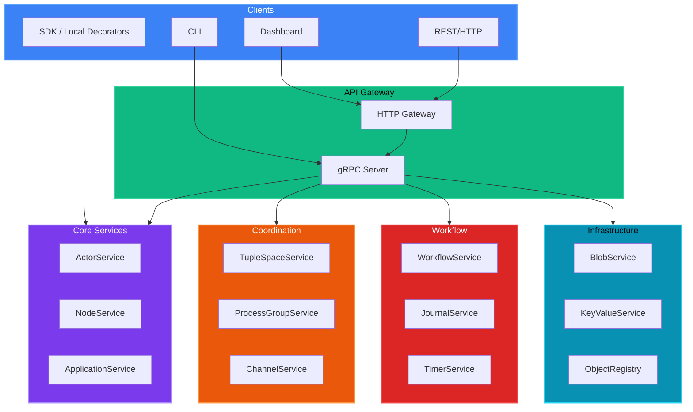

# PlexSpaces Services Reference

This document provides detailed documentation for all PlexSpaces gRPC services and APIs.

## Table of Contents

1. [Overview](#overview)
2. [Built-in and custom components (facets)](#built-in-and-custom-components-facets)
3. [Service links and outbound HTTP](#service-links-and-outbound-http)
4. [Unified discovery with ObjectRegistry](#unified-discovery-with-objectregistry)
5. [Core Services](#core-services)
   - [ActorService](#actorservice)
   - [NodeService](#nodeservice)
   - [ApplicationService](#applicationservice)
6. [Coordination Services](#coordination-services)
   - [TuplePlexSpaceService](#tupleplexspaceservice)
   - [ProcessGroupService](#processgroupservice)
   - [ChannelService](#channelservice)
7. [Workflow Services](#workflow-services)
   - [WorkflowService](#workflowservice)
   - [JournalService](#journalservice)
   - [TimerService](#timerservice)
8. [Infrastructure Services](#infrastructure-services)
   - [BlobService](#blobservice)
   - [KeyValueService](#keyvalueservice)
   - [ObjectRegistry](#objectregistry)
9. [Operational Services](#operational-services)
   - [MetricsService](#metricsservice)
   - [DashboardService](#dashboardservice)
   - [SchedulingService](#schedulingservice)
   - [SecurityService](#securityservice)
10. [Runtime Services](#runtime-services)
   - [WasmRuntimeService](#wasmruntimeservice)
   - [FirecrackerVmService](#firecrackerervmservice)
   - [PoolService](#poolservice)
11. [API Access](#api-access)

---

## Overview

PlexSpaces exposes remote functionality through gRPC services, with optional REST/HTTP gateway support via grpc-gateway annotations. The service layer is intentionally thin: framework behavior lives in the core crates and services translate HTTP/gRPC requests into calls on those shared implementations. All services follow these principles:

- **Proto-First Design**: All contracts defined in Protocol Buffers
- **Tenant Isolation**: All operations require `RequestContext` with tenant/namespace
- **Observability**: Built-in metrics, tracing, and health checks
- **Security**: mTLS support with configurable authentication
- **Thin Controllers**: gRPC/HTTP layers orchestrate request handling and delegate business behavior to the framework crates and ServiceLocator-registered services

**Application deploy** validates `ApplicationSpec.required_service_links` against the node `RuntimeConfig.service_links` catalog. Optional `publish_to_registry` registers link metadata as `ObjectTypeService` for discovery. Internal engineering notes (binding lifecycle, WIT phases, tradeoffs) live in [archived_docs/component-services-design.md](../archived_docs/component-services-design.md); the **implementation roadmap** is [archived_docs/component-services-roadmap.md](../archived_docs/component-services-roadmap.md). Full configuration, examples, and the unified model with facets are covered in [Built-in and custom components (facets)](#built-in-and-custom-components-facets), [Service links and outbound HTTP](#service-links-and-outbound-http), and [Unified discovery with ObjectRegistry](#unified-discovery-with-objectregistry) below.

### Service Architecture



---

## Built-in and custom components (facets)

In PlexSpaces, **components** attached to actors are **facets**: pluggable behavior (timers, durability, virtual-actor pooling, logging, custom factories) composed at spawn or from `app-config.toml`. There is **one** registration path for facet types—the node **`FacetRegistry`**—not a parallel “component registry.”

### Built-in facet types (node startup)

The node registers factories such as:

| Facet type string | Role |
|-------------------|------|
| `timer` | Delayed `send_after` / timer facet |
| `reminder` | Recurring reminders |
| `durability` | Journaling / checkpoints |
| `virtual_actor` | Idle timeout, pool size, activation strategy |
| `logging` | Structured logging facet |
| `caching` | Caching facet |
| `metrics` | Metrics facet |
| `event_sourcing` | Event-sourcing facet |

Registration happens during `ServiceLocator` / node bootstrap (see `crates/services/src/service_locator.rs` and `plexspaces_facet::FacetRegistry`). WASM and native apps **only reference** these names in configuration; they do not register builtins at runtime.

### Declaring facets on actors (`app-config.toml`)

Each child actor under `[supervisor]` lists facets with `type` (must match a registered factory), `priority`, and optional `config`:

```toml
[[supervisor.children]]
id = "worker"
behavior_kind = "GenServer"
facets = [
  { type = "virtual_actor", priority = 100, config = { idle_timeout = "10m", activation_strategy = "lazy" } },
  { type = "timer", priority = 80, config = {} },
  { type = "durability", priority = 90, config = { checkpoint_interval = 100 } },
]
```

### Custom facet factories

To add a **custom** component:

1. Implement `FacetFactory` in Rust (`plexspaces_facet` crate) for your behavior.
2. Register it on the node’s `FacetRegistry` under a unique type name at startup (same integration layer as built-ins).
3. Use `type = "your_type"` in `app-config.toml` or equivalent proto `FacetConfig`.

Custom facets follow the same lifecycle and supervision rules as built-ins; the difference is only **who registered the factory**.

### Examples (by language)

| Language | Example path | What it shows |
|----------|--------------|----------------|
| Rust WASM | `examples/rust/apps/calculator/` | GenServer WASM, `virtual_actor`, `durability`, WIT embed |
| Rust WASM | `examples/rust/apps/abstractions/` | Multiple child specs, timer, reminder, workflow/event patterns, KV / tuple space / blob / process groups |
| Python WASM | `examples/python/apps/calculator/` | SDK decorators, same facet model in `app-config.toml` |
| TypeScript WASM | `examples/typescript/apps/bank_account/` | Durable actor, WIT / jco pipeline |
| Go WASM | `examples/go/apps/abstractions/` | GenServer / workflow / event actors, host surface parity |

**Service links + weather actor examples:** `examples/{rust,python,typescript,go}/apps/weather_actor/` demonstrate end-to-end outbound HTTP service links with KV caching. See [examples/README.md](../examples/README.md).

### WASM host “services” vs facets

Polyglot actors call **host functions** defined in `wit/plexspaces-actor/world.wit` (import `host`). Those calls are implemented on the node using `ServiceLocator` (KV, tuple space, locks, blob, messaging, shard groups, etc.). That is the **supported** way to reach framework services from a guest—**not** ad-hoc HTTP clients inside the SDK that duplicate node policy. See [Polyglot WASM development](polyglot.md).

---

## Service links and outbound HTTP

**Service links** map a logical name (for example `payments-api`) to an external **HTTP** origin, optional auth via **environment variable** names, and shared **resilience** policy (connect/request timeouts, retries with jitter, circuit breaker). They are declared in **`RuntimeConfig`** and can be **required** per application in **`ApplicationSpec`**.

### Protocol buffers

| Artifact | Location |
|----------|----------|
| `ServiceLinkConfig`, `ClientTransportPolicy`, `HttpRetryPolicy`, `OutboundTransport` | `proto/plexspaces/v1/node/outbound.proto` |
| `RuntimeConfig.service_links`, `default_outbound_client_policy`, `outbound_policy_templates` | `proto/plexspaces/v1/node/release.proto` |
| `ApplicationServiceLinkRequirement`, `ApplicationSpec.required_service_links` | `proto/plexspaces/v1/application/application.proto` |

`ObjectRegistration.grpc_address` is the **primary URI** for the endpoint (HTTP(S) base URL today; gRPC transport enum exists for future channel support).

### Operator configuration (`release.toml`)

The release TOML parser (`plexspaces_common::release_parser`) supports:

```toml
[[runtime.service_links]]
name = "httpbin-echo"
transport = "HTTP"
base_url = "https://httpbin.org"
publish_to_registry = false

[[applications]]
name = "my-app"
# ... other required application fields ...

[[applications.required_service_links]]
link_name = "httpbin-echo"
# optional: policy_template = "fast"
```

Copy-ready fragment: [`examples/runtime-service-links.fragment.toml`](../examples/runtime-service-links.fragment.toml).

### Deploy-time validation

When `ApplicationSpec.required_service_links` is non-empty, deploy merges the app spec with the node’s `RuntimeConfig` and runs `plexspaces_http_client::validate_application_service_links`: each `link_name` must exist in `service_links`, and any `policy_template` must exist in `outbound_policy_templates`.

### Runtime implementation (Rust)

| Layer | Responsibility |
|-------|----------------|
| `plexspaces_actor::OutboundHttpClient` | Trait, request/response types, errors |
| `plexspaces_http_client::ResilientOutboundHttpClient` | reqwest, retries (idempotent methods by default), per-link circuit breaker, metrics, tracing |
| `ServiceLocator` | Register / lookup outbound client after `RuntimeConfig` is loaded |

Secrets must **not** be inlined in proto: use `api_key_env_var`, `bearer_token_env_var`, and optional `api_key_header_name` only.

### ServiceLinkService — runtime management

**Proto**: `proto/plexspaces/v1/node/outbound.proto`
**Implementation**: `crates/services/src/service_link_service.rs`

`ServiceLinkService` manages service links at runtime without restarting the node. Links in `RuntimeConfig.service_links` are registered at startup; this service adds, replaces, removes, and queries them dynamically. Each mutating call rebuilds and re-registers the `ResilientOutboundHttpClient` in `ServiceLocator`.

#### RPCs

| Method | HTTP | Description |
|--------|------|-------------|
| `AddServiceLink` | `POST /v1/service-links` | Add or replace a named link; rebuilds OutboundHttpClient |
| `RemoveServiceLink` | `DELETE /v1/service-links/{name}` | Remove link by name; rebuilds OutboundHttpClient |
| `GetServiceLink` | `GET /v1/service-links/{name}` | Retrieve a single link by name |
| `ListServiceLinks` | `GET /v1/service-links` | Paginated list of all registered links |

#### Example

```bash
# Add a new service link at runtime
grpcurl -plaintext -d '{"link":{"name":"weather-api","transport":"OUTBOUND_TRANSPORT_HTTP","base_url":"https://api.open-meteo.com"}}' \
    localhost:8091 plexspaces.node.v1.ServiceLinkService/AddServiceLink

# List registered service links
grpcurl -plaintext localhost:8091 plexspaces.node.v1.ServiceLinkService/ListServiceLinks
```

### WASM actor host function

WASM actors call outbound HTTP via the `http-fetch` host function defined in `wit/plexspaces-actor/world.wit`:

```wit
// Execute outbound HTTP request via named service link.
http-fetch: func(link-name: string, method: string, path-and-query: string,
                 request: list<u8>) -> result<list<u8>, actor-error>;
```

The request/response payloads use protobuf `plexspaces.wasm.v1.HttpFetchRequest` and `HttpFetchResponse`. The host resolves `link-name` against the `OutboundHttpClient` registered in `ServiceLocator`; retries, circuit breaking, and auth injection happen transparently. See the [weather actor examples](#weather-actor-examples-service-link--kv-cache) for all four languages.

### Weather actor examples (service link + KV cache)

End-to-end examples demonstrating outbound HTTP via a named service link combined with KV-based caching. Each example has contract tests (no live node required).

| Language | Location | Contract tests |
|----------|----------|----------------|
| Rust | `examples/rust/apps/weather_actor/` | `cargo test --lib` (5 tests) |
| Python | `examples/python/apps/weather_actor/` | `python test_weather_actor.py` (5 tests) |
| TypeScript | `examples/typescript/apps/weather_actor/` | `node --test` (7 tests) |
| Go | `examples/go/apps/weather_actor/` | `go test ./...` (8 tests) |

All examples:
- Call `http-fetch("weather-api", "GET", "/v1/forecast?...")` via the SDK `ServiceHttpClient`
- Cache the result in KV with a 5-minute TTL (`kv_get` / `kv_put`)
- Declare `[[applications.required_service_links]]` with `name = "weather-api"` in `app-config.toml`
- Include `build.sh` and `test.sh` (with `--e2e` flag for live node integration)

### Outbound gRPC by link (planned)

`OutboundTransport::GRPC` exists in proto; exposing a pooled gRPC channel per link through `ServiceLocator` is **not** yet the same maturity as HTTP—implementations should follow internal node client patterns (`crates/node/src/grpc_client.rs`).

---

## Unified discovery with ObjectRegistry

Use a **single** mental model:

- **Facets** → configured by name on actors; factories live in **`FacetRegistry`** (built-in at startup, custom via node integration).
- **External HTTP endpoints** → configured as **`RuntimeConfig.service_links`**; optional **`publish_to_registry`** exposes them as **`ObjectTypeService`** rows for discovery.
- **Applications, actors, nodes, workflows, tuple spaces** → registered and discovered through the same **ObjectRegistry** API (`Register`, `Lookup`, `Discover`, …).

### `ObjectTypeService` rows for published links

If `ServiceLinkConfig.publish_to_registry` is `true`, the node registers a service object with:

| Field | Typical value |
|-------|----------------|
| `object_id` | `service-link:{link_name}@{node_id}` |
| `grpc_address` | Link `base_url` |
| `object_category` | `outbound-service-link` |
| `capabilities` | `http` or `grpc` according to transport |
| `metadata.labels` | `plexspaces.link_name`, `plexspaces.transport` |

Static catalog registrations for links use tenant **`plexspaces`** and namespace **`runtime`** so they are distinguishable from application-scoped registry traffic.

### gRPC surface

Clients use **`ObjectRegistry`** as documented in [Infrastructure Services — ObjectRegistry](#objectregistry). Filter by `ObjectType`, category, capabilities, or labels consistent with your deployment’s metadata conventions.

---

## Core Services

### ActorService

**Proto**: `proto/plexspaces/v1/actors/actor_runtime.proto`

The ActorService provides comprehensive actor lifecycle management, messaging, and coordination.

#### RPCs

| Method | Description | Request | Response |
|--------|-------------|---------|----------|
| `CreateActor` | Create a new actor | `CreateActorRequest` | `CreateActorResponse` |
| `GetActor` | Get actor state and metadata | `GetActorRequest` | `GetActorResponse` |
| `DeleteActor` | Delete/stop an actor | `DeleteActorRequest` | `DeleteActorResponse` |
| `SendMessage` | HTTP-style tell to actor (fire-and-forget) | `SendMessageRequest` | `SendMessageResponse` |
| `AskReply` | HTTP-style ask to actor (request-reply) | `AskReplyRequest` | `AskReplyResponse` |
| `LinkActor` | Create Erlang-style link | `LinkActorRequest` | `LinkActorResponse` |
| `UnlinkActor` | Remove link | `UnlinkActorRequest` | `UnlinkActorResponse` |
| `MonitorActor` | Monitor actor lifecycle | `MonitorActorRequest` | `MonitorActorResponse` |
| `DemonitorActor` | Remove monitor | `DemonitorActorRequest` | `DemonitorActorResponse` |
| `ListActors` | List actors with filtering | `ListActorsRequest` | `ListActorsResponse` |
| `StreamActors` | Stream actor updates | `StreamActorsRequest` | `stream Actor` |

#### FaaS-Style Invocation

The actor runtime exposes separate RPCs for ask and tell semantics:

- **`AskReply`** handles request-reply over `GET /api/v1/actors/{namespace}/{actor_type}`, `GET /api/v1/actors/{namespace}/{actor_type}/ask`, and `POST`/`PUT` on the `/ask` path.
- **`SendMessage`** handles fire-and-forget delivery over `POST`/`PUT /api/v1/actors/{namespace}/{actor_type}`.
- When authentication is enabled, `tenant_id` is derived from the JWT and is not part of the actor HTTP path.
- `GET` is not supported for `SendMessage`.

```
GET  /api/v1/actors/{namespace}/{actor_type}         - AskReply
GET  /api/v1/actors/{namespace}/{actor_type}/ask     - AskReply
POST /api/v1/actors/{namespace}/{actor_type}         - SendMessage
PUT  /api/v1/actors/{namespace}/{actor_type}         - SendMessage
POST /api/v1/actors/{namespace}/{actor_type}/ask     - AskReply
PUT  /api/v1/actors/{namespace}/{actor_type}/ask     - AskReply
```

### NodeService

**Proto**: `proto/plexspaces/v1/node/node.proto`

Node management, cluster operations, and health monitoring.

#### RPCs

| Method | Description | Request | Response |
|--------|-------------|---------|----------|
| `GetReleaseSpec` | Get node configuration (secrets masked) | `GetReleaseSpecRequest` | `GetReleaseSpecResponse` |
| `RegisterNodes` | Register multiple nodes (batch) | `RegisterNodesRequest` | `RegisterNodesResponse` |
| `UnregisterNode` | Remove node from cluster | `UnregisterNodeRequest` | `UnregisterNodeResponse` |
| `ListConnectedNodes` | Paginated node list | `ListConnectedNodesRequest` | `ListConnectedNodesResponse` |
| `StreamConnectedNodes` | Stream for large clusters | `StreamConnectedNodesRequest` | `stream Node` |
| `GetMetrics` | Node CPU, memory, operational metrics | `GetMetricsRequest` | `NodeMetrics` |
| `CalculateCapacity` | Resource capacity calculation | `CalculateCapacityRequest` | `NodeCapacity` |
| `ListNodeApplications` | Applications on node | `ListNodeApplicationsRequest` | `ListNodeApplicationsResponse` |
| `GetHealth` | Node health status | `GetHealthRequest` | `GetHealthResponse` |
| `SendHeartbeat` | Heartbeat with capacity info | `SendHeartbeatRequest` | `SendHeartbeatResponse` |
| `ConnectNodes` | Connect to remote nodes (Erlang-style net_adm:ping) | `ConnectNodesRequest` | `ConnectNodesResponse` |
| `DisconnectNodes` | Disconnect from nodes | `DisconnectNodesRequest` | `DisconnectNodesResponse` |
| `Ping` | SWIM protocol ping for failure detection | `PingRequest` | `PingResponse` |

#### Node connectivity and seed nodes

**Where it lives**: Node connectivity is implemented and owned by **NodeServiceImpl**, not by ServiceLocator. The node creates `NodeServiceImpl`, registers itself as the connectivity instance via `register_node_connectivity(self)`, and passes it into **ApplicationServiceImpl** at construction so that application deploy can connect to `ApplicationSpec.seed_nodes`.

**Automatic connection**:

- **Node startup**: When the node starts, it connects to all addresses in `ReleaseSpec.node.cluster_seed_nodes` using `NodeServiceImpl::connect_to_node_addresses`. This runs after the gRPC server is up.
- **Application deploy**: When an application is deployed with `ApplicationSpec.seed_nodes` set, the deploy path uses the injected `NodeConnectivity` (the same NodeServiceImpl) to call `connect_to_node_addresses(seed_nodes)` so the node registry is populated before the app runs.
- **Seed-node registration model**: `connect_to_node_addresses` registers seed addresses synchronously in the node registry. SWIM direct ping then reconciles placeholder node IDs to the remote node's reported identity and updates the heartbeat timestamp. Cluster mismatches are removed during that reconciliation step.
- **Source of truth**: when shared DB mode is enabled, `NodeRegistry` treats `ObjectRegistry` as authoritative and only returns nodes from the same cluster whose `last_heartbeat` or `updated_at` is within the configured active-node window (default: 24 hours). SWIM supplements this with faster liveness updates but does not replace the backing-store view.
- **Context ownership**: node-registry uses system-owned request context for membership reads and writes so user tenant/namespace context cannot leak into cluster membership state.
- **Cluster labels**: node registrations persist cluster and placement labels in object metadata, and node-registry reconstructs `NodeRegistration.capabilities` from those metadata labels when it reads membership back from object-registry.
- **Environment override**: `plexspaces_common::config_manager::initialize` sets `ReleaseSpec.node.cluster_name` from `PLEXSPACES_CLUSTER_NAME` when that variable is set and non-empty (same precedence as other `PLEXSPACES_*` overrides). Use the same value on every node in a multinode deployment so `ListConnectedNodes` and `from_registry` placement see a consistent cluster label.

**Connect timeout**: For `connect_to_node_addresses` (and when the trait method is called with no timeout), the timeout is **1 second per address**, with a **minimum of 5 seconds** and **maximum of 5 minutes**. Explicit timeout on the gRPC `ConnectNodes` request is unchanged.

**Cluster matching**: NodeServiceImpl is constructed with a **local cluster name** (`local_cluster`): from `ReleaseSpec.node.cluster_name` when using `with_release_spec`, or empty when using `new()`. When connecting to an address by ping, the node is **registered only if** the remote node’s cluster (from the ping response) matches the effective local cluster (from release spec or `local_cluster`). If both are non-empty and different, the connection is rejected and not added to the registry.

**Already-registered check**: Before pinging, the node service checks whether an address or node ID is already registered (by node_id via `NodeRegistry::lookup_node`, or by exact address match via listing and comparing `node_address`). Already-registered entries are skipped. Address matching is **exact** (no scheme normalization).

#### Health-Aware Connection

The SDK provides `NodeClient` with production-grade health-aware connection:

- **Liveness Checks**: Uses `SystemService.liveness_probe()` before connecting
- **Readiness Checks**: Uses `SystemService.readiness_probe()` after connecting
- **Exponential Backoff**: Retry with jitter (prevents thundering herd)
- **Parallel Health Checks**: Efficient multi-node connection
- **Graceful Degradation**: Handles partial success gracefully

**SDK Usage**:
```rust
use plexspaces_sdk::NodeClient;

// Health-aware connection (checks liveness, waits for readiness)
let mut node_client = NodeClient::connect("http://localhost:8000").await?;

// Connect multiple nodes with health checks
let resp = node_client.connect_nodes(
    vec!["http://localhost:8092".to_string()],
    None,
    30,
).await?;
```

See [SDK Documentation](sdk.md#node-connectivity-health-aware-connection) for details.

#### Security Features

- `GetReleaseSpec` automatically masks sensitive fields (passwords, API keys, tokens)
- All operations require valid `RequestContext` with tenant isolation

### ApplicationService

**Proto**: `proto/plexspaces/v1/application/application.proto`

Application lifecycle management and deployment.

#### RPCs

| Method | Description | Request | Response |
|--------|-------------|---------|----------|
| `DeployApplication` | Deploy application to node | `DeployApplicationRequest` | `DeployApplicationResponse` |
| `UndeployApplication` | Remove application | `UndeployApplicationRequest` | `UndeployApplicationResponse` |
| `GetApplicationStatus` | Get deployment status | `GetApplicationStatusRequest` | `GetApplicationStatusResponse` |
| `ListApplications` | List all applications | `ListApplicationsRequest` | `ListApplicationsResponse` |
| `StartApplication` | Start stopped application | `StartApplicationRequest` | `StartApplicationResponse` |
| `StopApplication` | Stop running application | `StopApplicationRequest` | `StopApplicationResponse` |
| `RestartApplication` | Restart application | `RestartApplicationRequest` | `RestartApplicationResponse` |
| `GetApplicationLogs` | Stream application logs | `GetApplicationLogsRequest` | `stream LogEntry` |

**Listing from clients**: Use gRPC `ListApplications` (for example `plexspaces list --node <gRPC host:port> --json`). Proto `google.api.http` on this RPC feeds generated OpenAPI (`make proto-openapi` → `docs/openapi.json`) and gateway-style tooling; the embedded node’s Axum gateway wires deploy/undeploy (and related) HTTP routes, not a separate list handler—list flows go through gRPC or the CLI.

---

## Coordination Services

### TuplePlexSpaceService

**Proto**: `proto/plexspaces/v1/tuplespace/tuplespace.proto`

Linda-style TupleSpace coordination for decoupled communication.

#### RPCs

| Method | Description | Request | Response |
|--------|-------------|---------|----------|
| `Write` | Write tuple to space | `WriteRequest` | `WriteResponse` |
| `Read` | Read tuple (blocking) | `ReadRequest` | `ReadResponse` |
| `Take` | Take tuple (blocking, removes) | `TakeRequest` | `TakeResponse` |
| `ReadIfExists` | Non-blocking read | `ReadIfExistsRequest` | `ReadIfExistsResponse` |
| `TakeIfExists` | Non-blocking take | `TakeIfExistsRequest` | `TakeIfExistsResponse` |
| `Scan` | Scan tuples matching pattern | `ScanRequest` | `ScanResponse` |
| `Count` | Count matching tuples | `CountRequest` | `CountResponse` |
| `Subscribe` | Subscribe to tuple events | `SubscribeRequest` | `stream TupleEvent` |

#### Coordination Patterns

- **Spatial Decoupling**: Actors don't need to know each other
- **Temporal Decoupling**: Actors don't need to be active simultaneously
- **Pattern Matching**: Flexible tuple retrieval with wildcards

### ProcessGroupService

**Proto**: `proto/plexspaces/v1/process_groups/process_groups.proto`

OTP-style process groups for group communication.

#### RPCs

| Method | Description | Request | Response |
|--------|-------------|---------|----------|
| `CreateGroup` | Create process group | `CreateGroupRequest` | `CreateGroupResponse` |
| `DeleteGroup` | Delete group | `DeleteGroupRequest` | `DeleteGroupResponse` |
| `JoinGroup` | Add actor to group | `JoinGroupRequest` | `JoinGroupResponse` |
| `LeaveGroup` | Remove actor from group | `LeaveGroupRequest` | `LeaveGroupResponse` |
| `GetGroupMembers` | List group members | `GetGroupMembersRequest` | `GetGroupMembersResponse` |
| `BroadcastToGroup` | Send to all members | `BroadcastToGroupRequest` | `BroadcastToGroupResponse` |
| `ListGroups` | List all groups | `ListGroupsRequest` | `ListGroupsResponse` |

### ChannelService

**Proto**: `proto/plexspaces/v1/channel/channel.proto`

Queue and topic messaging with multiple backends.

#### RPCs

| Method | Description | Request | Response |
|--------|-------------|---------|----------|
| `CreateChannel` | Create channel | `CreateChannelRequest` | `CreateChannelResponse` |
| `DeleteChannel` | Delete channel | `DeleteChannelRequest` | `DeleteChannelResponse` |
| `Publish` | Publish message | `PublishRequest` | `PublishResponse` |
| `Subscribe` | Subscribe to channel | `SubscribeRequest` | `stream ChannelMessage` |
| `Acknowledge` | Acknowledge message | `AcknowledgeRequest` | `AcknowledgeResponse` |
| `GetChannelStats` | Get channel statistics | `GetChannelStatsRequest` | `GetChannelStatsResponse` |

#### Supported Backends

- **InMemory**: Local development, single-node
- **Redis**: Distributed, pub/sub
- **Kafka**: High-throughput streaming
- **NATS**: Lightweight messaging
- **SQS**: AWS managed queues
- **UDP Multicast**: Cluster-wide low-latency

---

## Workflow Services

### WorkflowService

**Proto**: `proto/plexspaces/v1/workflow/workflow.proto`

Temporal-style durable workflow orchestration.

#### RPCs

| Method | Description | Request | Response |
|--------|-------------|---------|----------|
| `StartWorkflow` | Start new workflow | `StartWorkflowRequest` | `StartWorkflowResponse` |
| `GetWorkflowStatus` | Get workflow state | `GetWorkflowStatusRequest` | `GetWorkflowStatusResponse` |
| `CancelWorkflow` | Cancel running workflow | `CancelWorkflowRequest` | `CancelWorkflowResponse` |
| `TerminateWorkflow` | Force terminate | `TerminateWorkflowRequest` | `TerminateWorkflowResponse` |
| `SignalWorkflow` | Send signal to workflow | `SignalWorkflowRequest` | `SignalWorkflowResponse` |
| `QueryWorkflow` | Query workflow state | `QueryWorkflowRequest` | `QueryWorkflowResponse` |
| `ListWorkflows` | List workflows | `ListWorkflowsRequest` | `ListWorkflowsResponse` |
| `GetWorkflowHistory` | Get execution history | `GetWorkflowHistoryRequest` | `GetWorkflowHistoryResponse` |

### JournalService

**Proto**: `proto/plexspaces/v1/journaling/journaling.proto`

Event sourcing and replay for durable execution.

#### RPCs

| Method | Description | Request | Response |
|--------|-------------|---------|----------|
| `AppendEntry` | Append journal entry | `AppendEntryRequest` | `AppendEntryResponse` |
| `ReadEntries` | Read journal entries | `ReadEntriesRequest` | `ReadEntriesResponse` |
| `GetLatestCheckpoint` | Get checkpoint | `GetLatestCheckpointRequest` | `GetLatestCheckpointResponse` |
| `CreateCheckpoint` | Create checkpoint | `CreateCheckpointRequest` | `CreateCheckpointResponse` |
| `TruncateJournal` | Truncate old entries | `TruncateJournalRequest` | `TruncateJournalResponse` |

### TimerService

**Proto**: `proto/plexspaces/v1/journaling/timer.proto`

Durable timers and reminders.

#### RPCs

| Method | Description | Request | Response |
|--------|-------------|---------|----------|
| `CreateTimer` | Create one-shot timer | `CreateTimerRequest` | `CreateTimerResponse` |
| `CreateReminder` | Create recurring reminder | `CreateReminderRequest` | `CreateReminderResponse` |
| `CancelTimer` | Cancel timer | `CancelTimerRequest` | `CancelTimerResponse` |
| `GetTimerStatus` | Get timer status | `GetTimerStatusRequest` | `GetTimerStatusResponse` |
| `ListTimers` | List actor timers | `ListTimersRequest` | `ListTimersResponse` |

---

## Infrastructure Services

### BlobService

**Proto**: `proto/plexspaces/v1/storage/blob.proto`

Binary large object storage with streaming support.

#### RPCs

| Method | Description | Request | Response |
|--------|-------------|---------|----------|
| `Upload` | Upload blob | `UploadRequest` | `UploadResponse` |
| `Download` | Download blob | `DownloadRequest` | `DownloadResponse` |
| `Delete` | Delete blob | `DeleteRequest` | `DeleteResponse` |
| `GetMetadata` | Get blob metadata | `GetMetadataRequest` | `GetMetadataResponse` |
| `ListBlobs` | List blobs | `ListBlobsRequest` | `ListBlobsResponse` |
| `StreamUpload` | Streaming upload | `stream UploadChunk` | `UploadResponse` |
| `StreamDownload` | Streaming download | `DownloadRequest` | `stream DownloadChunk` |

#### Supported Backends

- **Local**: File system storage
- **S3**: AWS S3 / S3-compatible (embedded object store)
- **GCS**: Google Cloud Storage
- **Azure**: Azure Blob Storage

### KeyValueService

**Proto**: `proto/plexspaces/v1/keyvalue/keyvalue.proto`

Multi-backend key-value storage for actor state, configuration, registries, leases, and metrics.

#### Architecture

The KeyValueStore has a layered trait design:

- **`plexspaces_common::KeyValueStore`**: Base trait for actors, facets, and WASM host (CRUD + TTL + CAS + increment). Defined in `common` crate to avoid circular dependencies.
- **`plexspaces_keyvalue::KeyValueStore`**: Extended trait for backend implementations (adds watch, multi_get, stats). Defined in the `keyvalue` crate.
- **`plexspaces_actor`** re-exports the base trait from `common` for convenience.

Backends: SQLite (`:memory:` or file), PostgreSQL, Redis, DynamoDB, S3/Blob (all via feature flags).

#### RPCs

| Method | Description | Request | Response |
|--------|-------------|---------|----------|
| `Get` | Get value | `GetRequest` | `GetResponse` |
| `Put` | Put value | `PutRequest` | `PutResponse` |
| `Delete` | Delete key | `DeleteRequest` | `DeleteResponse` |
| `Exists` | Check if key exists | `ExistsRequest` | `ExistsResponse` |
| `List` | List keys with prefix | `ListRequest` | `ListResponse` |
| `MultiGet` | Batch get | `MultiGetRequest` | `MultiGetResponse` |
| `MultiPut` | Batch put | `MultiPutRequest` | `MultiPutResponse` |
| `PutWithTtl` | Put with TTL | `PutWithTtlRequest` | `PutWithTtlResponse` |
| `Cas` | Compare-and-swap | `CasRequest` | `CasResponse` |
| `Increment` | Atomic increment | `IncrementRequest` | `IncrementResponse` |

### ObjectRegistry

**Proto**: `proto/plexspaces/v1/registry/object_registry.proto`

Distributed object registry for **unified discovery**: actors, tuple spaces, applications, workflows, nodes, and **published outbound service links** (`ObjectTypeService` when `ServiceLinkConfig.publish_to_registry` is true). See [Unified discovery with ObjectRegistry](#unified-discovery-with-objectregistry) for link metadata labels and conventions.

#### RPCs

| Method | Description | Request | Response |
|--------|-------------|---------|----------|
| `Register` | Register object | `RegisterRequest` | `RegisterResponse` |
| `Unregister` | Unregister object | `UnregisterRequest` | `UnregisterResponse` |
| `Lookup` | Lookup object | `LookupRequest` | `LookupResponse` |
| `List` | List objects | `ListRequest` | `ListResponse` |
| `Watch` | Watch for changes | `WatchRequest` | `stream WatchEvent` |

---

## Operational Services

### MetricsService

**Proto**: `proto/plexspaces/v1/metrics/metrics.proto`

Unified Prometheus-oriented metrics: in-process `metrics` macros, export via `ExportPrometheus`, and typed R.E.D. recording RPCs. `plexspaces_services::metrics_service::install_metrics_recorder()` installs the process-wide Prometheus recorder and runs early during `ServiceLocator` initialization (see [Metrics and Prometheus export](metrics.md)).

#### RPCs

| Method | Description | Request | Response |
|--------|-------------|---------|----------|
| `ExportPrometheus` | Prometheus text exposition | `ExportPrometheusRequest` | `ExportPrometheusResponse` |
| `GetMetrics` | Structured metric values | `GetMetricsRequest` | `GetMetricsResponse` |
| `ListMetricDefinitions` | Registered metric definitions | `ListMetricDefinitionsRequest` | `ListMetricDefinitionsResponse` |
| `RecordMetric` | Manual counter/gauge/histogram | `RecordMetricRequest` | `plexspaces.common.v1.Empty` |
| `RecordMessageRouting` | R.E.D. for routing (namespace labels) | `RecordMessageRoutingRequest` | `plexspaces.common.v1.Empty` |
| `RecordActorActivation` | R.E.D. for activation | `RecordActorActivationRequest` | `plexspaces.common.v1.Empty` |
| `RecordChannelMetrics` | R.E.D. for channel operations | `RecordChannelMetricsRequest` | `plexspaces.common.v1.Empty` |

### DashboardService

**Proto**: `proto/plexspaces/v1/dashboard/dashboard.proto`

Dashboard and monitoring UI backend.

#### RPCs

| Method | Description | Request | Response |
|--------|-------------|---------|----------|
| `GetClusterOverview` | Cluster summary | `GetClusterOverviewRequest` | `ClusterOverview` |
| `GetNodeDetails` | Node details | `GetNodeDetailsRequest` | `NodeDetails` |
| `GetActorDetails` | Actor details | `GetActorDetailsRequest` | `ActorDetails` |
| `GetSystemHealth` | System health | `GetSystemHealthRequest` | `SystemHealth` |

### SchedulingService

**Proto**: `proto/plexspaces/v1/scheduling/scheduling.proto`

Resource-aware actor scheduling and placement.

#### RPCs

| Method | Description | Request | Response |
|--------|-------------|---------|----------|
| `ScheduleActor` | Schedule actor placement | `ScheduleActorRequest` | `ScheduleActorResponse` |
| `GetPlacement` | Get current placement | `GetPlacementRequest` | `GetPlacementResponse` |
| `RebalanceCluster` | Trigger rebalancing | `RebalanceClusterRequest` | `RebalanceClusterResponse` |

### SecurityService

**Proto**: `proto/plexspaces/v1/security/security.proto`

Security, authentication, and authorization.

#### RPCs

| Method | Description | Request | Response |
|--------|-------------|---------|----------|
| `ValidateToken` | Validate JWT token | `ValidateTokenRequest` | `ValidateTokenResponse` |
| `RefreshToken` | Refresh token | `RefreshTokenRequest` | `RefreshTokenResponse` |
| `GetPermissions` | Get user permissions | `GetPermissionsRequest` | `GetPermissionsResponse` |
| `CheckPermission` | Check specific permission | `CheckPermissionRequest` | `CheckPermissionResponse` |

---

## Runtime Services

### WasmRuntimeService

**Proto**: `proto/plexspaces/v1/wasm/wasm.proto`

WebAssembly module deployment and execution.

#### RPCs

| Method | Description | Request | Response |
|--------|-------------|---------|----------|
| `LoadModule` | Load WASM module | `LoadModuleRequest` | `LoadModuleResponse` |
| `UnloadModule` | Unload module | `UnloadModuleRequest` | `UnloadModuleResponse` |
| `ListModules` | List loaded modules | `ListModulesRequest` | `ListModulesResponse` |
| `GetModuleInfo` | Get module metadata | `GetModuleInfoRequest` | `GetModuleInfoResponse` |
| `InvokeFunction` | Invoke WASM function | `InvokeFunctionRequest` | `InvokeFunctionResponse` |

### FirecrackerVmService

**Proto**: `proto/plexspaces/v1/firecracker/firecracker.proto`

Firecracker microVM management for strong isolation.

#### RPCs

| Method | Description | Request | Response |
|--------|-------------|---------|----------|
| `CreateVM` | Create microVM | `CreateVMRequest` | `CreateVMResponse` |
| `StartVM` | Start VM | `StartVMRequest` | `StartVMResponse` |
| `StopVM` | Stop VM | `StopVMRequest` | `StopVMResponse` |
| `DestroyVM` | Destroy VM | `DestroyVMRequest` | `DestroyVMResponse` |
| `GetVMStatus` | Get VM status | `GetVMStatusRequest` | `GetVMStatusResponse` |
| `ListVMs` | List all VMs | `ListVMsRequest` | `ListVMsResponse` |

### PoolService

**Proto**: `proto/plexspaces/v1/pool/pool.proto`

Actor pool management for load balancing.

#### RPCs

| Method | Description | Request | Response |
|--------|-------------|---------|----------|
| `CreatePool` | Create actor pool | `CreatePoolRequest` | `CreatePoolResponse` |
| `DeletePool` | Delete pool | `DeletePoolRequest` | `DeletePoolResponse` |
| `GetPoolStatus` | Get pool status | `GetPoolStatusRequest` | `GetPoolStatusResponse` |
| `ResizePool` | Resize pool | `ResizePoolRequest` | `ResizePoolResponse` |
| `RouteToPool` | Route message to pool | `RouteToPoolRequest` | `RouteToPoolResponse` |

---

## API Access

### Interactive API Documentation

Explore the PlexSpaces API interactively using Swagger UI:

[](https://petstore.swagger.io/?url=https://raw.githubusercontent.com/bhatti/PlexSpaces/refs/heads/master/docs/openapi.json)

### gRPC Client

```rust
use plexspaces_proto::actor::v1::actor_service_client::ActorServiceClient;

let mut client = ActorServiceClient::connect("http://localhost:50051").await?;

let request = tonic::Request::new(CreateActorRequest {
    actor_type: "counter".to_string(),
    tenant_id: "my-tenant".to_string(),
    namespace: "default".to_string(),
    ..Default::default()
});

let response = client.create_actor(request).await?;
```

### REST/HTTP Gateway

When HTTP gateway is enabled, all gRPC services are accessible via REST:

```bash
# Create actor via REST
curl -X POST http://localhost:8080/v1/actors \
  -H "Content-Type: application/json" \
  -H "X-Tenant-Id: my-tenant" \
  -d '{"actor_type": "counter", "namespace": "default"}'

# Invoke actor (FaaS-style)
curl -H "Authorization: Bearer $TOKEN" http://localhost:8080/api/v1/actors/default/counter
```

---

## See Also

- [Architecture Overview](architecture.md)
- [Getting Started](getting-started.md)
- [Detailed Design](detailed-design.md)
- [Polyglot WASM development](polyglot.md)
- [SDK guide](sdk.md)
- [Use Cases](use-cases.md)
- WIT interface architecture and Component Model roadmap: [wit-design.md](wit-design.md)
