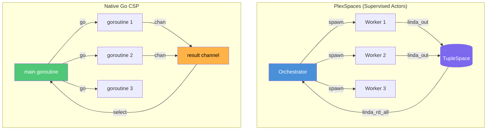

# CSP Structured Concurrency (Go)

Demonstrates structured concurrency for the scatter-gather pattern using two approaches:

1. **PlexSpaces actors** (WASM app) — supervised actors + Linda tuplespace coordination
2. **Native Go CSP** (native/) — goroutines + channels with gotchas and fixes

## Architecture



## Build & Test

```bash
# Build WASM app
./build.sh

# Full test (deploy + test + native gotchas)
./test.sh

# Native Go tests only (no server needed)
cd native && go test -v ./...
```

## Go CSP Gotchas — with Code Examples

All gotchas are demonstrated as runnable tests in `native/gotchas_test.go`.

### Gotcha 1: Goroutine Leak

Spawning goroutines without a cancellation path means they block forever — invisible to GC and Go's deadlock detector (which only fires when *every* goroutine is stuck):

```go
ch := make(chan int)
for i := 0; i < 10; i++ {
    go func(id int) {
        ch <- id // blocks forever — no reader
    }(i)
}
// 10 goroutines leaked permanently — runtime.NumGoroutine() confirms
```

### Gotcha 2: Nil Channel Recv Blocks Forever

A nil channel blocks on receive — no panic, no warning, just a silent hang:

```go
var ch chan int // nil — never initialized
<-ch           // blocks forever, silently
```

### Gotcha 3: Nil Channel Send Blocks Forever

Same from the other direction — sending on nil also hangs:

```go
var ch chan int // nil
ch <- 42       // blocks forever, silently
```

### Gotcha 4: Receive from Closed Returns Zero (no panic)

Receiving from a closed channel returns the zero value immediately with `ok=false` — **asymmetric** with send which panics:

```go
ch := make(chan int, 1)
ch <- 99
close(ch)

v1 := <-ch       // 99 (buffered value)
v2, ok := <-ch   // 0, false — no panic, just zero value
```

### Gotcha 5: Send on Closed Channel Panics

This is unrecoverable — a runtime panic that crashes the goroutine:

```go
ch := make(chan int, 1)
close(ch)
ch <- 42  // PANIC: send on closed channel
```

### Gotcha 6: Buffered vs Unbuffered Breaks Rendezvous

Unbuffered channels enforce CSP-style rendezvous (sender blocks until receiver is ready). Buffered channels break that — sender proceeds without knowing anyone received:

```go
// Unbuffered: sender blocks until receiver takes value
unbuffered := make(chan int)
go func() { unbuffered <- 1 }() // blocks here until receiver ready

// Buffered: sender proceeds immediately (buffer absorbs it)
buffered := make(chan int, 5)
buffered <- 1  // doesn't block — no rendezvous guarantee
buffered <- 2  // still doesn't block
```

### Gotcha 7: Select Non-determinism

When multiple cases are ready, Go's `select` picks randomly — unlike CSP's deterministic external choice:

```go
ch1 := make(chan string, 1)
ch2 := make(chan string, 1)
ch1 <- "A"
ch2 <- "B"

select {
case v := <-ch1: // might get "A"
case v := <-ch2: // might get "B" — random each time
}
```

### The Fix: Structured Concurrency with errgroup

`context.WithTimeout` + `errgroup` provides the structured lifetime Go doesn't give you by default:

```go
ctx, cancel := context.WithTimeout(context.Background(), 100*time.Millisecond)
defer cancel()

g, ctx := errgroup.WithContext(ctx)
for i, lat := range services {
    g.Go(func() error {
        resp, err := simulateService(ctx, i, lat)
        if err != nil { return nil } // cancelled — expected
        mu.Lock()
        results = append(results, resp)
        mu.Unlock()
        return nil
    })
}
_ = g.Wait() // Structured guarantee: ALL goroutines done here
```

## Gotcha Summary Table

| Gotcha | What Happens | CSP Algebra Equivalent |
|--------|-------------|----------------------|
| Goroutine leak | Blocked goroutines run forever, invisible to GC | N/A — CSP processes terminate or deadlock visibly |
| Nil channel recv | Blocks forever silently | N/A — CSP channels are never "nil" |
| Nil channel send | Blocks forever silently | N/A |
| Send on closed | **Runtime panic** — unrecoverable | N/A — CSP has no "close" operation |
| Recv from closed | Returns zero + `ok=false` immediately (**asymmetric** with send) | N/A |
| Buffered vs unbuffered | Breaks rendezvous = breaks formal reasoning | Buffered channels aren't in original CSP |
| Select non-determinism | Random case when multiple ready | CSP external choice (□) is nondeterministic by design |

## References

- [Architecture](../../../../docs/architecture.md)
- [Detailed Design](../../../../docs/detailed-design.md)
- [Getting Started](../../../../docs/getting-started.md)
- [Blog: Structured Concurrency Part III (Go and Rust)](https://shahbhat.medium.com/structured-concurrency-in-modern-programming-languages-part-iii-go-and-rust-cb7ccc52773b)
