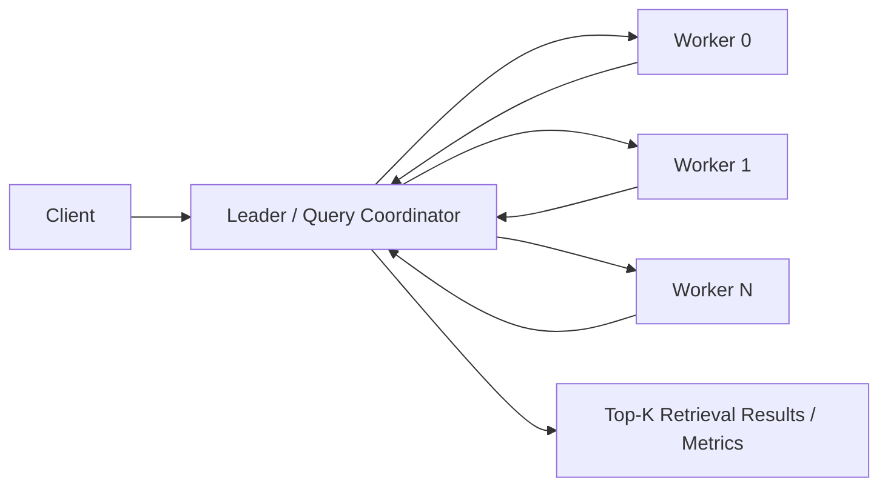
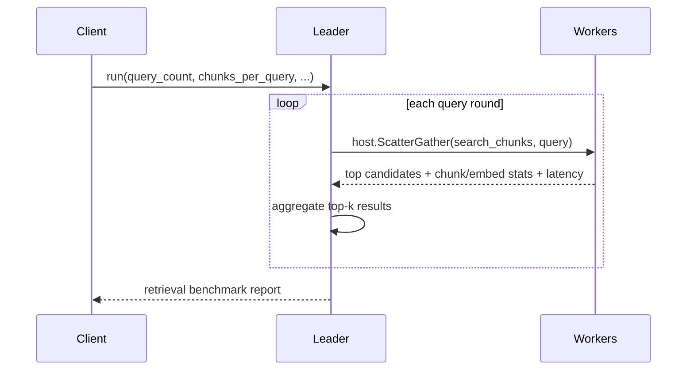

# Data Lake RAG (Go WASM)

Synthetic retrieval-augmented generation benchmark using the Go SDK and the same multinode leader/worker shard-group design as the earlier parameter-server examples.

## Purpose

Show ingest, chunking, embedding, and retrieval across multiple workers with:

- explicit `leader` and `worker` child types
- Go SDK `ActorRouter` for multi-actor routing in one WASM module
- shard-group placement with framework-owned worker actor IDs
- application-metrics-backed per-role and per-node reporting

## Architecture





## Files

- `data_lake_rag_actor.go`: leader and worker actors plus metrics helpers
- `app-config.toml`: reusable `leader` and `worker` child types for shard-group spawning
- `build.sh`: build the Go/TinyGo WASM component
- `test.sh`: deploy to both nodes, render `seed_nodes`, run retrieval, and print benchmark stats

## Quick Start

```bash
cd examples/go/apps/data_lake_rag
./build.sh
./test.sh
```

## Notes

- This is a synthetic RAG benchmark, not a real embedding/vector database integration.
- The leader models ingest/chunking/query orchestration while workers simulate chunk embedding and retrieval scoring.
- Workers write node-local `ApplicationMetrics`, and the leader combines per-node application status deltas into the final report.
