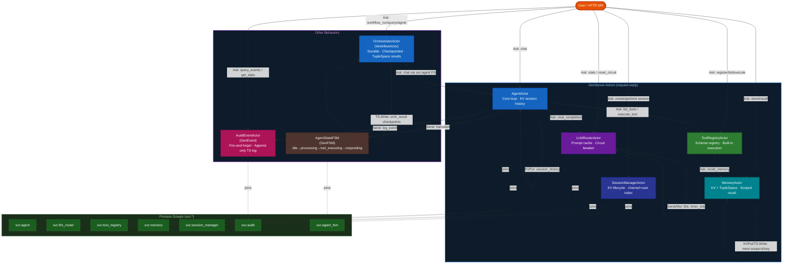

# MiniClaw — Mini Agent Framework on PlexSpaces

MiniClaw demonstrates how PlexSpaces actor primitives power an agentic AI framework
inspired by OpenClaw, NanoClaw, and MicroClaw. It implements 8 actors covering the
core abstractions of any production agent system: LLM routing, tool execution, the
agent loop, session management, multi-agent orchestration, scoped memory, audit
trails, and lifecycle state machines.

## Architecture



<details>
<summary>ASCII fallback</summary>

```
User (HTTP API)
    │
    ├─Ask──→ AgentActor ──Ask──→ LLMRouterActor (chat_completion)
    │              │                     │
    │              │              ←── response (tool_use or end_turn)
    │              │
    │              ├──Ask──→ ToolRegistryActor (execute_tool)
    │              │              │
    │              │              ├── (memory_search) ──Ask──→ MemoryActor
    │              │              │
    │              │              ←── tool output
    │              │
    │              ├──Send─→ AuditEventActor (fire-and-forget)
    │              ├──Send─→ AgentStateFSM  (state transitions)
    │              │
    │              ←── final response to user
    │
    ├──Ask──→ SessionManagerActor (create/get/end session)
    ├──Ask──→ MemoryActor         (store/recall/list)
    ├──Ask──→ OrchestratorActor   (workflow_run → delegates to AgentActor)
    ├──Ask──→ ToolRegistryActor   (register/list/execute tools)
    ├──Ask──→ LLMRouterActor      (stats, reset_circuit)
    └──Ask──→ AuditEventActor     (query_events, stats)
```
</details>

## Actors

| Actor | Behavior | Purpose | PlexSpaces Primitives |
|-------|----------|---------|----------------------|
| `LLMRouterActor` | GenServer | Simulated LLM with prompt caching and circuit breaker | KV (cache), PG (svc:llm_router), SendAfter (timer recovery) |
| `ToolRegistryActor` | GenServer | Tool registration and built-in execution (calculator, weather, memory, web search) | KV (tool defs + tool_names index), PG (svc:tool_registry) |
| `AgentActor` | GenServer | Core agent loop: message → LLM → tool_use → execute → repeat | Ask (LLM + tools), Send (FSM + audit), KV (session history), PG (svc:agent) |
| `SessionManagerActor` | GenServer | Session lifecycle with channel+user mapping | KV (session metadata), PG (svc:session_manager) |
| `OrchestratorActor` | WorkflowActor | Durable multi-agent task decomposition and delegation | Ask (agents), TupleSpace (result coordination), PG (svc:agent) |
| `MemoryActor` | GenServer | Scoped memory (global/agent/session) | KV (persistent), TupleSpace (queryable), PG (svc:memory) |
| `AuditEventActor` | GenEvent | Fire-and-forget audit trail | TupleSpace (audit log), PG (svc:audit) |
| `AgentStateFSM` | GenFSM | Agent processing lifecycle state machine | PG (svc:agent_fsm) |

## Key Patterns Demonstrated

1. **Agent loop** — `AgentActor.chat()` implements the agentic message → LLM → tool → repeat cycle
2. **Tool calling** — `ToolRegistryActor` dispatches to built-in handlers; memory_search delegates via PG
3. **Circuit breaker** — `LLMRouterActor` opens after 3 consecutive failures; auto-recovers via timer
4. **Prompt caching** — LLM responses cached in KV by message hash; hit ratio tracked
5. **Multi-agent orchestration** — `OrchestratorActor.Run()` decomposes tasks and delegates via PG discovery
6. **Session persistence** — conversation history stored in KV per session_id; compacted when over limit
7. **Scoped memory** — `MemoryActor` namespaces by scope (global/agent/session) via KV + TupleSpace
8. **Capability discovery** — all actors join PGs on init; clients call `pgFirst()` for location-transparent routing
9. **Audit trail** — every actor fires events to `AuditEventActor` via `host.Send()` (fire-and-forget)
10. **FSM lifecycle** — `AgentStateFSM` enforces valid state transitions: idle→processing→tool_executing→responding→idle

## PlexSpaces Primitives

| Primitive | How Used in MiniClaw |
|-----------|---------------------|
| `host.Ask()` | Request-reply: agent→LLM, agent→tools, orchestrator→agent |
| `host.Send()` | Fire-and-forget: all actors→audit, agent→FSM state updates |
| `host.SendAfter()` | Delayed timer: LLMRouter circuit recovery check every 30s |
| `host.KVGet/KVPut/KVDelete()` | LLM prompt cache, tool registry, sessions, memory |
| `host.KVList()` | Enumerate tool names via prefix |
| `host.TS().Write/ReadAll()` | Agent info, orchestration results, audit events, memory tuples |
| `host.PG().Join/Members()` | Service discovery: every actor joins a named PG on init |
| `BaseActor` | JSON state serialization for durable checkpointing |
| `WorkflowActor` | Durable `Run()`/`Signal()`/`Query()` for OrchestratorActor |

## Message Flow Example: "What is 42 * 17?"

```
1. User → agent: chat {message: "Please calculate 42 * 17", session_id: "s1"}
2. AgentActor → tool_registry: list_tools {}
   ← [{name: "calculator", ...}, ...]
3. AgentActor → agent_fsm: transition {to: "processing"}
4. AgentActor → llm_router: chat_completion {messages: [...], tools: [...]}
   ← {stop_reason: "tool_use", tool_calls: [{name: "calculator", input: {expression: "42 * 17"}}]}
5. AgentActor appends assistant message to history
6. AgentActor → agent_fsm: transition {to: "tool_executing"}
7. AgentActor → tool_registry: execute_tool {name: "calculator", input: {expression: "42 * 17"}}
   ← {status: "ok", output: {result: 714, expression: "42 * 17"}}
8. AgentActor appends tool result to history
9. AgentActor → audit_event: log_event {event_type: "tool_called", detail: "tool=calculator"}
10. AgentActor → agent_fsm: transition {to: "processing"}
11. AgentActor → llm_router: chat_completion {messages: [...with tool result...], tools: [...]}
    ← {stop_reason: "end_turn", content: "Tool results: calculator: ...result=714..."}
12. AgentActor → agent_fsm: transition {to: "idle"}
13. AgentActor → KV: put session_history:s1
14. User ← {status: "ok", response: "Tool results: calculator: ...result=714...", loop_iterations: 2}
```

## Build & Test

```bash
# Build WASM binary
./build.sh

# Run contract tests (no node required)
go test ./...

# Run integration tests against a live node
./test.sh 8092        # defaults to port 8092
```

**Prerequisites:**
- `tinygo` — `brew tap tinygo-org/tools && brew install tinygo`
- `wasm-tools` — `cargo install wasm-tools`
- `jco` — `npm install -g @bytecodealliance/jco`
- A running PlexSpaces node: `cargo run --release -- --http-port 8092 --cluster-port 8091`

## API Reference

### LLMRouterActor

| Op | Payload | Response |
|----|---------|----------|
| `chat_completion` | `{messages: [...], tools: [...], simulate_failure?: bool}` | `{response: {stop_reason, content, tool_calls}, model, usage, cached}` |
| `reset_circuit` | `{}` | `{status: "ok", circuit_open: false}` |
| `get_stats` | `{}` | `{request_count, total_tokens, cache_hits, circuit_open, consecutive_failures, model}` |

### ToolRegistryActor

| Op | Payload | Response |
|----|---------|----------|
| `register_tool` | `{name, description, input_schema}` | `{status: "ok", tool: name}` |
| `list_tools` | `{}` | `{tools: [...], count}` |
| `execute_tool` | `{name, input: {...}}` | `{status: "ok", tool, output: {...}}` |
| `get_stats` | `{}` | `{tool_count, execution_count}` |

### AgentActor

| Op | Payload | Response |
|----|---------|----------|
| `chat` | `{message, session_id?}` | `{status: "ok", response, session_id, loop_iterations, messages_count}` |
| `set_system_prompt` | `{prompt}` | `{status: "ok"}` |
| `get_history` | `{}` | `{messages: [...], count}` |
| `compact_context` | `{}` | `{status: "ok", messages_count}` |
| `get_capabilities` | `{}` | `{capabilities: [...]}` |

### SessionManagerActor

| Op | Payload | Response |
|----|---------|----------|
| `create_session` | `{channel, user_id, agent_id}` | `{status: "ok", session_id}` |
| `get_session` | `{session_id}` or `{channel, user_id}` | session metadata |
| `end_session` | `{session_id}` | `{status: "ok"}` |
| `list_sessions` | `{}` | `{sessions: [...], count}` |

### OrchestratorActor (WorkflowActor)

| Op | Payload | Response |
|----|---------|----------|
| `workflow_run` | `{task, task_id}` | `{status: "ok", result, sub_results, sub_tasks}` |
| `workflow_signal` | `{name: "cancel"}` | `{ok: true}` |
| `workflow_query` | `{name: "status"}` | `{task_id, status, progress}` |

### MemoryActor

| Op | Payload | Response |
|----|---------|----------|
| `store_memory` | `{scope, scope_id, key, value}` | `{status: "ok", key, scope}` |
| `recall_memory` | `{scope, scope_id, query}` | `{memories: [...], count, query}` |
| `list_memories` | `{scope, scope_id}` | `{memories: [...], count}` |
| `delete_memory` | `{scope, scope_id, key}` | `{status: "ok", key}` |

### AuditEventActor

| Op | Payload | Response |
|----|---------|----------|
| `log_event` | `{event_type, detail}` | `{ok: true}` |
| `query_events` | `{event_type?, limit?}` | `{events: [...], count}` |
| `get_stats` | `{}` | `{events_logged, last_event_type}` |

### AgentStateFSM

| Op | Payload | Response |
|----|---------|----------|
| `transition` | `{to: "processing"\|"tool_executing"\|"responding"\|"idle"\|"error"}` | `{status: "ok", from, to, state}` or `{error}` |
| `get_state` | `{}` | `{status: "ok", state, transition_count}` |

**Valid transitions:**
```
idle → processing
processing → tool_executing | responding
tool_executing → processing
responding → idle
any → error
error → idle
```

## Process Groups

| PG Name | Joined By | Used By |
|---------|-----------|---------|
| `svc:llm_router` | LLMRouterActor | AgentActor |
| `svc:tool_registry` | ToolRegistryActor | AgentActor |
| `svc:agent` | AgentActor | OrchestratorActor |
| `svc:session_manager` | SessionManagerActor | (external discovery) |
| `svc:memory` | MemoryActor | ToolRegistryActor (memory_search) |
| `svc:audit` | AuditEventActor | All actors (fireAudit helper) |
| `svc:agent_fsm` | AgentStateFSM | AgentActor |

## References

- [PlexSpaces Architecture](../../../../docs/architecture.md)
- [Getting Started](../../../../docs/getting-started.md)
- [A2A Multi-Agent Example](../a2a_multi_agent/README.md) — primary pattern reference
- [Agentic RAG Pipeline](../agentic_rag_pipeline/README.md) — circuit breaker, GenEvent, GenFSM patterns
- [MiniClaw Blog Post](../../../../archived_docs/miniclaw-secure-ai-agents-with-actors.md)
- [All Examples](../../../README.md)
