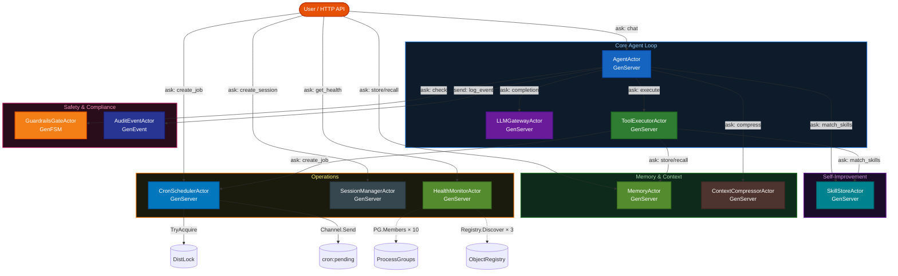

# MiniHermes — Self-Improving AI Agent (Go WASM)

MiniHermes is a PlexSpaces example application inspired by [Hermes Agent (Nous Research)](https://hermes-agent.nousresearch.com/). It demonstrates how a **single self-improving agent** can learn from experience, manage tiered memory, schedule background tasks, and swap AI providers — all built from composable PlexSpaces actor primitives compiled to a single Go WASM binary.

For the Python implementation see: [`examples/python/apps/minihermes`](../../../python/apps/minihermes/README.md)

---

## Actors

| File | Actor | Behavior | Key Primitives |
|------|-------|----------|---------------|
| `llm_gateway.go` | `LLMGatewayActor` | GenServer | HTTPFetch (Ollama/OpenAI/Anthropic), KV cache, SendAfter health tick |
| `tool_executor.go` | `ToolExecutorActor` | GenServer | KV tool registry, HTTPFetch, inter-actor Ask |
| `agent.go` | `AgentActor` | GenServer | Ask loop, KV session history, ObjectRegistry, skill injection |
| `skill_store.go` | `SkillStoreActor` | GenServer | KV metadata, BlobStorage procedures, TupleSpace tag index |
| `memory.go` | `MemoryActor` | GenServer | Three-tier KV+BlobStorage+TupleSpace storage |
| `memory.go` | `AuditEventActor` | GenEvent | Watermark audit trail, two-cursor KV polling |
| `context_compressor.go` | `ContextCompressorActor` | GenServer | LLM summarization, KV checkpoints |
| `cron_scheduler.go` | `CronSchedulerActor` | GenServer | SendAfter tick loop, DistributedLock leader election, Channel delivery |
| `guardrails.go` | `GuardrailsGateActor` | GenFSM | KV per-tool policies, TupleSpace approval queue |
| `infra.go` | `SessionManagerActor` | GenServer | KV session lifecycle, TupleSpace index |
| `infra.go` | `HealthMonitorActor` | GenServer | SendAfter polling, ProcessGroups + ObjectRegistry dual health |

---

## Architecture



---

## Key Patterns

### 1 — Conversation Loop with Tool Calling

```
User.chat("calculate 42 * 17")
  → AgentActor.Ask(LLMGateway, completion)
  ← stop_reason=tool_use [{name:"calculator", input:{expression:"42*17"}}]
  → GuardrailsGate.Ask(check)         ← allow
  → ToolExecutor.Ask(execute)         ← {result: 714}
  → LLMGateway.Ask(completion)        ← stop_reason=end_turn
  → KV.Put("session_history:s1", …)
  → SkillStore.Send(evaluate_for_learning)  ← async
```

### 2 — Skill Learning with Lifecycle

```
SkillStoreActor.evaluateForLearning(session_id, messages, tool_call_count)
  → extract tool sequence and user intent
  → KV.Put("skill_meta:<id>", metadata)
  → Blob.Upload("skills", "skill_procedure_<id>", procedure)
  → TS.Write(["skill_tag", tag, skill_id, name])
  → TS.Write(["skill_trigger", pattern, skill_id, name])
  // Lifecycle: active → stale (30d) → archived (90d)
  // Maintenance tick via SendAfter(24h)
```

### 3 — Distributed Cron with Leader Election

```
CronSchedulerActor.tick (every 60s via SendAfter):
  → DistLock.TryAcquire("cron_leader")   // only leader dispatches
  → for each due job: Channel.Send("cron:pending", job)
  → AgentActor.processCron(job_id, prompt)  // isolated session
```

### 4 — Service Discovery: Registry vs Process Groups

```go
// Object Registry — capability-aware (preferred for production)
id, err := registryFirst("agent", "svc:agent", "tool_use")

// Process Groups — SDK built-in (simple fallback)
id, err := host.PG().First("svc:agent")
```

### 5 — Provider Hot-Swap

```go
actor.Handle("", "switch_provider", `{"provider":"openai","model":"gpt-4o"}`)
// ActiveProvider and DefaultModel updated live — no restart
// Circuit breaker reset on switch
```

---

## PlexSpaces Primitives

| Primitive | Used By |
|-----------|---------|
| `KV` | Session history, skill metadata, tool registry, provider config, cron jobs |
| `TupleSpace` | Skill tag index, memory tiers, audit events, health snapshots |
| `BlobStorage` | Skill procedure bodies, deep memory archives |
| `Channel` | Cron job delivery (durable, at-least-once) |
| `DistributedLock` | Cron leader election |
| `ProcessGroups` | Service discovery for all `svc:*` groups |
| `ObjectRegistry` | Capability-aware actor discovery |
| `SendAfter` | Cron tick, LLM health tick, health monitor poll, skill maintenance |
| `HTTPFetch` | Ollama/OpenAI/Anthropic calls; http_request tool |
| `Ask/Send` | Inter-actor tool dispatch, cross-actor skill injection |
| `Metrics (IncrCounter)` | Every key operation |
| `Durability` | `checkpoint_interval` on all stateful actors |

---

## Prerequisites

```bash
# Build tools
brew tap tinygo-org/tools && brew install tinygo
cargo install wasm-tools
npm install -g @bytecodealliance/jco

# PlexSpaces node
# See: docs/getting-started.md

# Optional: Ollama for real LLM
brew install ollama
ollama run llama3.2
```

---

## Build & Test

```bash
# 1. Build WASM binary
./build.sh

# 2. Run unit tests (no node required)
go test ./... -v

# 3. Integration tests against a live node
./test.sh [HTTP_PORT]     # default port 8091

# 4. Clean up
./undeploy.sh [HTTP_PORT]
```

---

## Project Structure

```
minihermes/
├── helpers.go              # host var, marshal/parse, registryFirst, pgFirst
├── llm_gateway.go          # LLMGatewayActor (Ollama/OpenAI + simulated)
├── tool_executor.go        # ToolExecutorActor (6 built-in + extensible)
├── agent.go                # AgentActor (loop + skill injection + cron)
├── skill_store.go          # SkillStoreActor (CRUD, match, lifecycle)
├── memory.go               # MemoryActor + AuditEventActor
├── context_compressor.go   # ContextCompressorActor
├── cron_scheduler.go       # CronSchedulerActor (SendAfter + DistLock + Channel)
├── guardrails.go           # GuardrailsGateActor (FSM approval)
├── infra.go                # SessionManagerActor + HealthMonitorActor + init() + main()
├── minihermes_actor_test.go # Unit tests (ResetStubs, no node)
├── app-config.toml         # Supervisor tree (11 children)
├── go.mod
├── build.sh
├── test.sh
└── undeploy.sh
```

---

## Related Documentation

- [Architecture](../../../../docs/architecture.md)
- [Getting Started](../../../../docs/getting-started.md)
- [Go SDK](../../../../sdks/go/README.md)
- [Python MiniHermes](../../../python/apps/minihermes/README.md)
- [MiniClaw (multi-agent)](../miniclaw/README.md)
