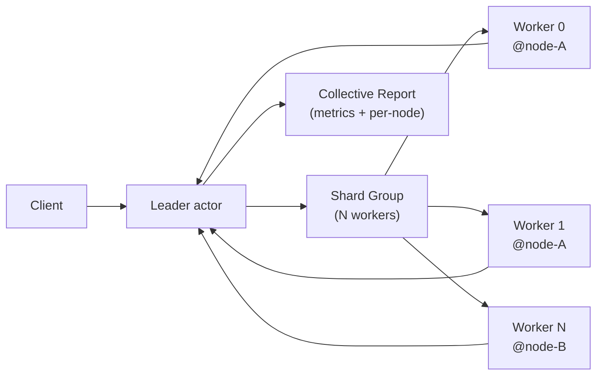
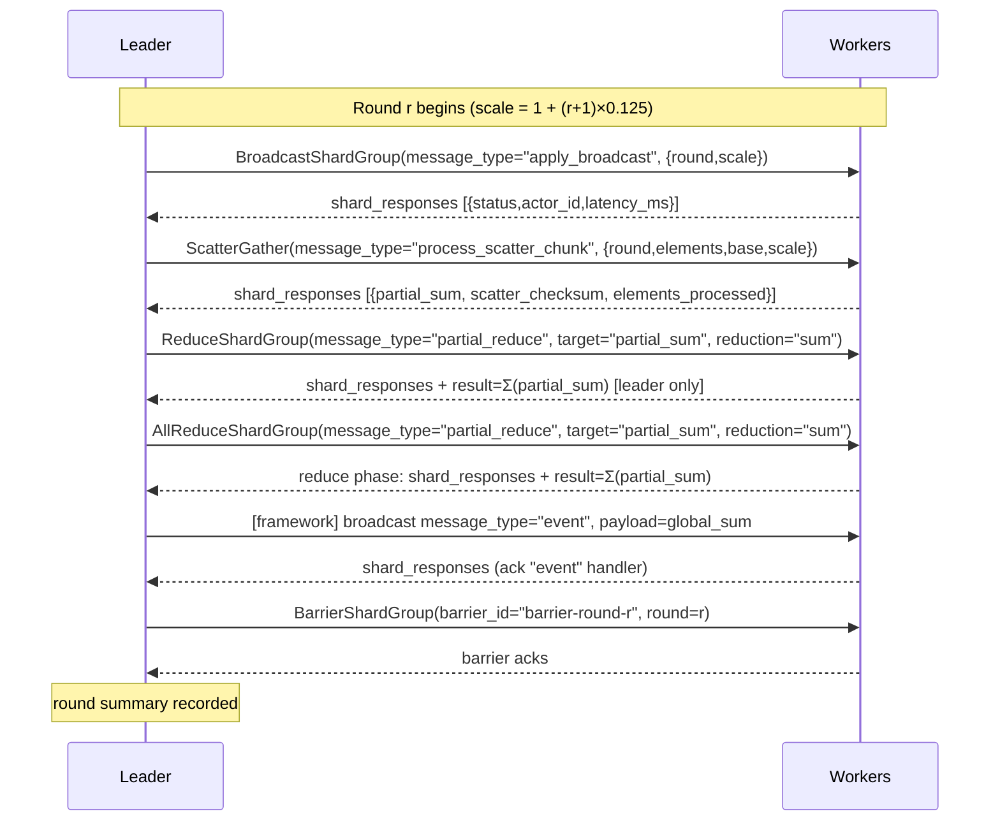

# MPI Collectives (Go WASM)

Distributed MPI-style collective operations benchmark built on PlexSpaces
shard-group APIs.  A **Leader** actor orchestrates **5 collective phases per
round** over a dynamically-created shard group of **Worker** actors, closely
mirroring the canonical MPI collective communication model.

## MPI → PlexSpaces API Mapping

| MPI Operation | PlexSpaces API | Semantics |
|---------------|---------------|-----------|
| `MPI_Bcast` | `BroadcastShardGroup` | Leader → all workers (fan-out) |
| `MPI_Scatter` + `MPI_Gather` | `ScatterGather` | Unique chunk per worker, results collected |
| `MPI_Reduce` | `ReduceShardGroup` | Workers respond with local values → framework reduces → result at leader only |
| `MPI_Allreduce` | `AllReduceShardGroup` | Same as Reduce + framework broadcasts final result back to ALL workers |
| `MPI_Barrier` | `BarrierShardGroup` | All workers must acknowledge before proceeding |

> **Legacy path**: `MapShardGroup` covers arbitrary fan-out queries (used
> implicitly by older code).  The dedicated APIs above are preferred because
> they carry explicit semantic intent and let the framework optimise each
> collective internally.

---

## Architecture



---

## Per-Round Sequence



---

## Collective API Details

### BroadcastShardGroup → MPI_Bcast

Leader broadcasts a value to all shards.  Workers acknowledge with their
response.

```go
host.BroadcastShardGroup(map[string]any{
    "group_id":     groupID,
    "message_type": "apply_broadcast",          // worker Handle dispatch key
    "message":      map[string]any{             // payload sent to each worker
        "round": round,
        "scale": scale,
    },
    "min_acks":   workerCount,
    "timeout_ms": 30000,
})
// response: {"shard_responses": [...], "stats": {shards_queried, shards_responded, shards_failed}}
```

Worker handler:
```go
case "apply_broadcast":
    w.BroadcastScale = scale   // store for use in scatter phase
    return marshal({"status":"ok", "latency_ms": ...})
```

---

### ScatterGather → MPI_Scatter + MPI_Gather

Each worker receives the same query descriptor but computes independently
(scatter), then all responses are collected at the leader (gather).

```go
host.ScatterGather(map[string]any{
    "group_id":     groupID,
    "message_type": "process_scatter_chunk",
    "query": map[string]any{
        "round": round, "elements_per_worker": N,
        "base_value": float64((round+1)*7), "scale": scale,
    },
    "aggregation":   "concat",
    "min_responses": workerCount,
    "timeout_ms":    30000,
})
// response: {"shard_responses": [...], "result": <aggregated>, "stats": {...}}
```

Worker handler:
```go
case "process_scatter_chunk":
    // compute partial_sum over N elements, store in w.LastPartialSum
    return marshal({"status":"ok", "partial_sum": localSum, "scatter_checksum": ..., ...})
```

---

### ReduceShardGroup → MPI_Reduce

Framework queries all workers, extracts `target` path from each response, and
applies the built-in `reduction`.  Result available **at the leader only**.

```go
host.ReduceShardGroup(map[string]any{
    "group_id":      groupID,
    "message_type":  "partial_reduce",   // worker returns {partial_sum: X, ...}
    "map_function":  map[string]any{"round": round},
    "target":        "partial_sum",      // dot-path extracted from each response
    "reduction":     "sum",              // built-in: sum | min | max | product | concat | bool_and | bool_or
    "min_responses": workerCount,
    "timeout_ms":    30000,
})
// response: {"result": <global_sum>, "shard_responses": [...], "stats": {...}}
```

Worker handler:
```go
case "partial_reduce":
    return marshal({"status":"ok", "partial_sum": w.LastPartialSum, ...})
```

---

### AllReduceShardGroup → MPI_Allreduce

Identical reduce semantics **plus** the framework automatically broadcasts the
final result back to all workers as a `message_type="event"` message.

```go
host.AllReduceShardGroup(map[string]any{
    "group_id":      groupID,
    "message_type":  "partial_reduce",
    "map_function":  map[string]any{"round": round},
    "target":        "partial_sum",
    "reduction":     "sum",
    "min_responses": workerCount,
    "timeout_ms":    30000,
})
// response: {"result": <global_sum>, "shard_responses": [...], "stats": {...}}
// Side-effect: each worker receives message_type="event" with payload=global_sum
```

Worker handler for the broadcast-back:
```go
case "event":
    // payload is the raw JSON number (e.g. 42.5)
    w.LastReducedSum = result   // every worker now holds the global sum
    return marshal({"status":"ok", "reduced_sum": result, ...})
```

---

### BarrierShardGroup → MPI_Barrier

Synchronisation point: leader blocks until `min_acks` workers have
acknowledged, then the next round begins.

```go
host.BarrierShardGroup(map[string]any{
    "group_id":   groupID,
    "barrier_id": fmt.Sprintf("barrier-round-%d", round),
    "round":      uint64(round),
    "min_acks":   workerCount,
    "timeout_ms": 30000,
})
// response: {"shard_responses": [...], "stats": {...}}
```

---

## Collective Reduction Types

`ReduceShardGroup` and `AllReduceShardGroup` support these built-in
`reduction` strings (maps to `CollectiveReduction` proto enum):

| String | Proto enum | Semantics |
|--------|-----------|-----------|
| `"sum"` | `SUM` | Σ of all numeric values |
| `"min"` | `MIN` | Minimum numeric value |
| `"max"` | `MAX` | Maximum numeric value |
| `"product"` | `PRODUCT` | ∏ of all numeric values |
| `"concat"` | `CONCAT` | Concatenate arrays (scalars become single-element arrays) |
| `"bool_and"` | `BOOL_AND` | Logical AND of boolean values |
| `"bool_or"` | `BOOL_OR` | Logical OR of boolean values |

---

## Files

| File | Purpose |
|------|---------|
| `mpi_collectives_actor.go` | Leader + Worker actors; all 5 collective phases |
| `app-config.toml` | Reusable `leader` / `worker` child-type definitions |
| `build.sh` | Builds the Go/TinyGo WASM component |
| `test.sh` | Deploys, runs benchmark, prints per-round and per-node metrics |

## Quick Start

```bash
cd examples/go/apps/mpi_collectives
./build.sh
./test.sh
```

## What It Demonstrates

- All 5 MPI-style collective APIs in a single benchmark loop
- `BroadcastShardGroup` fan-out with explicit `message_type`
- `ScatterGather` with `message_type` dispatch and checksum verification
- `ReduceShardGroup` returning the aggregated value at the leader
- `AllReduceShardGroup` where the framework broadcasts the result to all workers via `"event"`
- `BarrierShardGroup` for end-of-round synchronisation
- Per-node and per-role metrics via `ApplicationMetricsAdd` / `ApplicationGetStatus`
- Registry-driven multi-node worker placement with actor-distribution skew tracking
