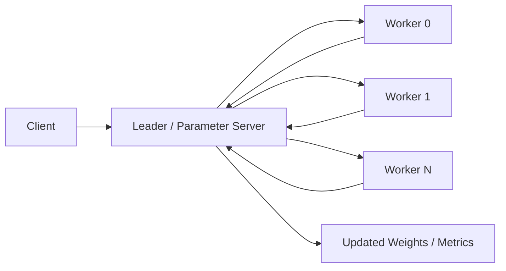
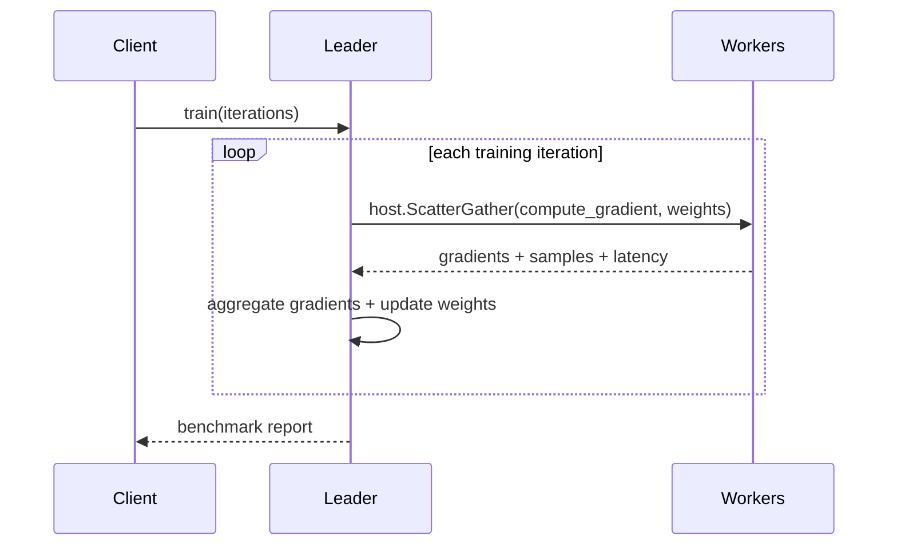

# Parameter Server (Go WASM)

Synthetic distributed training benchmark using the Go SDK and the same leader/worker shard-group design as the Rust and Python `parameter_server` examples.

## Purpose

Show centralized model coordination across multiple workers with:

- explicit `leader` and `worker` child types
- Go SDK `ActorRouter` for multi-actor routing in one WASM module
- shard-group placement with framework-owned worker actor IDs
- application-metrics-backed per-role and per-node reporting

## Architecture





## Files

- `parameter_server_actor.go`: leader and worker actors plus metrics helpers
- `app-config.toml`: reusable `leader` and `worker` child types for shard-group spawning
- `build.sh`: build the Go/TinyGo WASM component
- `test.sh`: deploy to both nodes, render `seed_nodes`, run training, and print benchmark stats

## Quick Start

```bash
cd examples/go/apps/parameter_server
./build.sh
./test.sh
```

## Notes

- This is a synthetic training benchmark, not a real ML integration.
- The leader uses shard-group placement with `from_registry`, so worker actor IDs come from the framework.
- Workers write node-local `ApplicationMetrics`, and the leader combines per-node application status deltas into the final report.
