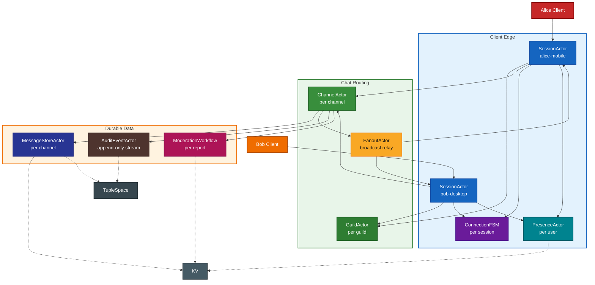
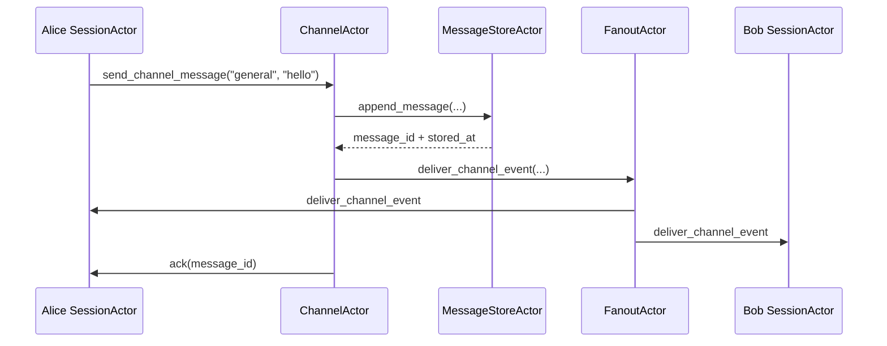

# Large-Scale Chat App (Python WASM)

This example shows how to grow a tiny chat room into the shape of a
Discord/WhatsApp-style system using PlexSpaces actors and built-in
abstractions. Instead of putting routing, storage, fan-out, and lifecycle in
one class, the app composes focused actors that communicate only by messages.

It stays intentionally small enough to read, but it demonstrates the same
patterns that large actor-based chat systems rely on:

- session actors for connected clients
- guild and channel routers
- dedicated fan-out offload
- durable per-channel message stores
- presence with expiry timers
- explicit connection lifecycle FSM
- durable moderation workflow
- append-only audit events and tuple-space traces

## Actors

| File | Actor | Behavior | Demonstrates |
|------|-------|----------|--------------|
| `sessions.py` | `SessionActor` | GenServer | Connected client session, channel joins, delivery inbox |
| `sessions.py` | `PresenceActor` | GenServer | Presence state, reminder-style expiry, KV + TupleSpace |
| `sessions.py` | `ConnectionFSM` | GenStateMachine | Explicit session lifecycle |
| `routing.py` | `GuildActor` | GenServer | Guild topology, membership, channel catalog |
| `routing.py` | `ChannelActor` | GenServer | Message routing, typing indicators, fan-out delegation |
| `routing.py` | `MessageStoreActor` | GenServer | Durable per-channel history, KV + TupleSpace indexing |
| `routing.py` | `FanoutActor` | GenServer | Object Registry + process-group broadcast offload |
| `routing.py` | `AuditEventActor` | GenEvent | Object Registry + fire-and-forget audit stream |
| `workflows.py` | `ModerationWorkflow` | Workflow | Durable report/review lifecycle |

## Architecture



## Message Path



## Abstractions In Play

- **Virtual actors** let us address `guild:guild-acme`, `channel:guild-acme__general`, or `session:alice-mobile` directly without manual process management.
- **Object Registry** is used for singleton service discovery: `FanoutActor` and `AuditEventActor` register on init with `host.registry.register()`, and `helpers.singleton_actor_id()` discovers them via `host.registry.discover(object_category=role)`. This replaces the older `pg_first("svc:{role}")` pattern.
- **Process groups** are still used for channel fan-out broadcast: session actors join per-channel groups so `FanoutActor` can broadcast a message to all subscribers in one call.
- **Durability** keeps guild, channel, store, session, and workflow state recoverable after reactivation.
- **KV + TupleSpace** give the example both durable lookups and searchable coordination traces.
- **Timers/reminders** make typing indicators and presence expiry deterministic and actor-owned.
- **Workflow + FSM** show that long-running moderation and short-lived connection lifecycle are both first-class, but modeled differently.

## Usage

```bash
./build.sh
./test.sh 8091
```

`test.sh` deploys the app with `app-config.toml`, connects two sessions, sends a
message through the channel router, verifies history and fan-out, checks typing
expiry and presence expiry, and exercises the moderation workflow.

## Project structure

```text
chat_room/
├── chat_room_actor.py  # entrypoint + ACTOR_ROLES
├── sessions.py         # SessionActor, PresenceActor, ConnectionFSM
├── routing.py          # GuildActor, ChannelActor, MessageStoreActor, FanoutActor, AuditEventActor
├── workflows.py        # ModerationWorkflow
├── helpers.py          # shared naming/discovery/metrics helpers
├── app-config.toml     # supervisor tree + facets
├── verify.py           # native deterministic verification
├── build.sh
└── test.sh
```

## Why this example matters

The point is not that a chat app must have exactly these actors. The point is
that actor boundaries stay stable as the system grows. The same design that
starts as one channel with two sessions can scale into many guilds, many
channels, many sessions, and many background workflows without falling back to
shared mutable state.

## Related docs

- [Actor System](../../../../docs/actor-system.md)
- [Architecture](../../../../docs/architecture.md)
- [Detailed Design](../../../../docs/detailed-design.md)
- [Python SDK](../../../../sdks/python/README.md)
