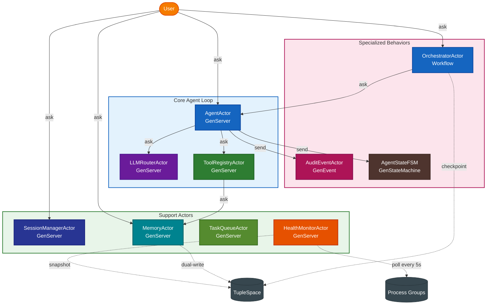

# MiniClaw — Mini Agent Framework (Python WASM)

MiniClaw is a self-contained multi-agent framework that demonstrates all major PlexSpaces actor patterns in Python. Ten actors collaborate to handle AI chat, tool calling, durable orchestration, session management, and more — all compiled to a single WASM binary.

## Actors

| File | Actor | Behavior | Demonstrates |
|------|-------|----------|--------------|
| `llm_router.py` | `LLMRouterActor` | GenServer | Simulated LLM with tool-call routing |
| `tool_registry.py` | `ToolRegistryActor` | GenServer | Tool catalog with execution |
| `agent.py` | `AgentActor` | GenServer | Core agent loop (chat → LLM → tools → repeat) |
| `agent.py` | `SessionManagerActor` | GenServer | Session lifecycle via KV |
| `orchestrator.py` | `OrchestratorActor` | Workflow | Durable task decomposition and aggregation |
| `memory.py` | `MemoryActor` | GenServer | Scoped KV + TupleSpace memory |
| `memory.py` | `AuditEventActor` | GenEvent | Fire-and-forget audit trail |
| `memory.py` | `AgentStateFSM` | GenFSM | Agent lifecycle state machine |
| `infra.py` | `TaskQueueActor` | GenServer | Channel-backed durable task queue |
| `infra.py` | `HealthMonitorActor` | GenServer | Periodic process group polling |

## Architecture



## Patterns

- **Agent loop** — chat → LLM → `tool_use` → execute tools → feed results back → loop until `end_turn`
- **Channel as Message Queue** — `TaskQueueActor` uses `host.channel.send/receive/ack/nack` for at-least-once delivery
- **Process Groups for discovery** — actors find each other via `pg_first("svc:xxx")` without hardcoded IDs
- **KV persistence** — session metadata and memory entries survive actor restarts
- **TupleSpace coordination** — orchestrator writes results; health monitor writes snapshots; memory stores queryable tuples
- **send_after polling** — `HealthMonitorActor` reschedules itself instead of subscribing to events
- **Durable workflow** — `OrchestratorActor` uses `@run_handler`, `@signal_handler`, `@query_handler`
- **GenFSM** — `AgentStateFSM` guards transitions with an explicit allowed-transitions table

## Usage

```bash
# Build (requires Python SDK and componentize-py)
./build.sh

# Run tests against a running node
./test.sh [HTTP_PORT]   # default: 8091
```

## Project structure

```
miniclaw/
├── miniclaw_actor.py   # entry point: imports all actors + ACTOR_REGISTRY
├── llm_router.py       # LLMRouterActor
├── tool_registry.py    # ToolRegistryActor
├── agent.py            # AgentActor, SessionManagerActor
├── orchestrator.py     # OrchestratorActor (Workflow)
├── memory.py           # MemoryActor, AuditEventActor, AgentStateFSM
├── infra.py            # TaskQueueActor, HealthMonitorActor
├── helpers.py          # pg_first, fire_audit, write_actor_info, ask
├── app-config.toml     # supervisor tree + facet configuration
├── build.sh
└── test.sh
```

## Related documentation

- [Getting Started](../../../../docs/getting-started.md)
- [Architecture](../../../../docs/architecture.md)
- [Python SDK](../../../../sdks/python/README.md)
- [Go MiniClaw](../../../go/apps/miniclaw/README.md)
