# MiniHermes — Self-Improving AI Agent (Python WASM)

MiniHermes is a PlexSpaces example application inspired by [Hermes Agent (Nous Research)](https://hermes-agent.nousresearch.com/). It demonstrates how a **single self-improving agent** can learn from experience, manage tiered memory, schedule background tasks, and swap AI providers — all built from composable PlexSpaces actor primitives compiled to a single WASM binary.

For the Go implementation see: [`examples/go/apps/minihermes`](../../../go/apps/minihermes/README.md)

---

## Actors

| File | Actor | Behavior | Key Primitives |
|------|-------|----------|---------------|
| `llm_gateway.py` | `LLMGatewayActor` | GenServer | HTTPFetch (Ollama/OpenAI/Anthropic), KV cache, SendAfter health tick |
| `tool_executor.py` | `ToolExecutorActor` | GenServer | KV tool registry, HTTPFetch, inter-actor Ask |
| `agent.py` | `AgentActor` | GenServer | Ask loop, KV session history, ObjectRegistry, skill injection |
| `skill_store.py` | `SkillStoreActor` | GenServer | KV metadata, BlobStorage procedures, TupleSpace tag index |
| `skill_workflow.py` | `SkillExtractionWorkflow` | **Workflow** | Parallel LLM analysis, durable checkpoints, TupleSpace coordination |
| `memory.py` | `MemoryActor` | GenServer | Three-tier KV+BlobStorage+TupleSpace storage |
| `memory.py` | `AuditEventActor` | GenEvent | Watermark audit trail, two-cursor KV polling |
| `context_compressor.py` | `ContextCompressorActor` | GenServer | LLM summarization, KV checkpoints |
| `cron_scheduler.py` | `CronSchedulerActor` | GenServer | SendAfter tick loop, DistributedLock leader election, Channel delivery |
| `guardrails.py` | `GuardrailsGateActor` | GenFSM | KV per-tool policies, TupleSpace approval queue |
| `infra.py` | `SessionManagerActor` | GenServer | KV session lifecycle, TupleSpace index |
| `infra.py` | `HealthMonitorActor` | GenServer | SendAfter polling, ProcessGroups + ObjectRegistry dual health |

---

## Architecture

```mermaid
graph TB
    User([User / HTTP API])

    subgraph Core["Core Agent Loop"]
        Agent["AgentActor<br/>GenServer"]
        LLM["LLMGatewayActor<br/>GenServer"]
        Tools["ToolExecutorActor<br/>GenServer"]
    end

    subgraph Learning["Self-Improvement"]
        Skills["SkillStoreActor<br/>GenServer"]
        Workflow["SkillExtractionWorkflow<br/>Workflow ✦"]
    end

    subgraph Memory["Memory & Context"]
        Mem["MemoryActor<br/>GenServer"]
        Comp["ContextCompressorActor<br/>GenServer"]
    end

    subgraph Safety["Safety & Compliance"]
        Guard["GuardrailsGateActor<br/>GenFSM"]
        Audit["AuditEventActor<br/>GenEvent"]
    end

    subgraph Ops["Operations"]
        Cron["CronSchedulerActor<br/>GenServer"]
        Sess["SessionManagerActor<br/>GenServer"]
        Health["HealthMonitorActor<br/>GenServer"]
    end

    User -->|ask: chat| Agent
    User -->|ask: create_session| Sess
    User -->|ask: store/recall| Mem
    User -->|ask: create_job| Cron
    User -->|ask: get_health| Health

    Agent -->|ask: completion| LLM
    Agent -->|ask: execute| Tools
    Agent -->|ask: match_skills| Skills
    Agent -->|ask: compress| Comp
    Agent -->|ask: check| Guard
    Agent -->|send: log_event| Audit

    Tools -->|ask: store/recall| Mem
    Tools -->|ask: create_job| Cron
    Tools -->|ask: match_skills| Skills

    Agent -->|workflow_run| Workflow
    Workflow -->|ask: completion × 3| LLM
    Workflow -->|ask: propose_skill| Skills
    Workflow -.->|checkpoint| TS[(TupleSpace)]

    Cron -->|TryAcquire| Lock[(DistLock)]
    Cron -->|Channel.Send| CH[(cron:pending)]

    Health -.->|PG.Members × 10| PG[(ProcessGroups)]
    Health -.->|registry.discover × 3| OR[(ObjectRegistry)]

    style User fill:#E65100,color:#fff,stroke:#BF360C,stroke-width:2px
    style Agent fill:#1565C0,color:#fff,stroke:#0D47A1,stroke-width:2px
    style LLM fill:#6A1B9A,color:#fff,stroke:#4A148C,stroke-width:2px
    style Tools fill:#2E7D32,color:#fff,stroke:#1B5E20,stroke-width:2px
    style Skills fill:#00838F,color:#fff,stroke:#006064,stroke-width:2px
    style Workflow fill:#AD1457,color:#fff,stroke:#880E4F,stroke-width:2px
    style Mem fill:#558B2F,color:#fff,stroke:#33691E,stroke-width:2px
    style Comp fill:#4E342E,color:#fff,stroke:#3E2723,stroke-width:2px
    style Guard fill:#F57F17,color:#fff,stroke:#E65100,stroke-width:2px
    style Audit fill:#283593,color:#fff,stroke:#1A237E,stroke-width:2px
    style Cron fill:#0277BD,color:#fff,stroke:#01579B,stroke-width:2px
    style Sess fill:#37474F,color:#fff,stroke:#263238,stroke-width:2px
    style Health fill:#558B2F,color:#fff,stroke:#33691E,stroke-width:2px
    style Core fill:#0D1B2A,color:#90CAF9,stroke:#1565C0,stroke-width:2px
    style Learning fill:#1A0D2A,color:#CE93D8,stroke:#6A1B9A,stroke-width:2px
    style Memory fill:#0D2A1A,color:#A5D6A7,stroke:#2E7D32,stroke-width:2px
    style Safety fill:#2A0D1A,color:#F48FB1,stroke:#AD1457,stroke-width:2px
    style Ops fill:#1A1A0D,color:#FFF176,stroke:#F57F17,stroke-width:2px
```



---

## Key Patterns

### 1 — Conversation Loop with Tool Calling

```
User.chat("calculate 42 * 17")
  → AgentActor asks LLMGatewayActor: completion({messages, tools})
  ← stop_reason=tool_use, tool_calls=[{name:"calculator", input:{expression:"42*17"}}]
  → GuardrailsGate.check("calculator")  ← decision=allow
  → ToolExecutorActor.execute("calculator")  ← {result: 714}
  → LLMGatewayActor.completion (with tool result)
  ← stop_reason=end_turn, content="42 * 17 = 714"
  → KV.put("session_history:s1", messages)
  → SkillStoreActor.evaluate_for_learning  (async, fire-forget)
```

### 2 — Durable Skill Extraction Workflow

When 3+ tool calls occur, the agent triggers `SkillExtractionWorkflow`:

```
SkillExtractionWorkflow.run(session_id, messages, tool_call_count)
  ├─ [parallel] LLM.completion("name this skill")
  ├─ [parallel] LLM.completion("write a procedure")
  └─ [parallel] LLM.completion("suggest tags and triggers")
  → SkillStoreActor.propose_skill({name, description, procedure, tags, triggers})
  → TupleSpace.write(["skill_extraction", session_id, skill_name, 100])
  ← {skill_id, skill_name, action:"learned"}
```

### 3 — Distributed Cron with Leader Election

```
CronSchedulerActor.tick (every 60s via SendAfter)
  → DistributedLock.try_acquire("cron_leader") — only 1 node dispatches
  → for each due job: Channel.send("cron:pending", job)
  → AgentActor.process_cron(job_id, prompt)  — isolated session context
```

### 4 — Service Discovery: Registry vs Process Groups

```python
# Object Registry — capability-aware (preferred)
actor_id, _ = registry_first("agent", capabilities=["tool_use"])

# Process Groups — simple (SDK built-in, good fallback)
actor_id = pg_first("svc:agent")
```

### 5 — Provider Hot-Swap

```
POST /api/v1/actors/llm_gateway/switch_provider  {provider:"openai", model:"gpt-4o"}
  → ActiveProvider = "openai"   # live, no restart needed
  → CircuitOpen = false
```

---

## PlexSpaces Primitives

| Primitive | Used By |
|-----------|---------|
| `KV` | Session history, skill metadata, tool registry, provider config, cron jobs |
| `TupleSpace` | Skill tag index, memory tiers, audit events, health snapshots, skill checkpoints |
| `BlobStorage` | Skill procedure bodies, deep memory archives |
| `Channel` | Cron job delivery (durable, at-least-once) |
| `DistributedLock` | Cron leader election (single scheduler across cluster) |
| `ProcessGroups` | Service discovery for all 10 `svc:*` groups |
| `ObjectRegistry` | Capability-aware actor discovery (`registry.discover`) |
| `SendAfter` | Cron tick loop, LLM health tick, health monitor poll |
| `HTTPFetch` | Real LLM calls to Ollama/OpenAI/Anthropic; http_request tool |
| `Ask/Send` | Inter-actor tool dispatch, cross-actor skill injection |
| `Metrics` | `incr_counter` on every key operation |
| `Workflow` | Durable parallel skill extraction with checkpoints |
| `Durability` | `checkpoint_interval` on all stateful actors |

---

## Prerequisites

```bash
# Python build toolchain
pip install -e ../../../../sdks/python

# PlexSpaces node (for integration tests)
# See: docs/getting-started.md

# Optional: Ollama for real LLM responses
brew install ollama
ollama run llama3.2
```

---

## Build & Test

```bash
# 1. Build WASM binary
./build.sh

# 2. Run unit tests (no node required)
pytest test_minihermes.py -v

# 3. Integration tests against a live node (default port 8091)
./test.sh [HTTP_PORT]

# 4. Clean up
./undeploy.sh [HTTP_PORT]
```

---

## Project Structure

```
minihermes/
├── minihermes_actor.py     # entry point: ACTOR_REGISTRY dispatch table
├── helpers.py              # registry_first, pg_first, fire_audit, ask
├── llm_gateway.py          # LLMGatewayActor (Ollama/OpenAI + simulated fallback)
├── tool_executor.py        # ToolExecutorActor (6 built-in + extensible)
├── agent.py                # AgentActor (conversation loop + skill injection)
├── skill_store.py          # SkillStoreActor (CRUD, match, lifecycle)
├── skill_workflow.py       # SkillExtractionWorkflow (durable parallel extraction)
├── memory.py               # MemoryActor + AuditEventActor
├── context_compressor.py   # ContextCompressorActor
├── cron_scheduler.py       # CronSchedulerActor (SendAfter + DistLock + Channel)
├── guardrails.py           # GuardrailsGateActor (GenFSM approval flow)
├── infra.py                # SessionManagerActor + HealthMonitorActor
├── test_minihermes.py      # Unit tests (MockHost, no node)
├── app-config.toml         # Supervisor tree (12 children)
├── build.sh
├── test.sh
└── undeploy.sh
```

---

## Related Documentation

- [Architecture](../../../../docs/architecture.md)
- [Getting Started](../../../../docs/getting-started.md)
- [Python SDK](../../../../sdks/python/README.md)
- [Go MiniHermes](../../../go/apps/minihermes/README.md)
- [MiniClaw (multi-agent)](../miniclaw/README.md)
