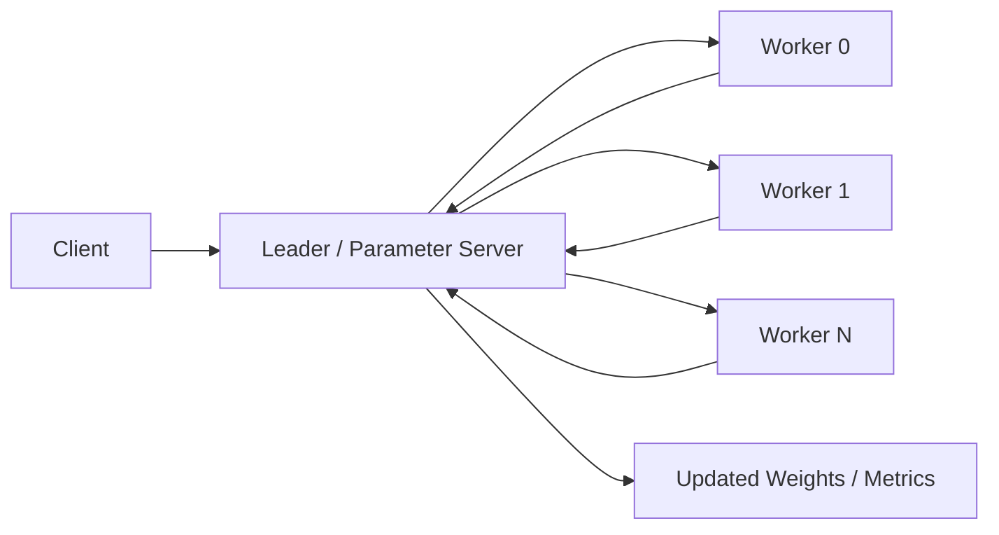
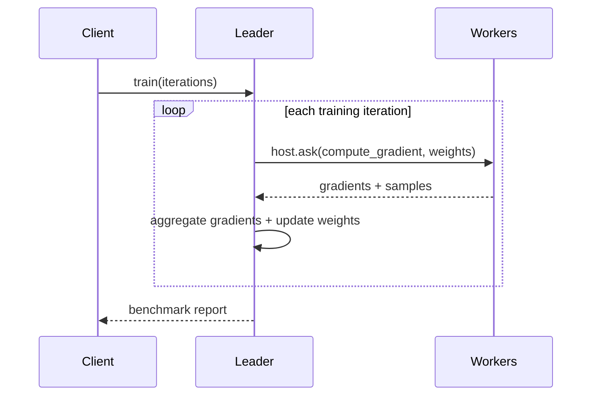

# Parameter Server (Python WASM)

Synthetic distributed training benchmark using the Python SDK actor/decorator flow for the same centralized-weight and worker-gradient pattern as the Rust `parameter_server` example.

## Purpose

Show centralized model coordination across multiple workers with:

- explicit `leader` and `worker` roles
- Python SDK decorators and handlers
- shard-group placement with framework-owned worker actor IDs
- weight fan-out and gradient fan-in each training iteration
- application-metrics-backed coordination vs computation reporting
- per-role and per-node benchmark output aligned with the Rust example

## Architecture





## Files

- `parameter_server_actor.py`: `leader` and `worker` actors in one WASM module
- `app-config.toml`: explicit `leader` and reusable `worker` child types for shard-group spawning
- `build.sh`: build Python WASM component with the PlexSpaces Python SDK
- `test.sh`: deploy to both nodes, render `seed_nodes`, run training, and print benchmark stats with per-role/per-node sections

## Quick Start

```bash
cd examples/python/apps/parameter_server
./build.sh
./test.sh
```

## Notes

- This is a synthetic training benchmark, not a real ML integration.
- It complements the Rust `parameter_server` example with the same high-level pattern in the Python SDK style.
- The leader uses shard-group placement with `from_registry`, so worker actor IDs come from the framework and the example does not invent remote actor IDs itself.
- The supervisor declares one reusable `worker` child type, which is what `create_shard_group(actor_type="worker")` resolves through the registered behavior factory on every node.
- Worker replies carry per-iteration latency and throughput details, while node-local `ApplicationMetrics` provide the final per-node and per-role totals printed by `test.sh`.
