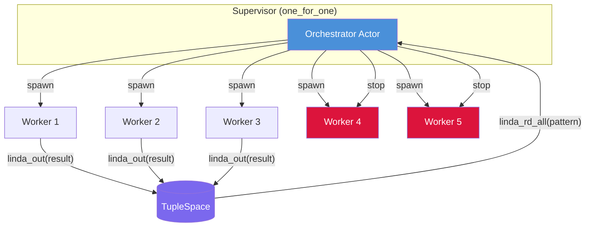

# Actor-CSP: Structured Concurrency with Supervised Actors + Linda Tuplespace

Demonstrates **structured concurrency** using the actor model with supervisor-managed lifecycle
and Linda-style tuplespace coordination for the scatter-gather pattern.

## Problem

Fan out requests to N service actors, collect the first K responses within a timeout,
cancel remaining workers — with supervisor guaranteeing no orphaned actors.

## Architecture



## How It Works

1. **Scatter**: Orchestrator spawns N worker actors via `spawn()` host function
2. **Process**: Each worker simulates a service call, writes result to tuplespace via `linda_out`
3. **Timeout**: `send_after` fires a `collect_results` message after the deadline
4. **Gather**: Orchestrator reads results from tuplespace via `linda_rd_all`
5. **Cleanup**: Remaining workers are stopped via `stop()` — supervisor handles graceful shutdown

## Linda Primitives

Linda (Gelernter, 1985) coordinates through a shared associative memory with four operations. PlexSpaces provides these as host functions:

| Linda Op | PlexSpaces Host | Semantics |
|----------|----------------|-----------|
| `out(t)` | `ts_write` | Write a tuple — non-blocking, non-destructive |
| `in(t)` | `ts_take` | Atomically remove first matching tuple (destructive read) |
| `rd(t)` | `ts_read` | Read first matching tuple without removing (non-destructive) |
| `rd_all(t)` | `ts_read_all` | Read all matching tuples |

```rust
// Linda OUT: worker writes result tuple to tuplespace
fn linda_out(fields: &[Value]) -> Result<(), String> {
    let request = WriteRequest {
        tuples: vec![json_array_to_proto_tuple(fields)?],
        ..Default::default()
    };
    ts_write(&request.encode_to_vec()).map(|_| ())
}

// Linda RD-ALL: orchestrator collects all results matching a pattern
fn linda_rd_all(pattern: &[Value]) -> Result<Vec<Vec<Value>>, String> {
    let request = ReadRequest {
        template: Some(json_array_to_proto_tuple_pattern(pattern)?),
        take: false,
        max_results: 1024,
        ..Default::default()
    };
    let bytes = ts_read_all(&request.encode_to_vec())?;
    Ok(decode_response(&bytes))
}
```

## Actor Model Gotchas (and how PlexSpaces addresses them)

| Actor Gotcha | What Happens | PlexSpaces Fix |
|-------------|-------------|----------------|
| Unbounded mailbox | Fast producer grows consumer's mailbox until OOM | **Bounded mailboxes** with configurable limit |
| No structured lifetime | Actors are async — no blocking scope to wait for children | **Supervisor** stops children + `send_after` for deadline |
| Orphaned actors | Spawned actor runs forever if nobody stops it | **Supervisor one_for_one** manages lifecycle |
| No result tracking | Actor sends a reply — caller must correlate | **Tuplespace** decouples result collection from actor identity |
| Location opacity failures | Remote send can silently fail | **Location-transparent routing** with failure propagation |

## Structured Concurrency Properties

- **Bounded lifetime**: Workers only exist during the scatter-gather operation
- **No leaks**: Orchestrator explicitly stops all workers after collection
- **Fault tolerance**: OneForOne supervisor restarts crashed workers
- **Backpressure**: Bounded mailboxes prevent overload
- **Decoupled coordination**: Workers write to tuplespace without knowing the collector

## Build & Test

```bash
# Build WASM component
./build.sh

# Deploy and test (requires running PlexSpaces server)
# Start server first: ./scripts/server.sh (from repo root)
./test.sh

# Undeploy
./undeploy.sh
```

## Key Features Demonstrated

- SDK annotations: `#[gen_server_actor(wasm)]`, `#[plexspaces_handlers(wasm)]`
- Linda-style tuplespace coordination (out/in/rd/rd_all)
- Supervisor lifecycle management (one_for_one)
- Timeout pattern with `send_after`
- Dynamic actor spawning from within a WASM actor
- Proto-encoded tuplespace tuples with pattern matching (wildcards)

## References

- [Architecture](../../../../docs/architecture.md)
- [Detailed Design](../../../../docs/detailed-design.md)
- [Getting Started](../../../../docs/getting-started.md)
- [Blog: Structured Concurrency Part II (Erlang)](https://shahbhat.medium.com/structured-concurrency-in-modern-programming-languages-part-ii-erlang-and-elixir-24a37711471c)
