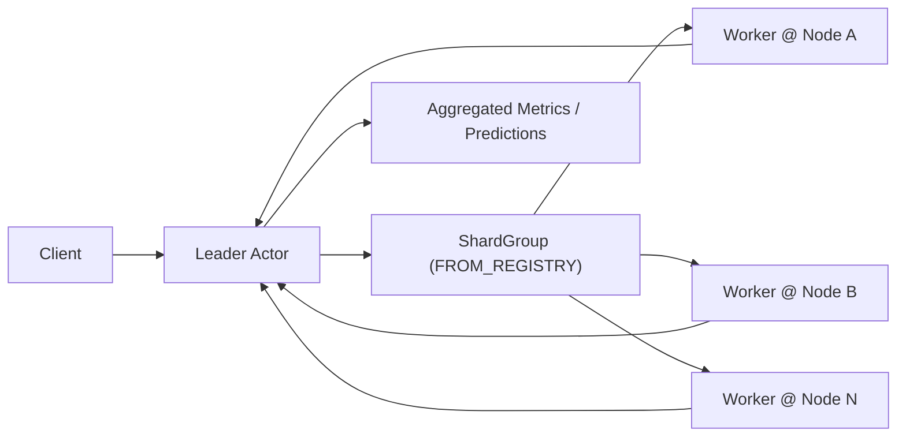
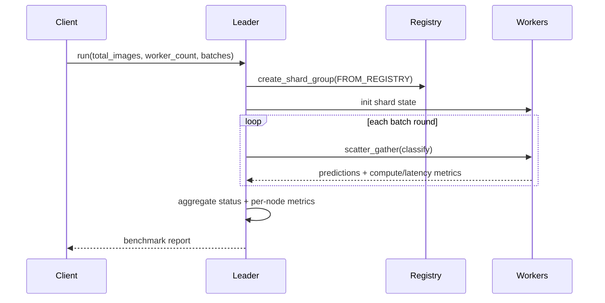

# Batch Image Classification (Rust WASM)

Synthetic batch image classification pipeline using the same Rust SDK/WIT leader-worker pattern as the completed `heat_diffusion` and `genomics_pipeline` examples.

## Purpose

Show batch-oriented parallel fan-out across multiple nodes with:

- explicit `leader` and `worker` roles
- registry-based `NodePlacement`
- shard-group `scatter_gather`
- application-metrics-backed per-node and per-role reporting

The workload is synthetic on purpose: we model a large image corpus and deterministic classification work without pulling in host-only ML dependencies.

## What It Demonstrates

- Rust WASM actors with `#[gen_server_actor(wasm)]` and `#[plexspaces_handlers(wasm)]`
- one request to a leader actor that partitions batch work across workers
- worker placement from connected node registry membership
- clear compute vs coordination metrics across nodes
- leader aggregation via node-local `ApplicationMetrics`

## Architecture





## APIs Used

- SDK annotations: `#[gen_server_actor(wasm)]`, `#[handler]`, `#[plexspaces_handlers(wasm)]`
- Shard-group host functions:
  - `create_shard_group`
  - `scatter_gather`
- Application metrics/status host functions:
  - `application_metrics_add`
  - `application_get_status`

## Files

- `src/lib.rs`: shared state, metric aggregation helpers, WIT entrypoint
- `src/leader.rs`: shard-group orchestration and benchmark aggregation
- `src/worker.rs`: per-shard synthetic classification workload
- `app-config.toml`: explicit leader/worker deployment config
- `build.sh`: build Rust WASM component with shared workspace target
- `test.sh`: deploy, run, and validate metrics

## Quick Start

Start two nodes from the repo root in separate terminals:

```bash
./scripts/server.sh 8091
./scripts/server.sh 8093
```

Build the WASM app:

```bash
cd examples/rust/apps/batch_image_classification
./build.sh
```

Deploy and run:

```bash
./test.sh
```

Or target a specific node list:

```bash
./test.sh "localhost:8092 localhost:8094"
```

## Metrics

The example prints:

- total images and batch rounds
- actor and node counts
- compute vs coordination time and granularity ratio
- average and max worker latency
- classification operation count and images processed
- per-role metrics (`leader`, `worker`)
- per-node metrics with node id and node address
- aggregated class prediction counts

## Notes

- This is a synthetic inference benchmark, not a model-serving integration.
- The goal is to validate parallel distribution, metrics, and SDK/WIT usage without host-only ML runtimes.
- The example uses the shared workspace `target/` directory and debug builds by default.
