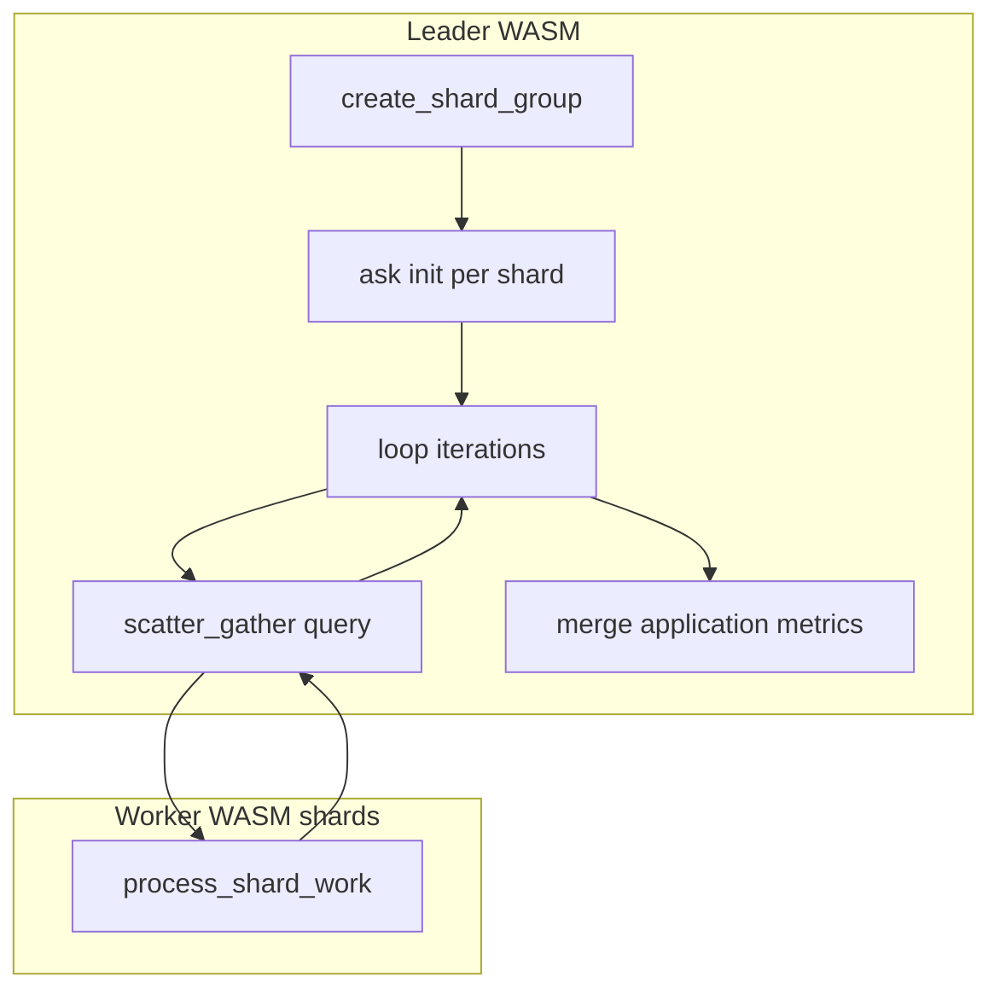

# Data-parallel worker (Rust WASM)

Deployable example: **shard group + scatter/gather** rounds over worker actors. This matches the main data-parallel pattern (fan-out query, gather per-shard results) while staying on the **SDK + WIT** stack (`wit_bindgen`, `plexspaces_sdk::simple_actor::SimpleActorHandlers`, `host::scatter_gather`).

For comparison, see [parameter_server](../parameter_server/) (training-style gradients) and the Python host usage in [parameter_server Python](../../../python/apps/parameter_server/) — same WIT surface, different domain narrative.

## Orchestration



## Metrics

The leader returns a JSON payload (also stored as `last_result`) including:

- **Timing**: `wall_time_ms`, `compute_time_ms`, `coordination_time_ms`, `granularity_ratio`, `efficiency`, per-iteration detail.
- **Topology**: `node_count`, `worker_node_count`, `shard_actor_ids`, `remote_nodes_with_work`, `actor_distribution_skew`.
- **Throughput**: `message_count`, `gradient_operation_count` (shard op count), `samples_processed`, `weight_update_count`.
- **Flags**: `orchestration: "scatter_gather"`, `use_case: "data_parallel"`.
- **Per-node / per-role** maps for actors, messages, latency, errors.

`test.sh` prints a full block and validates multi-node expectations when more than one node is provided.

## Checklist (this example)

- [x] WASM `cdylib`, no Tokio in this crate.
- [x] `host::create_shard_group` + iterative `host::scatter_gather` (not required for other apps).
- [x] Worker handler `process_shard_work` (scatter query payload).
- [x] `build.sh` / `test.sh` / `app-config.toml` / shared workspace `target`.
- [x] README with diagram and metrics description.

## Build and test

```bash
# From repo root; requires wasm32-wasip1, wasm-tools, WASI adapter (see other rust/apps examples)
cd examples/rust/apps/data_parallel_worker
./build.sh
# With cluster nodes listening on HTTP (e.g. 8092, 8094):
./test.sh
```

Single-node smoke: `./test.sh 8092`

Prerequisite: PlexSpaces nodes running (e.g. `./scripts/server.sh` from repo root).

## Layout

| File | Role |
|------|------|
| `src/lib.rs` | WIT `Guest`, shared metrics helpers, dispatch |
| `src/leader.rs` | `run`: shard group + scatter/gather loop |
| `src/worker.rs` | `init`, `process_shard_work` |
| `build.sh` | `cargo` → `wasm-tools component embed` → component |
| `test.sh` | Deploy + leader `run` + metrics validation |
