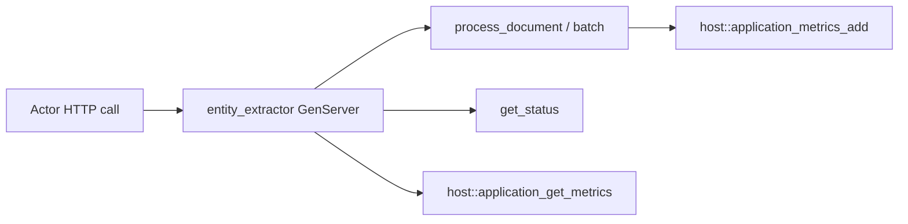

# Entity recognition (Rust WASM)

Simplified **document → entities** pipeline on one GenServer actor: token-level heuristics (EMAIL, URL, TOKEN) plus **`host::application_metrics_add`** for writes and **`host::application_get_metrics`** for reads. Same SDK+WIT layout as `calculator` / `nbody`.

For a **full native** multi-actor demo (FSM + GenServer + GenEvent, Tokio), see **[`examples/rust/embedded/entity_recognition`](../../embedded/entity_recognition/)**.

## Layout

| Path | Role |
|------|------|
| `src/lib.rs` | Extraction rules, actor, WIT `Guest` |
| `app-config.toml` | Supervisor child `entity_extractor` |
| `build.sh` | → `entity_recognition_actor.wasm` |
| `test.sh` | Deploy, `process_document`, `batch`, metrics |

## Handlers

| Op | Payload |
|----|---------|
| `process_document` | `{ "doc_id": string, "content": string }` |
| `batch` | `{ "documents": [ { "doc_id", "content" }, ... ] }` (max 50) |
| `reset` | — |
| `get_stats` | — |
| `get_status` / `status` | Rollups + `use_case` |
| `get_metrics` / `metrics` | Raw application metrics snapshot from WIT |

## Build & test

```bash
cd examples/rust/apps/entity_recognition
./build.sh
./scripts/server.sh   # repo root
./test.sh
```

## Flow



## References

- [Architecture](../../../../docs/architecture.md)
- [SDK](../../../../docs/sdk.md)
- [Apps checklist](../SDK_WIT_APPS_CHECKLIST.md)
- [Embedded entity_recognition](../../embedded/entity_recognition/README.md)
