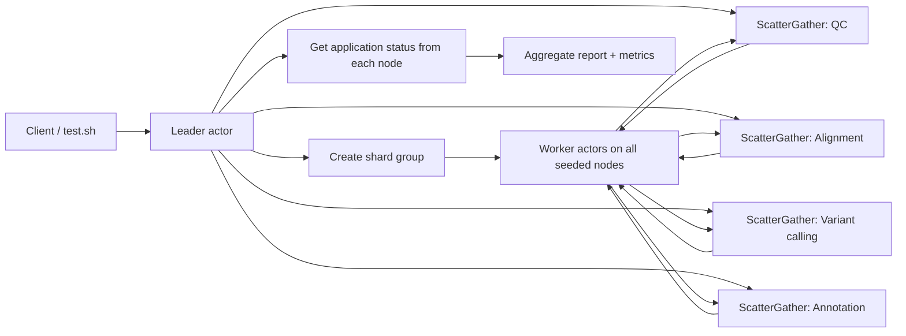
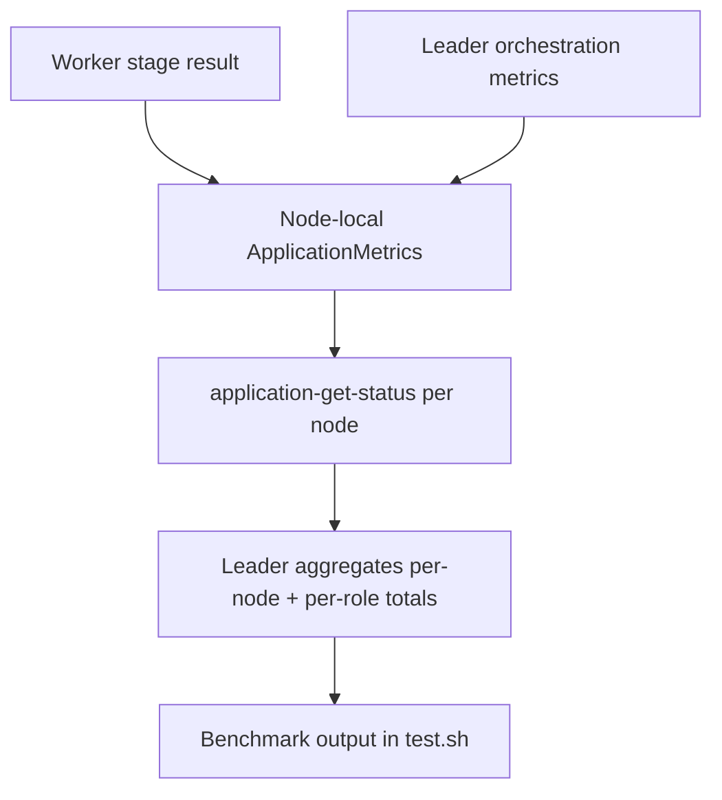

# Genomics Pipeline (Rust WASM)

Genomics benchmark using a deployed Rust WASM application with two actor roles:

- `leader` creates a shard group of `worker` actors and orchestrates QC, alignment, variant calling, and annotation via scatter/gather.
- `worker` owns one shard of the pipeline and reports compute versus coordination time for each stage.

## Code layout

- `src/lib.rs`
  Shared WIT entrypoint, role/config initialization, shared metrics aggregation types, and common helpers.
- `src/leader.rs`
  Annotated `#[gen_server_actor(wasm)]` leader role for shard-group creation, stage-by-stage scatter/gather, report assembly, and final per-node/per-role metrics aggregation.
- `src/worker.rs`
  Annotated `#[gen_server_actor(wasm)]` worker role for QC, alignment, variant calling, and annotation plus node-local metrics updates.

## Parallel flow



## Metrics flow



## APIs used

- `plexspaces:simple-actor` WIT host
- Rust SDK WASM annotations: `#[gen_server_actor(wasm)]`, `#[plexspaces_handlers(wasm)]`, `#[handler(...)]`
- ShardGroup create / scatter-gather
- ApplicationSpec deploy with `seed_nodes`
- Application metrics aggregation through `application-get-status`

## Build

```bash
cd /Users/shahzadbhatti/workspace/myspaces/examples/rust/apps/genomics_pipeline
./build.sh
```

This uses the shared workspace `target/` directory and produces:

- `genomics_actor.wasm`

## Test

```bash
./test.sh
./test.sh "localhost:8092 localhost:8094"
```

The test script:

- builds the WASM app
- deploys the same `ApplicationSpec` to both nodes
- writes `seed_nodes` for the chosen node list into a temporary config
- triggers one `run` on the entry-node `leader`
- prints a benchmark block with data size, topology, per-stage summary, per-role totals, per-node node-id and address, stage-operation counts, compute time, coordination time, latency, granularity, and errors

## Metrics model

Each node keeps local application metrics for the deployed app instance. The worker and leader update
node-local `ApplicationMetrics` through the simple-actor WIT host, and the leader aggregates those
per-node snapshots via `application-get-status` after the scatter/gather run completes.

That means the final benchmark output reflects:

- local metrics recorded on each participating node
- per-role aggregation (`leader`, `worker`)
- per-node aggregation keyed by node ID and node address
- scatter/gather rounds, worker message counts, stage-operation counts, compute time,
  coordination time, latency totals, and errors

## Config

`app-config.toml` defines:

- top-level `seed_nodes` for deploy-time node connectivity
- one `leader` child with explicit `args.role = "leader"`
- one `worker` child type with explicit `args.role = "worker"` used for shard-group worker spawning

Role is required during WASM actor initialization. Missing or invalid role configuration fails actor startup instead of defaulting to a fallback role.
