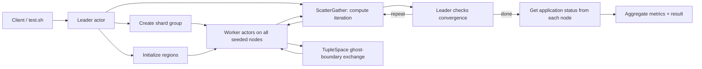
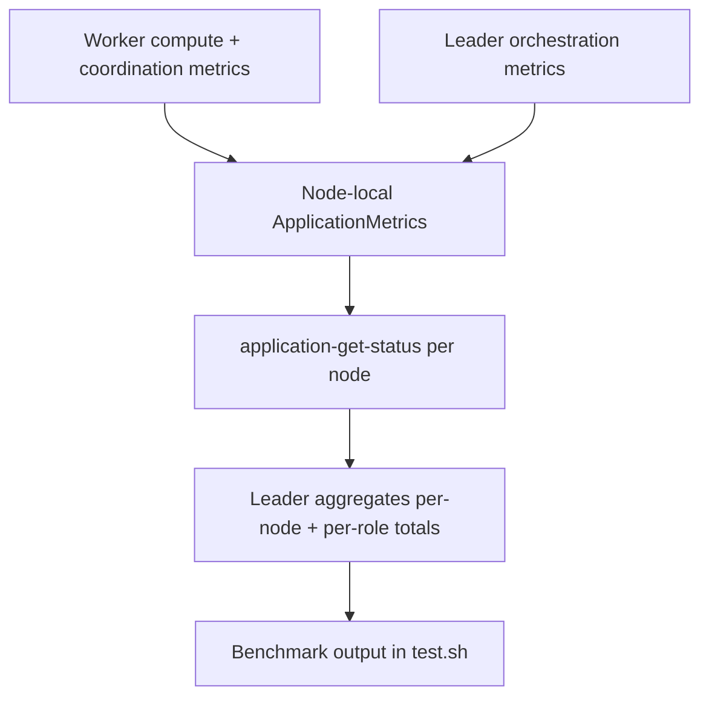

# Heat Diffusion (Rust WASM)

Heat diffusion benchmark using a deployed Rust WASM application with two actor roles:

- `leader` creates a shard group of `worker` actors and runs scatter/gather iterations.
- `worker` owns one grid region, exchanges ghost boundaries through TupleSpace, and reports compute versus coordination time.

## Code layout

- `src/lib.rs`
  Shared WIT entrypoint, role/config initialization, tuple-space helpers, and shared metrics aggregation helpers.
- `src/leader.rs`
  Annotated `#[gen_server_actor(wasm)]` leader role with scatter/gather orchestration logic.
- `src/worker.rs`
  Annotated `#[gen_server_actor(wasm)]` worker role with region init and compute handlers.

## Parallel flow



## Metrics flow



## APIs used

- `plexspaces:simple-actor` WIT host
- Rust SDK WASM annotations: `#[gen_server_actor(wasm)]`, `#[plexspaces_handlers(wasm)]`, `#[handler(...)]`
- ShardGroup create / bulk-update / scatter-gather
- TupleSpace `ts-write` / `ts-read`
- ApplicationSpec deploy with `seed_nodes`

## Build

```bash
cd /Users/shahzadbhatti/workspace/myspaces/examples/rust/apps/heat_diffusion
./build.sh
```

This uses the shared workspace `target/` directory and produces:

- `heat_diffusion_actor.wasm`

## Test

```bash
./test.sh
./test.sh "localhost:8092 localhost:8094"
```

The test script:

- builds the WASM app
- deploys the same `ApplicationSpec` to both nodes
- writes `seed_nodes` for the chosen node list into a temporary config
- waits for seed-node registry reconciliation and retries the leader trigger if the remote node ID has not been resolved yet
- triggers one `run` on the entry-node `leader`
- prints a benchmark block with data size, node/actor topology, per-node node-id and address, per-role totals, per-node actor and message counts, tuple-operation counts, compute time, coordination time, latency, granularity, and errors

## Metrics model

Each node keeps local application metrics for the deployed app instance. The worker and leader update
node-local `ApplicationMetrics` through the simple-actor WIT host, and the leader aggregates those
per-node snapshots via `application-get-status` after the scatter/gather run completes.

That means the final benchmark output reflects:

- local metrics recorded on each participating node
- per-role aggregation (`leader`, `worker`)
- per-node aggregation keyed by node ID and node address
- scatter/gather rounds, worker message counts, tuple operations, compute time, coordination time,
  latency totals, and errors

## Config

`app-config.toml` defines:

- top-level `seed_nodes` for deploy-time node connectivity
- one `leader` child with explicit `args.role = "leader"`
- one `worker` child type with explicit `args.role = "worker"` used for shard-group worker spawning

Role is required during WASM actor initialization. Missing or invalid role configuration fails actor startup instead of defaulting to a fallback role.
