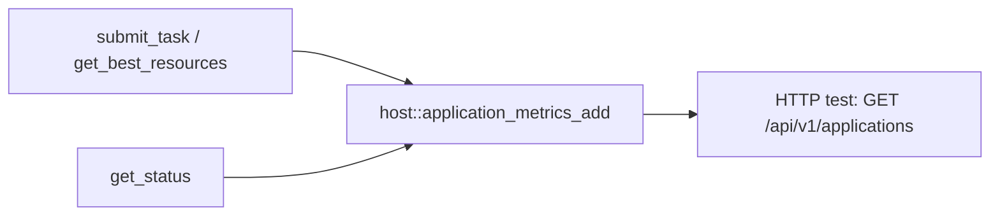

# SkyPilot → PlexSpaces: Multi-Cloud ML Orchestration (Rust WASM App)

Rust WASM scheduler: SkyPilot-style multi-cloud AI workload placement with a **simulated** instance catalog. Deploy via HTTP; test with `./scripts/server.sh` then `./test.sh [HTTP_PORT]`.

## Stack (aligned with `migrating_temporal` / `data_parallel_worker`)

- `wit_bindgen::generate!` → `wit/plexspaces-simple-actor`, `actor-world`
- `#[gen_server_actor(wasm)]` + `#[plexspaces_handlers(wasm)]` — `submit_task`, `get_best_resources`, `get_status`, `status`
- `plexspaces::simple_actor::host` — `application_metrics_add` with **`application_id` resolved before** state updates; merges run **after** releasing the scheduler mutex (wasm32-safe)
- `SkyPilotBridge`: `impl Guest` + `export!(...)` — no Tokio, no manual exports

## Use Case

- Picks cost-effective instances from a small AWS/GCP catalog for each `AITask`
- Ops: `submit_task`, `get_best_resources`, `get_status` (alias `status`)

## Flow



## API (HTTP JSON)

| Op | Payload | Returns |
|----|---------|--------|
| `submit_task` | `{"op":"submit_task","task":{...}}` | `{"allocation":{...}}` or queued / error |
| `get_best_resources` | `{"op":"get_best_resources","task":{...}}` | `{"allocation":{...}}` or error |
| `get_status` / `status` | `{"op":"get_status"}` | Queue/running + coord vs compute rollups |

Task shape: `task_id`, `task_type`, `gpu_required`, `gpu_memory_gb`, `cpu_cores`, `memory_gb`, `cloud_preference` (optional).

### Metrics

- **Actor state** (`get_status`): `queue_size`, `running`, `tasks_scheduled`, `total_compute_ms`, `total_coord_ms`, `compute_pct`, `coord_pct`, `granularity_ratio`
- **Merged application metrics** (via host): counters such as `scheduler_submits`, `scheduler_get_best`, `scheduler_status_queries`, and `latency_totals_ms` keys under `scheduler.*`

## Build and Test

```bash
./build.sh
./test.sh 8092
```

Requires: Rust (`wasm32-wasip1`), `wasm-tools`, WASI adapter (e.g. from `jco`). See `build.sh` for `CARGO_PROFILE` / shared `target`.

`test.sh` step 7 prints **actor** rollups from `get_status` plus **application** `counter_metrics` / latency maps from `GET /api/v1/applications` (merged counters from `host::application_metrics_add`). The script passes JSON to Python via **environment variables** so stdin is not consumed by a heredoc by mistake.

## Comparison

| Feature | SkyPilot | PlexSpaces (this app) |
|---------|----------|------------------------|
| Multi-cloud | AWS, GCP, Azure | Simulated catalog (AWS, GCP) |
| Cost optimization | Finds cheapest | Cost-aware selection |
| Resource matching | By accelerators/CPU/mem | By GPU/CPU/memory fields |
| Deployment | CLI / YAML | WASM app deploy via HTTP |

## Native reference

See [`native/skypilot_ref.md`](native/skypilot_ref.md).

## References

- [SkyPilot](https://skypilot.readthedocs.io/)
- [PlexSpaces architecture](../../../../docs/architecture.md)
- [SDK + WIT checklist](../SDK_WIT_APPS_CHECKLIST.md)
