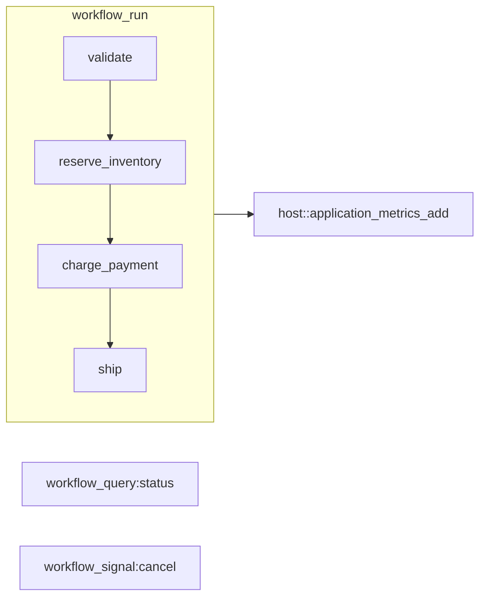

# Order Fulfillment Workflow (Rust WASM)

E-commerce order fulfillment as a **Rust WASM** app on **plexspaces-actor** (init, handle, get-state, set-state), aligned with Go/TypeScript/Python: `workflow_run` / `workflow_signal:*` / `workflow_query:*`.

## Stack (same class as `data_parallel_worker`)

- `wit_bindgen::generate!` → `wit/plexspaces-actor`, `actor-world`
- `#[gen_server_actor(wasm)]` + `#[plexspaces_handlers(wasm)]` — handlers for `workflow_run`, `workflow_signal:cancel`, `workflow_query:status`; `#[init_handler]` for config
- `plexspaces::actor::host` — `now_ms`, **`application_metrics_add`** (counters + latency maps for workflow compute/coordination; no scatter/gather). On **wasm32**, the Rust standard mutex is non-reentrant: never call `application_metrics_add` (or `resolve_application_id`, which uses the same state lock) **while holding** the workflow state mutex—merge metrics **after** the state update closure returns.
- Thin `impl Guest` + `export!(...)` bridge (no Tokio, no hand-written `#[no_mangle]` exports)

## Purpose

- **cdylib** for `wasm32-wasip1` → `wasm-tools component embed` + WASI adapter → `order_fulfillment_actor.wasm`
- **Workflow**: saga steps (validate → reserve → charge → ship), cancel signal, status query
- **Facets**: virtual_actor + durability (`app-config.toml`)

## Flow



## Quick Start

```bash
# Terminal 1 (from repo root)
./scripts/server.sh

# Terminal 2
cd examples/rust/apps/migrating_temporal
./build.sh
./test.sh 8092
```

## Build

- **Requirements**: Rust (`wasm32-wasip1`), `wasm-tools`, WASI adapter (e.g. from `jco`)
- **Steps**: `cargo build` (see `build.sh` for profile) → embed WIT → component new → `order_fulfillment_actor.wasm`

## API

- **Run**: `POST /api/v1/actors/{app_id}/order-fulfillment:{order_id}` with `{"op":"workflow_run","order_id":"...","customer_id":"..."}`.
- **Signal**: same path with `{"op":"workflow_signal:cancel"}`.
- **Query**: same path with `{"op":"workflow_query:status"}`.

## Polyglot

| Language  | Location |
|----------|----------|
| TypeScript | `examples/typescript/apps/migrating_temporal` (WASM) |
| Go        | `examples/go/apps/migrating_temporal` (WASM) |
| Python    | `examples/python/apps/migrating_temporal` (WASM) |
| Rust      | `examples/rust/apps/migrating_temporal` (WASM, this dir) |
| Rust (embedded) | `examples/rust/embedded/migrating_temporal` (in-process) |

## References

- [PLAN.md – Workflow behavior](../../../../PLAN.md)
- [Rust embedded example](../../embedded/migrating_temporal) (in-process Node + WorkflowBehavior)
- [SDK + WIT checklist](../SDK_WIT_APPS_CHECKLIST.md)
