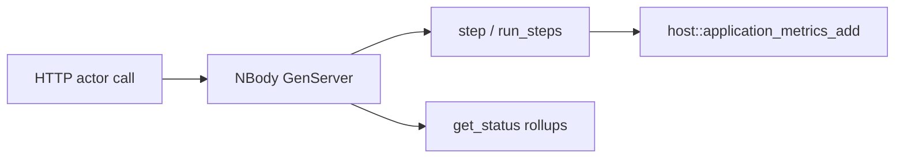

# N-body simulation (Rust WASM)

Gravitational **N-body** dynamics on a single GenServer actor: explicit pairwise gravity with softening, integrated with a simple kick–drift step. Uses **`plexspaces-sdk`** (`#[gen_server_actor(wasm)]`, `#[plexspaces_handlers(wasm)]`) and **`host::application_metrics_add`** for merged application metrics (no scatter/gather; not the default DPA pattern).

## Layout

| Path | Role |
|------|------|
| `src/lib.rs` | Actor, physics, WIT `Guest` export |
| `app-config.toml` | Supervisor + virtual actor + durability |
| `build.sh` | `wasm32-wasip1` → component `nbody_actor.wasm` |
| `test.sh` | Deploy, reset/step/run_steps, metrics via `test-common.sh` |

## Operations

| Handler | Purpose |
|---------|---------|
| `reset` | Optional `bodies` array; default is two masses |
| `step` | `{ "dt": number }` — one integration step |
| `run_steps` | `{ "count": n, "dt": number }` — burst (capped) |
| `get_state` | Current bodies + `step_count` |
| `get_status` | Rollups, KE/PE, `use_case` / `orchestration` flags |

## Metrics

- Per-step deltas: `nbody_steps`, `nbody_pair_interactions`, latency keys `nbody.compute` / `nbody.coordination`.
- Burst: extra counters `nbody_burst_runs`, `nbody_burst_steps_delta`.

Primary run insight: **handler payloads** (`step`, `get_status`). Application list is a secondary node-level view.

## Build & test

From repo root (shared `target/` via `.cargo/config.toml`):

```bash
cd examples/rust/apps/nbody
./build.sh
# With node: ./scripts/server.sh
./test.sh
```

## Flow



## References

- [Architecture](../../../../docs/architecture.md)
- [SDK](../../../../docs/sdk.md)
- [Apps checklist](../SDK_WIT_APPS_CHECKLIST.md)
