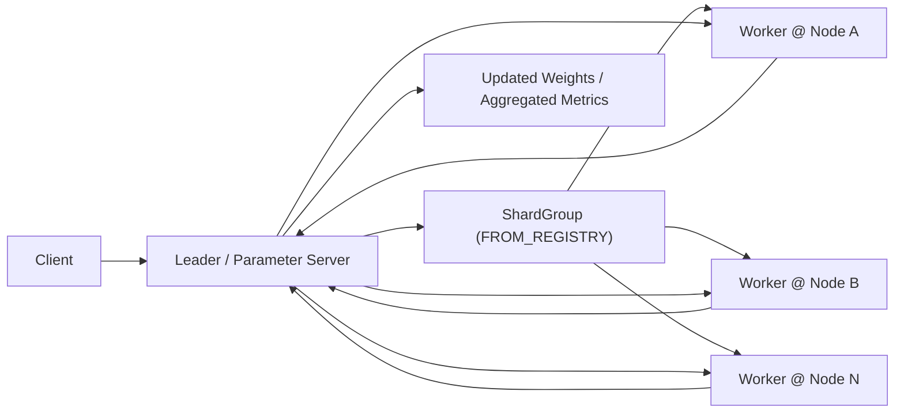
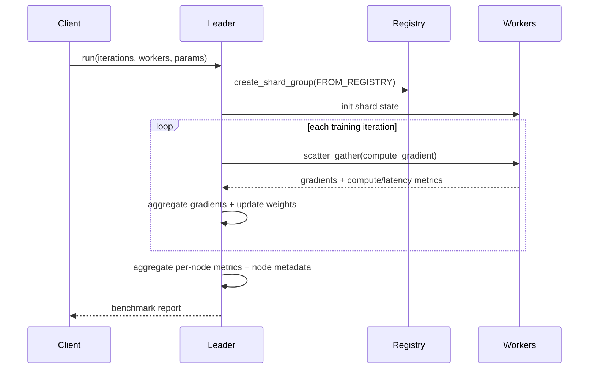

# Parameter Server (Rust WASM)

Synthetic distributed training benchmark using the same Rust SDK/WIT leader-worker pattern as the completed `heat_diffusion`, `genomics_pipeline`, `batch_image_classification`, and `ring_allreduce` examples.

## Purpose

Show centralized model coordination across multiple nodes with:

- explicit `leader` and `worker` roles
- registry-based `NodePlacement`
- shard-group `scatter_gather`
- parameter-server style weight fan-out and gradient fan-in
- application-metrics-backed per-node and per-role reporting

The workload is synthetic on purpose: we model model weights, batches, and gradient aggregation without pulling in host-only ML dependencies.

## What It Demonstrates

- Rust WASM actors with `#[gen_server_actor(wasm)]` and `#[plexspaces_handlers(wasm)]`
- one request to a leader actor that behaves like a parameter server
- worker placement from connected node registry membership
- synchronous gradient aggregation with one coordinator and many workers
- clear compute vs coordination metrics across nodes
- leader aggregation via node-local `ApplicationMetrics`

## Architecture





## APIs Used

- SDK annotations: `#[gen_server_actor(wasm)]`, `#[handler]`, `#[plexspaces_handlers(wasm)]`
- Shard-group host functions:
  - `create_shard_group`
  - `scatter_gather`
- Application metrics/status host functions:
  - `application_metrics_add`
  - `application_get_metrics`
  - `application_get_status` (node-address labeling only)

## Files

- `src/lib.rs`: shared state, metric aggregation helpers, WIT entrypoint
- `src/leader.rs`: parameter-server orchestration and benchmark aggregation
- `src/worker.rs`: per-shard synthetic gradient workload
- `app-config.toml`: explicit leader/worker deployment config
- `build.sh`: build Rust WASM component with shared workspace target
- `test.sh`: deploy, run, and validate metrics

## Quick Start

Start two nodes from the repo root in separate terminals:

```bash
./scripts/server.sh 8091
./scripts/server.sh 8093
```

Build the WASM app:

```bash
cd examples/rust/apps/parameter_server
./build.sh
```

Deploy and run:

```bash
./test.sh
```

Or target a specific node list:

```bash
./test.sh "localhost:8092 localhost:8094"
```

## Metrics

The example prints:

- parameter count, worker count, iterations, and batch size
- actor and node counts
- compute vs coordination time and granularity ratio
- average and max worker latency
- gradient operation count, samples processed, and weight updates
- per-role metrics (`leader`, `worker`)
- per-node metrics with node id and node address
- aggregated weight checksum

## Notes

- This is a synthetic distributed-training benchmark, not an integration with a real ML runtime.
- The goal is to validate centralized coordination, metrics, and SDK/WIT usage without host-only dependencies.
- The example uses the shared workspace `target/` directory and debug builds by default.
