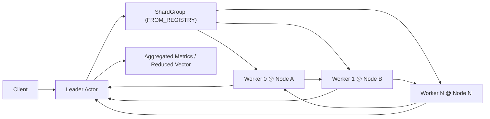
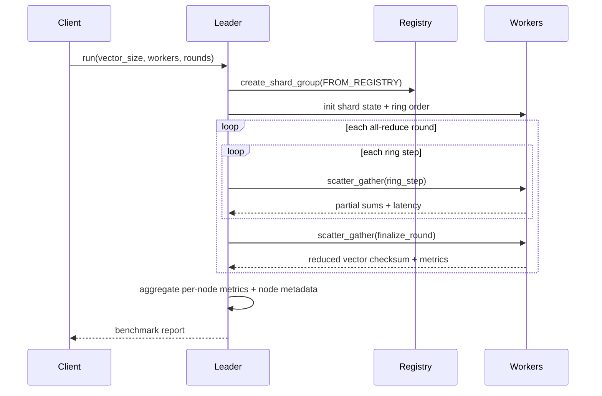

# Ring AllReduce (Rust WASM)

Synthetic ring all-reduce benchmark using the same Rust SDK/WIT leader-worker pattern as the completed `heat_diffusion`, `genomics_pipeline`, and `batch_image_classification` examples.

## Purpose

Show iterative synchronization across multiple nodes with:

- explicit `leader` and `worker` roles
- registry-based `NodePlacement`
- shard-group `scatter_gather`
- ring-step style reduction and broadcast accounting
- application-metrics-backed per-node and per-role reporting

The workload is synthetic on purpose: we model gradient vectors and ring communication without pulling in native MPI or accelerator dependencies.

## What It Demonstrates

- Rust WASM actors with `#[gen_server_actor(wasm)]` and `#[plexspaces_handlers(wasm)]`
- one request to a leader actor that builds a ring over distributed workers
- worker placement from connected node registry membership
- clear compute vs coordination metrics across nodes
- all-reduce style rounds and per-step reporting
- leader aggregation via node-local `ApplicationMetrics`

## Architecture





## APIs Used

- SDK annotations: `#[gen_server_actor(wasm)]`, `#[handler]`, `#[plexspaces_handlers(wasm)]`
- Shard-group host functions:
  - `create_shard_group`
  - `scatter_gather`
- Application metrics/status host functions:
  - `application_metrics_add`
  - `application_get_metrics`
  - `application_get_status` (node-address labeling only)

## Files

- `src/lib.rs`: shared state, metric aggregation helpers, WIT entrypoint
- `src/leader.rs`: shard-group orchestration and benchmark aggregation
- `src/worker.rs`: per-shard synthetic all-reduce workload
- `app-config.toml`: explicit leader/worker deployment config
- `build.sh`: build Rust WASM component with shared workspace target
- `test.sh`: deploy, run, and validate metrics

## Quick Start

Start two nodes from the repo root in separate terminals:

```bash
./scripts/server.sh 8091
./scripts/server.sh 8093
```

Build the WASM app:

```bash
cd examples/rust/apps/ring_allreduce
./build.sh
```

Deploy and run:

```bash
./test.sh
```

Or target a specific node list:

```bash
./test.sh "localhost:8091 localhost:8094"
```

## Metrics

The example prints:

- vector size, worker count, rounds, and ring steps
- actor and node counts
- compute vs coordination time and granularity ratio
- average and max worker latency
- all-reduce operation count and values reduced
- per-role metrics (`leader`, `worker`)
- per-node metrics with node id and node address
- aggregated reduced vector checksum

## Notes

- This is a synthetic synchronization benchmark, not a native MPI integration.
- The goal is to validate ring-style coordination, metrics, and SDK/WIT usage without host-only runtimes.
- The example uses the shared workspace `target/` directory and debug builds by default.
