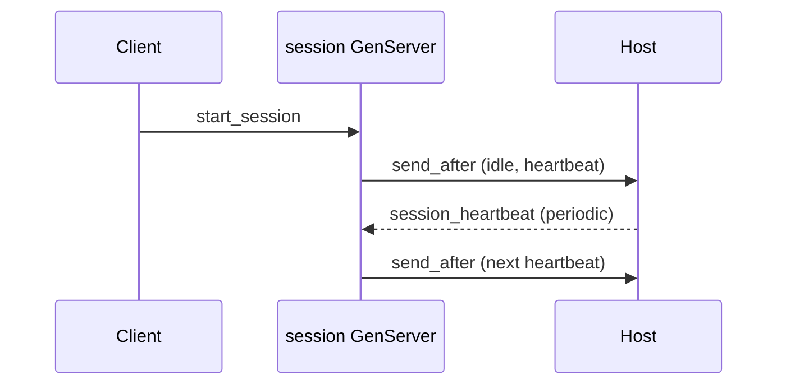

# Session manager (Rust WASM)

**Idle timeout** and **heartbeat** using the WIT host **`send-after`** API (`host::send_after` in Rust): delayed messages are delivered back to this actor as **`session_idle`** and **`session_heartbeat`** handlers. Metrics via **`host::application_metrics_add`**.

For **TimerFacet** + **node spawn** (native Tokio) the previous `cargo run` demo lived in this crate’s history; the current layout matches other `examples/rust/apps/*` WASM examples.

## Layout

| Path | Role |
|------|------|
| `src/lib.rs` | GenServer handlers + `Guest` export |
| `app-config.toml` | Supervisor child `session` |
| `build.sh` | → `session_manager_actor.wasm` |
| `test.sh` | Deploy, `start_session`, `touch`, short wait, metrics |

## Handlers

| Op | Behavior |
|----|----------|
| `start_session` | `{ user_id?, idle_timeout_ms?, heartbeat_ms? }` — schedules idle + first heartbeat |
| `touch` | Activity + reschedules idle timer |
| `session_idle` / `session_heartbeat` | Fired by runtime when `send_after` elapses; heartbeat reschedules itself |
| `reset`, `get_stats`, `get_status` / `status` | State + rollups |

## Build & test

```bash
cd examples/rust/apps/session_manager
./build.sh
./scripts/server.sh   # repo root
./test.sh
```

`./scripts/test.sh` runs `./test.sh`.

## Flow



## References

- [Architecture](../../../../docs/architecture.md)
- [SDK](../../../../docs/sdk.md)
- [Apps checklist](../SDK_WIT_APPS_CHECKLIST.md)
