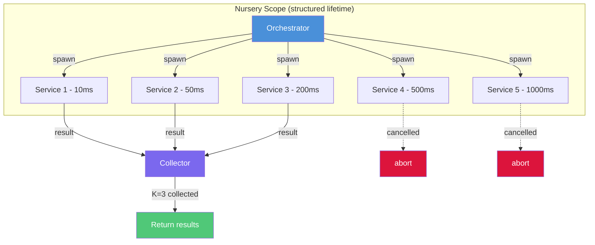

# CSP Channels — Pure Rust Structured Concurrency

Demonstrates the **scatter-gather** pattern using three progressively better approaches,
mapping Hoare's CSP concepts to practical Rust with tokio.

## Problem

Fan out requests to N services, collect the first K responses within a timeout,
then **cancel all stragglers** — guaranteed, no resource leaks.

## Approaches

| # | Approach | Structured? | Leak-free? |
|---|----------|-------------|------------|
| 1 | Naive `tokio::spawn` | No | No — orphaned tasks run forever |
| 2 | `JoinSet` + timeout | Yes | Yes — `abort_all()` on scope exit |
| 3 | CSP Nursery + `select!` | Yes | Yes — nursery guarantees child lifetime |

## Why CSP Is More Formally Sound Than Actors

CSP (Communicating Sequential Processes) is a **process algebra** — a mathematical system with
equational laws and operators, the same way arithmetic has `+` and `×` with commutativity and
associativity. The key operators:

| Operator | Meaning | Rust approximation |
|----------|---------|-------------------|
| P □ Q | External choice — environment picks | `tokio::select!` (biased = deterministic priority) |
| P ⊓ Q | Internal choice — process picks nondeterministically | No direct equivalent |
| P ‖ Q | Parallel composition — P and Q run, synchronize on shared events | `JoinSet` / `Nursery` |
| P ; Q | Sequential composition | `.await` chaining |
| STOP | Deadlock | Channel with no sender/receiver |

**What this buys you**: The FDR model checker can take two CSP process descriptions and
*prove* properties like deadlock-freedom, livelock-freedom, and refinement (one implementation
correctly implements a specification). No actor system has an industrial equivalent —
actor model safety comes from runtime discipline, not proof.

**Why actors lack this**: The actor model (Hewitt 1973, formalized by Clinger/Agha) has partial
algebraic treatment but no mainstream model checker. An actor's isolation guarantee (private state,
one message at a time) prevents data races *inside* one actor, but says nothing about protocol-level
deadlocks *between* actors. You get safety by convention (supervision, bounded mailboxes) rather
than by proof.

**Go's gap**: Go borrows CSP vocabulary (channels, select) but drops the algebra the moment you
add a buffer. A buffered channel is not a CSP rendezvous — FDR can't reason about it. Go's
safety comes from the race detector and `context` discipline, not from algebraic proof.

## CSP Concepts Mapped to Rust

| CSP | Rust/tokio | Note |
|-----|-----------|------|
| Synchronous channel (rendezvous) | `mpsc::channel(1)` | tokio has no true capacity-0 mpsc; capacity-1 approximates rendezvous (sender blocks after 1 unread message) |
| Guarded command / external choice (□) | `tokio::select! { biased; ... }` | `biased;` gives deterministic priority (unlike Go's random tie-break) |
| Process composition (P ‖ Q) | `JoinSet` / `Nursery` parallel spawn | |
| Structured scope | `Nursery::wait_all()` — all children must finish | Maps to Trio nurseries / Kotlin coroutineScope |
| Buffered channel | `mpsc::channel(n)` where n > 1 | **Breaks CSP rendezvous** — sender doesn't wait for receiver. Use deliberately. |

## Architecture



## Build & Test

```bash
# Build
cargo build --release

# Run demo
cargo run

# Run tests
cargo test --tests
# or
bash scripts/run_tests.sh
```

## Key Files

- `src/csp.rs` — Minimal CSP primitives (Channel, Nursery, scoped)
- `src/scatter_gather.rs` — Three scatter-gather implementations
- `src/main.rs` — Demo runner comparing all approaches
- `tests/scatter_gather_test.rs` — Integration tests

## References

- [Architecture](../../../../docs/architecture.md)
- [Detailed Design](../../../../docs/detailed-design.md)
- [Getting Started](../../../../docs/getting-started.md)
- [Structured Concurrency Blog Series](https://shahbhat.medium.com/)
