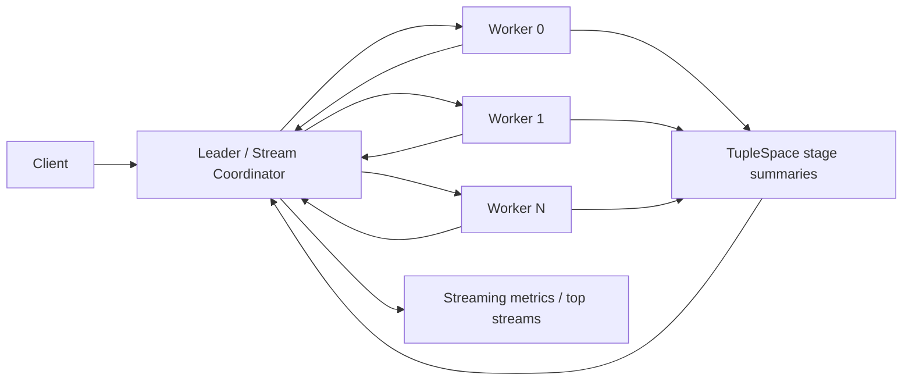
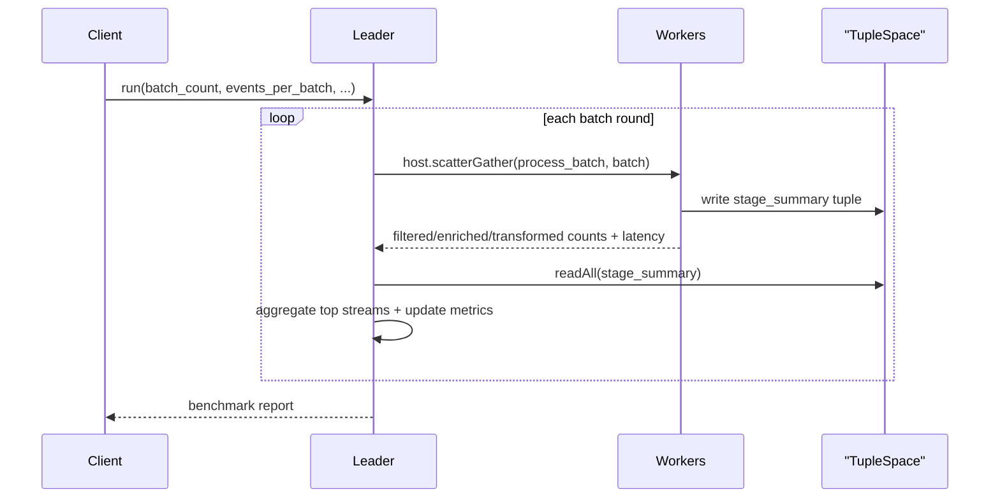

# Streaming Pipeline (TypeScript WASM)

Synthetic filter → enrich → transform streaming benchmark using the TypeScript SDK and the same multinode leader/worker shard-group pattern as the completed Rust, Python, and Go examples.

## Purpose

Show a distributed event pipeline with:

- explicit `leader` and `worker` child types
- TypeScript SDK `ActorRouter` for multi-actor routing in one WASM module
- shard-group placement with framework-owned worker actor IDs
- tuple-space stage summaries for per-batch artifacts
- application-metrics-backed per-role and per-node reporting

## Architecture





## Files

- `streaming_actor.ts`: leader and worker actors plus metrics helpers
- `app-config.toml`: reusable `leader` and `worker` child types for shard-group spawning
- `build.sh`: build the TypeScript WASM component
- `test.sh`: deploy to both nodes, render `seed_nodes`, run the pipeline, and print benchmark stats

## Quick Start

```bash
cd examples/typescript/apps/streaming_pipeline
./build.sh
./test.sh
```

## Notes

- This is a synthetic benchmark, not a real log or telemetry integration.
- Workers simulate filter, enrich, and transform stages and write tuple-space batch summaries.
- The leader combines application-status deltas and tuple-space artifacts into the final report.
